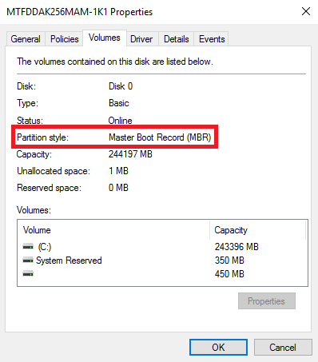

# MBR2GPT.EXE

**Applies to**
-   Windows 10

MBR2GPT.EXE converts a disk from Master Boot Record (MBR) to GUID Partition Table (GPT) partition style without modifying or deleting data on the disk.

## Syntax

```
MBR2GPT.exe /validate|convert [/disk:<diskNumber>] [/logs:<logDirectory>] [/map:<source>=<destination>] [/allowFullOS]
```

| Option | Description |
|----|-------------|
|/validate| Instructs MBR2GPT.exe to perform only the disk validation steps and report whether the disk is eligible for conversion. |
|/convert| Instructs MBR2GPT.exe to perform the disk validation and to proceed with the conversion if all validation tests pass. |
|/disk:\<diskNumber\>| Specifies the disk number of the disk to be converted to GPT. If not specified, the system disk is used. The mechanism used is the same as that used by the diskpart.exe tool **SELECT DISK SYSTEM** command.|
|/logs:\<logDirectory\>| Specifies the directory where MBR2GPT.exe logs should be written. If not specified, **%windir%** is used.|
|/map:\<source\>=\<destination\>| Specifies additional partition type mappings between MBR and GPT.|
|/allowFullOS| By default, MBR2GPT.exe is blocked unless it is run from WinPE. This option overrides this block and enables disk conversion while running in the full Windows environment. You cannot convert the system disk using this option.|
|/silent| Suppresses all warning messages so that the utility can be used in scripts.|

>You can use MBR2GPT to convert an MBR disk with BitLocker-encrypted volumes as long as protection has been suspended. To resume BitLocker after conversion, you will need to delete the existing protectors and recreate them.

## Examples


## Specifications


### Troubleshooting

#### Determining partition type

You can type the following command at a Windows PowerShell prompt to display the disk number and partition type. Example output is also shown.


```
PS C:\> Get-Disk | ft -Auto

Number Friendly Name      Serial Number        HealthStatus OperationalStatus Total Size Partition Style
------ -------------      -------------        ------------ ----------------- ---------- ---------------
0      MTFDDAK256MAM-1K1  13050928F47C         Healthy      Online             238.47 GB MBR
1      ST1000DM003-1ER162 Z4Y3GD8F             Healthy      Online             931.51 GB GPT
```

You can also view the partition type of a disk by opening the Disk Management tool, right-clicking the disk number, clicking **Properties**, and then clicking the **Volumes** tab. See the following example:




```

C:\> mbr2gpt /?

Converts a disk from MBR to GPT partitioning without modifying or deleting data on the disk.

MBR2GPT.exe /validate|convert [/disk:<diskNumber>] [/logs:<logDirectory>] [/map:<source>=<destination>] [/allowFullOS]

Where:

 /validate
         - Validates that the selected disk can be converted
           without performing the actual conversion.

 /convert
         - Validates that the selected disk can be converted
           and performs the actual conversion.

 /disk:<diskNumber>
         - Specifies the disk number of the disk to be processed.
           If not specified, the system disk is processed.

 /logs:<logDirectory>
         - Specifies the directory for logging. By default logs
           are created in the %windir% directory.

 /map:<source>=<destination>
         - Specifies the GPT partition type to be used for a
           given MBR partition type not recognized by Windows.
           Multiple /map switches are allowed.

 /allowFullOS
         - Allows the tool to be used from the full Windows
           environment. By default, this tool can only be used
           from the Windows Preinstallation Environment.


```


## Related topics

[Windows 10 FAQ for IT professionals](https://technet.microsoft.com/en-us/windows/dn798755.aspx)
<BR>[Windows 10 Enterprise system requirements](https://technet.microsoft.com/en-us/windows/dn798752.aspx)
<BR>[Windows 10 Specifications](https://www.microsoft.com/en-us/windows/Windows-10-specifications)
<BR>[Windows 10 IT pro forums](https://social.technet.microsoft.com/Forums/en-US/home?category=Windows10ITPro)
<BR>[Fix Windows Update errors by using the DISM or System Update Readiness tool](https://support.microsoft.com/kb/947821)
