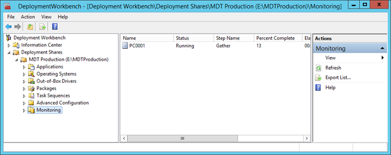

# Monitor the Windows 10 deployment with Configuration Manager

**Applies to**

-   Windows 10

In this topic, you will learn how to monitor a Windows 10 deployment that was started previously using Microsoft System Center 2012 R2 Configuration Manager and the Microsoft Deployment Toolkit (MDT) Deployment Workbench. You will also use the Deployment Workbench to access the computer remotely via the Microsoft Diagnostics and Recovery Toolkit (DaRT) Remote Connection feature.

For the purposes of this topic, we will use four machines: DC01, CM01, and PC0001. DC01 is a domain controller and CM01 is a machine running Windows Server 2012 R2 Standard. PC0001 is a Unified Extensible Firmware Interface (UEFI) machine to which Windows 10 Enterprise has been deployed. DC01, CM01, and PC0001 are all members of the domain contoso.com for the fictitious Contoso Corporation. For more details on the setup for this topic, please see [Deploy Windows 10 with the Microsoft Deployment Toolkit](deploy-windows-10-with-the-microsoft-deployment-toolkit.md).

To monitor an operating system deployment conducted through System Center 2012 R2 Configuration Manager, you will use the Deployment Workbench in MDT as follows:

1.  On CM01, using the Deployment Workbench, expand **MDT Production**, and use the **Monitoring** node to view the deployment process (press **F5** to refresh).

    **Note**  
    It takes a little while for the task sequence to start reporting monitor information, so if PC0001 does not appear when you press F5 the first time, wait 20 seconds and try again.

     

    

    Figure 33. PC0001 being deployed by Configuration Manager.

2.  When you see the PC0001 entry, double-click **PC0001**, and then click **DaRT Remote Control** and review the **Remote Control** option.

3.  The task sequence will now run and do the following:

    1.  Install the Windows 10 operating system.

    2.  Install the Configuration Manager client and the client hotfix.

    3.  Join the machine to the domain.

    4.  Install the application added to the task sequence.

    **Note**  
    You also can use the built-in reports to get information about ongoing deployments. For example, a task sequence report gives you a quick overview of the task sequence progress.

     

4.  If time permits, allow the deployment of PC0001 to complete. Then log in as Administrator in the CONTOSO domain and verify that Adobe Reader XI was installed.

## Related topics

[Integrate Configuration Manager with MDT 2013 Update 2](integrate-configuration-manager-with-mdt-2013.md)

[Prepare for Zero Touch Installation of Windows 10 with Configuration Manager](prepare-for-zero-touch-installation-of-windows-10-with-configuration-manager.md)

[Create a custom Windows PE boot image with Configuration Manager](create-a-custom-windows-pe-boot-image-with-configuration-manager.md)

[Add a Windows 10 operating system image using Configuration Manager](add-a-windows-10-operating-system-image-using-configuration-manager.md)

[Create an application to deploy with Windows 10 using Configuration Manager](create-an-application-to-deploy-with-windows-10-using-configuration-manager.md)

[Add drivers to a Windows 10 deployment with Windows PE using Configuration Manager](add-drivers-to-a-windows-10-deployment-with-windows-pe-using-configuration-manager.md)

[Create a task sequence with Configuration Manager and MDT](create-a-task-sequence-with-configuration-manager-and-mdt.md)

[Refresh a Windows 7 SP1 client with Windows 10 using Configuration Manager](refresh-a-windows-7-client-with-windows-10-using-configuration-manager.md)

[Replace a Windows 7 SP1 client with Windows 10 using Configuration Manager](replace-a-windows-7-client-with-windows-10-using-configuration-manager.md)

 

 

