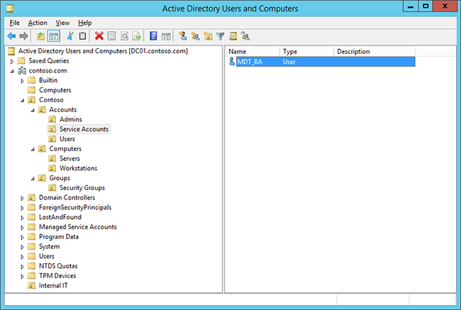
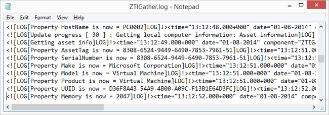
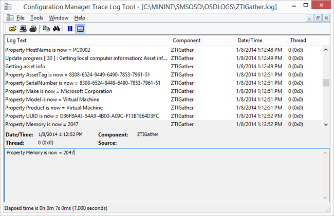

# Prepare for deployment with MDT 2013 Update 1


**Applies to**

-   Windows 10

This topic will walk you through the steps necessary to create the server structure required to deploy the Windows 10 operating system using the Microsoft Deployment Toolkit (MDT) 2013 Update 1. It covers the installation of the necessary system prerequisites, the creation of shared folders and service accounts, and the configuration of security permissions in the files system and in Active Directory.

For the purposes of this topic, we will use two machines: DC01 and MDT01. DC01 is a domain controller and MDT01 is a Windows Server 2012 R2 standard server. MDT01 is a member of the domain contoso.com for the fictitious Contoso Corporation. For more details on the setup for this topic, please see [Deploy Windows 10 with the Microsoft Deployment Toolkit](deploy-windows-81-with-the-microsoft-deployment-toolkit.md#proof).

## <a href="" id="sec01"></a>System requirements


MDT 2013 Update 1 requires the following components:

-   Any of the following operating systems:

    -   Windows 7

    -   Windows 8

    -   Windows 8.1

    -   Windows 10

    -   Windows Server 2008 R2

    -   Windows Server 2012

    -   Windows Server 2012 R2

-   Windows Assessment and Deployment Kit (ADK) for Windows 10

-   Windows PowerShell

-   Microsoft .NET Framework

## <a href="" id="sec02"></a>Install Windows ADK for Windows 10


These steps assume that you have the MDT01 member server installed and configured and that you have downloaded [Windows ADK for Windows 10](http://go.microsoft.com/fwlink/p/?LinkId=526803) to the E:\\Downloads\\ADK folder.

1.  On MDT01, log on as Administrator in the CONTOSO domain using a password of **P@ssw0rd**.

2.  Start the **ADK Setup** (E:\\Downloads\\ADK\\adksetup.exe), and on the first wizard page, click **Continue**.

3.  On the **Select the features you want to change** page, select the features below and complete the wizard using the default settings:

    1.  Deployment Tools

    2.  Windows Preinstallation Environment (Windows PE)

    3.  User State Migration Tool (UMST)

## <a href="" id="sec03"></a>Install MDT 2013 Update 1


These steps assume that you have downloaded [MDT 2013 Update 1](http://go.microsoft.com/fwlink/p/?LinkId=618117 ) to the E:\\Downloads\\MDT 2013 folder on MDT01.

1.  On MDT01, log on as Administrator in the CONTOSO domain using a password of **P@ssw0rd**.

2.  Install **MDT** (E:\\Downloads\\MDT 2013\\MicrosoftDeploymentToolkit2013\_x64.msi) with the default settings.

## <a href="" id="sec04"></a>Create the OU structure


If you do not have an organizational unit (OU) structure in your Active Directory, you should create one. In this section, you create an OU structure and a service account for MDT 2013 Update 1.

1.  On DC01, using Active Directory User and Computers, in the contoso.com domain level, create a top-level OU named **Contoso**.

2.  In the **Contoso** OU, create the following OUs:

    1.  Accounts

    2.  Computers

    3.  Groups

3.  In the **Contoso / Accounts** OU, create the following underlying OUs:

    1.  Admins

    2.  Service Accounts

    3.  Users

4.  In the **Contoso / Computers** OU, create the following underlying OUs:

    1.  Servers

    2.  Workstations

5.  In the **Contoso / Groups** OU, create the following OU:

    -   Security Groups



Figure 6. A sample of how the OU structure will look after all the OUs are created.

## <a href="" id="sec05"></a>Create the MDT service account


When creating a reference image, you need an account for MDT. The MDT Build Account is used for Windows Preinstallation Environment (Windows PE) to connect to MDT01.

1.  On DC01, using Active Directory User and Computers, browse to **contoso.com / Contoso / Service Accounts**.

2.  Select the **Service Accounts** OU and create the **MDT\_BA** account using the following settings:

    1.  Name: MDT\_BA

    2.  User logon name: MDT\_BA

    3.  Password: P@ssw0rd

    4.  User must change password at next logon: Clear

    5.  User cannot change password: Selected

    6.  Password never expires: Selected

## <a href="" id="sec06"></a>Create and share the logs folder


By default MDT stores the log files locally on the client. In order to capture a reference image, you will need to enable server-side logging and, to do that, you will need to have a folder in which to store the logs. For more information, see [Create a Windows 10 reference image](create-a-windows-81-reference-image.md).

1.  On MDT01, log on as **CONTOSO\\Administrator**.

2.  Create and share the **E:\\Logs** folder by running the following commands in an elevated Windows PowerShell prompt:

    ``` syntax
    New-Item -Path E:\Logs -ItemType directory
    New-SmbShare ?Name Logs$ ?Path E:\Logs -ChangeAccess EVERYONE
    icacls E:\Logs /grant '"MDT_BA":(OI)(CI)(M)'
    ```


Figure 7. The Sharing tab of the E:\\Logs folder after sharing it with PowerShell.

## <a href="" id="sec07"></a>Use CMTrace to read log files (optional)


The log files in MDT Lite Touch are formatted to be read by Configuration Manager Trace (CMTrace), which is available as part [of Microsoft System Center 2012 R2 Configuration Manager Toolkit](http://go.microsoft.com/fwlink/p/?LinkId=734717). You can use Notepad, but CMTrace formatting makes the logs easier to read.



Figure 8. An MDT log file opened in Notepad.



Figure 9. The same log file, opened in CMTrace, is much easier to read.

## Related topics


[Key features in MDT 2013 Update 1](key-features-in-mdt-2013.md)

[MDT 2013 Update 1 Lite Touch components](mdt-2013-lite-touch-components.md)

 

 


