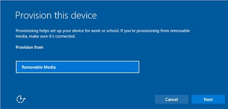
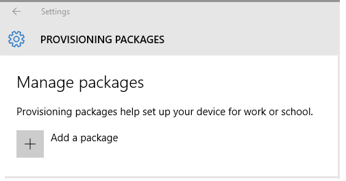
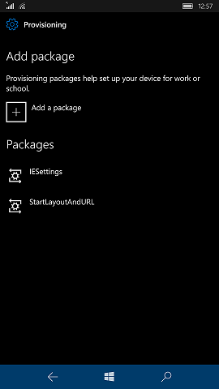

# Apply a provisioning package

**Applies to**

-   Windows 10
-   Windows 10 Mobile

Provisioning packages can be applied to a device during the first-run experience (out-of-box experience or "OOBE") and after ("runtime").

## Desktop editions

### During initial setup, from a USB drive

1. Start with a computer on the first-run setup screen. If the PC has gone past this screen, reset the PC to start over. To reset the PC, go to **Settings** > **Update & security** > **Recovery** > **Reset this PC**.

    

2. Insert the USB drive. Windows Setup will recognize the drive and ask if you want to set up the device. Select **Set up**.

    

3. The next screen asks you to select a provisioning source. Select **Removable Media** and tap **Next**.

    
    
4. Select the provisioning package (\*.ppkg) that you want to apply, and tap **Next**.

    

5. Select **Yes, add it**.

    
    
6. Read and accept the Microsoft Software License Terms.  

    
    
7. Select **Use Express settings**.

    

8. If the PC doesn't use a volume license, you'll see the **Who owns this PC?** screen. Select **My work or school owns it** and tap **Next**.

    

9. On the **Choose how you'll connect** screen, select **Join Azure AD** or **Join a domain** and tap **Next**.

    

10. Sign in with  your domain, Azure AD,  or Office 365 account and password. When you see the progress ring, you can remove the USB drive.

    
    
### After setup, from a USB drive, network folder, or SharePoint site

On a desktop computer, navigate to **Settings** > **Accounts** > **Access work or school** > **Add or remove a provisioning package** > **Add a package**, and select the package to install. 

    
## Mobile editions

### Using removable media

1. Insert an SD card containing the provisioning package into the device.
2. Navigate to **Settings** > **Accounts** > **Access work or school** > **Add or remove a provisioning package** > **Add a package**, and select the package to install. 

    

3. Click **Add**.

4. On the device, the **Is this package from a source you trust?** message will appear. Tap **Yes, add it**.

    
    
### Copying the provisioning package to the device

1. Connect the device to your PC through USB.

2. On the PC, select the provisioning package that you want to use to provision the device and then drag and drop the file to your device.

3. On the device, the **Is this package from a source you trust?** message will appear. Tap **Yes, add it**.

    

#

## Learn more

-   Watch the video: [Provisioning Windows 10 Devices with New Tools](https://go.microsoft.com/fwlink/p/?LinkId=615921)

-   Watch the video: [Windows 10 for Mobile Devices: Provisioning Is Not Imaging](https://go.microsoft.com/fwlink/p/?LinkId=615922)

## Related topics

- [Provisioning packages for Windows 10](provisioning-packages.md)
- [How provisioning works in Windows 10](provisioning-how-it-works.md)
- [Install Windows Imaging and Configuration Designer](provisioning-install-icd.md)
- [Create a provisioning package](provisioning-create-package.md)
- [Settings changed when you uninstall a provisioning package](provisioning-uninstall-package.md)
- [Provision PCs with common settings for initial deployment (simple provisioning)](provision-pcs-for-initial-deployment.md)
- [Provision PCs with apps and certificates for initial deployments (advanced provisioning)](provision-pcs-with-apps-and-certificates.md)
- [Use a script to install a desktop app in provisioning packages](provisioning-script-to-install-app.md)
- [NFC-based device provisioning](provisioning-nfc.md)
- [Windows ICD command-line interface (reference)](provisioning-command-line.md)
- [Create a provisioning package with multivariant settings](provisioning-multivariant.md)