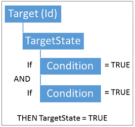
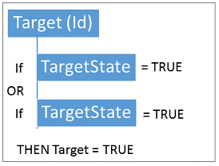

# Create a provisioning package with multivariant settings


**Applies to**

-   Windows 10
-   Windows 10 Mobile


In your organization, you might have different configuration requirements for devices that you manage. You can create separate provisioning packages for each group of devices in your organization that have different requirements. Or, you can create a multivariant provisioning package, a single provisioning package that can work for multiple conditions. For example, in a single provisioning package, you can define one set of customization settings that will apply to devices set up for French and a different set of customization settings for devices set up for Japanese. 

To provision multivariant settings, you use Windows Imaging and Configuration Designer (ICD) to create a provisioning package that contains all of the customization settings that you want to apply to any of your devices. Next, you manually edit the .XML file for that project to define each set of devices (a **Target**). For each **Target**, you specify at least one **Condition** with a value, which identifies the devices to receive the configuration. Finally, for each **Target**, you provide the customization settings to be applied to those devices.

Let's begin by learning how to define a **Target**.


## Define a target

In the XML file, you provide an **Id**, or friendly name, for each **Target**. Each **Target** is defined by at least one **TargetState** which contains at least one **Condition**. A **Condition** element defines the matching type between the condition and the specified value.

A **Target** can have more than one **TargetState**, and a **TargetState** can have more than one **Condition**. 


The following table describes the logic for the target definition.

<table><tr><td>When all **Condition** elements are TRUE, **TargetState** is TRUE.</td><td></td></tr>
<tr><td>If any of the **TargetState** elements is TRUE, **Target** is TRUE, and the **Id** can be used for setting customizations.</td><td></td></tr></table>

### Conditions

The following table shows the conditions supported in Windows 10 provisioning for a **TargetState**:


| Condition Name | Condition priority | Windows 10 Mobile | Windows 10 for desktop editions | Value type | Value description |
| --- | --- | --- | --- | --- | --- |
| MNC | P0 | Supported | N/A | Digit string | Use to target settings based on the Mobile Network Code (MNC) value. |
| MCC | P0 | Supported | N/A | Digit string | Use to target settings based on the Mobile Country Code (MCC) value. |
| SPN | P0 | Supported | N/A | String | Use to target settings based on the Service Provider Name (SPN) value. |
| PNN | P0 | Supported | N/A | String | Use to target settings based on public land mobile network (PLMN) Network Name value. |
| GID1 | P0 | Supported | N/A | Digit string | Use to target settings based on the Group Identifier (level 1) value. |
| ICCID | P0 | Supported | N/A | Digit string | Use to target settings based on the Integrated Circuit Card Identifier (ICCID) value. |
| Roaming | P0 | Supported | N/A | Boolean | Use to specify roaming. Set the value to **1** (roaming) or **0** (non-roaming). | 
| UICC | P0 | Supported | N/A | Enumeration | Use to specify the Universal Integrated Circuit Card (UICC) state. Set the value to one of the following:</br></br></br>- 0 - Empty</br>- 1 - Ready</br>- 2 - Locked |
| UICCSLOT | P0 | Supported | N/A | Digit string | Use to specify the UICC slot. Set the value one of the following:</br></br></br>- 0 - Slot 0</br>- 1 - Slot 1 |
| ProcessorType | P1 | Supported | Supported | String | Use to target settings based on the processor type. |
| ProcessorName | P1 | Supported | Supported | String | Use to target settings based on the processor name. |
| AoAc ("Always On, Always Connected") | P1 | Supported | Supported | Boolean | Set the value to **0** (false) or **1** (true). If this condition is TRUE, the system supports the S0 low power idle model. |
| PowerPlatformRole | P1 | Supported | Supported | Enumeration | Indicates the preferred power management profile. Set the value based on the [POWER_PLATFORM_ROLE enumeration](https://msdn.microsoft.com/library/windows/desktop/aa373174.aspx).  |
| Architecture | P1 | Supported | Supported | String | Matches the PROCESSOR_ARCHITECTURE environment variable. |
| Server | P1 | Supported | Supported | Boolean | Set the value to **0** (false) or **1** (true) to identify a server. |
| Region | P1 | Supported | Supported | Enumeration | Use to target settings based on [country/region](https://msdn.microsoft.com/library/cdax410z.aspx). |
| Lang | P1 | Supported | Supported | Enumeration | Use to target settings based on [language code](https://msdn.microsoft.com/library/39cwe7zf.aspx).  |


The matching types supported in Windows 10 are:

| Matching type | Syntax | Example |
| --- | --- | --- |
| Straight match | Matching type is specified as-is | &lt;Condition Name="ProcessorName" Value="Barton" /&gt; |
| Regular expression (Regex) match | Matching type is prefixed by "Pattern:" | &lt;Condition Name="ProcessorName" Value="Pattern:.*Celeron.*" /&gt; |
| Numeric range match | Matching type is prefixed by "!Range:" | &lt;Condition Name="MNC" Value="!Range:400, 550" /&gt; |
 

### TargetState priorities

You can define more than one **TargetState** within a provisioning package to apply settings to devices that match device conditions. When the provisioning engine evalues each **TargetState**, more than one **TargetState** may fit current device conditions. To determine the order in which the settings are applied, the system assigns a priority to every **TargetState**. 

A setting that matches a **TargetState** with a lower priority is applied before the setting that matches a **TargetState** with a higher priority. This means that a setting for the **TargetState** with the higher priority can overwrite a setting for the **TargetState** with the lower priority.

Settings that match more than one **TargetState** with equal priority are applied according to the order that each **TargetState** is defined in the provisioning package.

The **TargetState** priority is assigned based on the condition's priority (see the [Conditions table](#conditions) for priorities). The priority evaluation rules are as followed:

1. A **TargetState** with P0 conditions is higher than **TargetState** without P0 conditions.


2. A **TargetState** with P1 conditions is higher than **TargetState** without P0 and P1 conditions.

3. When you have more than one **TargetState** with the same priority conditions, the **TargetState** with the highest number of that priority conditions takes precedence.

4. When you have more than one **TargetState** with the same number of the same priority conditions, **TargetState** priorities are considered equal.


## Create a provisioning package with multivariant settings

Follow these steps to create a provisioning package with multivariant capabilities.


1. Build a provisioning package and configure the customizations you want to apply during certain conditions. For more information, see [Create a provisioning package](provisioning-create-package.md).

2. After you've [configured the settings](provisioning-create-package.md#configure-settings), save the project.

3. Open the project folder and copy the customizations.xml file to any local location. 

4. Use an XML or text editor to open the customizations.xml file.

    The customizations.xml file holds the package metadata (including the package owner and rank) and the settings that you configured when you created your provisioning package. The **Customizations** node of the file contains a **Common** section, which contains the customization settings.

    The following example shows the contents of a sample customizations.xml file.

    ```XML
<?xml version="1.0" encoding="utf-8"?> 
<WindowsCustomizatons> 
  <PackageConfig xmlns="urn:schemas-Microsoft-com:Windows-ICD-Package-Config.v1.0"> 
    <ID>{6aaa4dfa-00d7-4aaa-8adf-73c6a7e2501e}</ID> 
    <Name>My Provisioning Package</Name> 
    <Version>1.0</Version> 
    <OwnerType>OEM</OwnerType> 
    <Rank>50</Rank> 
  </PackageConfig> 
  <Settings xmlns="urn:schemas-microsoft-com:windows-provisioning"> 
    <Customizations> 
      <Common> 
        <Policies> 
          <AllowBrowser>0</AllowBrowser> 
          <AllowCamera>0</AllowCamera> 
          <AllowBluetooth>0</AllowBluetooth> 
        </Policies> 
        <HotSpot> 
          <Enabled>0</Enabled> 
        </HotSpot> 
      </Common> 
    </Customizations> 
  </Settings> 
</WindowsCustomizatons> 
    ```

4. Edit the customizations.xml file to create a **Targets** section to describe the conditions that will handle your multivariant settings. 

    The following example shows the customizations.xml, which has been modified to include several conditions including **ProcessorName**, **ProcessorType**, **MCC**, and **MNC**.
    
    ```XML
    <?xml version="1.0" encoding="utf-8"?> 
<WindowsCustomizatons> 
  <PackageConfig xmlns="urn:schemas-Microsoft-com:Windows-ICD-Package-Config.v1.0"> 
    <ID>{6aaa4dfa-00d7-4aaa-8adf-73c6a7e2501e}</ID> 
    <Name>My Provisioning Package</Name> 
    <Version>1.0</Version> 
    <OwnerType>OEM</OwnerType> 
    <Rank>50</Rank> 
  </PackageConfig> 
  <Settings xmlns="urn:schemas-microsoft-com:windows-provisioning"> 
    <Customizations> 
      <Common> 
        <Policies> 
          <AllowBrowser>0</AllowBrowser> 
          <AllowCamera>0</AllowCamera> 
          <AllowBluetooth>0</AllowBluetooth> 
        </Policies> 
        <HotSpot> 
          <Enabled>0</Enabled> 
        </HotSpot> 
      </Common> 
      <Targets> 
        <Target Id="Unique target identifier for desktop"> 
          <TargetState> 
            <Condition Name="ProcessorName" Value="Pattern:.*Celeron.*" /> 
            <Condition Name="ProcessorType" Value="Pattern:.*(I|i)ntel.*" /> 
          </TargetState> 
          <TargetState> 
            <Condition Name="ProcessorName" Value="Barton" /> 
            <Condition Name="ProcessorType" Value="Athlon MP" /> 
          </TargetState> 
        </Target> 
        <Target Id="Mobile target"> 
          <TargetState> 
            <Condition Name="MCC" Value="Range:310, 320" /> 
            <Condition Name="MNC" Value="!Range:400, 550" /> 
          </TargetState> 
        </Target> 
      </Targets> 
    </Customizations> 
  </Settings> 
</WindowsCustomizatons> 
    ```

5. In the customizations.xml file, create a **Variant** section for the settings you need to customize. To do this:

    a. Define a child **TargetRefs** element.
    
    b. Within the **TargetRefs** element, define a **TargetRef** element. You can define multiple **TargetRef** elements for each **Id** that you need to apply to customized settings. 

    c. Move compliant settings from the **Common** section to the **Variant** section.

    If any of the **TargetRef** elements matches the **Target**, all settings in the **Variant** are applied.

    >[!NOTE]
    >You can define multiple **Variant** sections. Settings that reside in the **Common** section are applied unconditionally on every triggering event.

    The following example shows the customizations.xml updated to include a **Variant** section and the moved settings that will be applied if the conditions for the variant are met.

    ```XML
<?xml version="1.0" encoding="utf-8"?> 
<WindowsCustomizatons> 
  <PackageConfig xmlns="urn:schemas-Microsoft-com:Windows-ICD-Package-Config.v1.0">
    <ID>{6aaa4dfa-00d7-4aaa-8adf-73c6a7e2501e}</ID> 
    <Name>My Provisioning Package</Name> 
    <Version>1.0</Version> 
    <OwnerType>OEM</OwnerType> 
    <Rank>50</Rank> 
  </PackageConfig> 
  <Settings xmlns="urn:schemas-microsoft-com:windows-provisioning"> 
    <Customizations> 
      <Common> 
      </Common> 
      <Targets> 
        <Target Id="Unique target identifier for desktop"> 
          <TargetState> 
            <Condition Name="ProcessorName" Value="Pattern:.*Celeron.*" /> 
            <Condition Name="ProcessorType" Value="Pattern:.*(I|i)ntel.*" /> 
          </TargetState> 
          <TargetState> 
            <Condition Name="ProcessorName" Value="Barton" /> 
            <Condition Name="ProcessorType" Value="Athlon MP" /> 
          </TargetState> 
        </Target> 
        <Target Id="Mobile target"> 
          <TargetState> 
            <Condition Name="MCC" Value="Range:310, 320" /> 
            <Condition Name="MNC" Value="!Range:400, 550" /> 
          </TargetState> 
        </Target>
      </Targets> 
      <Variant> 
        <TargetRefs> 
          <TargetRef Id="Unique target identifier for desktop" /> 
          <TargetRef Id="Mobile target" /> 
        </TargetRefs> 
        <Settings> 
          <Policies> 
            <AllowBrowser>1</AllowBrowser> 
            <AllowCamera>1</AllowCamera> 
            <AllowBluetooth>1</AllowBluetooth> 
          </Policies> 
          <HotSpot> 
            <Enabled>1</Enabled> 
          </HotSpot> 
        </Settings> 
      </Variant> 
    </Customizations> 
  </Settings> 
</WindowsCustomizatons> 
    ```

6. Save the updated customizations.xml file and note the path to this updated file. You will need the path as one of the values for the next step.


7. Use the [Windows ICD command-line interface](provisioning-command-line.md) to create a provisioning package using the updated customizations.xml. 

    For example:

    ```
    icd.exe /Build-ProvisioningPackage /CustomizationXML:"C:\CustomProject\customizations.xml" /PackagePath:"C:\CustomProject\output.ppkg" /StoreFile:C:\Program Files (x86)\Windows Kits\10\Assessment and Deployment Kit\Imaging and Configuration Designer\x86\Microsoft-Common-Provisioning.dat"
    ```
    

In this example, the **StoreFile** corresponds to the location of the settings store that will be used to create the package for the required Windows edition. 

>[!NOTE]
>The provisioning package created during this step will contain the multivariant settings. You can use this package either as a standalone package that you can apply to a Windows device or use it as the base when starting another project.

 

## Events that trigger provisioning

When you install the multivariant provisioning package on a Windows 10 device, the provisioning engine applies the matching condition settings at every event and triggers provisioning.

The following events trigger provisioning on Windows 10 devices:

| Event | Windows 10 Mobile | Windows 10 for desktop editions |
| --- | --- | --- |
| System boot | Supported | Supported |
| Operating system update | Supported | Planned |
| Package installation during device first run experience | Supported | Supported |
| Detection of SIM presence or update | Supported | Supported |
| Package installation at runtime | Supported | Supported |
| Roaming detected | Supported | Not supported |
 

 


 

## Related topics

- [Provisioning packages for Windows 10](provisioning-packages.md)
- [How provisioning works in Windows 10](provisioning-how-it-works.md)
- [Install Windows Imaging and Configuration Designer](provisioning-install-icd.md)
- [Create a provisioning package](provisioning-create-package.md)
- [Apply a provisioning package](provisioning-apply-package.md)
- [Settings changed when you uninstall a provisioning package](provisioning-uninstall-package.md)
- [Provision PCs with common settings for initial deployment (simple provisioning)](provision-pcs-for-initial-deployment.md)
- [Provision PCs with apps and certificates for initial deployments (advanced provisioning)](provision-pcs-with-apps-and-certificates.md)
- [Use a script to install a desktop app in provisioning packages](provisioning-script-to-install-app.md)
- [NFC-based device provisioning](provisioning-nfc.md)
- [Windows ICD command-line interface (reference)](provisioning-command-line.md)

 


