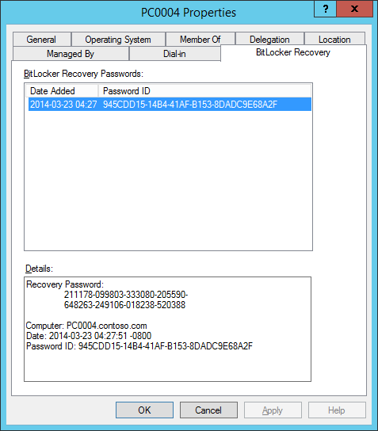
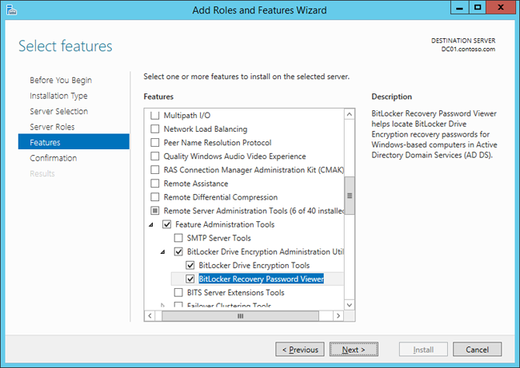

# Set up MDT for BitLocker

This topic will show you how to configure your environment for BitLocker, the disk volume encryption built into Windows 10 Enterprise and Windows 10 Pro, using MDT. BitLocker in Windows 10 has two requirements in regard to an operating system deployment:
-   A protector, which can either be stored in the Trusted Platform Module (TPM) chip, or stored as a password. Technically, you also can use a USB stick to store the protector, but it's not a practical approach as the USB stick can be lost or stolen. We, therefore, recommend that you instead use a TPM chip and/or a password.
-   Multiple partitions on the hard drive.

To configure your environment for BitLocker, you will need to do the following:

1.  Configure Active Directory for BitLocker.
2.  Download the various BitLocker scripts and tools.
3.  Configure the operating system deployment task sequence for BitLocker.
4.  Configure the rules (CustomSettings.ini) for BitLocker.

**Note**  
Even though it is not a BitLocker requirement, we recommend configuring BitLocker to store the recovery key and TPM owner information in Active Directory. For additional information about these features, see [Backing Up BitLocker and TPM Recovery Information to AD DS](https://go.microsoft.com/fwlink/p/?LinkId=619548). If you have access to Microsoft BitLocker Administration and Monitoring (MBAM), which is part of Microsoft Desktop Optimization Pack (MDOP), you have additional management features for BitLocker.
 
For the purposes of this topic, we will use DC01, a domain controller that is a member of the domain contoso.com for the fictitious Contoso Corporation. For more details on the setup for this topic, please see [Deploy Windows 10 with the Microsoft Deployment Toolkit](deploy-windows-10-with-the-microsoft-deployment-toolkit.md#proof).

## <a href="" id="sec01"></a>Configure Active Directory for BitLocker

To enable BitLocker to store the recovery key and TPM information in Active Directory, you need to create a Group Policy for it in Active Directory. For this section, we are running Windows Server 2012 R2, so you do not need to extend the Schema. You do, however, need to set the appropriate permissions in Active Directory.

**Note**  
Depending on the Active Directory Schema version, you might need to update the Schema before you can store BitLocker information in Active Directory.
 
In Windows Server 2012 R2 (as well as in Windows Server 2008 R2 and Windows Server 2012), you have access to the BitLocker Drive Encryption Administration Utilities features, which will help you manage BitLocker. When you install the features, the BitLocker Active Directory Recovery Password Viewer is included, and it extends Active Directory Users and Computers with BitLocker Recovery information.



Figure 2. The BitLocker Recovery information on a computer object in the contoso.com domain.

### Add the BitLocker Drive Encryption Administration Utilities

The BitLocker Drive Encryption Administration Utilities are added as features via Server Manager (or Windows PowerShell):

1.  On DC01, log on as **CONTOSO\\Administrator**, and, using Server Manager, click **Add roles and features**.
2.  On the **Before you begin** page, click **Next**.
3.  On the **Select installation type** page, select **Role-based or feature-based installation**, and click **Next**.
4.  On the **Select destination server** page, select **DC01.contoso.com** and click **Next**.
5.  On the **Select server roles** page, click **Next**.
6.  On the **Select features** page, expand **Remote Server Administration Tools**, expand **Feature Administration Tools**, select the following features, and then click **Next**:
    1.  BitLocker Drive Encryption Administration Utilities
    2.  BitLocker Drive Encryption Tools
    3.  BitLocker Recovery Password Viewer
7.  On the **Confirm installation selections** page, click **Install** and then click **Close**.



Figure 3. Selecting the BitLocker Drive Encryption Administration Utilities.

### Create the BitLocker Group Policy

Following these steps, you enable the backup of BitLocker and TPM recovery information to Active Directory. You also enable the policy for the TPM validation profile.
1.  On DC01, using Group Policy Management, right-click the **Contoso** organizational unit (OU), and select **Create a GPO in this domain, and Link it here**.
2.  Assign the name **BitLocker Policy** to the new Group Policy.
3.  Expand the **Contoso** OU, right-click the **BitLocker Policy**, and select **Edit**. Configure the following policy settings:
    Computer Configuration / Policies / Administrative Templates / Windows Components / BitLocker Drive Encryption / Operating System Drives
    1.  Enable the **Choose how BitLocker-protected operating system drives can be recovered** policy, and configure the following settings:
        1.  Allow data recovery agent (default)
        2.  Save BitLocker recovery information to Active Directory Domain Services (default)
        3.  Do not enable BitLocker until recovery information is stored in AD DS for operating system drives
    2.  Enable the **Configure TPM platform validation profile for BIOS-based firmware configurations** policy.
    3.  Enable the **Configure TPM platform validation profile for native UEFI firmware configurations** policy.
        Computer Configuration / Policies / Administrative Templates / System / Trusted Platform Module Services
    4.  Enable the **Turn on TPM backup to Active Directory Domain Services** policy.

**Note**  
If you consistently get the error "Windows BitLocker Drive Encryption Information. The system boot information has changed since BitLocker was enabled. You must supply a BitLocker recovery password to start this system." after encrypting a computer with BitLocker, you might have to change the various "Configure TPM platform validation profile" Group Policies, as well. Whether or not you need to do this will depend on the hardware you are using.
 
### Set permissions in Active Directory for BitLocker

In addition to the Group Policy created previously, you need to configure permissions in Active Directory to be able to store the TPM recovery information. In these steps, we assume you have downloaded the [Add-TPMSelfWriteACE.vbs script](https://go.microsoft.com/fwlink/p/?LinkId=167133) from Microsoft to C:\\Setup\\Scripts on DC01.
1.  On DC01, start an elevated PowerShell prompt (run as Administrator).
2.  Configure the permissions by running the following command:
    ``` syntax
    cscript C:\Setup\Scripts\Add-TPMSelfWriteACE.vbs
    ```


Figure 4. Running the Add-TPMSelfWriteACE.vbs script on DC01.

## <a href="" id="sec02"></a>Add BIOS configuration tools from Dell, HP, and Lenovo

If you want to automate enabling the TPM chip as part of the deployment process, you need to download the vendor tools and add them to your task sequences, either directly or in a script wrapper.

### Add tools from Dell

The Dell tools are available via the Dell Client Configuration Toolkit (CCTK). The executable file from Dell is named cctk.exe. Here is a sample command to enable TPM and set a BIOS password using the cctk.exe tool:
``` syntax
cctk.exe --tpm=on --valsetuppwd=Password1234
```
### Add tools from HP

The HP tools are part of HP System Software Manager. The executable file from HP is named BiosConfigUtility.exe. This utility uses a configuration file for the BIOS settings. Here is a sample command to enable TPM and set a BIOS password using the BiosConfigUtility.exe tool:
``` syntax
BIOSConfigUtility.EXE /SetConfig:TPMEnable.REPSET /NewAdminPassword:Password1234
```
And the sample content of the TPMEnable.REPSET file:
``` syntax
English
Activate Embedded Security On Next Boot
*Enable
Embedded Security Activation Policy
*No prompts
F1 to Boot
Allow user to reject
Embedded Security Device Availability
*Available
```
### Add tools from Lenovo

The Lenovo tools are a set of VBScripts available as part of the Lenovo BIOS Setup using Windows Management Instrumentation Deployment Guide. Lenovo also provides a separate download of the scripts. Here is a sample command to enable TPM using the Lenovo tools:
``` syntax
cscript.exe SetConfig.vbs SecurityChip Active
```
## <a href="" id="sec03"></a>Configure the Windows 10 task sequence to enable BitLocker

When configuring a task sequence to run any BitLocker tool, either directly or using a custom script, it is helpful if you also add some logic to detect whether the BIOS is already configured on the machine. In this task sequence, we are using a sample script (ZTICheckforTPM.wsf) from the Deployment Guys web page to check the status on the TPM chip. You can download this script from the Deployment Guys Blog post, [Check to see if the TPM is enabled](https://go.microsoft.com/fwlink/p/?LinkId=619549). In the following task sequence, we have added five actions:
-   **Check TPM Status.** Runs the ZTICheckforTPM.wsf script to determine if TPM is enabled. Depending on the status, the script will set the TPMEnabled and TPMActivated properties to either true or false.
-   **Configure BIOS for TPM.** Runs the vendor tools (in this case, HP, Dell, and Lenovo). To ensure this action is run only when necessary, add a condition so the action is run only when the TPM chip is not already activated. Use the properties from the ZTICheckforTPM.wsf.
    **Note**  
    It is common for organizations wrapping these tools in scripts to get additional logging and error handling.
     
-   **Restart computer.** Self-explanatory, reboots the computer.
-   **Check TPM Status.** Runs the ZTICheckforTPM.wsf script one more time.
-   **Enable BitLocker.** Runs the built-in action to activate BitLocker.

## Related topics

[Configure MDT deployment share rules](configure-mdt-deployment-share-rules.md)

[Configure MDT for UserExit scripts](configure-mdt-2013-for-userexit-scripts.md)

[Simulate a Windows 10 deployment in a test environment](simulate-a-windows-10-deployment-in-a-test-environment.md)

[Use the MDT database to stage Windows 10 deployment information](use-the-mdt-database-to-stage-windows-10-deployment-information.md)

[Assign applications using roles in MDT](assign-applications-using-roles-in-mdt-2013.md)

[Use web services in MDT](use-web-services-in-mdt-2013.md)

[Use Orchestrator runbooks with MDT](use-orchestrator-runbooks-with-mdt-2013.md)
