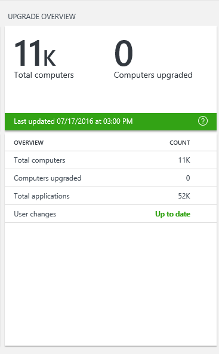
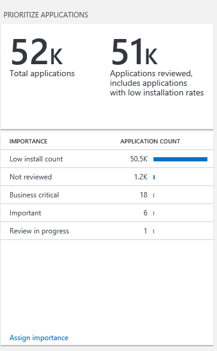

---
title: Upgrade Analytics - Prepare your environment (Windows 10)
description: Describes how to prepare your environment so that you can use Upgrade Analytics to manage Windows upgrades.
ms.prod: w10
author: MaggiePucciEvans
---

# Upgrade Analytics - Prepare your environment

This section of the Upgrade Analytics workflow reports your computer and application inventory and lists computers that you can use in a pilot with no known issues or with fixable driver issues. Additionally, you can determine the priority level of applications to indicate which applications the team should focus on to get them upgrade ready.

The blades in the **Prepare your environment** section are:

## Upgrade overview

Displays the total count of computers sharing data with Microsoft and the count of computers upgraded. As you successfully upgrade computers, the count of computers upgraded increases.

Check this blade for data refresh status, including the date and time of the most recent data update and whether user changes are reflected. If a user change is pending when changing the upgrade assessment or importance level of an application or driver, **Data refresh pending** is displayed in orange. User changes are processed once every 24 hours and read **Up to date** in green when there are no pending changes.

<!-- PRESERVING ORIGINAL IMAGE CODING JUST IN CASE

-->

Select **Total computers** for a list of computers and details about them, including:

-   Computer ID and computer name

-   Computer manufacturer

-   Computer model

-   Operating system version and build

-   Count of system requirement, application, and driver issues per computer

-   Upgrade assessment based on analysis of computer telemetry data

-   Upgrade decision status

Select **Total applications** for a list of applications discovered on user computers and details about them, including:

-   Application vendor

-   Application version

-   Count of computers the application is installed on

-   Count of computers that opened the application at least once in the past 30 days

-   Percentage of computers in your total computer inventory that opened the application in the past 30 days

-   Issues detected, if any

-   Upgrade assessment based on analysis of application data
   
-   Roll up level

## Run a pilot

Computers with no known issues and computers with fixable driver issues are listed, grouped by upgrade assessment. We recommend that you use these computers to test the impact of upgrading.

<!-- PRESERVING ORIGINAL IMAGE CODING JUST IN CASE

-->

Before you start your pilot project, be sure to review upgrade assessment and guidance details, explained in more detail in the table below.

| Upgrade assessment    | Action required before or after upgrade pilot? | Issue    | What it means   | Guidance      |
|-----------------------|------------------------------------------------|----------|-----------------|---------------|
| No known issues                                 | No                                             | None                                             | Computers will upgrade seamlessly.                                                                                                                                          | OK to use as-is in pilot.                                                                                                                                                                                                                                                                                                                 |
| OK to pilot, fixed during upgrade               | No, for awareness only                         | Application or driver will not migrate to new OS | The currently installed version of an application or driver won’t migrate to the new operating system; however, a compatible version is installed with the new operating system. | OK to use as-is in pilot.                                                                                                                                                                                                                                                                                                                 |
| OK to pilot with new driver from Windows Update | Yes                                            | Driver will not migrate to new OS                | The currently installed version of a driver won’t migrate to the new operating system; however, a newer, compatible version is available from Windows Update.                    | Although a compatible version of the driver is installed during upgrade, a newer version is available from Windows Update.   If the computer automatically receives updates from Windows Update, no action is required. Otherwise, replace the new in-box driver with the Windows Update version after upgrading.     |

Select **Export computers** to view pilot-ready computers organized by operating system. After you select the computers you want to use in a pilot, click Export to generate and save a comma-separated value (csv) file.

>**Important**> When viewing inventory items in table view, the maximum number of rows that can be viewed and exported is limited to 5,000. If you need to view or export more than 5,000 items, reduce the scope of the query so you can export fewer items at a time.

See [Plan for Windows 10 deployment](http://technet.microsoft.com/itpro/windows/plan/index) for more information about ways to deploy Windows in your organization. Read about [how Microsoft IT deployed Windows as an in-place upgrade](https://www.microsoft.com/itshowcase/Article/Content/668/Deploying-Windows-10-at-Microsoft-as-an-inplace-upgrade) for best practices using the in-place upgrade method.

## Prioritize applications

Applications are listed, grouped by importance level. Prioritizing your applications allows you to identify the ones that you will focus on preparing for upgrade.

<!-- PRESERVING ORIGINAL IMAGE CODING JUST IN CASE

-->

Select **Assign importance** to change an application’s importance level. By default, applications are marked **Not reviewed** or **Low install count** until you assign a different importance level to them.

To change an application’s importance level:

1.  Select **Not reviewed** or **Low install count** on the **Prioritize applications** blade to view the list of applications with that importance level. Select **Table** to view the list in a table.

2.  Select **User changes** to enable user input.

3.  Select the applications you want to change to a specific importance level and then select the appropriate option from the **Select importance level** list.

4.  Click **Save** when finished.

Importance levels include:

| Importance level   | When to use it   | Recommendation   |
|--------------------|------------------|------------------|
| Low install count  | We give you a head start by identifying applications that are installed on 2% or less of your total computer inventory. \[Number of computers application is installed on/total number of computers in your inventory.\]  Low install count applications are automatically marked as **Ready to upgrade** in the **UpgradeDecision** column unless they have issues that need attention.  | Be sure to review low install count applications for any business critical or important applications that are not yet upgrade-ready, despite their low installation rates.                                                                                                                                                                                                    |
| Not reviewed       | Applications that are installed on more than 2% of your total computer inventory are marked not reviewed until you change the importance level.  These applications are also marked as **Not reviewed** in the **UpgradeDecision** column.                                                                                                                                                | Once you’ve started to investigate an application to determine its importance level and upgrade readiness, change its status to **Review in progress** in both the **Importance** and **UpgradeDecision** columns.                                                                                                                                                                      |
| Business critical  | By default, no applications are marked as business critical because only you can make that determination. If you know that an application is critical to your organization’s functioning, mark it **Business critical**.                                                                                                                                                                       | You may also want to change the application’s status to **Review in progress** in the **UpgradeDecision** column to let other team members know that you’re working on getting this business critical application upgrade-ready. Once you’ve fixed any issues and validated that the application will migrate successfully, change the upgrade decision to **Ready to upgrade**.   |
| Important          | By default, no applications are marked as important because only you can make that determination. If the application is important but not critical to your organization’s functioning, mark it **Important**.                                                                                                                                                                          | You may also want to change the application’s status to **Review in progress** in the **UpgradeDecision** column to let other team members know that you’re working on getting this important application upgrade-ready. Once you’ve fixed any issues and validated that the application will migrate successfully, change the upgrade decision to **Ready to upgrade**.           |
| Ignore             | By default, no applications are marked as ignore because only you can make that determination. If the application is not important to your organization’s functioning, such as user-installed applications and games, you may not want to spend time and money validating that these applications will migrate successfully. Mark these applications **Ignore**.                                    | Set the application’s importance level to **Ignore** to let other team members know that it can be left as-is with no further investigation or testing.  You may also want to change the application’s status to **Not reviewed** or **Ready to upgrade** in the **UpgradeDecision** column.                                                                             |
| Review in progress | Once you’ve started to investigate an application to determine its importance level and upgrade readiness, change its status to **Review in progress** in both the **Importance** and **UpgradeDecision** columns.                                                                                                                                                                                  | As you learn more about the application’s importance to your organization’s functioning, change the importance level to **Business critical**, **Important**, or **Ignore**.  Until you’ve determined that priority applications will migrate successfully, leave the upgrade decision status as **Review in progress**.                                                 |

