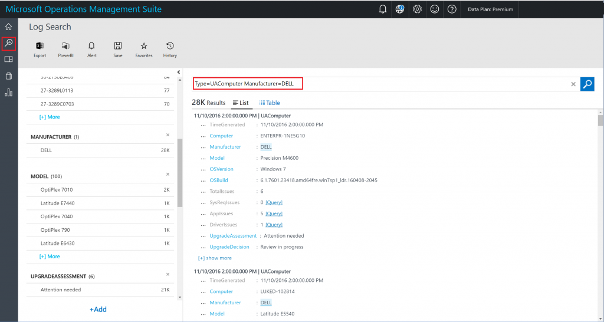
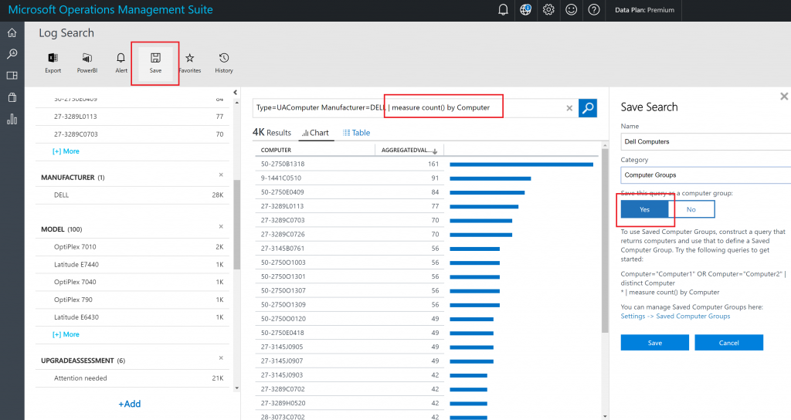
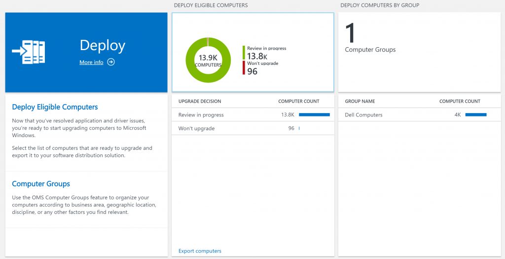
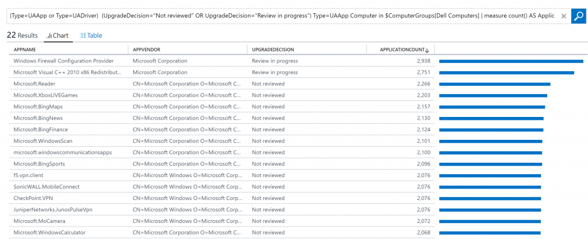

---
title: Upgrade Readiness - Get a list of computers that are upgrade-ready (Windows 10)
description: Describes how to get a list of computers that are ready to be upgraded in Upgrade Readiness.
ms.prod: w10
author: greg-lindsay
---

# Upgrade Readiness - Step 3: Deploy Windows

All of your work up to now involved reviewing and resolving application and driver issues. Along the way, as you’ve resolved issues and decided which applications and drivers are ready to upgrade, you’ve been building a list of computers that are upgrade ready. 
The blades in the **Deploy** section are:

- [Deploy eligible computers](#deploy-eligible-computers)
- [Deploy computers by group](#computer-groups) 

>Computers that are listed in this step are assigned an **UpgradeDecision** value, and the total count of computers in each upgrade decision category is displayed. Additionally, computers are assigned an **UpgradeAssessment** value. This value is displayed by drilling down into a specific upgrade decision category. For information about upgrade assessment values, see [Upgrade assessment](#upgrade-assessment).

## Deploy eligible computers

In this blade, computers grouped by upgrade decision are listed. The upgrade decision on the machines is a calculated value based on the upgrade decision status for the apps and drivers installed on the computer.  This value cannot be modified directly. The upgrade decision is calculated in the following ways:
- **Review in progress**:  At least one app or driver installed on the computer is marked **Review in progress**.
- **Ready to upgrade**:  All apps and drivers installed on the computer are marked as **Ready to Upgrade**.
- **Won’t upgrade**:  At least one app or driver installed on the computer is marked as **Won’t upgrade**, or a system requirement is not met.

<!-- PRESERVING ORIGINAL IMAGE CODING JUST IN CASE

-->


Select **Export computers** for more details, including computer name, manufacturer and model, and Windows edition currently running on the computer. Sort or further query the data and then select **Export** to generate and save a comma-separated value (csv) list of upgrade-ready computers.

>**Important**<br> When viewing inventory items in table view, the maximum number of rows that can be viewed and exported is limited to 5,000. If you need to view or export more than 5,000 items, reduce the scope of the query so you can export fewer items at a time.

## Computer groups

Computer groups allow you to segment your environment by creating device groups based on OMS log search results, or by importing groups from Active Directory, WSUS or System Center Configuration Manager. Computer groups are an OMS feature. For more information, see [Computer groups in OMS](https://blogs.technet.microsoft.com/msoms/2016/04/04/computer-groups-in-oms/).

Query based computer groups are recommended in the initial release of this feature. A feature known as **Configuration Manager Upgrade Readiness Connector** is anticipated in a future release that will enable synchronization of **ConfigMgr Collections** with computer groups in OMS.

### Getting started with Computer Groups

When you sign in to OMS, you will see a new blade entitled **Computer Groups**. See the following example:


To create a computer group, open **Log Search** and create a query based on **Type=UAComputer**, for example:

```
Type=UAComputer Manufacturer=DELL
```



When you are satisfied that the query is returning the intended results, add the following text to your search:

```
| measure count() by Computer
```

This will ensure every computer only shows up once. Then, save your group by clicking **Save** and **Yes**. See the following example:



Your new computer group will now be available in Upgrade Readiness. See the following example:



### Using Computer Groups

When you drill into a computer group, you will see that computers are categorized by **UpgradeDecision**. For computers with the status **Review in progress** or **Won’t upgrade** you can drill down to view issues that cause a computer to be in each category, or you can simply display a list of the computers in the category. For computers that are designated **Ready to upgrade**, you can go directly to the list of computers that are ready.


Viewing a list of computers in a certain status is self-explanatory, Let’s look at what happens when you click the details link on **Review in progress**:


Next, select if you want to see application issues (**UAApp**) or driver issues (**UADriver**). See the following example of selecting **UAApp**:



A list of apps that require review so that Dell Computers are ready for upgrade to Windows 10 is displayed.

### Upgrade assessment

Upgrade assessment and guidance details are explained in the following table.

| Upgrade assessment    | Action required before or after upgrade pilot? | Issue    | What it means   | Guidance      |
|-----------------------|------------------------------------------------|----------|-----------------|---------------|
| No known issues                                 | No                                             | None                                             | Computers will upgrade seamlessly.<br>                                                                                                                                         | OK to use as-is in pilot.                                                                                                                                                                                                                                                                                                                 |
| OK to pilot, fixed during upgrade               | No, for awareness only                         | Application or driver will not migrate to new OS | The currently installed version of an application or driver won’t migrate to the new operating system; however, a compatible version is installed with the new operating system. | OK to use as-is in pilot.                                                                                                                                                                                                                                                                                                                 |
| OK to pilot with new driver from Windows Update | Yes                                            | Driver will not migrate to new OS                | The currently installed version of a driver won’t migrate to the new operating system; however, a newer, compatible version is available from Windows Update.                    | Although a compatible version of the driver is installed during upgrade, a newer version is available from Windows Update. <br><br>If the computer automatically receives updates from Windows Update, no action is required. Otherwise, replace the new in-box driver with the Windows Update version after upgrading. <br> <br> |

Select **Export computers** to view pilot-ready computers organized by operating system. After you select the computers you want to use in a pilot, click Export to generate and save a comma-separated value (csv) file.

>**Important**> When viewing inventory items in table view, the maximum number of rows that can be viewed and exported is limited to 5,000. If you need to view or export more than 5,000 items, reduce the scope of the query so you can export fewer items at a time.