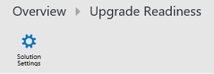
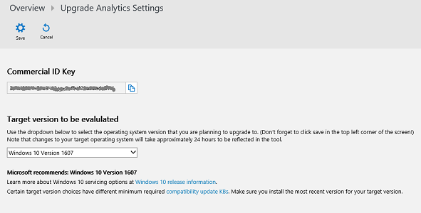

---
title: Use Upgrade Analytics to manage Windows upgrades (Windows 10)
description: Describes how to use Upgrade Analytics to manage Windows upgrades.
ms.prod: w10
author: greg-lindsay
---

# Use Upgrade Analytics to manage Windows upgrades

You can use Upgrade Analytics to prioritize and work through application and driver issues, assign and track issue resolution status, and identify computers that are ready to upgrade. Upgrade Analytics enables you to deploy Windows with confidence, knowing that you’ve addressed potential blocking issues.

- Based on telemetry data from user computers, Upgrade Analytics identifies application and driver compatibility issues that may block Windows upgrades, allowing you to make data-driven decisions about your organization’s upgrade readiness.
- Information is refreshed daily so you can monitor upgrade progress. Any changes your team makes, such as assigning application importance and marking applications as ready to upgrade, are reflected 24 hours after you make them.

When you are ready to begin the upgrade process, a workflow is provided to guide you through critical high-level tasks. 

Each step in the workflow is enumerated using blue tiles. Helpful data is provided on white tiles to help you get started, to monitor your progress, and to complete each step.

>**Important**: You can use the [Target OS](#target-os) setting to evaluate computers that are runnign a specified version of Windows before starting the Upgrade Analytics workflow. By default, the Target OS is configured to the released version of Windows 10 for the Current Branch for Business (CBB).

The following information and workflow is provided:

- [Upgrade overview](upgrade-analytics-upgrade-overview.md): Review compatibility and usage information about computers, applications, and drivers.
- [Step 1: Identify important apps](upgrade-analytics-identify-apps.md): Assign importance levels to prioritize your applications.
- [Step 2: Resolve issues](upgrade-analytics-resolve-issues.md): Identify and resolve problems with applications.
- [Step 3: Deploy](upgrade-analytics-deploy-windows.md): Start the upgrade process.

Also see the following topic for information about additional items that can be affected by the upgrade process:

- [Additional insights](upgrade-analytics-additional-insights.md): Find out which MS Office add-ins are installed, and review web site activity.

## Target OS

The target OS setting is used to evaluate the number of computers that are already running the default version of Windows 10, or a later version.

As mentioned previously, the default target OS in Upgrade Analytics is set to the released version of the Current Branch for Business (CBB). CBB can be determined by reviewing [Windows 10 release information](https://technet.microsoft.com/windows/release-info.aspx). The target OS setting is used to evaluate the number of computers that are already running this version of Windows, or a later version. 

The number displayed under **Computers upgraded** in the Upgrade Overview blade is the total number of computers that are already running the same or a later version of Windows compared to the target OS. It also is used in the evaluation of apps and drivers: Known issues and guidance for the apps and drivers in Upgrade Analytics is based on the target OS version.

You now have the ability to change the Windows 10 version you wish to target. The available options currently are: Windows 10 version 1507, Windows 10 version 1511, and Windows version 1610.

To change the target OS setting, click on **Solutions Settings**, which appears at the top when you open you Upgrade Analytics solution:

>You must be signed in to Upgrade Analytics as an administrator to view settings.

On the **Upgrade Analytics Settings** page, choose one of the options in the drop down box and click **Save**. The changes in the target OS setting are reflected in evaluations when a new snapshot is uploaded to your workspace.

