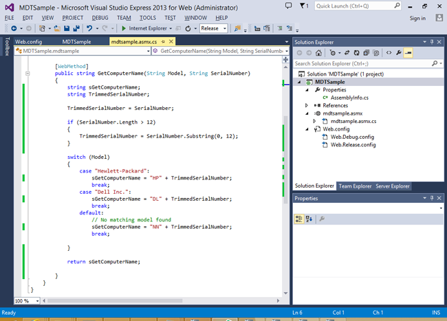
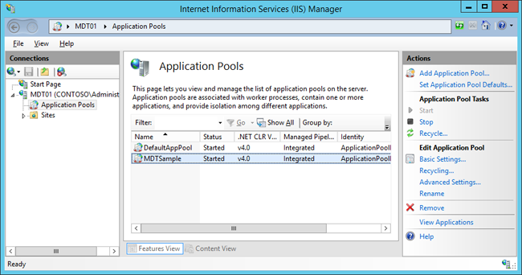
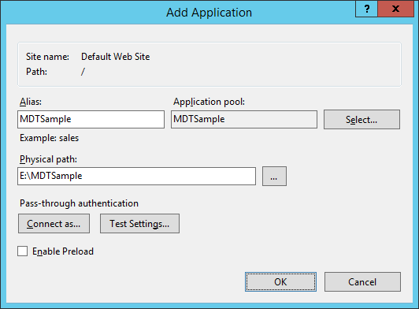
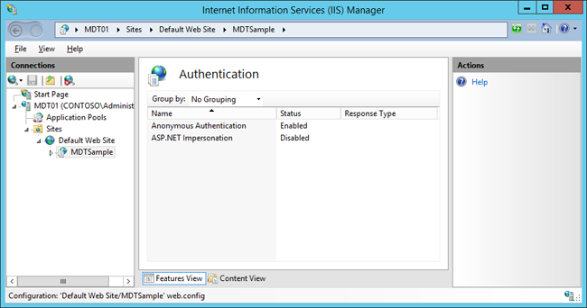
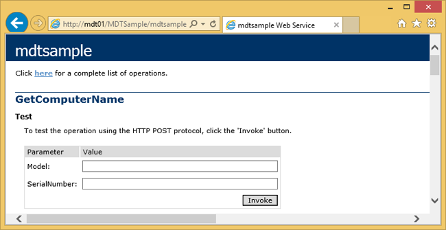
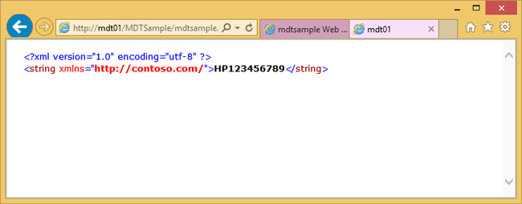
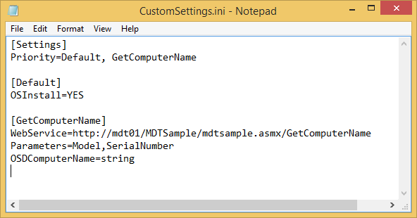
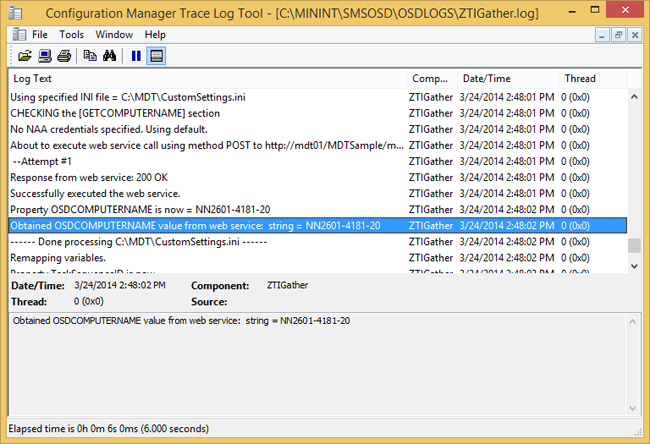

# Use web services in MDT

In this topic, you will learn how to create a simple web service that generates computer names and then configure MDT to use that service during your Windows 10 deployment. Web services provide a powerful way to assign settings during a deployment. Simply put, web services are web applications that run code on the server side, and MDT has built-in functions to call these web services.
Using a web service in MDT is straightforward, but it does require that you have enabled the Web Server (IIS) role on the server. Developing web services involves a little bit of coding, but for most web services used with MDT, you can use the free Microsoft Visual Studio Express 2013 for Web.

## <a href="" id="sec01"></a>Create a sample web service

In these steps we assume you have installed Microsoft Visual Studio Express 2013 for Web on PC0001 (the Windows 10 client) and downloaded the [MDT Sample Web Service](https://go.microsoft.com/fwlink/p/?LinkId=619363) from the Microsoft Download Center and extracted it to C:\\Projects.
1.  On PC0001, using Visual Studio Express 2013 for Web, open the C:\\Projects\\MDTSample\\ MDTSample.sln solution file.
2.  On the ribbon bar, verify that Release is selected.
3.  In the **Debug** menu, select the **Build MDTSample** action.
4.  On MDT01, create a folder structure for **E:\\MDTSample\\bin**.
5.  From PC0001, copy the C:\\Projects\\MDTSample\\obj\\Release\\MDTSample.dll file to the **E:\\MDTSample\\bin** folder on MDT01.
6.  From PC0001, copy the following files from C:\\Projects\\MDTSample file to the **E:\\MDTSample** folder on MDT01:
    1.  Web.config
    2.  mdtsample.asmx



Figure 15. The sample project in Microsoft Visual Studio Express 2013 for Web.

## <a href="" id="sec02"></a>Create an application pool for the web service

This section assumes that you have enabled the Web Server (IIS) role on MDT01.
1.  On MDT01, using Server Manager, install the **IIS Management Console** role (available under Web Server (IIS) / Management Tools).
2.  Using Internet Information Services (IIS) Manager, expand the **MDT01 (CONTOSO\\Administrator)** node. If prompted with the "Do you want to get started with Microsoft Web Platform?" question, select the **Do not show this message** check box and then click **No**.
3.  Right-click **Application Pools**, select **Add Application Pool**, and configure the new application pool with the following settings:
    1.  Name: MDTSample
    2.  .NET Framework version: .NET Framework 4.0.30319
    3.  Manage pipeline mode: Integrated
    4.  Select the **Start application pool immediately** check box.
    5.  Click **OK**.



Figure 16. The new MDTSample application.

## <a href="" id="sec03"></a>Install the web service

1.  On MDT01, using Internet Information Services (IIS) Manager, expand **Sites**, right-click **Default Web Site**, and select **Add Application**. Use the following settings for the application:
    1.  Alias: MDTSample
    2.  Application pool: MDTSample
    3.  Physical Path: E:\\MDTSample

    

    Figure 17. Adding the MDTSample web application.

2.  In the **Default Web Site** node, select the MDTSample web application, and in the right pane, double-click **Authentication**. Use the following settings for the **Authentication** dialog box:
    1.  Anonymous Authentication: Enabled
    2.  ASP.NET Impersonation: Disabled



Figure 18. Configuring Authentication for the MDTSample web service.

## <a href="" id="sec04"></a>Test the web service in Internet Explorer

1.  On PC0001, using Internet Explorer, navigate to: **http://MDT01/MDTSample/mdtsample.asmx**.
2.  Click the **GetComputerName** link.

    

    Figure 19. The MDT Sample web service.
3.  On the **GetComputerName** page, type in the following settings, and click **Invoke**:
    1.  Model: Hewlett-Packard
    2.  SerialNumber: 123456789



Figure 20. The result from the MDT Sample web service.

## <a href="" id="sec05"></a>Test the web service in the MDT simulation environment

After verifying the web service using Internet Explorer, you are ready to do the same test in the MDT simulation environment.

1.  On PC0001, edit the CustomSettings.ini file in the **C:\\MDT** folder to look like the following:
    ``` syntax
    [Settings]
    Priority=Default, GetComputerName
    [Default]
    OSInstall=YES
    [GetComputerName]
    WebService=http://mdt01/MDTSample/mdtsample.asmx/GetComputerName
    Parameters=Model,SerialNumber
    OSDComputerName=string
    ```
    

    Figure 21. The updated CustomSettings.ini file.

2.  Save the CustomSettings.ini file.
3.  Using an elevated Windows PowerShell prompt (run as Administrator), run the following commands. Press **Enter** after each command:
    ``` syntax
    Set-Location C:\MDT
    .\Gather.ps1
    ```
4.  Review the ZTIGather.log in the **C:\\MININT\\SMSOSD\\OSDLOGS** folder.



Figure 22. The OSDCOMPUTERNAME value obtained from the web service.

## Related topics

[Set up MDT for BitLocker](set-up-mdt-2013-for-bitlocker.md)

[Configure MDT deployment share rules](configure-mdt-deployment-share-rules.md)

[Configure MDT for UserExit scripts](configure-mdt-2013-for-userexit-scripts.md)

[Simulate a Windows 10 deployment in a test environment](simulate-a-windows-10-deployment-in-a-test-environment.md)

[Use the MDT database to stage Windows 10 deployment information](use-the-mdt-database-to-stage-windows-10-deployment-information.md)

[Assign applications using roles in MDT](assign-applications-using-roles-in-mdt-2013.md)

[Use Orchestrator runbooks with MDT](use-orchestrator-runbooks-with-mdt-2013.md)
 