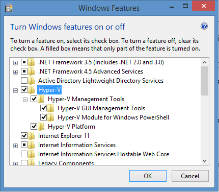

# Step by step guide: Deploy Windows 10 in a test lab

**Applies to**

-   Windows 10

## In this guide

This guide provides instructions for configuring a test lab that can be used as a proof of concept (PoC) environment where you can deploy Windows 10. The PoC enviroment is configured using Hyper-V and a minimum amount of resources. Detailed steps are provided for setting up the test lab, and for deploying Windows 10 under common scenarios with current deployment tools. The following topics are available in this guide:

<table style="border:5px double;" cellpadding="2">
    <tr>
        <td BGCOLOR="#a0e4fa">**Topic**</td>
        <td BGCOLOR="#a0e4fa">**Description**</td>
    <tr>
        <td>[Hardware and software requirements](#hardware-and-software-requirements)</td>
        <td>Prerequisites to configure the test lab environment.</td>
    </tr>
    <tr>
        <td>[Lab setup](#lab-setup)</td>
        <td>A summary of the lab configuration.</td>
    </tr>
    <tr>
        <td>[Configure the PoC environment](#configure-the-poc-environment)</td>
        <td>Step by step instructions to configure the test lab environment.</td>
    </tr>
    </tr>
     <tr>
        <td>[Step by step: Deploy Windows 10](#windows-10-poc-guides)</td>
        <td>Instructions to deploy Windows 10 in the lab environment.</td>
    </tr>
</table>

## Hardware and software requirements

Two computers are required to complete this guide: 

<table border="1" cellpadding="2">
    <tr>
        <td style="border:0px hidden white;"></td>
        <td BGCOLOR="#a8bbc1" style="border:0px hidden;">**Computer 1**</td>
        <td BGCOLOR="#a8bbc1" style="border:0px hidden;">**Computer 2**</td>
    </tr>
    <tr>
        <td BGCOLOR="#a8bbc1">Role</td>
        <td>Hyper-V host</td>
        <td>Client</td>
    </tr>
    <tr>
        <td BGCOLOR="#a8bbc1">Description</td>
        <td>This computer will run Hyper-V, the Hyper-V management tools, and the Hyper-V Windows PowerShell module.</td>
        <td>This computer is a test system on your corporate network that will be converted to a VHD.</td>
    </tr>
    <tr>
        <td BGCOLOR="#a8bbc1">OS</td>
        <td>Windows 8/8.1/10 or Windows Server 2012/2012 R2/2016</td>
        <td>Windows 7 or a later</td>
    </tr>
    <tr>
        <td BGCOLOR="#a8bbc1">Edition</td>
        <td>Enterprise, Professional, or Education</td>
        <td>Any</td>
    </tr>
    <tr>
        <td BGCOLOR="#a8bbc1">Architecture</td>
        <td>64-bit</td>
        <td>Any*</td>
    </tr>
    <tr>
        <td BGCOLOR="#a8bbc1">RAM</td>
        <td>8 GB RAM (16 GB recommended)</td>
        <td>Any</td>
    </tr>
    <tr>
        <td BGCOLOR="#a8bbc1">Disk</td>
        <td>50 GB available hard disk space (100 GB recommended)</td>
        <td>Any</td>
    </tr>
    <tr>
        <td BGCOLOR="#a8bbc1">CPU</td>
        <td>SLAT-Capable CPU</td>
        <td>Any</td>
    </tr>
    <tr>
        <td BGCOLOR="#a8bbc1">Network</td>
        <td>Internet connection</td>
        <td>Any</td>
    </tr>
</table>

>*Retaining applications and settings during the upgrade process requires that architecture (32 or 64-bit) is the same before and after the upgrade.

## Lab setup

The Hyper-V host computer is configured to host four VMs on a private, proof of concept network. Links are provided to download trial versions of Windows Server 2012 and all deployment tools necessary to complete the lab.
- Two VMs are running Windows Server 2012 R2 with required network services and tools installed.
- Two VMs are client systems: One VM is intended to mirror a host on your corporate network and one VM is running Windows 10 to demonstrate the hardware replacement scenario.

See the following diagram:


**Note**:
>If you have an existing Hyper-V host, you can use this host if desired and skip the Hyper-V installation section in this guide. If your Hyper-V host is running Windows Server 2008 R2, you must enable PowerShell functionality to complete the steps in this guide. 

>The two Windows Server VMs can be combined into a single VM to conserve RAM and disk space if required. However, instructions in this guide assume two server systems are used. Using two servers enables Active Directory Domain Services and DHCP to be installed on a server that is not directly connected to the corporate network. This mitigates the risk of clients on the corporate network receiving DHCP leases from the PoC network (i.e. "rogue" DHCP), and limits NETBIOS service broadcasts to the corporate network.

## Configure the PoC environment

### In this section

[Install Hyper-V](#install-hyper-v)<BR>
[Download VHDs](#download-vhds)<BR>
[Configure Hyper-V](#configure-hyper-v)<BR>
[Configure VHDs](#configure-vhds)<BR>
[Verify the configuration](#verify-the-configuration)

### Install Hyper-V

1. Verify that the computer supports Hyper-V.

    To install Hyper-V, the computer must be running one of the following operating systems, or a later operating system: 
    - Windows 8 
    - Windows 8.1
    - Windows 10
    - Windows Server 2012
    - Windows Server 2012 R2
    - Winodws Server 2016

    Note: A 64-bit operating system is requried to run Hyper-V.

    Starting with Windows 8, the host computer’s microprocessor must support second level address translation (SLAT) to install Hyper-V. See [Hyper-V: List of SLAT-Capable CPUs for Hosts](http://social.technet.microsoft.com/wiki/contents/articles/1401.hyper-v-list-of-slat-capable-cpus-for-hosts.aspx) for more information. To verify your computer supports SLAT, open an administrator command prompt,  type systeminfo, press ENTER, and review the section displayed at the bottom of the output, next to Hyper-V Requirements. 
    
    See the following example:
    
    ```
    C:\>systeminfo
    ...
    Hyper-V Requirements:      VM Monitor Mode Extensions: Yes
                               Virtualization Enabled In Firmware: Yes
                               Second Level Address Translation: Yes
                               Data Execution Prevention Available: Yes
    ```   
    In the example above, the computer supports SLAT and Hyper-V. 
    
    If one or more requirements are evaluated as "No" then the computer does not support installing Hyper-V.  However, if only the **"Virtualization Enabled In Firmware"** setting is incompatible, you might be able to enable virtualization in the BIOS and change this setting from "No" to "Yes." The location of this setting will depend on the manufacturer and BIOS version, but is often found associated with the BIOS security settings.

2. Enable Hyper-V.

    The Hyper-V feature is not installed by default. To get it, open an elevated Windows PowerShell window and type the following command. This command works to install Hyper-V on both Windows client and server operating systems:

    ```
    Enable-WindowsOptionalFeature -Online -FeatureName Microsoft-Hyper-V –All
    ```
    When you are prompted to restart the computer, choose **Yes**. The computer might restart more than once. 
    
    You can also install Hyper-V using the Control Panel in Windows, under Turn Windows features on or off, as shown below:
    
    

### Download VHDs

### Configure Hyper-V

### Configure VHDs

## Windows 10 PoC guides

- [Step by step: Deploy Windows 10 PoC with System Center Configuration Manager](windows-10-poc-sccm.md)
- [Step by step: Deploy Windows 10 PoC with the Microsoft Deployment Toolkit](windows-10-poc-mdt.md)

## Related Topics

[Windows 10 deployment scenarios](windows-10-deployment-scenarios.md)
 

 


