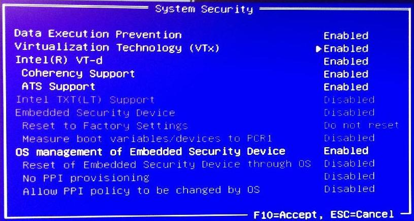

# Deploy Windows 10 in a test lab
**Applies to**

-   Windows 10

## In this guide

This guide provides instructions for setting up a proof of concept (PoC) lab using Hyper-V and a minimum amount of resources. Additional guides will provide detailed steps for deploying Windows 10 on client computers in the PoC environmment.

<table border="0" cellpadding="2">
    <tr>
        <td BGCOLOR="#a0e4fa">Topic</td>
        <td BGCOLOR="#a0e4fa">Description</td>
    </tr>
    <tr>
        <td>[Configure the PoC environment](#configure-the-poc-environment)</td>
        <td>Instructions are provided for installing and configuring Hyper-V and configuring VHDs in preparation for different deployment scenarios.</td>
    </tr>
    <tr>
        <td>Topic 2</td>
        <td>Description 2</td>
    </tr>
    <tr>
        <td>Topic 3</td>
        <td>Description 3</td>
    </tr>
    <tr>
        <td>Topic 4</td>
        <td>Description 4</td>
    </tr>
</table>

## Hardware and software requirements

Two computers are required to complete this guide: 

<table border="1" cellpadding="2">
    <tr>
        <td BGCOLOR="#a0e4fa">Computer 1: Hyper-V host</td>
        <td BGCOLOR="#a0e4fa">Computer 2: Client</td>
    </tr>
    <tr>
        <td>Windows 8/8.1/10 or Windows Server 2012/2012 R2/2016 installed 
            8 GB RAM (16 GB recommended) 
            50 GB available hard disk space (100 GB recommended) 
            SLAT-Capable CPU 
            Internet connection</td>
        <td>Windows 7 or a later operating system installed</td>
    </tr>
</table>

## Lab setup

The Hyper-V host computer is configured to host four VMs on a private, proof of concept network. Two VMs are running Windows Server 2012 R2 with required network services and tools installed. The remaining VMs are client systems with one VM intended to mirror a host on your corporate network, and one VM running Windows 10 to illustrate a hardware replacement scenario. See the following diagram.

Note: Instructions are provided in this guide to install and configure Hyper-V. However, you can skip the Hyper-V installation instructions and use an existing Hyper-V host computer if desired.

Links are provided to download trial versions of Windows Server 2012 and all deployment tools necessary to complete the lab.

## Configure the PoC environment

### Requirements

To complete the procedures in this topic

### Install Hyper-V

Use one of the following procedures to install Hyper-V on the Hyper-V host computer:
Install Hyper-V on a computer running Windows 8/8.1 or Windows 10

Starting with Windows 8, the host computer’s microprocessor must support second level address translation (SLAT) to install Hyper-V. See [Hyper-V: List of SLAT-Capable CPUs for Hosts](http://social.technet.microsoft.com/wiki/contents/articles/1401.hyper-v-list-of-slat-capable-cpus-for-hosts.aspx) for more information.

If your processor supports SLAT Hyper-V Manager is already included in Windows under Programs and Features.

Note  If you installed a 32-bit version of Windows, you won’t be able to create and manage local virtual machines. To fully manage virtual machines by using the host computer, you must install the 64-bit version of Windows 8.1 or Windows 8.

The Hyper-V feature is not installed by default in Windows 8. To get it, you can use the following Windows PowerShell command:

Enable-WindowsOptionalFeature -Online -FeatureName Microsoft-Hyper-V –All

You can also install it via the Control Panel in Windows under Turn Windows features on or off, as shown here:

Important  If you know that your processor supports SLAT, but you still get an error message that states Hyper-V cannot be installed, you might need to enable virtualization in the BIOS. The location of this setting will depend on the manufacturer and BIOS version. The following image shows an example of the required settings (under Security) in a Hewlett-Packard BIOS for an Intel processor:

### Configure Hyper-V

### Download VHDs

### Configure VHDs

## Related Topics

[Windows 10 deployment scenarios](windows-10-deployment-scenarios.md)
 

 

