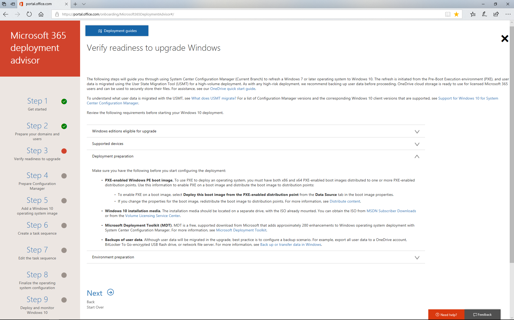

# Deploy Windows 10 with Microsoft 365

**Applies to**

-   Windows 10

This topic provides a brief overview of Microsoft 365 and describes how to use a free 90-day trial account to review some of the benefits of Microsoft 365.

[Microsoft 365](https://www.microsoft.com/microsoft-365) is a new offering from Microsoft that combines [Windows 10](https://www.microsoft.com/windows/features) with [Office 365](https://products.office.com/business/explore-office-365-for-business), and [Enterprise Mobility and Security](https://www.microsoft.com/cloud-platform/enterprise-mobility-security) (EMS).

For Windows 10 deployment, Microsoft 365 includes a fantasic deployment advisor that can walk you through the entire process of deploying Windows 10. The wizard supports multiple Windows 10 deployment methods, including:

- Windows AutoPilot
- In-place upgrade
- Deploying Windows 10 upgrade with Intune
- Deploying Windows 10 upgrade with System Center Configuration Manager
- Deploying a computer refresh with System Center Configuration Manager

## Free trial account

You can check out the Microsoft 365 deployment advisor and other resources for free! Just follow the steps below. 

1. Obtain a free EMS 90-day trial by visiting the following link. Provide your email address and answer a few simple questions.

    [Free Trial - Enterprise Mobility + Security](https://www.microsoft.com/cloud-platform/enterprise-mobility-security-trial)

2. Check out the [Microsoft 365 deployment advisor](https://portal.office.com/onboarding/Microsoft365DeploymentAdvisor#/).
3. Also check out the [Windows Analytics deployment advisor](https://portal.office.com/onboarding/WindowsAnalyticsDeploymentAdvisor#/). This advisor will walk you through deploying [Upgrade Readiness](https://docs.microsoft.com/windows/deployment/upgrade/manage-windows-upgrades-with-upgrade-readiness), [Update Compliance](https://docs.microsoft.com/windows/deployment/update/update-compliance-monitor), and [Device Health](https://docs.microsoft.com/windows/deployment/update/device-health-monitor). 

That's all there is to it! 

Examples of these two deployment advisors are shown below.

- [Microsoft 365 deployment advisor example](#microsoft-365-deployment-advisor-example)
- [Windows Analytics deployment advisor example](#windows-analytics-deployment-advisor-example)

## Microsoft 365 deployment advisor example

## Windows Analytics deployment advisor example

## Related Topics

[Windows 10 deployment scenarios](windows-10-deployment-scenarios.md)
 

 

