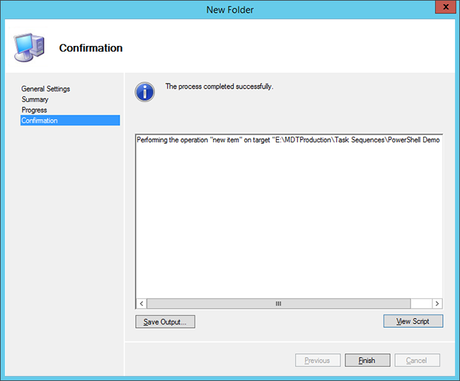
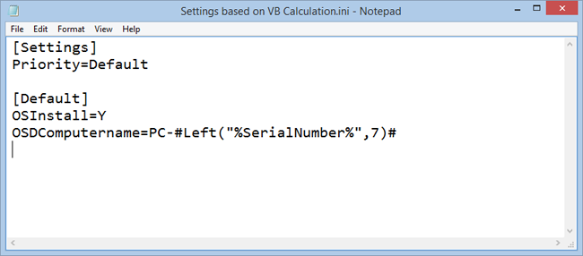

# MDT Lite Touch components

**Applies to**
-   Windows 10

This topic provides an overview of the features in the Microsoft Deployment Toolkit (MDT) that support Lite Touch Installation (LTI) for Windows 10. An LTI deployment strategy requires very little infrastructure or user interaction, and can be used to deploy an operating system from a network share or from a physical media, such as a USB flash drive or disc.
When deploying the Windows operating system using MDT, most of the administration and configuration is done through the Deployment Workbench, but you also can perform many of the tasks using Windows PowerShell. The easiest way to find out how to use PowerShell in MDT is to use the Deployment Workbench to perform an operation and at the end of that task, click View Script. That will give you the PowerShell command.

Figure 4. If you click **View Script** on the right side, you will get the PowerShell code that was used to perform the task.

## Deployment shares

A deployment share is essentially a folder on the server that is shared and contains all the setup files and scripts needed for the deployment solution. It also holds the configuration files (called rules) that are gathered when a machine is deployed. These configuration files can reach out to other sources, like a database, external script, or web server to get additional settings for the deployment. For Lite Touch deployments, it is common to have two deployment shares: one for creating the reference images and one for deployment. For Zero Touch, it is common to have only the deployment share for creating reference images because Microsoft System Center 2012 R2 Configuration Manager deploys the image in the production environment.

## Rules

The rules (CustomSettings.ini and Bootstrap.ini) make up the brain of MDT. The rules control the Windows Deployment Wizard on the client and, for example, can provide the following settings to the machine being deployed:
-   Computer name
-   Domain to join, and organizational unit (OU) in Active Directory to hold the computer object
-   Whether to enable BitLocker
-   Regional settings
You can manage hundreds of settings in the rules. For more information, see the [Microsoft Deployment Toolkit resource center](https://go.microsoft.com/fwlink/p/?LinkId=618117).

Figure 5. Example of a MDT rule. In this example, the new computer name is being calculated based on PC- plus the first seven (Left) characters from the serial number

## Boot images

Boot images are the Windows Preinstallation Environment (Windows PE) images that are used to start the deployment. They can be started from a CD or DVD, an ISO file, a USB device, or over the network using a Pre-Boot Execution Environment (PXE) server. The boot images connect to the deployment 
share on the server and start the deployment.

## Operating systems

Using the Deployment Workbench, you import the operating systems you want to deploy. You can import either the full source (like the full Windows 10 DVD/ISO) or a custom image that you have created. The full-source operating systems are primarily used to create reference images; however, they also can be used for normal deployments.

## Applications

Using the Deployment Workbench, you also add the applications you want to deploy. MDT supports virtually every executable Windows file type. The file can be a standard .exe file with command-line switches for an unattended install, a Microsoft Windows Installer (MSI) package, a batch file, or a VBScript. In fact, it can be just about anything that can be executed unattended. MDT also supports the new Universal Windows apps.

## Driver repository

You also use the Deployment Workbench to import the drivers your hardware needs into a driver repository that lives on the server, not in the image.

## Packages

With the Deployment Workbench, you can add any Microsoft packages that you want to use. The most commonly added packages are language packs, and the Deployment Workbench Packages node works well for those. You also can add security and other updates this way. However, we generally recommend that you use Windows Server Update Services (WSUS) for operating system updates. The rare exceptions are critical hotfixes that are not available via WSUS, packages for the boot image, or any other package that needs to be deployed before the WSUS update process starts.

## Task sequences

Task sequences are the heart and soul of the deployment solution. When creating a task sequence, you need to select a template. The templates are located in the Templates folder in the MDT installation directory, and they determine which default actions are present in the sequence.

You can think of a task sequence as a list of actions that need to be executed in a certain order. Each action can also have conditions. Some examples of actions are as follows:
-   **Gather.** Reads configuration settings from the deployment server.
-   **Format and Partition.** Creates the partition(s) and formats them.
-   **Inject Drivers.** Finds out which drivers the machine needs and downloads them from the central driver repository.
-   **Apply Operating System.** Uses ImageX to apply the image.
-   **Windows Update.** Connects to a WSUS server and updates the machine.

## Task sequence templates

MDT comes with nine default task sequence templates. You can also create your own templates. As long as you store them in the Templates folder, they will be available when you create a new task sequence.
-   **Sysprep and Capture task sequence.** Used to run the System Preparation (Sysprep) tool and capture an image of a reference computer.

    **Note**  
    It is preferable to use a complete build and capture instead of the Sysprep and Capture task sequence. A complete build and capture can be automated, whereas Sysprep and Capture cannot.
     
-   **Standard Client task sequence.** The most frequently used task sequence. Used for creating reference images and for deploying clients in production.
-   **Standard Client Replace task sequence.** Used to run User State Migration Tool (USMT) backup and the optional full Windows Imaging (WIM) backup action. Can also be used to do a secure wipe of a machine that is going to be decommissioned.
-   **Custom task sequence.** As the name implies, a custom task sequence with only one default action (one Install Application action).
-   **Standard Server task sequence.** The default task sequence for deploying operating system images to servers. The main difference between this template and the Standard Client task sequence template is that it does not contain any USMT actions because USMT is not supported on servers.
-   **Lite Touch OEM task sequence.** Used to preload operating systems images on the computer hard drive. Typically used by computer original equipment manufacturers (OEMs) but some enterprise organizations also use this feature.
-   **Post OS Installation task sequence.** A task sequence prepared to run actions after the operating system has been deployed. Very useful for server deployments but not often used for client deployments.
-   **Deploy to VHD Client task sequence.** Similar to the Standard Client task sequence template but also creates a virtual hard disk (VHD) file on the target computer and deploys the image to the VHD file.
-   **Deploy to VHD Server task sequence.** Same as the Deploy to VHD Client task sequence but for servers.
-   **Standard Client Upgrade task sequence.** A simple task sequence template used to perform an in-place upgrade from Windows 7, Windows 8, or Windows 8.1 directly to Windows 10, automatically preserving existing data, settings, applications, and drivers.

## Selection profiles

Selection profiles, which are available in the Advanced Configuration node, provide a way to filter content in the Deployment Workbench. Selection profiles are used for several purposes in the Deployment Workbench and in Lite Touch deployments. For example, they can be used to:
-   Control which drivers and packages are injected into the Lite Touch (and generic) boot images.
-   Control which drivers are injected during the task sequence.
-   Control what is included in any media that you create.
-   Control what is replicated to other deployment shares.
-   Filter which task sequences and applications are displayed in the Deployment Wizard.

## Logging

MDT uses many log files during operating system deployments. By default the logs are client side, but by configuring the deployment settings, you can have MDT store them on the server, as well.

**Note**  
The easiest way to view log files is to use Configuration Manager Trace (CMTrace), which is included in the [System Center 2012 R2 Configuration Manager Toolkit](https://go.microsoft.com/fwlink/p/?LinkId=734717).
 
## Monitoring

On the deployment share, you also can enable monitoring. After you enable monitoring, you will see all running deployments in the Monitor node in the Deployment Workbench.

## Related topics

[Key features in MDT](key-features-in-mdt.md)

[Prepare for deployment with MDT](prepare-for-windows-deployment-with-mdt.md)
