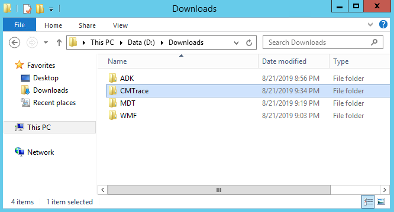

# Prepare for deployment with MDT

**Applies to**
-   Windows 10

This topic will walk you through the steps necessary to create the server structure required to deploy the Windows 10 operating system using the Microsoft Deployment Toolkit (MDT). It covers the installation of the necessary system prerequisites, the creation of shared folders and service accounts, and the configuration of security permissions in the file system and in Active Directory.

For the purposes of this topic, we will use two computers: **DC01** and **MDT01**
- Both servers are running Windows Server 2012 R2. You can also use a later version of Windows Server.
- DC01 is a domain controller and DNS server for contoso.com, representing the fictitious Contoso Corporation.
- MDT01 is a domain member server in contoso.com and has a D: drive that will be used for data.
    - The data drive requires at least 100GB of disk space.
 
For more details on requirements for the proof of concept environment used in this guide, see [Deploy Windows 10 with the Microsoft Deployment Toolkit](deploy-windows-10-with-the-microsoft-deployment-toolkit.md).

## Install Windows ADK for Windows 10

These steps assume that you have the MDT01 member server running and configured as a domain member server.

On MTD01, visit the [Download and install the Windows ADK](https://go.microsoft.com/fwlink/p/?LinkId=526803) page and download the following to the **D:\\Downloads\\ADK** folder on MDT01 (you will need to create the folder):
- [The Windows ADK for Windows 10](https://go.microsoft.com/fwlink/?linkid=2086042)
- [The Windows PE add-on for the ADK](https://go.microsoft.com/fwlink/?linkid=2087112)
- [The Windows System Image Manager (WSIM) 1903 update](https://go.microsoft.com/fwlink/?linkid=2095334)

>[!TIP]
>You might need to temporarily disable IE Enhanced Security Configuration for administrators in order to download files from the Internet to the server. This setting can be disabled by using Server Manager (Local Server/Properties).

1. On MDT01, sign in as an administrator in the CONTOSO domain. 
    - For the purposes of this guide, we are using a Domain Admin account of **admin** with a password of <b>pass@word3</b>. You can use your own administrator username and password as long as you properly adjust all steps in this guide that use login these credentials.
2. Start the **ADK Setup** (D:\\Downloads\\ADK\\adksetup.exe), click **Next** twice to accept the default installation parameters, click **Accept** to accept the license agreement, and then on the **Select the features you want to install** page accept the default list of features by clicking **Install**. This will install deployment tools and the USMT.
3. Start the **WinPE Setup** (D:\\Downloads\\ADK\\adkwinpesetup.exe), click **Next** twice to accept the default installation parameters, click **Accept** to accept the license agreement, and then on the **Select the features you want to install** page click **Install**. This will install Windows PE for x86, AMD64, ARM, and ARM64.
4. Extract the **WSIM 1903 update** (D:\\Downloads\ADK\\WSIM1903.zip) and then run the **UpdateWSIM.bat** file.
   - You can confirm that the update is applied by viewing properties of the ImageCat.exe and ImgMgr.exe files at **C:\\Program Files (x86)\\Windows Kits\\10\\Assessment and Deployment Kit\\Deployment Tools\\WSIM** and verifying that the **Details** tab displays a **File version** of **10.0.18362.144**.

## Install MDT

>[!NOTE]
>MDT installation requires the following:
>-   The Windows ADK for Windows 10 (installed in the previous procedure)
>-   Windows PowerShell ([version 5.1](https://www.microsoft.com/download/details.aspx?id=54616) is recommended)
>-   Microsoft .NET Framework

1. Visit the [MDT resource page](https://go.microsoft.com/fwlink/p/?LinkId=618117) and click **Download MDT**. 
2. Save the **MicrosoftDeploymentToolkit_x64.msi** file to the D:\\Downloads\\MDT folder on MDT01. 
    - **Note**: As of the publishing date for this guide, the current version of MDT is 8456, but a later version should also work. 
3. Install **MDT** (D:\\Downloads\\MDT\\MicrosoftDeploymentToolkit_x64.exe) with the default settings.

## Create the OU structure

>**Note**: The following procedures are performed on **DC01**.

To create the OU structure, you can use the Active Directory Users and Computers console (dsa.msc), or you can use Windows PowerShell.

To use Windows PowerShell, copy the following commands into a text file and save it as <b>c:\ou.ps1</b>. Be sure that you are viewing file extensions and that you save the file with the .ps1 extension.

```powershell
$oulist = Import-csv -Path c:\oulist.txt
ForEach($entry in $oulist){
    $ouname = $entry.ouname
    $oupath = $entry.oupath
    New-ADOrganizationalUnit -Name $ouname -Path $oupath -WhatIf
    Write-Host -ForegroundColor Green "OU $ouname is created in the location $oupath"
}
```

Next, copy the following list of OU names and paths into a text file and save it as <b>c:\oulist.txt</b>

```text
OUName,OUPath
Contoso,"DC=CONTOSO,DC=COM"
Accounts,"OU=Contoso,DC=CONTOSO,DC=COM"
Computers,"OU=Contoso,DC=CONTOSO,DC=COM"
Groups,"OU=Contoso,DC=CONTOSO,DC=COM"
Admins,"OU=Accounts,OU=Contoso,DC=CONTOSO,DC=COM"
Service Accounts,"OU=Accounts,OU=Contoso,DC=CONTOSO,DC=COM"
Users,"OU=Accounts,OU=Contoso,DC=CONTOSO,DC=COM"
Servers,"OU=Computers,OU=Contoso,DC=CONTOSO,DC=COM"
Workstations,"OU=Computers,OU=Contoso,DC=CONTOSO,DC=COM"
Security Groups,"OU=Groups,OU=Contoso,DC=CONTOSO,DC=COM"
```

Lastly, open an elevated Windows PowerShell prompt on DC01, navigate to the <b>c:\\</b> directory and run the ou.ps1 script:

```powershell
.\ou.ps1
```

This will create an OU structure as shown below.


To use the Active Directory Users and Computers console (instead of PowerShell):

1.  On DC01, using Active Directory User and Computers, in the contoso.com domain level, create a top-level OU named **Contoso**.
2.  In the **Contoso** OU, create the following OUs:
    1.  Accounts
    2.  Computers
    3.  Groups
3.  In the **Contoso / Accounts** OU, create the following underlying OUs:
    1.  Admins
    2.  Service Accounts
    3.  Users
4.  In the **Contoso / Computers** OU, create the following underlying OUs:
    1.  Servers
    2.  Workstations
5.  In the **Contoso / Groups** OU, create the following OU:
    1.   Security Groups

The final result of either method is shown below (the MDT_BA account will be created next).

## Create the MDT service account

When creating a reference image, you need an account for MDT. The MDT build account is used for Windows Preinstallation Environment (Windows PE) to connect to MDT01.

To create an MDT build account, open an elevalted Windows PowerShell prompt on DC01 and enter the following (copy and paste the entire command noticing the scroll bar at the bottom):

```powershell
New-ADUser -Name MDT_BA -UserPrincipalName MDT_BA -path "OU=Service Accounts,OU=Accounts,OU=Contoso,DC=CONTOSO,DC=COM" -Description "MDT Build Account" -AccountPassword (ConvertTo-SecureString "pass@word3" -AsPlainText -Force) -ChangePasswordAtLogon $false -PasswordNeverExpires $true -Enabled $true
```
If you have the Active Directory Users and Computers console open you can refresh the view and see this new account in the **Contoso\Accounts\Service Accounts** OU as shown in the screenshot above.

## Create and share the logs folder

By default MDT stores the log files locally on the client. In order to capture a reference image, you will need to enable server-side logging and, to do that, you will need to have a folder in which to store the logs. For more information, see [Create a Windows 10 reference image](create-a-windows-10-reference-image.md).

1.  On MDT01, sign in as **CONTOSO\\admin**.
2.  Create and share the **D:\\Logs** folder by running the following commands in an elevated Windows PowerShell prompt:

    ```powershell
    New-Item -Path D:\Logs -ItemType directory
    New-SmbShare -Name Logs$ -Path D:\Logs -ChangeAccess EVERYONE
    icacls D:\Logs /grant '"MDT_BA":(OI)(CI)(M)'
    ```

See the following example:


## Use CMTrace to read log files (optional)

The log files in MDT Lite Touch are formatted to be read by Configuration Manager Trace ([CMTrace](https://docs.microsoft.com/sccm/core/support/cmtrace)), which is available as part of the [Microsoft System 2012 R2 Center Configuration Manager Toolkit](https://go.microsoft.com/fwlink/p/?LinkId=734717). You should also download this tool.

You can use Notepad (example below):


Alternatively, CMTrace formatting makes the logs much easier to read. See the same log file below, opened in CMTrace:


## Next steps

The following is an example of files that have been downloaded and installed (including optional CMTrace) on MDT at this point in the lab.



When you have completed all the steps in this section to prepare for deployment, see [Create a Windows 10 reference image](create-a-windows-10-reference-image.md).

## Related topics

[Understand the Microsoft Deployment Toolkit (MDT)](get-started-with-the-microsoft-deployment-toolkit.md)