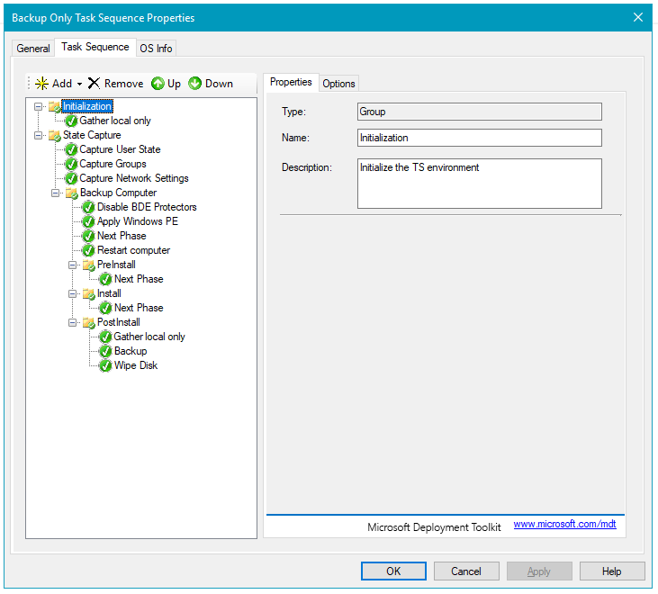
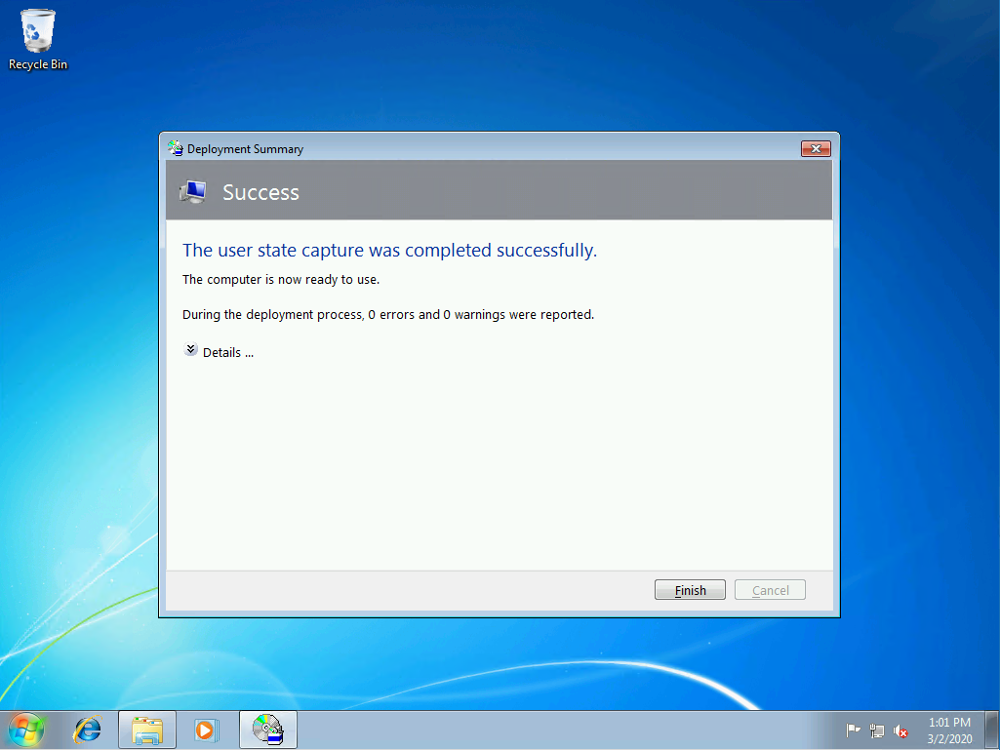
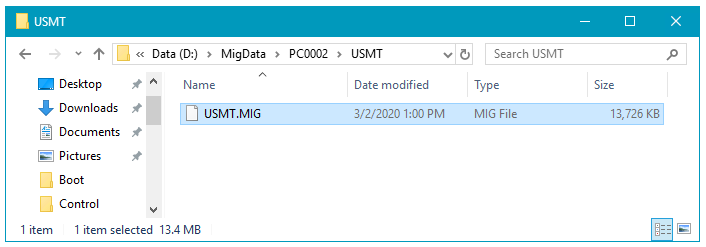
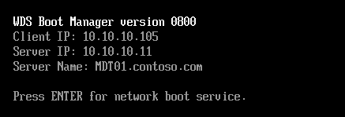

# Replace a Windows 7 computer with a Windows 10 computer

**Applies to**
-   Windows 10

A computer replace scenario for Windows 10 is quite similar to a computer refresh for Windows 10; however, because you are replacing a machine, you cannot store the backup on the old computer. Instead you need to store the backup to a location where the new computer can read it.
For the purposes of this topic, we will use four machines: DC01, MDT01, PC0002, and PC0007. DC01 is a domain controller and MDT01 is a Windows Server 2012 R2 standard server. PC0002 is an old machine running Windows 7 SP1. It is going to be replaced by a new Windows 10 machine, PC0007. User State Migration Tool (USMT) will be used to backup and restore data and settings. MDT01, PC0002, and PC0007 are members of the domain contoso.com for the fictitious Contoso Corporation. For more details on the setup for this topic, please see [Deploy Windows 10 with the Microsoft Deployment Toolkit](deploy-windows-10-with-the-microsoft-deployment-toolkit.md#proof).


Figure 1. The machines used in this topic.

## <a href="" id="sec01"></a>Prepare for the computer replace

When preparing for the computer replace, you need to create a folder in which to store the backup, and a backup only task sequence that you run on the old computer.

### Configure the rules on the Microsoft Deployment Toolkit (MDT) Production share

1.  On MDT01, using the Deployment Workbench, update the MDT Production deployment share rules.

2.  Change the **SkipUserData=YES** option to **NO**, and click **OK**.

### Create and share the MigData folder

1.  On MDT01, log on as **CONTOSO\\Administrator**.

2.  Create and share the **E:\\MigData** folder by running the following three commands in an elevated Windows PowerShell prompt:
    ``` syntax
    New-Item -Path E:\MigData -ItemType directory
    New-SmbShare ?Name MigData$ ?Path E:\MigData 
    -ChangeAccess EVERYONE
    icacls E:\MigData /grant '"MDT_BA":(OI)(CI)(M)'
    ```
### Create a backup only (replace) task sequence

1.  On MDT01, using the Deployment Workbench, in the MDT Production deployment share, select the **Task Sequences** node and create a new folder named **Other**.

2.  Right-click the **Other** folder and select **New Task Sequence**. Use the following settings for the New Task Sequence Wizard:

    * Task sequence ID: REPLACE-001
    * Task sequence name: Backup Only Task Sequence
    * Task sequence comments: Run USMT to backup user data and settings
    * Template: Standard Client Replace Task Sequence

3.  In the **Other** folder, double-click **Backup Only Task Sequence**, and then in the **Task Sequence** tab, review the sequence. Notice that it only contains a subset of the normal client task sequence actions.

    

    Figure 2. The Backup Only Task Sequence action list.

## <a href="" id="sec02"></a>Perform the computer replace

During a computer replace, these are the high-level steps that occur:

1.  On the computer you are replacing, a special replace task sequence runs the USMT backup and, if you configured it, runs the optional full Window Imaging (WIM) backup.

2.  On the new machine, you perform a standard bare-metal deployment. At the end of the bare-metal deployment, the USMT backup from the old computer is restored.

### Execute the replace task sequence

1.  On PC0002, log on as **CONTOSO\\Administrator**.

2.  Verify that you have write access to the **\\\\MDT01\\MigData$** share.

3.  Execute **\\\\MDT01\\MDTProduction$\\Scripts\\LiteTouch.vbs**.

4.  Complete the Windows Deployment Wizard using the following settings:

    1.  Select a task sequence to execute on this computer: Backup Only Task Sequence
        * Specify where to save your data and settings: Specify a location
        * Location: \\\\MDT01\\MigData$\\PC0002
        
        >[!NOTE]  
        >If you are replacing the computer at a remote site you should create the MigData folder on MDT02 and use that share instead.
         
    2.  Specify where to save a complete computer backup: Do not back up the existing computer
    3.  Password: P@ssw0rd

    The task sequence will now run USMT (Scanstate.exe) to capture user data and settings of the machine.

    

    Figure 3. The new task sequence running the Capture User State action on PC0002.

5.  On MDT01, verify that you have an USMT.MIG compressed backup file in the **E:\\MigData\\PC0002\\USMT** folder.

    

    Figure 4. The USMT backup of PC0002.

### Deploy the PC0007 virtual machine

1.  Create a virtual machine with the following settings:

    * Name: PC0007
    * Location: C:\\VMs
    * Generation: 2
    * Memory: 2048 MB
    * Hard disk: 60 GB (dynamic disk)

2.  Start the PC0007 virtual machine, and press **Enter** to start the Pre-Boot Execution Environment (PXE) boot. The machine will now load the Windows PE boot image from the WDS server.

    

    Figure 5. The initial PXE boot process of PC0005.

3.  After Windows Preinstallation Environment (Windows PE) has booted, complete the Windows Deployment Wizard using the following settings:

    * Password: P@ssw0rd
    * Select a task sequence to execute on this computer:
        * Windows 10 Enterprise x64 RTM Custom Image
        * Computer Name: PC0007
        * Applications: Select the Install - Adobe Reader XI - x86 application.

4.  The setup now starts and does the following:

    * Installs the Windows 10 Enterprise operating system.
    * Installs the added application.
    * Updates the operating system via your local Windows Server Update Services (WSUS) server.
    * Restores the USMT backup from PC0002.

## Related topics

[Get started with the Microsoft Deployment Toolkit (MDT)](get-started-with-the-microsoft-deployment-toolkit.md)

[Create a Windows 10 reference image](create-a-windows-10-reference-image.md)

[Deploy a Windows 10 image using MDT](deploy-a-windows-10-image-using-mdt.md)

[Build a distributed environment for Windows 10 deployment](build-a-distributed-environment-for-windows-10-deployment.md)

[Refresh a Windows 7 computer with Windows 10](refresh-a-windows-7-computer-with-windows-10.md)

[Configure MDT settings](configure-mdt-settings.md)
