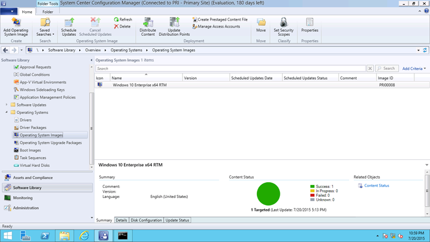

# Add a Windows 10 operating system image using Configuration Manager

**Applies to**

-   Windows 10 versions 1507, 1511

>[!IMPORTANT]
>For instructions to deploy the most recent version of Windows 10 with Configuration Manager, see [Scenarios to deploy enterprise operating systems with System Center Configuration Manager](https://docs.microsoft.com/sccm/osd/deploy-use/scenarios-to-deploy-enterprise-operating-systems). 
>Configuration Manager 2012 and 2012 R2 provide support for Windows 10 versions 1507 and 1511 only. Later versions of Windows 10 require an updated Configuration Manager release. For a list of Configuration Manager versions and the corresponding Windows 10 client versions that are supported, see [Support for Windows 10 for System Center Configuration Manager](https://docs.microsoft.com/sccm/core/plan-design/configs/support-for-windows-10).

Operating system images are typically the production image used for deployment throughout the organization. This topic shows you how to add a Windows 10 operating system image created with Microsoft System Center 2012 R2 Configuration Manager, and how to distribute the image to a distribution point.

For the purposes of this topic, we will use CM01, a machine running Windows Server 2012 R2 Standard, as the distribution point. CM01 is a member of the domain contoso.com for the fictitious Contoso Corporation. For more details on the setup for this topic, please see [Deploy Windows 10 with the Microsoft Deployment Toolkit](../deploy-windows-mdt/deploy-windows-10-with-the-microsoft-deployment-toolkit.md). Our image is named REFW10-X64-001.wim. For details on building this image, please see [Create a Windows 10 reference image](../deploy-windows-mdt/create-a-windows-10-reference-image.md).

1.  Using File Explorer, in the **E:\\Sources\\OSD\\OS** folder, create a subfolder named **Windows 10 Enterprise x64 RTM**.

2.  Copy the REFW10-X64-001.wim file to the **E:\\Sources\\OSD\\OS\\Windows 10 Enterprise x64 RTM** folder.

    

    Figure 17. The Windows 10 image copied to the Sources folder structure.

3.  Using the Configuration Manager Console, in the Software Library workspace, right-click **Operating System Images**, and select **Add Operating System Image**.

4.  On the **Data Source** page, in the **Path:** text box, browse to \\\\CM01\\Sources$\\OSD\\OS\\Windows 10 Enterprise x64 RTM\\REFW10-X64-001.wim and click **Next**.

5.  On the **General** page, assign the name Windows 10 Enterprise x64 RTM and click **Next** twice, and then click **Close**.

6.  Distribute the operating system image to the CM01 distribution point by right-clicking the Windows 10 Enterprise x64 RTM operating system image and selecting **Distribute Content**.

7.  In the Distribute Content Wizard, add the CM01 distribution point.

8.  View the content status for the Windows 10 Enterprise x64 RTM package. Do not continue until the distribution is completed. You also can review the E:\\Program Files\\Microsoft Configuration Manager\\Logs\\distmgr.log file and look for the **STATMSG: ID=2301** line.

    

    Figure 18. The distributed Windows 10 Enterprise x64 RTM package.

## Related topics

[Integrate Configuration Manager with MDT](../deploy-windows-mdt/integrate-configuration-manager-with-mdt.md)

[Prepare for Zero Touch Installation of Windows 10 with Configuration Manager](prepare-for-zero-touch-installation-of-windows-10-with-configuration-manager.md)

[Create a custom Windows PE boot image with Configuration Manager](create-a-custom-windows-pe-boot-image-with-configuration-manager.md)

[Create an application to deploy with Windows 10 using Configuration Manager](create-an-application-to-deploy-with-windows-10-using-configuration-manager.md)

[Add drivers to a Windows 10 deployment with Windows PE using Configuration Manager](add-drivers-to-a-windows-10-deployment-with-windows-pe-using-configuration-manager.md)

[Create a task sequence with Configuration Manager and MDT](../deploy-windows-mdt/create-a-task-sequence-with-configuration-manager-and-mdt.md)

[Deploy Windows 10 using PXE and Configuration Manager](deploy-windows-10-using-pxe-and-configuration-manager.md)

[Refresh a Windows 7 SP1 client with Windows 10 using Configuration Manager](refresh-a-windows-7-client-with-windows-10-using-configuration-manager.md)

[Replace a Windows 7 SP1 client with Windows 10 using Configuration Manager](replace-a-windows-7-client-with-windows-10-using-configuration-manager.md)
