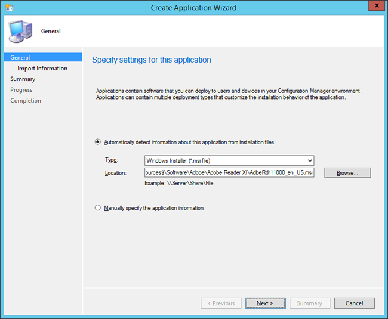

# Create an application to deploy with Windows 10 using Configuration Manager

**Applies to**

-   Windows 10 versions 1507, 1511

>[!IMPORTANT]
>For instructions to deploy the most recent version of Windows 10 with Configuration Manager, see [Scenarios to deploy enterprise operating systems with System Center Configuration Manager](https://docs.microsoft.com/sccm/osd/deploy-use/scenarios-to-deploy-enterprise-operating-systems). 
>Configuration Manager 2012 and 2012 R2 provide support for Windows 10 versions 1507 and 1511 only. Later versions of Windows 10 require an updated Configuration Manager release. For a list of Configuration Manager versions and the corresponding Windows 10 client versions that are supported, see [Support for Windows 10 for System Center Configuration Manager](https://docs.microsoft.com/sccm/core/plan-design/configs/support-for-windows-10).

Microsoft System Center 2012 R2 Configuration Manager supports deploying applications as part of the Windows 10 deployment process. In this section, you create an application in System Center 2012 R2 Configuration Manager that you later configure the task sequence to use.

For the purposes of this topic, we will use CM01, a machine running Windows Server 2012 R2 Standard that is a member of the domain contoso.com for the fictitious Contoso Corporation. For more details on the setup for this topic, please see [Deploy Windows 10 with the Microsoft Deployment Toolkit](../deploy-windows-mdt/deploy-windows-10-with-the-microsoft-deployment-toolkit.md).

>[!NOTE]  
>Even though the new application model is fully supported to deploy via the task sequence, the most reliable way to deploy software via the task sequence is still the legacy packages, especially if you deploy many applications.

## Example: Create the Adobe Reader XI application

The following steps show you how to create the Adobe Reader XI application. This section assumes that you have downloaded the MSI version of Adobe Reader XI to the C:\\Setup\\Adobe Reader XI folder on CM01.

1.  On CM01, using File Explorer, copy the **C:\\Setup\\Adobe Reader XI** folder to the **E:\\Sources\\Software\\Adobe** folder.

2.  Using the Configuration Manager Console, in the Software Library workspace, expand **Application Management**.

3.  Right-click **Applications** and select **Folder / Create Folder**. Assign the name **OSD**.

4.  Right-click the **OSD** folder, and select **Create Application**.

5.  In the Create Application Wizard, on the **General** page, use the following settings:

    * Automatically detect information about this application from installation files

    * Type: Windows Installer (\*.msi file)

    * Location: \\\\CM01\\Sources$\\Software\\Adobe\\Adobe Reader XI

    * \\AdbeRdr11000\_en\_US.msi

    

    *Figure 19. The Create Application Wizard*

6.  Click **Next**, and wait while Configuration Manager parses the MSI file.

7.  On the **Import Information** page, review the information and then click **Next**.

8.  On the **General Information** page, name the application Adobe Reader XI - OSD Install, click **Next** twice, and then click **Close**.

    >[!NOTE]
    >Because it is not possible to reference an application deployment type in the task sequence, you should have a single deployment type for applications deployed by the task sequence. If you are deploying applications via both the task sequence and normal application deployment, and you have multiple deployment types, you should have two applications of the same software. In this section, you add the "OSD Install" suffix to applications that are deployed via the task sequence. If using packages, you can still reference both package and program in the task sequence.
  
    
  
    *Figure 20. Add the "OSD Install" suffix to the application name*

9.  In the **Applications** node, select the Adobe Reader XI - OSD Install application, and click **Properties** on the ribbon bar.

10. In the **General Information** tab, select the **Allow this application to be installed from the Install Application task sequence action without being deployed** check box, and click **OK**.

## Related topics

[Integrate Configuration Manager with MDT](../deploy-windows-mdt/integrate-configuration-manager-with-mdt.md)

[Prepare for Zero Touch Installation of Windows 10 with Configuration Manager](prepare-for-zero-touch-installation-of-windows-10-with-configuration-manager.md)

[Create a custom Windows PE boot image with Configuration Manager](create-a-custom-windows-pe-boot-image-with-configuration-manager.md)

[Add a Windows 10 operating system image using Configuration Manager](add-a-windows-10-operating-system-image-using-configuration-manager.md)

[Add drivers to a Windows 10 deployment with Windows PE using Configuration Manager](add-drivers-to-a-windows-10-deployment-with-windows-pe-using-configuration-manager.md)

[Create a task sequence with Configuration Manager and MDT](../deploy-windows-mdt/create-a-task-sequence-with-configuration-manager-and-mdt.md)

[Deploy Windows 10 using PXE and Configuration Manager](deploy-windows-10-using-pxe-and-configuration-manager.md)

[Refresh a Windows 7 SP1 client with Windows 10 using Configuration Manager](refresh-a-windows-7-client-with-windows-10-using-configuration-manager.md)

[Replace a Windows 7 SP1 client with Windows 10 using Configuration Manager](replace-a-windows-7-client-with-windows-10-using-configuration-manager.md)

 

 

