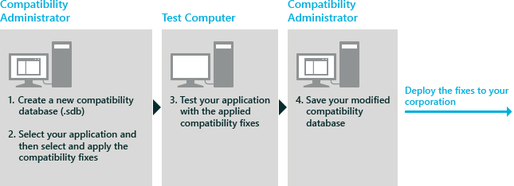

# Compatibility Administrator User's Guide

**Applies to**

- Windows 10
- Windows 8.1
- Windows 8
- Windows 7
- Windows Server 2012
- Windows Server 2008 R2

The Compatibility Administrator tool helps you resolve potential application-compatibility issues before deploying a new version of Windows to your organization. Compatibility Administrator provides the following:

- Compatibility fixes, compatibility modes, and AppHelp messages that you can use to resolve specific compatibility issues.

- Tools for creating customized compatibility fixes, compatibility modes, AppHelp messages, and compatibility databases.

- A query tool that you can use to search for installed compatibility fixes on your local computers.

The following flowchart shows the steps for using the Compatibility Administrator tool to create your compatibility fixes, compatibility modes, and AppHelp messages.

>[!IMPORTANT]  
>Application Compatibility Toolkit (ACT) installs a 32-bit and a 64-bit version of the Compatibility Administrator tool. You must use the 32-bit version to create and work with custom databases for 32-bit applications, and the 64-bit version to create and work with custom databases for 64-bit applications.

## In this section

<table>
<colgroup>
<col width="50%" />
<col width="50%" />
</colgroup>
<thead>
<tr class="header">
<th align="left">Topic</th>
<th align="left">Description</th>
</tr>
</thead>
<tbody>
<tr class="odd">
<td align="left">
<a href="using-the-compatibility-administrator-tool.md" data-raw-source="[Using the Compatibility Administrator Tool](using-the-compatibility-administrator-tool.md)">Using the Compatibility Administrator Tool</a>
</td>
<td align="left">
This section provides information about using the Compatibility Administrator tool.
</td>
</tr>
<tr class="even">
<td align="left">
<a href="managing-application-compatibility-fixes-and-custom-fix-databases.md" data-raw-source="[Managing Application-Compatibility Fixes and Custom Fix Databases](managing-application-compatibility-fixes-and-custom-fix-databases.md)">Managing Application-Compatibility Fixes and Custom Fix Databases</a>
</td>
<td align="left">
This section provides information about managing your application-compatibility fixes and custom-compatibility fix databases. This section explains the reasons for using compatibility fixes and how to deploy custom-compatibility fix databases.
</td>
</tr>
<tr class="odd">
<td align="left">
<a href="using-the-sdbinstexe-command-line-tool.md" data-raw-source="[Using the Sdbinst.exe Command-Line Tool](using-the-sdbinstexe-command-line-tool.md)">Using the Sdbinst.exe Command-Line Tool</a>
</td>
<td align="left">
You must deploy your customized database (.sdb) files to other computers in your organization before your compatibility fixes, compatibility modes, and AppHelp messages are applied. You can deploy your customized database files in several ways, including by using a logon script, by using Group Policy, or by performing file copy operations.
</td>
</tr>
</tbody>
</table>