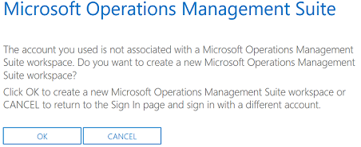
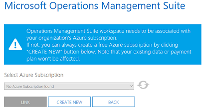
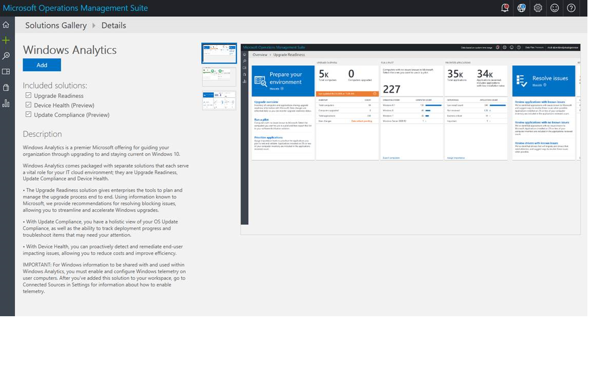

# Get started with Device Health

This topic explains the steps necessary to configure your environment for Windows Analytics: Device Health. 

Steps are provided in sections that follow the recommended setup process:

1. [Add Device Health](#add-device-health-to-microsoft-operations-management-suite) to Microsoft Operations Management Suite.
2. [Enroll devices in Windows Analytics](#deploy-your-commercial-id-to-your-windows-10-devices) to your organization’s devices.
3. [Use Device Health to monitor frequency and causes of device crashes](#use-device-health-to-monitor-frequency-and-causes-of-device-crashes) once your devices are enrolled.

## Add Device Health to Microsoft Operations Management Suite

Device Health is offered as a solution in the Microsoft Operations Management Suite (OMS), a collection of cloud-based servicing for monitoring and automating your on-premise and cloud environments. For more information about OMS, see [Operations Management Suite overview](https://azure.microsoft.com/en-us/documentation/articles/operations-management-suite-overview/). 

**If you are already using Windows Analytics**, you should use the same Azure Log Analytics workspace you're already using. find Device Health in the Solutions Gallery. Select the **Device Health** tile in the gallery and then click **Add** on the solution's details page. Device Health is now visible in your workspace. While you're in the Solutions Gallery, you should consider installing the [Upgrade Readiness](../upgrade/use-upgrade-readiness-to-manage-windows-upgrades.md)  and [Update Compliance](update-compliance-monitor.md) solutions as well, if you haven't already.

**If you are not yet using Windows Analytics or Azure Log Analytics**, use the following steps to subscribe:

1.	Go to [Operations Management Suite](https://www.microsoft.com/en-us/cloud-platform/operations-management-suite) on Microsoft.com and click **Sign in**.
   

2.	Sign in to Operations Management Suite (OMS). You can use either a Microsoft Account or a Work or School account to create a workspace. If your company is already using Azure Active Directory (Azure AD), use a Work or School account when you sign in to OMS. Using a Work or School account allows you to use identities from your Azure AD to manage permissions in OMS.
   

3.	Create a new OMS workspace.

     

4.	Enter a name for the workspace, select the workspace region, and provide the email address that you want associated with this workspace. Click **Create**.

    

5.	If your organization already has an Azure subscription, you can link it to your workspace. Note that you may need to request access from your organization’s Azure administrator. If your organization does not have an Azure subscription, create a new one or select the default OMS Azure subscription from the list. If you do not yet have an Azure subscription, follow [this guide](https://blogs.technet.microsoft.com/upgradeanalytics/2016/11/08/linking-operations-management-suite-workspaces-to-microsoft-azure/) to create and link an Azure subscription to an OMS workspace.

    

6.	To add Update Readiness to your workspace, go to the Solution Gallery, Select the **Update Readiness** tile and then select **Add** on the solution's detail page.

    

7.	Click the **Update Readiness** tile to configure the solution. The **Settings Dashboard** opens. In this example, both Upgrade Readiness and Device Health solutions have been added.

    

After you have added Device Health and devices have a Commercial ID, you will begin receiving data. It will typically take 24-48 hours for the first data to begin appearing. The following section explains how to deploy your Commercial ID to your Windows 10 devices.

>[!NOTE]
>You can unsubscribe from the Device Health solution if you no longer want to monitor your organization’s devices. User device data will continue to be shared with Microsoft while the opt-in keys are set on user devices and the proxy allows traffic.

## Enroll devices in Windows Analytics

Once you've added Update Compliance to Microsoft Operations Management Suite, you can now start enrolling the devices in your organization. For full instructions, see [Enrolling devices in Windows Analytics](windows-analytics-get-started.md).

## Use Device Health to monitor frequency and causes of device crashes

Once your devices are enrolled, you can move on to [Using Device Health](device-health-using.md).

## Related topics

[Use Device Health to monitor frequency and causes of device crashes](device-health-using.md) 
For the latest information on Windows Analytics, including new features and usage tips, see the [Windows Analytics blog](https://blogs.technet.microsoft.com/upgradeanalytics)
