# Using Device Health

This section describes how to use Device Health to monitor devices deployed on your network and troubleshoot the causes if they crash.

Device Health provides IT Pros with reports on some common problems that users might experience so that they can be proactively remediated. This decreases support calls and improves productivity.

Device Health provides the following benefits:

- Identification of devices that crash frequently and therefore might need to be rebuilt or replaced
- Identification of device drivers that are causing device crashes, with suggestions of alternative versions of those drivers that might reduce the number of crashes
- Notification of Windows Information Protection misconfigurations that send prompts to end users

>[!NOTE]
>Information is refreshed daily so that health status can be monitored. Changes will be displayed about 24-48 hours after their occurrence, so you always have a recent snapshot of your devices.

In OMS, the aspects of a solution's dashboard are usually divided into <I>blades</I>. Blades are a slice of information, typically with a summarization tile and an enumeration of the items that makes up that data. All data is presented through <I>queries</I>. <I>Perspectives</I> are also possible, wherein a given query has a unique view designed to display custom data. The terminology of blades, tiles, and perspectives will be used in the sections that follow. 

## Device Reliability

- [Frequently Crashing Devices](#frequently-crashing-devices)
- [Driver-Induced OS Crashes](#driver--induced-OS-crashes)

### Frequently Crashing Devices

This middle blade in Device Reliability displays the devices that have crashed the most often in the last week. This can help you identify unhealthy devices that might need to be rebuilt or replaced.

See the following example: 

Clicking the header of the Frequently Crashing Devices blade opens a reliability perspective view, where you can filter data (by using filters in the left pane), see trends, and compare to commercial averages:

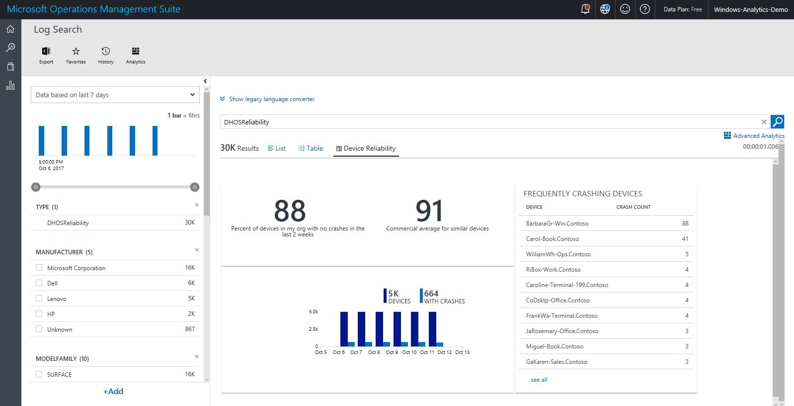

"Commercial averages" here refers to data collected from deployments with a mix of operating system versions and device models that is similar to yours. If your crash rate is higher, there are opportunities for improvement, for example by moving to newer driver versions.

Notice the filters in the left pane; they allow you to filter the crash rate shown to a particular operating system version, device model, or other parameter. 

>[!NOTE]
>Use caution when interpreting results filtered by model or operating system version. This is very useful for troubleshooting, but might not be accurate for *comparisons* because the crashes displayed could be of different types. The overall goal for working with crash data is to ensure that most devices have the same driver versions and that that version has a low crash rate.

>[!TIP]
>Once you've applied a filter (for example setting OSVERSION=1607) you will see the query in the text box change to append the filter (for example, with “(OSVERSION=1607)”). To undo the filter, remove that part of the query in the text box and click the search button to the right of the text box to run the adjusted query.”

If you click through a particular device from the view blade or from the Device Reliability perspective, it will take you to the Crash History perspective for that device.

This displays device records sorted by date and crash details by failure ID, also sorted by date. In this view are a number of useful items:

- Crash history records by date, aggregated  by Failure ID. The Failure ID is an internal number that is used to group crashes that are related to each other. Eventually over time, you can use the Failure ID to provide additional info. If a crash was caused by driver, some driver fields will also be populated.

- StopCode: this is hex value that would be displayed on a bluescreen if you were looking directly at the affected device.

- Count: the number times that particular Failure ID has occurred on that specific device *on that date*.

 
 
### Driver-Induced OS Crashes

This blade (on the right) displays drivers that have caused the most devices to crash in the last two weeks. If your crash rate is high, you can reduce the overall operating system crashes in your deployment by upgrading those drivers with a high crash rate.

Clicking a listed driver on the Driver-Induced OS Crashes blade opens a driver perspective view, which shows the details for the responsible driver, trends and commercial averages for that driver, and alternative versions of the driver.

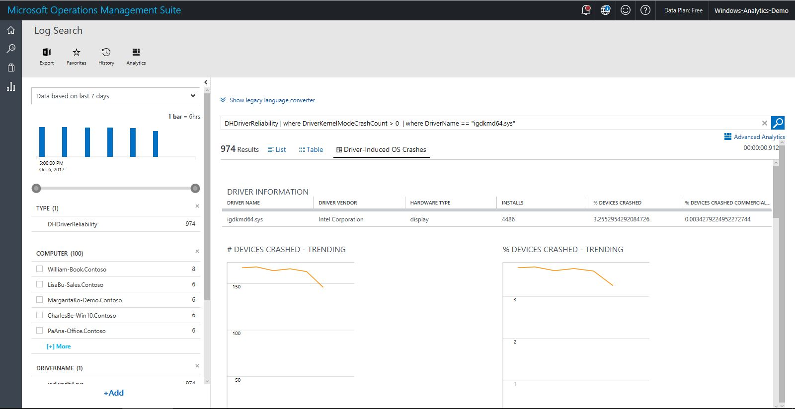
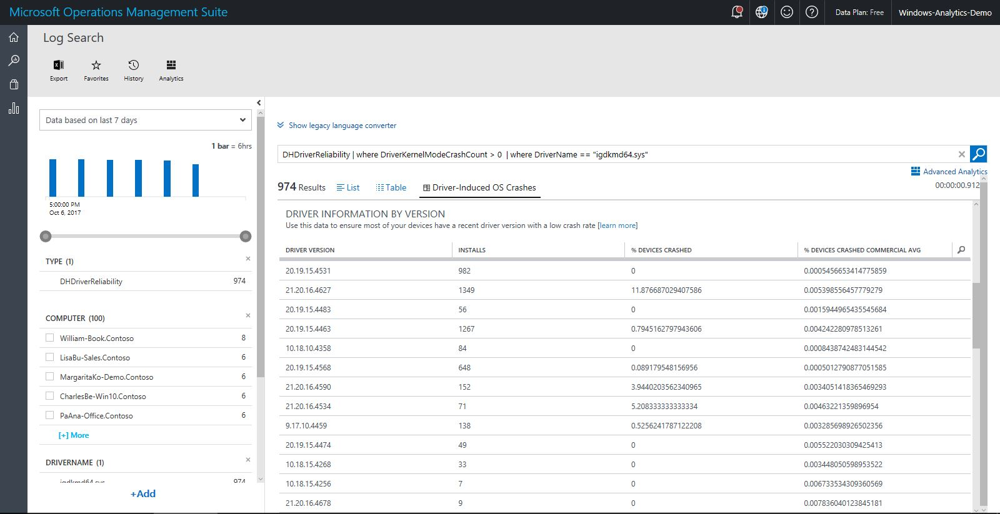

The driver version table can help you determine whether deploying a newer version of the driver might help you reduce the crash rate. In the example shown above, the most commonly installed driver version (19.15.1.5) has a crash rate of about one-half of one percent--this is low, so this driver is probably fine. However, driver version 19.40.0.3 has a crash rate of almost 20%. If that driver had been widely deployed, updating it would substantially reduce the overal number of crashes in your organization.

## App Reliability

The App Reliability report shows you useful data on app usage and behavior so that you can identify apps that are misbehaving and then take steps to resolve the problem.

### App reliability events

The default view includes the **Devices with events** count, which shows the number of devices in your organization that have logged a reliability event for a given app over the last 14 days. A "reliability event" occurs when an app either exits unexpectedly or stops responding.

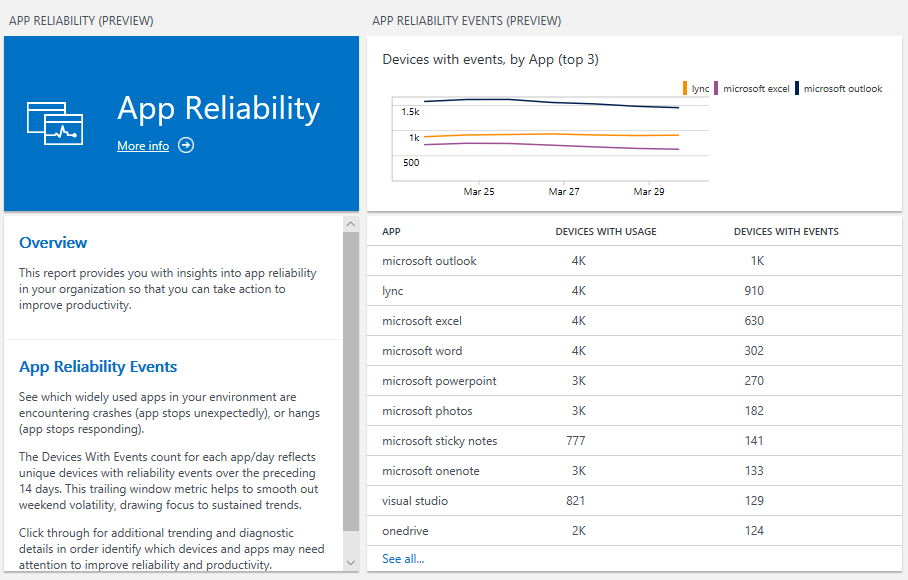

When you click a particular app, the detailed **App reliability** view opens:

The view shows the following information for a given app:

- App name
- Publisher
- Devices with usage: the number of unique devices that logged any usage of the app
- Devices with events: the number of unique devices that logged any reliability event for the app
- % with events: the ratio of "devices with events" to "devices with usage"
- % with events (commercial average): the ratio of "devices with events" to "devices with usage" in data collected from deployments with a mix of operating system versions and device models that is similar to yours. This can help you decide if a given app is having problems specifically in your environment or more generally in many environments.

#### Trend view
[Click SOMETHING] to open the Trend view:

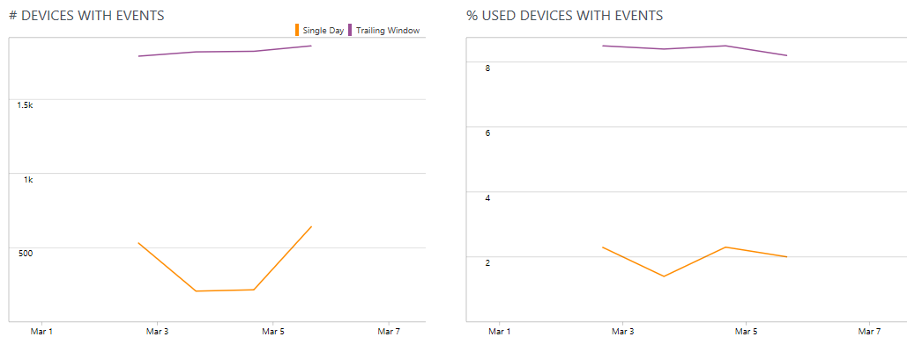

This view shows the 14-day trend in the reported reliability events, so you can more easily detect if the issue is growing, shrinking, or steady. The graph on the left the trend in number of devices that logged any reliability event for the app. The graph on the right shows the trend in the the ratio of "devices with events" to "devices with usage."

Each graph displays two lines:

- Trailing window: in this line, each day’s value reflects reliability events that occurred in the 14 days leading up to that day. This is useful for gauging the long-term trend with reduced volatility due to weekends and small populations.
- Single day: Each day’s value reflects reliability events that occurred in a single day. This is useful if an issue is quickly emerging (or being resolved).

#### App and OS versions view
[Click SOMETHING] to open the App and OS versions view:

This view is essentially the same as the detailed **App reliability** view, but with columns showing the versions of the app and Windows, to make it easier for you to identify patterns in either that might indicate the need to update or change configurations.

For example, if the table shows that a later version is more reliable than an earlier version in your environment, then prioritizing deployment of the later version is likely the best path forward. However, if you are already running the latest version of the app, but reliability events are increasing, you might need to do some troubleshooting, or seek support from Microsoft or the app vendor.

#### Reliability event history view

[Click SOMETHING] to open the reliability event history view:

This view shows the most detailed information available. Although Device Health is not a debugging tool, the details available in the reliability event history view can help with troubleshooting by providing the specific devices, versions, and dates of the reliability events.

This view also includes the **Diagnostic Signature** column. This value can be helpful when you are working with product support. The value is the same one (also known as Failure ID or Failure Name) that is used to summarize crash statistics for Microsoft and partner developers.

The Diagnostic Signature value contains the type of reliability event, error code, DLL name, and function name involved. You can use this information to drastically narrow the scope of troubleshooting. For example, a value like *APPLICATION_HANG_ThreadHang_Contoso-Add-In.dll!GetRegistryValue()* implies that the app stopped responding when Contoso-Add-In was trying to read a registry value. In this case you might prioritize updating or disabling the add-in, or using Process Monitor to identify the registry value it was trying to read, which could lead to a resolution through antivirus exclusions, fixing missing keys, or similar remedies.

### FAQs and limitations

#### Why does a particular app not appear in the views?
To eliminate noise from apps that would appear frequently but not offer any useful data (for example, taskhost.exe) and to draw focus to the apps which matter most to users, App Reliability uses series of filters to limit what appears in the list. The filter criteria include the following:

- Filter out processes which have no detected user interaction (for example, background tasks).
- Filter out operating system processes which, despite having user interaction, do not feel like apps (for example, Logonui.exe, Winlogon.exe).
- Remove apps which are not widely used in your environment (for example, apps that appear to be for testing or have use on only one device).

The filters' ability to identify these processes currently has certain limitations. For example:

- Iexplore.exe, Microsoftedge.exe, and several others apps are tagged as operating system processes (and are therefore filtered out) even though they feel to users like apps.
- Explorer.exe (the process behind the operating system shell, Taskbar, File Explorer, and more) is an operating system process with some app-like characteristics. Currently the filter (by design) leaves this tagged as an operating system process and it is filtered out.
- Apps which are not among the top 30 most-used apps (by device count) in your environment are filtered out--this can result in an app that you consider important being filtered.

We welcome your suggestions and feedback on this filtering process at the [Device Health Tech Community](https://aka.ms/community/DeviceHealth). [WHY NOT FEEDBACK HUB?]

#### Why are there multiple names and entries for the same app?
For example, you might see *Skype for Business*, *‘skype for business’*, and *Lync* listed separately, but you only use *Skype for Business*. Or you might see *MyApp Pro* and *MyApp Professional* listed separately, even though they are the same thing.

Apps have many elements of metadata which describe them. These include an Add/Remove programs title (“Contoso Suite 12”), executable file names (“ContosoCRM.exe”), executable display name (“Contoso CRM”), and others. App publishers (and in some cases app re-packagers) set these values. For the most part we leave the data as-is which can lead to some duplication. In certain cases we apply transformations to reduce this duplication.

We welcome your suggestions and feedback on this deduplication process at the [Device Health Tech Community](https://aka.ms/community/DeviceHealth). [WHY NOT FEEDBACK HUB?]

#### Clicking an app in the App Reliability Events blade sometimes results a List view of records instead of the App Reliability view
To work around this, click the **App Reliability** tab above the results to see the expected view.
 
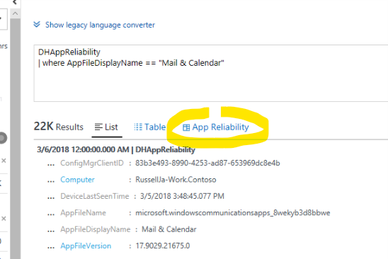

#### Clicking "See all…" from the App Reliability Events blade followed by clicking an app from the expanded list results in raw records instead of the App Reliability view
To work around this, replace all of the text in the Log Search query box with the following:

*DHAppReliability|where AppFileDisplayName == "<Name of app as it appeared in the list>"*

For example:

*DHAppReliability|where AppFileDisplayName == "Microsoft Outlook"*

## Login Health

Login Health provides reports on a variety of data related to login attempts on devices in your environment, including metrics on the login methods being used (such as Windows Hello, face recognition, fingerprint recognition, PIN, or password), the rates and patterns of login success and failure, and the specific reasons logins have failed.

To open the default view, [CLICK SOMETHING]:

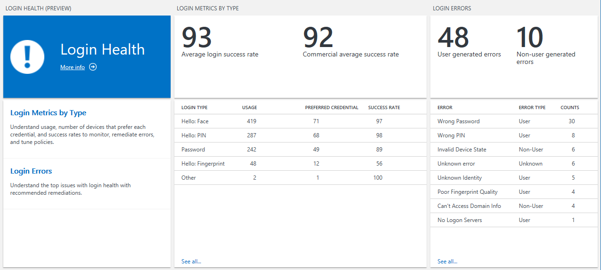

### Login Errors
The **Login errors** blade displays data on the frequency and type of errors, with statistics on specific errors. They are generally categorized into user-generated or non-user-generated errors. Click any individual error to see all instances of the error's occurence for the specified time period.

### Login Metrics by Type
The **Login metrics by type** blade shows the success rate for logins, as well as the same number for deployments with a mix of operating system versions and device models that is similar to yours (the **Commercial average success rate**).

In the table (by type) you can gauge how broadly each login type is attempted, the number of devices that prefer the type (most used), and the success rate. If migration from passwords to an alternative such as Hello: PIN is going well, you would see high usage and high success rates for the new type.

Click any of the login types to see detailed login health data for that type:

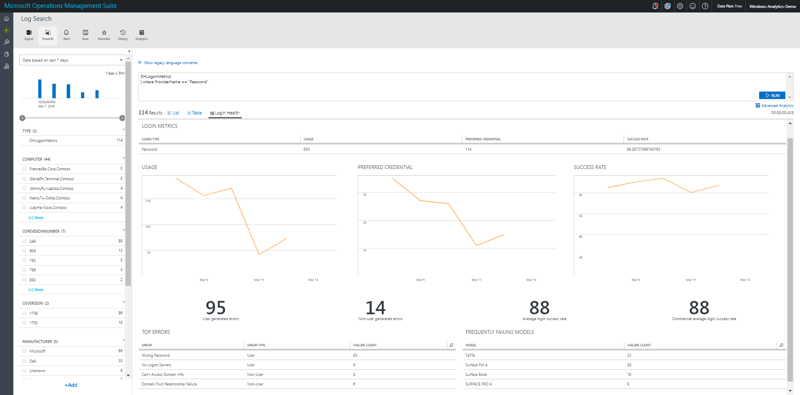

This view shows trends over time of usage, preferred credentials, and success rate along with the most frequent errors and frequently failing devices for that login type.

Click a specific login error in this view to see a list of all instances for that error and login type within the specified time range:

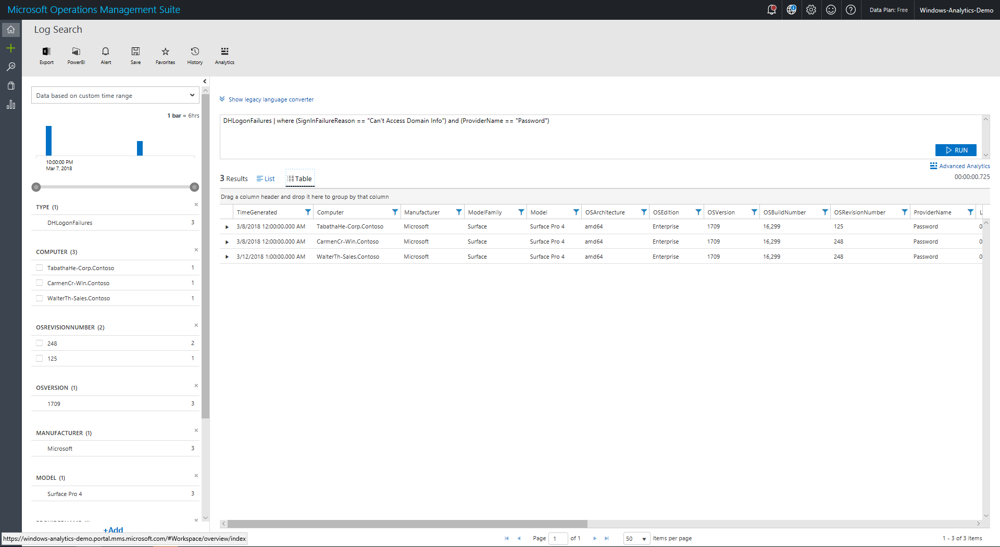

Included in this view are device attributes and error attributes such as the following:

- LogonStatus/LogonSubStatus: These are the top or lower level statuses the credential framework returns. [UNCLEAR WHAT THIS MEANS] 
- SignInFailureReason: Known failure reasons evaluated from status or sub-status.
- SuggestedSignInRemediation: Suggested remediation that was presented to the user at the time of error.

The filters in the left pane allow you to filter errors to a particular operating system, device model, or other parameters. Alternatively, clicking the most frequently failing models from the Login Health perspective will take you to a list of error instances filtered to the login type and specified device model within the specified time range.

>[!NOTE]
> Windows Hello: Face authentication errors are not currently included in the login health reports.

## Windows Information Protection

Windows Information Protection (WIP) helps protect work data from accidental sharing. Users might be disrupted if WIP rules are not aligned with real work behavior. WIP App Learning shows which apps on which computers are attempting to cross policy boundaries.

For details about deploying WIP policies, see [Protect your enterprise data using Windows Information Protection (WIP)](https://docs.microsoft.com/windows/threat-protection/windows-information-protection/protect-enterprise-data-using-wip).

Once you have WIP policies in place, by using the WIP section of Device Health, you can:

- Reduce disruptive prompts by adding rules to allow data sharing from approved apps.
- Tune WIP rules, for example by confirming that certain apps are allowed or disallowed by current policy.

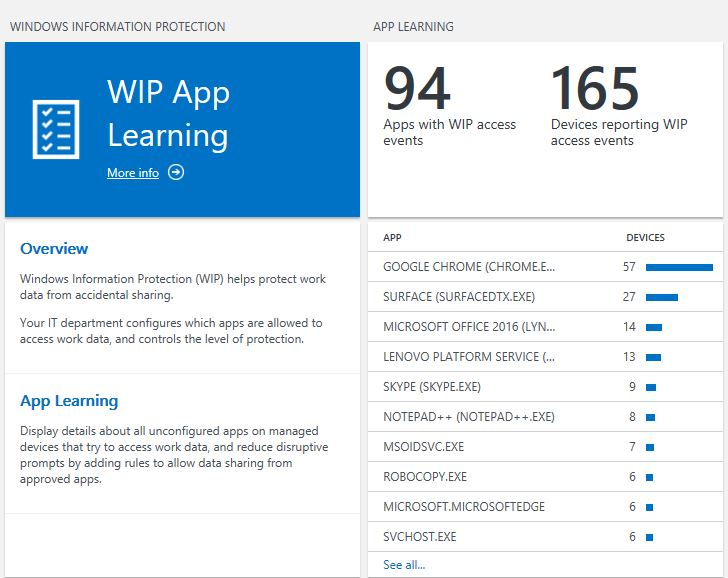

Clicking through the **APP LEARNING** tile shows details of app statistics that you can use to explore each incident and update app policies by using AppLocker or WIP AppIDs.

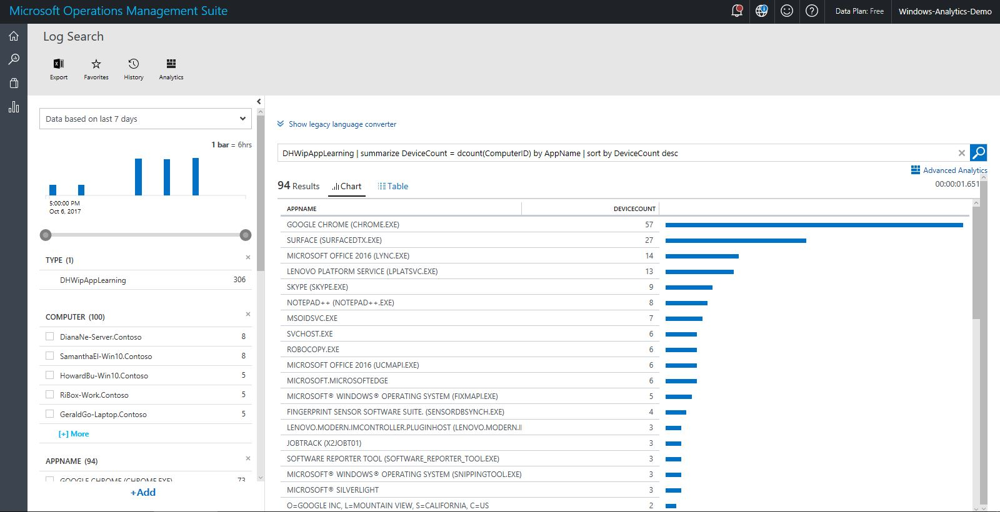

In this chart view, you can click a particular app listing, which will open additional details on the app in question, including details you need to adjust your Windows Information Protection Policy:

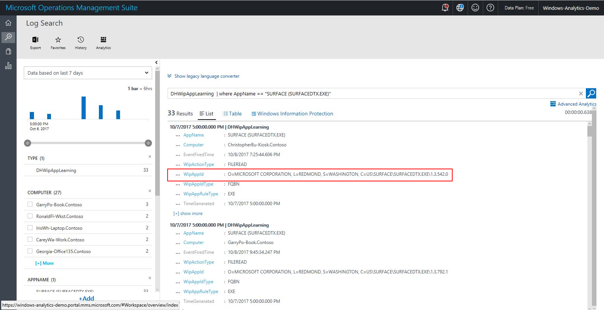

Here you can copy the WipAppid and use that for adjusting the WIP policy.

## Data model and OMS built-in extensibility

All of the views and blades display slices of the most useful data by using pre-formed queries. You have access to the full set of data collected by Device Health, which means you can construct your own queries to expose any data that is of interest to you. For documentation on working with log searches, see [Find data using log searches](https://docs.microsoft.com/azure/log-analytics/log-analytics-log-searches). This topic section provides information about the data types being populated specifically by Device Health.

### Example queries

You can run these queries from the OMS **Log Search** interface (available at several points in the Device Health interface) by just typing them in. There are few details to be aware of:

- After running a query, make sure to set the date range (which appears upper left after running initial query) to "7 days" to ensure you get data back.
- If you see the search tutorial dialog appearing frequently, it's likely because you are have read-only access to the OMS workspace. Ask a workspace administrator to grant you "contributor" permissions (which is required for the "completed tutorial" state to persist).
- If you use the search filters in the left pane, you might notice there is no control to undo a filter selection. To undo a selection, delete the (FilterName="FilterValue") element that is appended to the search query and then click the search button again. For example, after you run a base query of *Type = DHOSReliability KernelModeCrashCount > 0*, a number of filter options appear on the left. If you then filter on **Manufacturer** (for example, by setting *Manufacturer="Microsoft Corporation"* and then clicking **Apply**), the query will change to *Type = DHOSReliability KernelModeCrashCount > 0 (Manufacturer="Microsoft Corporation")*. Delete *(Manufacturer="Microsoft Corporation")* and then click the **search** button again to re-run the query without that filter.

### Device reliability query examples

|Data|Query|
|-------------------|------------------------|
|Total devices|	Type = DHOSReliability \| measure countdistinct(ComputerID) by Type|
|Number of devices that have crashed in the last three weeks|	Type = DHOSReliability KernelModeCrashCount > 0 \| measure countdistinct(ComputerID) by Type|
|Compare the percentage of your devices that have not crashed with the percentage of similar devices outside your organization ("similar" here means other commercial devices with the same mix of device models, operating system versions and update levels).|	Type=DHOSReliability \| measure avg(map(KernelModeCrashCount, 1, 10000, 0, 1)) as MyOrgPercentCrashFreeDevices, avg(KernelModeCrashFreePercentForIndustry) as CommercialAvgPercentCrashFreeDevices by Type \| Display Table|
|As above, but sorted by device manufacturer|	Type=DHOSReliability \| measure avg(map(KernelModeCrashCount, 1, 10000, 0, 1)) as MyOrgPercentCrashFreeDevices, avg(KernelModeCrashFreePercentForIndustry) as CommercialAvgPercentCrashFreeDevices, countdistinct(ComputerID) as NumberDevices by Manufacturer \| sort NumberDevices desc \| Display Table|
|As above, but sorted by model|	Type=DHOSReliability \| measure avg(map(KernelModeCrashCount, 1, 10000, 0, 1)) as MyOrgPercentCrashFreeDevices, avg(KernelModeCrashFreePercentForIndustry) as CommercialAvgPercentCrashFreeDevices, countdistinct(ComputerID) as NumberDevices by ModelFamily\| sort NumberDevices desc \| Display Table|
|As above, but sorted by operating system version|	Type=DHOSReliability \| measure avg(map(KernelModeCrashCount, 1, 10000, 0, 1)) as MyOrgPercentCrashFreeDevices, avg(KernelModeCrashFreePercentForIndustry) as CommercialAvgPercentCrashFreeDevices, countdistinct(ComputerID) as NumberDevices by OSVersion \| sort NumberDevices desc \| Display Table|
|Crash rate trending in my organization compared to the commercial average. Each interval shows percentage of devices that crashed at least once in the trailing two weeks|	Type=DHOSReliability \| measure avg(map(KernelModeCrashCount, 1, 10000, 0, 1)) as MyOrgPercentCrashFreeDevices, avg(KernelModeCrashFreePercentForIndustry) as CommercialAvgPercentCrashFreeDevices by TimeGenerated \| Display LineChart|
|Table of devices that have crashed the most in the last two weeks|	Type = DHOSReliability KernelModeCrashCount > 0 \| Dedup ComputerID \| select Computer, KernelModeCrashCount \| sort TimeGenerated desc, KernelModeCrashCount desc \| Display Table|
|Detailed crash records, most recent first|	Type = DHOSCrashData \| sort TimeGenerated desc, Computer asc \| display Table|
|Number of devices that crashed due to drivers|	Type = DHDriverReliability DriverKernelModeCrashCount > 0 \| measure countdistinct(ComputerID) by Type|
|Table of drivers that have caused the most devices to crash|	Type = DHDriverReliability DriverKernelModeCrashCount > 0 \| measure countdistinct(ComputerID) by DriverName \| Display Table|
|Trend of devices crashed by driver by day|	* Type=DHOSCrashData DriverName!="ntkrnlmp.exe" DriverName IN {Type=DHOSCrashData \| measure count() by DriverName | top 5} \| measure countdistinct(ComputerID) as NumberDevices by DriverName interval 1day|
|Crashes for different versions of a given driver (replace netwtw04.sys with the driver you want from the previous list). This lets you get an idea of which *versions* of a given driver work best with your devices|	Type = DHDriverReliability DriverName="netwtw04.sys" \| Dedup ComputerID \| sort TimeGenerated desc \| measure countdistinct(ComputerID) as InstallCount, sum(map(DriverKernelModeCrashCount,1,10000, 1)) as DevicesCrashed by DriverVersion \| Display Table|
|Top crashes by FailureID|	Type =DHOSCrashData \| measure count() by KernelModeCrashFailureId \| Display Table|

### Windows Information Protection (WIP) App Learning query examples

|Data|Query|
|-------------------|------------------------|
|Apps encountering policy boundaries on the most computers (click on an app in the results to see details including computer names)| Type=DHWipAppLearning \| measure countdistinct(ComputerID) as ComputerCount by AppName|
|Trend of App Learning activity for a given app. Useful for tracking activity before and after a rule change| Type=DHWipAppLearning AppName="MICROSOFT.SKYPEAPP" | measure countdistinct(ComputerID) as ComputerCount interval 1day|

### Exporting data and configuring alerts

OMS enables you to export data to other tools. To do this, in any view that shows **Log Search** just click the **Export** button. Similarly, clicking the **Alert** button will enable you to run a query automaticlaly on a schedule and receive email alerts for particular query results that you set. If you have a PowerBI account, then you will also see a **PowerBI** button that enables you to run a query on a schedule and have the results automatically saved as a PowerBI data set.

## Related topics

[Get started with Device Health](device-health-get-started.md) 

For the latest information on Windows Analytics, including new features and usage tips, see the [Windows Analytics blog](https://blogs.technet.microsoft.com/upgradeanalytics)