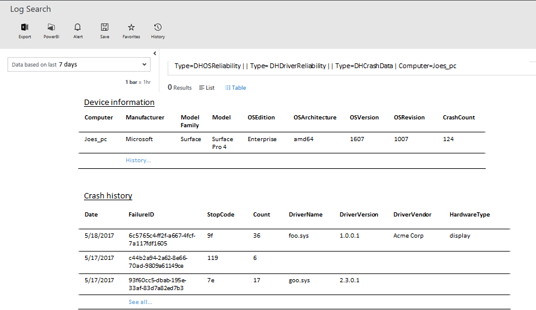
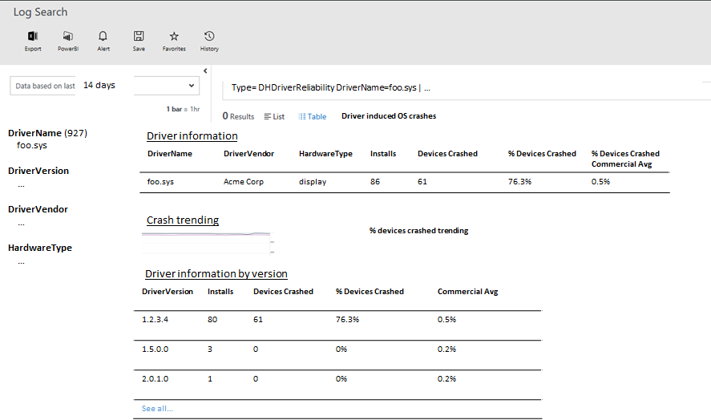
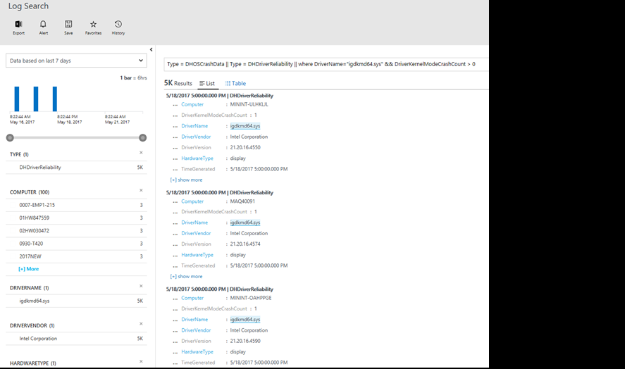
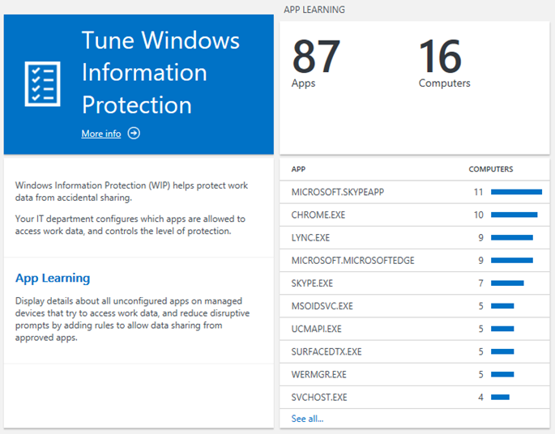
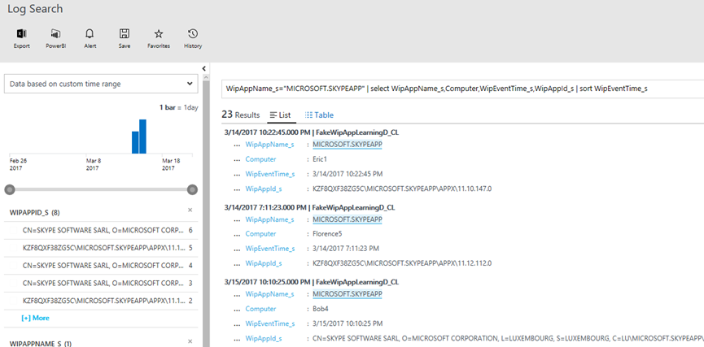

# Use Device Health to monitor frequency and causes of device crashes

This section describes how to use Device Health to monitor devices deployed on your network and troubleshoot the causes if they crash.

Device Health: 
- Uses telemetry gathered from user devices to form an all-up view of Windows 10 devices in your organization. 
- Displays devices that crash frequently and might need to be flattened, replaced, or otherwise fixed.
- Identifies drivers that are causing many devices to crash, so that they can be updated or replaced.

>[!NOTE]
>Information is refreshed daily so that health status can be monitored. Changes will be displayed about 24 hours after their occurrence, so you always have a recent snapshot of your devices.

In OMS, the aspects of a solution's dashboard are usually divided into <I>blades</I>. Blades are a slice of information, typically with a summarization tile and an enumeration of the items that makes up that data. All data is presented through <I>queries</I>. <I>Perspectives</I> are also possible, wherein a given query has a unique view designed to display custom data. The terminology of blades, tiles, and perspectives will be used in the sections that follow. 

## Device Reliability

- [Frequently Crashing Devices](#frequently-crashing-devices)
- [Driver Induced OS Crashes](#driver-induced-OS-crashes)

### Frequently Crashing Devices

This middle blade in Device Health displays the devices that crash most often. See the following example: 

Clicking the Frequently Crashing Devices blade opens a reliability perspective view, where you can filter data using filters in the left pane, see trends, and compare to commercial averages:

In this view, you can click a particular device to see the details of that particular device and for each crash recorded on it. (You can also reach this view by clicking a particular device on the Frequently Crashing Devices blade.)

This displays device records sorted by date and crash details by failure ID, also sorted by date.

>[!TIP]
>Once you've applied a filter, for example by clicking a particular model or computer name in the left pane, you can remove the applied filter by manually editing the query. For example, in the device detail screenshot above, the results are filtered to a particular computer named "joes-pc". Remove the filter focusing on that one computer, just delete the string "joes-pc" in the query.
 
 
### Driver Induced OS Crashes

This blade (on the right) displays values for the number of *devices* that have crashed due to driver issues, as well as the total number of crashes altogether due to driver issues.

Clicking the Driver Induced OS Crashes blade opens a driver perspective view, which shows the details for the responsible driver, trends and commercial averages for that driver, alternative versions of the driver, and tools for filtering the data.

Clicking through this view opens a display of still more details for the driver, including:

- Driver properties, such as its name, version, and class
- Information (stop code, failure ID) for each crash instance
- A list oftThe computers on which the crash occurred and the time they occurred

The records are sorted by the time generated and the computer. If a driver has caused a computer to crash on several different days, only the most recent event is shown in this view.

## Windows Information Protection

Windows Information Protection (WIP) helps protect work data from accidental sharing. Users might be disrupted if WIP rules are not aligned with real work behavior. WIP App Learning shows which apps on which computers are attempting to cross policy boundaries.

For details about deploying WIP policies, see [Protect your enterprise data using Windows Information Protection (WIP)](https://docs.microsoft.com/windows/threat-protection/windows-information-protection/protect-enterprise-data-using-wip).

Once you have WIP policies in place, by using the WIP section of Device Health, you can:

- Tune WIP rules, for example by confirming that certain apps are allowed or disallowed by current policy.
- Reduce disruptive prompts by adding rules to allow data sharing from approved apps.

Clicking through shows the details you can use to explore each incident and update app policies by using AppLocker or WIP AppIDs.

## Data model and OMS built-in extensibility

All of the views and blades display slices of the most useful data by using pre-formed queries. You have access to the full set of data collected by Device Health, which means you can construct your own queries to expose any data that is of interest to you. For documentation on working with log searches, see [Find data using log searches](https://docs.microsoft.com/azure/log-analytics/log-analytics-log-searches). This topic section provides information about the data types being populated specifically by Device Health.

### Example queries

You can run these queries from the OMS **Log Search** interface (available at several points in the Device Health interface) by just typing them in. There are few details to be aware of:

- After running a query, make sure to set the date range (which appears upper left after running initial query) to "7 days" to ensure you get data back.
- If you see the search tutorial dialog appearing frequently, it's likely because you are have read-only access to the OMS workspace. Ask a workspace administrator to grant you "contributor" permissions (which is required for the "completed tutorial" state to persist).
- If you use the search filters in the left pane, you might notice there is no control to undo a filter selection. To undo a selection, delete the (FilterName="FilterValue") element that is appended to the search query and then click the search button again. For example, after you run a base query of *Type = DHOSReliability KernelModeCrashCount > 0*, a number of filter options appear on the left. If you then filter on **Manufacturer** (for example, by setting *Manufacturer="Microsoft Corporation"* and then clicking **Apply**), the query will change to *Type = DHOSReliability KernelModeCrashCount > 0 (Manufacturer="Microsoft Corporation")*. Delete *(Manufacturer="Microsoft Corporation")* and then click the **search** button again to re-run the query without that filter.

### Device reliability query examples

|Data|Query|
|-------------------|------------------------|
|Total devices|	Type = DHOSReliability \| measure countdistinct(ComputerID) by Type|
|Number of devices that have crashed in the last three weeks|	Type = DHOSReliability KernelModeCrashCount > 0 \| measure countdistinct(ComputerID) by Type|
|Compare the percentage of your devices that have not crashed with the percentage of similar devices outside your organization ("similar" here means other commercial devices with the same mix of device models, operating system versions and update levels).|	Type=DHOSReliability \| measure avg(map(KernelModeCrashCount, 1, 10000, 0, 1)) as MyOrgPercentCrashFreeDevices, avg(KernelModeCrashFreePercentForIndustry) as CommercialAvgPercentCrashFreeDevices by Type \| Display Table|
|As above, but sorted by device manufacturer|	Type=DHOSReliability \| measure avg(map(KernelModeCrashCount, 1, 10000, 0, 1)) as MyOrgPercentCrashFreeDevices, avg(KernelModeCrashFreePercentForIndustry) as CommercialAvgPercentCrashFreeDevices, countdistinct(ComputerID) as NumberDevices by Manufacturer \| sort NumberDevices desc \| Display Table|
|As above, but sorted by model|	Type=DHOSReliability \| measure avg(map(KernelModeCrashCount, 1, 10000, 0, 1)) as MyOrgPercentCrashFreeDevices, avg(KernelModeCrashFreePercentForIndustry) as CommercialAvgPercentCrashFreeDevices, countdistinct(ComputerID) as NumberDevices by ModelFamily\| sort NumberDevices desc \| Display Table|
|As above, but sorted by operating system version|	Type=DHOSReliability \| measure avg(map(KernelModeCrashCount, 1, 10000, 0, 1)) as MyOrgPercentCrashFreeDevices, avg(KernelModeCrashFreePercentForIndustry) as CommercialAvgPercentCrashFreeDevices, countdistinct(ComputerID) as NumberDevices by OSVersion \| sort NumberDevices desc \| Display Table|
|Crash rate trending in my organization compared to the commercial average. Each interval shows percentage of devices that crashed at least once in the trailing two weeks|	Type=DHOSReliability \| measure avg(map(KernelModeCrashCount, 1, 10000, 0, 1)) as MyOrgPercentCrashFreeDevices, avg(KernelModeCrashFreePercentForIndustry) as CommercialAvgPercentCrashFreeDevices by TimeGenerated \| Display LineChart|
|Table of devices that have crashed the most in the last two weeks|	Type = DHOSReliability KernelModeCrashCount > 0 \| Dedup ComputerID \| select Computer, KernelModeCrashCount \| sort TimeGenerated desc, KernelModeCrashCount desc \| Display Table|
|Detailed crash records, most recent first|	Type = DHOSCrashData \| sort TimeGenerated desc, Computer asc \| display Table|
|Number of devices that crashed due to drivers|	Type = DHDriverReliability DriverKernelModeCrashCount > 0 \| measure countdistinct(ComputerID) by Type|
|Table of drivers that have caused the most devices to crash|	Type = DHDriverReliability DriverKernelModeCrashCount > 0 \| measure countdistinct(ComputerID) by DriverName \| Display Table|
|Trend of devices crashed by driver by day|	* Type=DHOSCrashData DriverName!="ntkrnlmp.exe" DriverName IN {Type=DHOSCrashData \| measure count() by DriverName | top 5} \| measure countdistinct(ComputerID) as NumberDevices by DriverName interval 1day|
|Crashes for different versions of a given driver (replace netwtw04.sys with the driver you want from the previous list). This lets you get an idea of which *versions* of a given driver work best with your devices|	Type = DHDriverReliability DriverName="netwtw04.sys" \| Dedup ComputerID \| sort TimeGenerated desc \| measure countdistinct(ComputerID) as InstallCount, sum(map(DriverKernelModeCrashCount,1,10000, 1)) as DevicesCrashed by DriverVersion \| Display Table|
|Top crashes by FailureID|	Type =DHOSCrashData \| measure count() by KernelModeCrashFailureId \| Display Table|

### Windows Information Protection (WIP) App Learning query examples

|Data|Query|
|-------------------|------------------------|
|Apps encountering policy boundaries on the most computers (click on an app in the results to see details including computer names)| Type=DHWipAppLearning \| measure countdistinct(ComputerID) as ComputerCount by AppName|
|Trend of App Learning activity for a given app. Useful for tracking activity before and after a rule change| Type=DHWipAppLearning AppName="MICROSOFT.SKYPEAPP" | measure countdistinct(ComputerID) as ComputerCount interval 1day|

### Exporting data and configuring alerts

OMS enables you to export data to other tools. To do this, in any view that shows **Log Search** just click the **Export** button. Similarly, clicking the **Alert** button will enable you to run a query automaticlaly on a schedule and receive email alerts for particular query results that you set. If you have a PowerBI account, then you will also see a **PowerBI** button that enables you to run a query on a schedule and have the results automatically saved as a PowerBI data set.

## Related topics

[Get started with Device Health](device-health-get-started.md) 

For the latest information on Windows Analytics, including new features and usage tips, see the [Windows Analytics blog](https://blogs.technet.microsoft.com/upgradeanalytics)