# Deploy Windows 10 updates using Windows Server Update Services (WSUS)

**Applies to**

- Windows 10

> **Looking for consumer information?** See [Windows Update: FAQ](https://support.microsoft.com/help/12373/windows-update-faq) 

>[!IMPORTANT]
>Due to [naming changes](waas-overview.md#naming-changes), older terms like CB,CBB and LTSB may still be displayed in some of our products.
>
>In the following settings CB refers to Semi-Annual Channel (Targeted), while CBB refers to Semi-Annual Channel. 

WSUS is a Windows Server role available in the Windows Server operating systems. It provides a single hub for Windows updates within an organization. WSUS allows companies not only to defer updates but also to selectively approve them, choose when they’re delivered, and determine which individual devices or groups of devices receive them. WSUS provides additional control over Windows Update for Business but does not provide all the scheduling options and deployment flexibility that System Center Configuration Manager provides.

When you choose WSUS as your source for Windows updates, you use Group Policy to point Windows 10 client devices to the WSUS server for their updates. From there, updates are periodically downloaded to the WSUS server and managed, approved, and deployed through the WSUS administration console or Group Policy, streamlining enterprise update management. If you’re currently using WSUS to manage Windows updates in your environment, you can continue to do so in Windows 10. 

## Requirements for Windows 10 servicing with WSUS

To be able to use WSUS to manage and deploy Windows 10 feature updates, you must have WSUS 4.0, which is available in the Windows Server 2012 R2 and Windows Server 2012 operating systems. In addition to WSUS 4.0, you must install the [KB3095113](https://support.microsoft.com/kb/3095113) and [KB3159706](https://support.microsoft.com/kb/3159706) patches on the WSUS server. 

## WSUS scalability

To use WSUS to manage all Windows updates, some organizations may need access to WSUS from a perimeter network, or they might have some other complex scenario. WSUS is highly scalable and configurable for organizations of any size or site layout. For specific information about scaling WSUS, including upstream and downstream server configuration, branch offices, WSUS load balancing, and other complex scenarios, see [Choose a Type of WSUS Deployment](https://technet.microsoft.com/library/cc720448%28v=ws.10%29.aspx).
 

## Express Installation Files

With Windows 10, quality updates will be larger than traditional Windows Updates because they’re cumulative. To manage the bandwidth clients downloading large updates like these will need, WSUS has a feature called *Express Installation Files*.

 At a binary level, files associated with updates may not change a lot. In fact, with cumulative quality updates, most of the content will be from previous updates. Rather than downloading the entire update when only a small percentage of the payload is actually different, Express Installation Files analyze the differences between the new files associated with an update and the existing files on the client. This approach significantly reduces the amount of bandwidth used because only a fraction of the update content is actually delivered. 
 
 **To configure WSUS to download Express Update Files**
 
1. Open the WSUS Administration Console.
 
2. In the navigation pane, go to *Your_Server*\\**Options**.

3. In the **Options** section, click **Update Files and Languages**.

    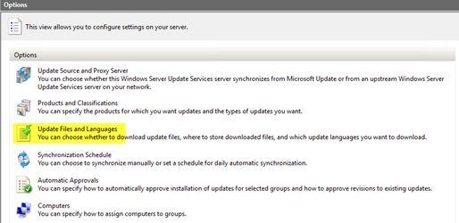
    
4. In the **Update Files and Languages** dialog box, select **Download express installation files**.

    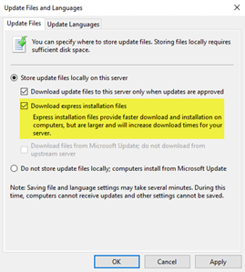 
    
    >[!NOTE]
    >Because Windows 10 updates are cumulative, enabling Express Installation Files when WSUS is configured to download Windows 10 updates will significantly increase the amount of disk space that WSUS requires. Alternatively, when using Express Installation Files for previous versions of Windows, the feature’s positive effects aren’t noticeable because the updates aren’t cumulative. 

## Configure automatic updates and update service location

When using WSUS to manage updates on Windows client devices, start by configuring the **Configure Automatic Updates** and **Intranet Microsoft Update Service Location** Group Policy settings for your environment. Doing so forces the affected clients to contact the WSUS server so that it can manage them. The following process describes how to specify these settings and deploy them to all devices in the domain.

**To configure the Configure Automatic Updates and Intranet Microsoft Update Service Location Group Policy settings for your environment**

1. Open GPMC.

2. Expand Forest\Domains\\*Your_Domain*. 

3. Right-click *Your_Domain*, and then click **Create a GPO in this domain, and Link it here**.

   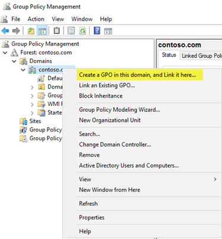 
    
   >[!NOTE]
   >In this example, the **Configure Automatic Updates** and **Intranet Microsoft Update Service Location** Group Policy settings are specified for the entire domain. This is not a requirement; you can target these settings to any security group by using Security Filtering or a specific OU.
    
4. In the **New GPO** dialog box, name the new GPO **WSUS – Auto Updates and Intranet Update Service Location**.

5. Right-click the **WSUS – Auto Updates and Intranet Update Service Location** GPO, and then click **Edit**.

6. In the Group Policy Management Editor, go to Computer Configuration\Policies\Administrative Templates\Windows Components\Windows Update.

7. Right-click the **Configure Automatic Updates** setting, and then click **Edit**.

   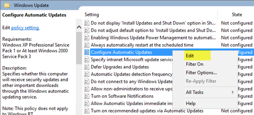
    
8. In the **Configure Automatic Updates** dialog box, select **Enable**.

9. Under **Options**, from the **Configure automatic updating** list, select **3 - Auto download and notify for install**, and then click **OK**.

   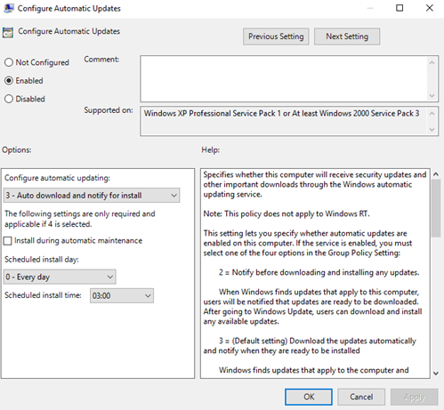
    
   > [!NOTE]
   > ?There are three other settings for automatic update download and installation dates and times. This is simply the option this example uses. For more examples of how to control automatic updates and other related policies, see [Configure Automatic Updates by Using Group Policy](https://technet.microsoft.com/library/cc720539%28v=ws.10%29.aspx). 
    
10. Right-click the **Specify intranet Microsoft update service location** setting, and then click **Edit**. 

11. In the **Specify intranet Microsoft update service location** dialog box, select **Enable**.

12. Under **Options**, in the **Set the intranet update service for detecting updates** and **Set the intranet statistics server** options, type <strong>http://Your_WSUS_Server_FQDN:PortNumber</strong>, and then click **OK**.

    >[!NOTE]
    >The URL `http://CONTOSO-WSUS1.contoso.com:8530` in the following image is just an example. In your environment, be sure to use the server name and port number for your WSUS instance.
    
     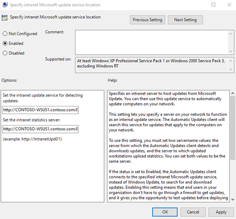
     
     >[!NOTE]
     >The default HTTP port for WSUS is 8530, and the default HTTP over Secure Sockets Layer (HTTPS) port is 8531. If you’re unsure which port WSUS is using for client communication, right-click the WSUS Administration site in IIS Manager, and then click **Edit Bindings**.

As Windows clients refresh their computer policies (the default Group Policy refresh setting is 90 minutes and when a computer restarts), computers start to appear in WSUS. Now that clients are communicating with the WSUS server, create the computer groups that align with your deployment rings.

## Create computer groups in the WSUS Administration Console

>[!NOTE]
>The following procedures use the groups from Table 1 in [Build deployment rings for Windows 10 updates](waas-deployment-rings-windows-10-updates.md) as examples.

You can use computer groups to target a subset of devices that have specific quality and feature updates. These groups represent your deployment rings, as controlled by WSUS. You can populate the groups either manually by using the WSUS Administration Console or automatically through Group Policy. Regardless of the method you choose, you must first create the groups in the WSUS Administration Console. 

**To create computer groups in the WSUS Administration Console**

1. Open the WSUS Administration Console. 

2. Go to *Server_Name*\Computers\All Computers, and then click **Add Computer Group**. 

    
    
3. Type **Ring 2 Pilot Business Users** for the name, and then click **Add**.

4. Repeat these steps for the **Ring 3 Broad IT** and **Ring 4 Broad Business Users** groups. When you’re finished, there should be three deployment ring groups.

Now that the groups have been created, add the computers to the computer groups that align with the desired deployment rings. You can do this through [Group Policy](#wsus-gp) or manually by using the [WSUS Administration Console](#wsus-admin).

## Use the WSUS Administration Console to populate deployment rings

Adding computers to computer groups in the WSUS Administration Console is simple, but it could take much longer than managing membership through Group Policy, especially if you have many computers to add. Adding computers to computer groups in the WSUS Administration Console is called *server-side targeting*. 

In this example, you add computers to computer groups in two different ways: by manually assigning unassigned computers and by searching for multiple computers.

### Manually assign unassigned computers to groups

When new computers communicate with WSUS, they appear in the **Unassigned Computers** group. From there, you can use the following procedure to add computers to their correct groups. For these examples, you use two Windows 10 PCs (WIN10-PC1 and WIN10-PC2) to add to the computer groups.

**To assign computers manually**

1. In the WSUS Administration Console, go to *Server_Name*\Computers\All Computers\Unassigned Computers.

    Here, you see the new computers that have received the GPO you created in the previous section and started communicating with WSUS. This example has only two computers; depending on how broadly you deployed your policy, you will likely have many computers here.

2. Select both computers, right-click the selection, and then click **Change Membership**.

    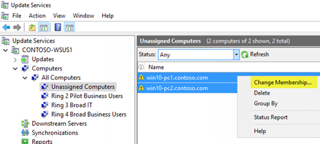

3. In the **Set Computer Group Membership** dialog box, select the **Ring 2 Pilot Business Users** deployment ring, and then click **OK**.

    Because they were assigned to a group, the computers are no longer in the **Unassigned Computers** group. If you select the **Ring 2 Pilot Business Users** computer group, you will see both computers there.

### Search for multiple computers to add to groups

Another way to add multiple computers to a deployment ring in the WSUS Administration Console is to use the search feature.

**To search for multiple computers**

1. In the WSUS Administration Console, go to *Server_Name*\Computers\All Computers, right-click **All Computers**, and then click **Search**.

2. In the search box, type **WIN10**.

3. In the search results, select the computers, right-click the selection, and then click **Change Membership**.

    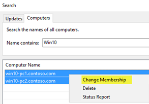
    
4. Select the **Ring 3 Broad IT** deployment ring, and then click **OK**.

You can now see these computers in the **Ring 3 Broad IT** computer group.

## Use Group Policy to populate deployment rings

The WSUS Administration Console provides a friendly interface from which you can manage Windows 10 quality and feature updates. When you need to add many computers to their correct WSUS deployment ring, however, it can be time-consuming to do so manually in the WSUS Administration Console. For these cases, consider using Group Policy to target the correct computers, automatically adding them to the correct WSUS deployment ring based on an Active Directory security group. This process is called *client-side targeting*. Before enabling client-side targeting in Group Policy, you must configure WSUS to accept Group Policy computer assignment.

**To configure WSUS to allow client-side targeting from Group Policy**

1. Open the WSUS Administration Console, and go to *Server_Name*\Options, and then click **Computers**.

     
     
2. In the **Computers** dialog box, select **Use Group Policy or registry settings on computers**, and then click **OK**.

    >[!NOTE]
    >This option is exclusively either-or. When you enable WSUS to use Group Policy for group assignment, you can no longer manually add computers through the WSUS Administration Console until you change the option back. 
    
Now that WSUS is ready for client-side targeting, complete the following steps to use Group Policy to configure client-side targeting:

**To configure client-side targeting**

>[!TIP]
>When using client-side targeting, consider giving security groups the same names as your deployment rings. Doing so simplifies the policy-creation process and helps ensure that you don’t add computers to the incorrect rings.

1. Open GPMC.

2. Expand Forest\Domains\\*Your_Domain*.

3. Right-click *Your_Domain*, and then click **Create a GPO in this domain, and Link it here**.

4. In the **New GPO** dialog box, type **WSUS – Client Targeting – Ring 4 Broad Business Users** for the name of the new GPO.

5. Right-click the **WSUS – Client Targeting – Ring 4 Broad Business Users** GPO, and then click **Edit**.

    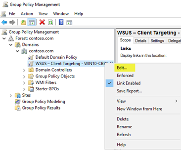
    
6. In the Group Policy Management Editor, go to Computer Configuration\Policies\Administrative Templates\Windows Components\Windows Update.

7. Right-click **Enable client-side targeting**, and then click **Edit**.

8. In the **Enable client-side targeting** dialog box, select **Enable**.

9. In the **Target group name for this computer** box, type **Ring 4 Broad Business Users**. This is the name of the deployment ring in WSUS to which these computers will be added.

    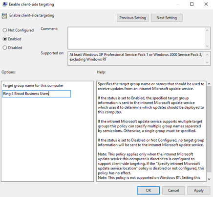

10. Close the Group Policy Management Editor.

Now you’re ready to deploy this GPO to the correct computer security group for the **Ring 4 Broad Business Users** deployment ring. 

**To scope the GPO to a group**

1. In GPMC, select the **WSUS – Client Targeting – Ring 4 Broad Business Users** policy.

2. Click the **Scope** tab.

3. Under **Security Filtering**, remove the default **AUTHENTICATED USERS** security group, and then add the **Ring 4 Broad Business Users** group.

    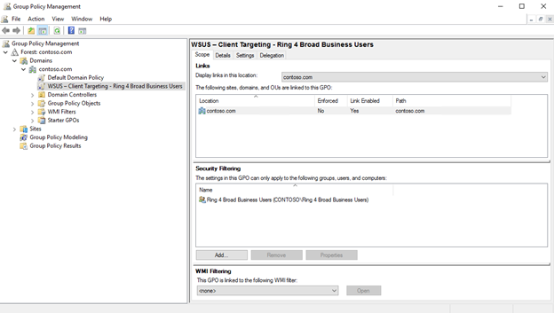
    
The next time the clients in the **Ring 4 Broad Business Users** security group receive their computer policy and contact WSUS, they will be added to the **Ring 4 Broad Business Users** deployment ring. 

## Automatically approve and deploy feature updates

For clients that should have their feature updates approved as soon as they’re available, you can configure Automatic Approval rules in WSUS.

>[!NOTE]
>WSUS respects the client’s servicing branch. If you approve a feature update while it is still Current Branch (CB), WSUS will install the update only on PCs that are in the CB servicing branch. When Microsoft releases the build for Current Branch for Business (CBB), the PCs in the CBB servicing branch will install it. Windows Update for Business branch settings do not apply to feature updates through WSUS.

**To configure an Automatic Approval rule for Windows 10 feature updates and approve them for the Ring 3 Broad IT deployment ring**

1. In the WSUS Administration Console, go to Update Services\\*Server_Name*\Options, and then select **Automatic Approvals**.

2. On the **Update Rules** tab, click **New Rule**.

3. In the **Add Rule** dialog box, select the **When an update is in a specific classification**, **When an update is in a specific product**, and **Set a deadline for the approval** check boxes.

     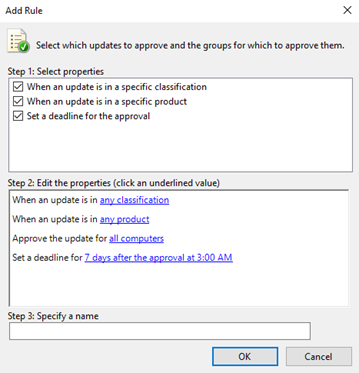
     
4. In the **Edit the properties** area, select **any classification**. Clear everything except **Upgrades**, and then click **OK**.

5. In the **Edit the properties area**, click the **any product** link. Clear all check boxes except **Windows 10**, and then click **OK**.

    Windows 10 is under All Products\Microsoft\Windows.
    
6. In the **Edit the properties** area, click the **all computers** link. Clear all the computer group check boxes except **Ring 3 Broad IT**, and then click **OK**.

7. Leave the deadline set for **7 days after the approval at 3:00 AM**.

8. In the **Step 3: Specify a name** box, type **Windows 10 Upgrade Auto-approval for Ring 3 Broad IT**, and then click **OK**.

    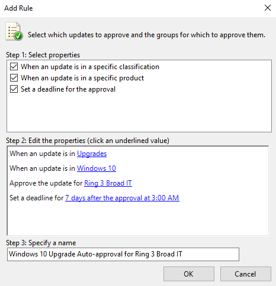
    
9. In the **Automatic Approvals** dialog box, click **OK**.

    >[!NOTE]
    >WSUS does not honor any existing month/week/day deferral settings for CB or CBB. That said, if you’re using Windows Update for Business for a computer for which WSUS is also managing updates, when WSUS approves the update, it will be installed on the computer regardless of whether you configured Group Policy to wait.

Now, whenever Windows 10 feature updates are published to WSUS, they will automatically be approved for the **Ring 3 Broad IT** deployment ring with an installation deadline of 1 week.

## Manually approve and deploy feature updates

You can manually approve updates and set deadlines for installation within the WSUS Administration Console, as well. To simplify the manual approval process, start by creating a software update view that contains only Windows 10 updates.

**To approve and deploy feature updates manually**

1.	 In the WSUS Administration Console, go to Update Services\\*Server_Name*\Updates. In the **Action** pane, click **New Update View**.

2. In the **Add Update View** dialog box, select **Updates are in a specific classification** and **Updates are for a specific product**.

3. Under **Step 2: Edit the properties**, click **any classification**. Clear all check boxes except **Upgrades**, and then click **OK**.

4. Under **Step 2: Edit the properties**, click **any product**. Clear all check boxes except **Windows 10**, and then click **OK**.

    Windows 10 is under All Products\Microsoft\Windows.
    
5. In the **Step 3: Specify a name** box, type **All Windows 10 Upgrades**, and then click **OK**.

     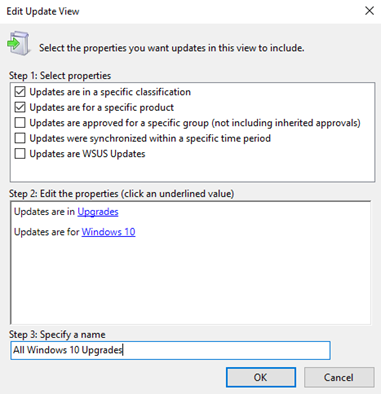

Now that you have the All Windows 10 Upgrades view, complete the following steps to manually approve an update for the **Ring 4 Broad Business Users** deployment ring:

1. In the WSUS Administration Console, go to Update Services\\*Server_Name*\Updates\All Windows 10 Upgrades.

2. Right-click the feature update you want to deploy, and then click **Approve**.

        
      
3. In the **Approve Updates** dialog box, from the **Ring 4 Broad Business Users** list, select **Approved for Install**.

      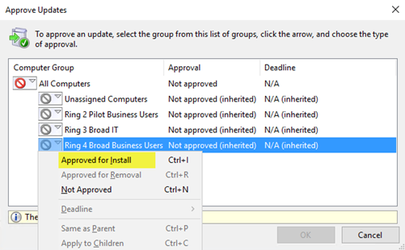 
      
4. In the **Approve Updates** dialog box, from the **Ring 4 Broad Business Users** list, click **Deadline**, click **One Week**, and then click **OK**. 

      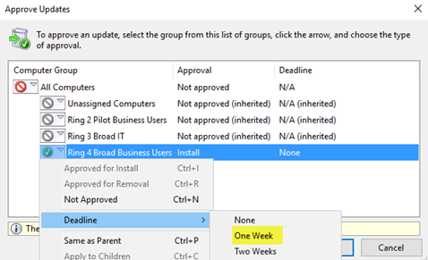 
      
5. If the **Microsoft Software License Terms** dialog box opens, click **Accept**.

    If the deployment is successful, you should receive a successful progress report.
    
    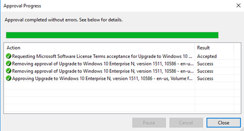 

6. In the **Approval Progress** dialog box, click **Close**.

 

## Steps to manage updates for Windows 10

| | |
| --- | --- |
|  | [Learn about updates and servicing channels](waas-overview.md) |
|  | [Prepare servicing strategy for Windows 10 updates](waas-servicing-strategy-windows-10-updates.md) |
|  | [Build deployment rings for Windows 10 updates](waas-deployment-rings-windows-10-updates.md) |
|  | [Assign devices to servicing channels for Windows 10 updates](waas-servicing-channels-windows-10-updates.md) |
|  | [Optimize update delivery for Windows 10 updates](waas-optimize-windows-10-updates.md) |
|  | [Deploy updates using Windows Update for Business](waas-manage-updates-wufb.md) or Deploy Windows 10 updates using Windows Server Update Services (this topic) or [Deploy Windows 10 updates using System Center Configuration Manager](waas-manage-updates-configuration-manager.md) |

## Related topics

- [Update Windows 10 in the enterprise](index.md)
- [Overview of Windows as a service](waas-overview.md)
- [Prepare servicing strategy for Windows 10 updates](waas-servicing-strategy-windows-10-updates.md)
- [Build deployment rings for Windows 10 updates](waas-deployment-rings-windows-10-updates.md)
- [Assign devices to servicing channels for Windows 10 updates](waas-servicing-channels-windows-10-updates.md)
- [Optimize update delivery for Windows 10 updates](waas-optimize-windows-10-updates.md)
- [Configure Delivery Optimization for Windows 10 updates](waas-delivery-optimization.md)
- [Configure BranchCache for Windows 10 updates](waas-branchcache.md)
- [Deploy updates for Windows 10 Mobile Enterprise and Windows 10 IoT Mobile](waas-mobile-updates.md) 
- [Deploy updates using Windows Update for Business](waas-manage-updates-wufb.md)
- [Configure Windows Update for Business](waas-configure-wufb.md)
- [Integrate Windows Update for Business with management solutions](waas-integrate-wufb.md)
- [Walkthrough: use Group Policy to configure Windows Update for Business](waas-wufb-group-policy.md)
- [Walkthrough: use Intune to configure Windows Update for Business](waas-wufb-intune.md)
- [Deploy Windows 10 updates using System Center Configuration Manager](waas-manage-updates-configuration-manager.md)
- [Manage device restarts after updates](waas-restart.md)
