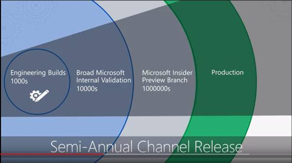

# Quick guide to Windows as a service

**Applies to**

- Windows 10
- Windows 10 Mobile
- Windows 10 IoT Mobile

Windows as a service is a new concept, introduced with the release of Windows 10. While [an extensive set of documentation](index.md) is available explaining all the specifics and nuances, here is a quick guide to the most important concepts.

## Definitions

Some new terms have been introduced as part of Windows as a service, so you should know what these terms mean.
- **Feature updates** will be released twice per year, around March and September. As the name suggests, these will add new features to Windows 10, delivered in bite-sized chunks compared to the previous practice of Windows releases every 3-5 years.
- **Quality updates** deliver both security and non-security fixes. They are typically released on the second Tuesday of each month ("Patch Tuesday"), though they can be released at any time. Quality updates include security updates, critical updates, servicing stack updates, and driver updates. Quality updates are cumulative, so installing the latest quality update is sufficient to get all the available fixes for a specific Windows 10 feature update. The "servicing stack" is the code that installs other updates, so they are important to keep current. For more information, see [Servicing stack updates](servicing-stack-updates.md).
- **Insider Preview** builds are made available during the development of the features that will be shipped in the next feature update, enabling organizations to validate new features as well as compatibility with existing apps and infrastructure, providing feedback to Microsoft on any issues encountered.
- **Servicing channels** allow organizations to choose when to deploy new features. 
    - The **Semi-Annual Channel** receives feature updates twice per year. 
    - The **Long Term Servicing Channel**, which is designed to be used only for specialized devices (which typically don't run Office) such as those that control medical equipment or ATM machines, receives new feature releases every two to three years.
- **Deployment rings** are groups of devices used to initially pilot, and then to broadly deploy, each feature update in an organization. 

See [Overview of Windows as a service](waas-overview.md) for more information.

For some interesting in-depth information about how cumulative updates work, see [Windows Updates using forward and reverse differentials](PSFxWhitepaper.md).

## Key Concepts

Windows 10 gains new functionality with twice-per-year feature update releases. Initially, organizations will use these feature update releases for pilot deployments to ensure compatibility with existing apps and infrastructure. After a period of time, typically about four months after the feature update release, broad deployment throughout the organization can begin. The exact timeframe is determined by feedback from customers, ISVs, OEMs, and others, with an explicit "ready for broad deployment" declaration signaling this to customers.

Each Windows 10 feature update will be serviced with quality updates for 18 months from the date of the feature update release. 

Windows 10 Enterprise LTSB is a separate **Long Term Servicing Channel** version. Each release is supported for a total of 10 years (five years standard support, five years extended support). New releases are expected about every three years.

See [Assign devices to servicing channels for Windows 10 updates](waas-servicing-channels-windows-10-updates.md) for more information.

## Staying up to date

The process for keeping Windows 10 up to date involves deploying a feature update, at an appropriate time after its release. A variety of tools management and patching tools such as Windows Update, Windows Update for Business, Windows Server Update Services, System Center Configuration Manager, and third-party products) can be used to help with this process. [Windows Analytics Upgrade Readiness](https://www.microsoft.com/en-us/WindowsForBusiness/windows-analytics), a free tool to streamline Windows upgrade projects, is another important tool to help.

Because app compatibility, both for desktop apps and web apps, is outstanding with Windows 10, extensive advanced testing isn’t required. Instead, only business-critical apps need to be tested, with the remaining apps validated through a series of pilot deployment rings. Once these pilot deployments have validated most apps, broad deployment can begin.

This process repeats with each new feature update, twice per year. These are small deployment projects, compared to the big projects that were necessary with the old three-to-five-year Windows release cycles.

Additional technologies such as BranchCache and Delivery Optimization, both peer-to-peer distribution tools, can help with the distribution of the feature update installation files.

See [Build deployment rings for Windows 10 updates](waas-deployment-rings-windows-10-updates.md) and [Optimize update delivery for Windows 10 updates](waas-optimize-windows-10-updates.md) for more information.

## Video: An overview of Windows as a service

Click the following Microsoft Mechanics video for an overview of the updated release model, particularly the Semi-Annual Channel.

 
 
## Learn more

- [Adopting Windows as a service at Microsoft](https://www.microsoft.com/itshowcase/Article/Content/851/Adopting-Windows-as-a-service-at-Microsoft)
- [Windows lifecycle fact sheet](https://support.microsoft.com/help/13853/windows-lifecycle-fact-sheet)

## Related topics

- [Update Windows 10 in the enterprise](index.md)
- [Deploy updates for Windows 10 Mobile Enterprise and Windows 10 IoT Mobile](waas-mobile-updates.md) 
- [Configure Delivery Optimization for Windows 10 updates](waas-delivery-optimization.md)
- [Configure BranchCache for Windows 10 updates](waas-branchcache.md)
- [Configure Windows Update for Business](waas-configure-wufb.md)
- [Integrate Windows Update for Business with management solutions](waas-integrate-wufb.md)
- [Walkthrough: use Group Policy to configure Windows Update for Business](waas-wufb-group-policy.md)
- [Walkthrough: use Intune to configure Windows Update for Business](waas-wufb-intune.md)
- [Manage device restarts after updates](waas-restart.md)

