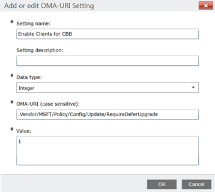
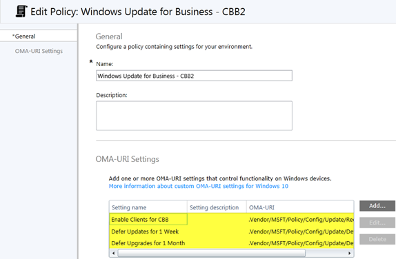
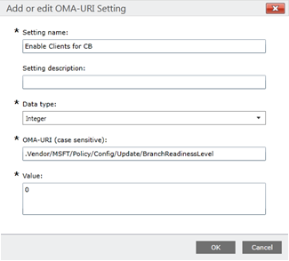
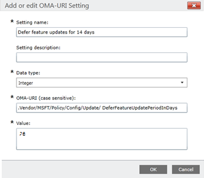
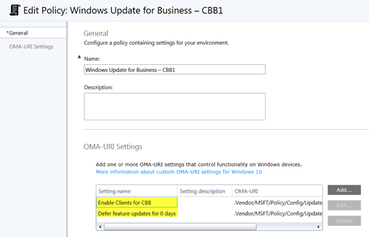

# Walkthrough: use Microsoft Intune to configure Windows Update for Business

**Applies to**

- Windows 10
- Windows 10 Mobile

> **Looking for consumer information?** See [Windows Update: FAQ](https://support.microsoft.com/help/12373/windows-update-faq) 

>[!IMPORTANT]
>Due to [naming changes](waas-overview.md#naming-changes), older terms like CB,CBB and LTSB may still be displayed in some of our products.
>
>In the following settings CB refers to Semi-Annual Channel (Targeted), while CBB refers to Semi-Annual Channel.

You can use Intune to configure Windows Update for Business even if you don’t have on-premises infrastructure when you use Intune in conjunction with Azure AD. Before configuring Windows Update for Business, consider a [deployment strategy](waas-servicing-strategy-windows-10-updates.md) for updates and feature updates in your environment. 

Windows Update for Business in Windows 10 version 1511 allows you to delay quality updates up to 4 weeks and feature updates up to an additional 8 months after Microsoft releases builds to the Current Branch for Business (CBB) servicing branch. In Windows 10 version 1607 and later, you can delay quality updates for up to 30 days and feature updates up to an additional 180 days after the release of either a Current Branch (CB) or CBB build.

To use Intune to manage quality and feature updates in your environment, you must first create computer groups that align with your constructed deployment rings. 

>[!NOTE]
>Coming soon: [Intune Groups will be converted to Azure Active Directory-based Security Groups](https://docs.microsoft.com/intune/deploy-use/use-groups-to-manage-users-and-devices-with-microsoft-intune)

## Configure Windows Update for Business in Windows 10, version 1511

In this example, you use two security groups to manage your updates: **Ring 4 Broad business users** and **Ring 5 Broad business users #2** from  Table 1 in [Build deployment rings for Windows 10 updates](waas-deployment-rings-windows-10-updates.md). 

- The **Ring 4 Broad business users** group contains PCs of IT members who test the updates as soon as they’re released for Windows clients in the Current Branch for Business (CBB) servicing branch. This phase typically occurs after testing on Current Branch (CB) devices.
- The **Ring 5 Broad business users #2** group consists of the first line-of-business (LOB) users, who consume quality updates after 1 week and feature updates 1 month after the CBB release.

>[!NOTE]
>Although the [sample deployment rings](waas-deployment-rings-windows-10-updates.md) specify a feature update deferral of 2 weeks for Ring 5, deferrals in Windows 10, version 1511 are in increments of months only. 

### Configure the Ring 4 Broad business users deployment ring for CBB with no deferral

1. Sign in to [https://manage.microsoft.com](https://manage.microsoft.com) with your Intune administrator credentials.

2. Click the **Policy** workspace. In the middle pane, click **Configuration Policies**, and then click **Add** in the details pane.

    
    
3. In the Create a New Policy Wizard, select **Windows\Custom Configuration (Windows 10 Desktop and Mobile and later)**, and then click **Create Policy**.

4. Name the policy **Windows Update for Business - CBB1**. Then, in the **OMA-URI Settings** section, click **Add**.

5. In **Setting name**, type **Enable Clients for CBB**, and then select **Integer** from the **Data type** list.

6. In the **OMA-URI** box, type **./Vendor/MSFT/Policy/Config/Update/RequireDeferUpgrade**.

7. In the **Value** box, type **1**, and then click **OK**.

    >[!NOTE]
    >The OMA-URI settings are case sensitive, so be sure to review [Policy CSP](https://msdn.microsoft.com/library/windows/hardware/dn904962.aspx) for the proper syntax.

    
    
8. For this deployment ring, you’re required to enable only CBB, so click **Save Policy**.

9. In the **Deploy Policy: Windows Update for Business – CBB1** dialog box, click **Yes**.

    >[!NOTE]
    >If this dialog box doesn't appear, select the policy, and then click **Manage Deployment**.
    
10. In the **Manage Deployment: Windows Update for Business – CBB1** dialog box, select the **Ring 4 Broad business users** group, click **Add**, and then click **OK**.

You have now configured the **Ring 4 Broad business users** deployment ring to enable the CBB servicing branch. Now, you must configure **Ring 5 Broad business users #2** to accommodate a 1-week delay for quality updates and a 1-month delay for feature updates. 

### Configure the Ring 5 Broad business users \#2 deployment ring for CBB with deferrals

1.	In the Policy workspace, click **Configuration Policies**, and then click **Add**.

2.	In the Create a New Policy Wizard, select **Windows\Custom Configuration (Windows 10 Desktop and Mobile and later)**, and then click **Create Policy**.

3.	Name the policy **Windows Update for Business – CBB2**. Then, in the **OMA-URI Settings** section, click **Add**.
    In this policy, you add two OMA-URI settings, one for each deferment type.
    
4.	In **Setting name**, type **Enable Clients for CBB**, and then in the **Data type** list, select **Integer**.

6.	In the **OMA-URI** box, type **./Vendor/MSFT/Policy/Config/Update/RequireDeferUpgrade**. Then, in the **Value** box, type **1**.

7.	Click **OK** to save the setting.

8.	In the **OMA-URI Settings** section, click **Add**.

9.	For this setting, in **Setting name**, type **Defer Updates for 1 Week**, and then in the **Data type** list, select **Integer**.

11.	In the **OMA-URI** box, type **./Vendor/MSFT/Policy/Config/Update/DeferUpdatePeriod**. 

12.	In the **Value** box, type **1**.

13.	Click **OK** to save the setting.

14.	In the **OMA-URI Settings** section, click **Add**.

15.	For this setting, in **Setting name**, type **Defer Upgrades for 1 Month**, and then in the **Data type** list, select **Integer**.

17.	In the **OMA-URI** box, type **./Vendor/MSFT/Policy/Config/Update/DeferUpgradePeriod**.

18.	In the **Value** box, type **1**.

19.	Click **OK** to save the setting.

    Three settings should appear in the **Windows Update for Business – CBB2** policy.
    
    
    
20. Click **Save Policy**, and then click **Yes** at the **Deploy Policy** prompt.

21.	In the **Manage Deployment** dialog box, select the **Ring 5 Broad business users #2** computer group, click **Add**, and then click **OK**.

## Configure Windows Update for Business in Windows 10 version 1607

To use Intune to manage quality and feature updates in your environment, you must first create computer groups that align with your constructed deployment rings.

In this example, you use three security groups from Table 1 in [Build deployment rings for Windows 10 updates](waas-deployment-rings-windows-10-updates.md) to manage your updates: 

- **Ring 2 Pilot Business Users** contains the PCs of business users which are part of the pilot testing process, receiving CB builds 28 days after they are released.
- **Ring 4 Broad business users** consists of IT members who receive updates after Microsoft releases a Windows 10 build to the CBB servicing branch.
- **Ring 5 Broad business users #2** consists of LOB users on CBB, who receive quality updates after 7 days and feature updates after 14 days. 

### Configure Ring 2 Pilot Business Users policy

1. Sign in to [https://manage.microsoft.com](https://manage.microsoft.com) with your Intune administrator credentials.

2. Click the **Policy** workspace. In the middle pane, click **Configuration Policies**, and then click **Add** in the details pane.

    
    
3. In the Create a New Policy Wizard, select **Windows\Custom Configuration (Windows 10 Desktop and Mobile and later)**, and then click **Create Policy**.

4. Name the policy **Windows Update for Business - CB2**. Then, in the **OMA-URI Settings** section, click **Add**.

4. In **Setting name**, type **Enable Clients for CB**, and then select **Integer** from the **Data type** list.

6. In the **OMA-URI** box, type **./Vendor/MSFT/Policy/Config/Update/BranchReadinessLevel**.

7. In the **Value** box, type **0**, and then click **OK**.

    >[!NOTE]
    >The OMA-URI settings are case sensitive, so be sure to review [Policy CSP](https://msdn.microsoft.com/library/windows/hardware/dn904962.aspx) for the proper syntax.

    
    
8. Because the **Ring 2 Pilot Business Users** deployment ring receives the CB feature updates after 28 days, in the **OMA-URI Settings** section, click **Add** to add another OMA-URI setting. 

8. In **Setting name**, type **Defer feature updates for 28 days**, and then select **Integer** from the **Data type** list.
10.	In the **OMA-URI** box, type **./Vendor/MSFT/Policy/Config/Update/DeferFeatureUpdatesPeriodInDays**.
11.	In the **Value** box, type **28**, and then click **OK**.

    

9. Click **Save Policy**.

9. In the **Deploy Policy: Windows Update for Business – CB2** dialog box, click **Yes**.

    >[!NOTE]
    >If this dialog box doesn't appear, select the policy, and then click **Manage Deployment**.
    
10. In the **Manage Deployment: Windows Update for Business – CB2** dialog box, select the **Ring 2 Pilot Business Users** group, click **Add**, and then click **OK**.

You have now configured the **Ring 2 Pilot Business Users** deployment ring to enable CB feature update deferment for 14 days. Now, you must configure **Ring 4 Broad business users** to receive CBB features updates as soon as they’re available.

### Configure Ring 4 Broad business users policy

2. Click the **Policy** workspace. In the middle pane, click **Configuration Policies**, and then click **Add** in the details pane.

    
    
3. In the Create a New Policy Wizard, select **Windows\Custom Configuration (Windows 10 Desktop and Mobile and later)**, and then click **Create Policy**.

4. Name the policy **Windows Update for Business - CBB1**. Then, in the **OMA-URI Settings** section, click **Add**.

4. In **Setting name**, type **Enable Clients for CBB**, and then select **Integer** from the **Data type** list.

6. In the **OMA-URI** box, type **./Vendor/MSFT/Policy/Config/Update/BranchReadinessLevel**.

7. In the **Value** box, type **1**, and then click **OK**.

    >[!NOTE]
    >The OMA-URI settings are case sensitive, so be sure to review [Policy CSP](https://msdn.microsoft.com/library/windows/hardware/dn904962.aspx) for the proper syntax.

    
8. Because the **Ring 4 Broad business users** deployment ring receives the CBB feature updates immediately, in the **OMA-URI Settings** section, click **Add** to add another OMA-URI setting. 

8. In **Setting name**, type **Defer feature updates for 0 days**, and then select **Integer** from the **Data type** list.

10.	In the **OMA-URI** box, type **./Vendor/MSFT/Policy/Config/Update/DeferFeatureUpdatesPeriodInDays**.

11.	In the **Value** box, type **0**, and then click **OK**.

    

9. Click **Save Policy**.

9. In the **Deploy Policy: Windows Update for Business – CBB1** dialog box, click **Yes**.

    >[!NOTE]
    >If this dialog box doesn't appear, select the policy, and then click **Manage Deployment**.
    
10. In the **Manage Deployment: Windows Update for Business – CBB1** dialog box, select the **Ring 4 Broad business users** group, click **Add**, and then click **OK**.

You have now configured the **Ring 4 Broad business users** deployment ring to receive CBB feature updates as soon as they’re available. Finally, configure **Ring 5 Broad business users #2** to accommodate a 7-day delay for quality updates and a 14-day delay for feature updates. 

### Configure Ring 5 Broad business users \#2 policy

2. Click the **Policy** workspace. In the middle pane, click **Configuration Policies**, and then click **Add** in the details pane.

    
    
3. In the Create a New Policy Wizard, select **Windows\Custom Configuration (Windows 10 Desktop and Mobile and later)**, and then click **Create Policy**.

4. Name the policy **Windows Update for Business - CBB2**. Then, in the **OMA-URI Settings** section, click **Add**.

4. In **Setting name**, type **Enable Clients for CBB**, and then select **Integer** from the **Data type** list.

6. In the **OMA-URI** box, type **./Vendor/MSFT/Policy/Config/Update/BranchReadinessLevel**.

7. In the **Value** box, type **1**, and then click **OK**.

    >[!NOTE]
    >The OMA-URI settings are case sensitive, so be sure to review [Policy CSP](https://msdn.microsoft.com/library/windows/hardware/dn904962.aspx) for the proper syntax.

    
8. In the **OMA-URI Settings** section, click **Add** to add another OMA-URI setting. 

8. In **Setting name**, type **Defer quality updates for 7 days**, and then select **Integer** from the **Data type** list.

10.	In the **OMA-URI** box, type **./Vendor/MSFT/Policy/Config/Update/DeferQualityUpdatesPeriodInDays**.

11.	In the **Value** box, type **7**, and then click **OK**.

8. In the **OMA-URI Settings** section, click **Add** to add another OMA-URI setting. 

8. In **Setting name**, type **Defer feature updates for 14 days**, and then select **Integer** from the **Data type** list.

10.	In the **OMA-URI** box, type **./Vendor/MSFT/Policy/Config/Update/DeferFeatureUpdatesPeriodInDays**.

11.	In the **Value** box, type **14**, and then click **OK**.

    

9. Click **Save Policy**.

9. In the **Deploy Policy: Windows Update for Business – CBB2** dialog box, click **Yes**.

    >[!NOTE]
    >If this dialog box doesn't appear, select the policy, and then click **Manage Deployment**.
    
10. In the **Manage Deployment: Windows Update for Business – CBB2** dialog box, select the **Ring 5 Broad Business Users #2** group, click **Add**, and then click **OK**.

## Related topics

- [Update Windows 10 in the enterprise](index.md)
- [Overview of Windows as a service](waas-overview.md)
- [Prepare servicing strategy for Windows 10 updates](waas-servicing-strategy-windows-10-updates.md)
- [Build deployment rings for Windows 10 updates](waas-deployment-rings-windows-10-updates.md)
- [Assign devices to servicing channels for Windows 10 updates](waas-servicing-channels-windows-10-updates.md)
- [Optimize update delivery for Windows 10 updates](waas-optimize-windows-10-updates.md)
- [Configure Delivery Optimization for Windows 10 updates](waas-delivery-optimization.md)
- [Configure BranchCache for Windows 10 updates](waas-branchcache.md)
- [Deploy updates for Windows 10 Mobile Enterprise and Windows 10 IoT Mobile](waas-mobile-updates.md) 
- [Deploy updates using Windows Update for Business](waas-manage-updates-wufb.md)
- [Configure Windows Update for Business](waas-configure-wufb.md)
- [Integrate Windows Update for Business with management solutions](waas-integrate-wufb.md)
- [Walkthrough: use Group Policy to configure Windows Update for Business](waas-wufb-group-policy.md)
- [Deploy Windows 10 updates using Windows Server Update Services](waas-manage-updates-wsus.md)
- [Deploy Windows 10 updates using System Center Configuration Manager](waas-manage-updates-configuration-manager.md)
- [Manage device restarts after updates](waas-restart.md)

