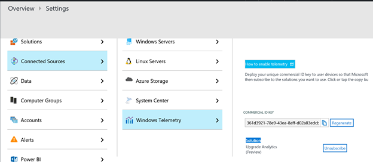

# Troubleshoot Upgrade Readiness

If you’re having issues seeing data in Upgrade Readiness after running the Upgrade Readiness Deployment script, make sure it completes successfully without any errors. Check the output of the script in the command window and/or log UA_dateTime_machineName.txt to ensure all steps were completed successfully. In addition, we recommend that you wait at least 48 hours before checking OMS for data after the script first completes without reporting any error.

If you still don’t see data in Upgrade Readiness, follow these steps:

1.  Download and extract the [Upgrade Readiness Deployment Script](https://go.microsoft.com/fwlink/?LinkID=822966&clcid=0x409). Ensure the “Pilot/Diagnostics” folder is included .

2.  Edit the script as described in [Upgrade Readiness deployment script](upgrade-readiness-deployment-script.md).

3.  Check that isVerboseLogging is set to $true.

4.  Run the script again. Log files will be saved to the directory specified in the script.

5.  Open a support case with Microsoft Support through your regular channel and provide this information.

## Disable Upgrade Readiness

If you want to stop using Upgrade Readiness and stop sending telemetry data to Microsoft, follow these steps:

1.  Unsubscribe from the Upgrade Readiness solution in the OMS portal. In the OMS portal, go to **Settings** > **Connected Sources** > **Windows Telemetry** and choose the **Unsubscribe** option.

  

2.  Disable the Commercial Data Opt-in Key on computers running Windows 7 SP1 or 8.1. On computers running Windows 10, set the telemetry level to **Security**:

  **Windows 7 and Windows 8.1**: Delete CommercialDataOptIn registry property from *HKLM:\SOFTWARE\Microsoft\Windows\CurrentVersion\Policies\DataCollection*
  **Windows 10**: Follow the instructions in the [Configure Windows telemetry in your organization](https://technet.microsoft.com/itpro/windows/manage/configure-windows-telemetry-in-your-organization#enterprise-management) topic.

3.	If you enabled **Internet Explorer Site Discovery**, you can disable Internet Explorer data collection by setting the *IEDataOptIn* registry key to value "0".  The IEDataOptIn key can be found under: *HKLM:\SOFTWARE\Microsoft\Windows\CurrentVersion\Policies\DataCollection*.
4.	You can also remove the “CommercialId” key from: "HKLM:\SOFTWARE\Microsoft\Windows\CurrentVersion\Policies\DataCollection". **This is an optional step**.
