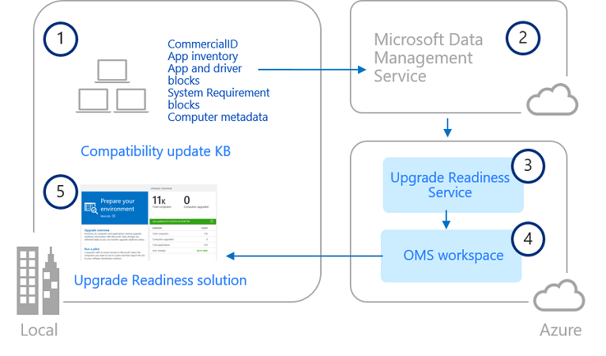

# Upgrade Readiness architecture

Microsoft analyzes system, application, and driver diagnostic data  to help you determine when computers are upgrade-ready, allowing you to simplify and accelerate Windows upgrades in your organization. The diagram below illustrates how Upgrade Readiness components work together in a typical installation. 

<!-- PRESERVING ORIGINAL IMAGE CODING JUST IN CASE 

-->

After you enable Windows diagnostic data on user computers and install the compatibility update KB (1), user computers send computer, application and driver diagnostic data to a secure Microsoft data center through the Microsoft Data Management Service (2). After you configure Upgrade Readiness, diagnostic data is analyzed by the Upgrade Readiness Service (3) and pushed to your workspace (4). You can then use the Upgrade Readiness solution (5) to plan and manage Windows upgrades.

For more information about what diagnostic data Microsoft collects and how that data is used and protected by Microsoft, see:

[Configure Windows diagnostic data in your organization](/windows/configuration/configure-windows-diagnostic-data-in-your-organization) 
[Manage connections from Windows operating system components to Microsoft services](/windows/configuration/manage-connections-from-windows-operating-system-components-to-microsoft-services) 
[Windows 7, Windows 8, and Windows 8.1 appraiser diagnostic data events and fields](https://go.microsoft.com/fwlink/?LinkID=822965) 

## **Related topics**

[Upgrade Readiness requirements](upgrade-readiness-requirements.md) 
[Upgrade Readiness release notes](upgrade-readiness-requirements.md#important-information-about-this-release) 
[Get started with Upgrade Readiness](upgrade-readiness-get-started.md) 
