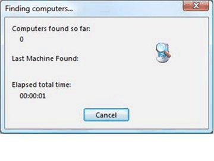

# Add and Remove Computers

You can add computers that have any of the supported Windows or Office products installed to a Volume Activation Management Tool (VAMT) database by using the **Discover products** function. You can search for computers in an Active Directory domain, by individual computer name or IP address, in a workgroup, or by a general LDAP query. You can remove computers from a VAMT database by using the **Delete** function. After you add the computers, you can add the products that are installed on the computers by running the **Update license status** function.

Before adding computers, ensure that the Windows Management Instrumentation (WMI) firewall exception required by VAMT has been enabled on all target computers. For more information see [Configure Client Computers](configure-client-computers-vamt.md).

## To add computers to a VAMT database

1.  Open VAMT.
2.  Click **Discover products** in the **Actions** menu in the right-side pane to open the **Discover Products** dialog box.
3.  In the **Discover products** dialog box, click **Search for computers in the Active Directory** to display the search options, then click the search option you want to use. You can search for computers in an Active Directory domain, by individual computer name or IP address, in a workgroup, or by a general LDAP query.
    -   To search for computers in an Active Directory domain, click **Search for computers in the Active Directory**, then under **Domain Filter Criteria**, in the list of domain names click the name of the domain you want to search. You can narrow the search further by typing a name in the **Filter by computer name** field to search for a specific computer within the domain. This filter supports the asterisk (\*) wildcard. For example, typing "a\*" will display only computer names that start with the letter "a".
    -   To search by individual computer name or IP address, click **Manually enter name or IP address**, then enter the full name or IP address in the **One or more computer names or IP addresses separated by commas** text box. Separate multiple entries with a comma. Note that VAMT supports both IPv4 and IPV6 addressing.
    -   To search for computers in a workgroup, click **Search for computers in the workgroup**, then under **Workgroup Filter Criteria**, in the list of workgroup names click the name of the workgroup you want to search. You can narrow the search further by typing a name in the **Filter by computer name** field to search for a specific computer within the workgroup. This filter supports the asterisk (\*) wildcard. For example, typing "a\*" will display only computer names that start with the letter "a".
    -   To search for computers by using a general LDAP query, click **Search with LDAP query** and enter your query in the text box provided. VAMT will validate only the LDAP query syntax, but will otherwise run the query without further checks.
4.  Click **Search**.
5.  VAMT searches for the specified computers and adds them to the VAMT database. During the search, VAMT displays the **Finding computers** message shown below.
    To cancel the search, click **Cancel**. When the search is complete the names of the newly-discovered computers appear in the product list view in the center pane.
    
    
    
    **Important**  
    This step adds only the computers to the VAMT database, and not the products that are installed on the computers. To add the products, you need to run the **Update license status** function.
    
## To add products to VAMT

1.  In the **Products** list, select the computers that need to have their product information added to the VAMT database.
2.  You can use the **Filter** function to narrow your search for computers by clicking **Filter** in the right-side pane to open the **Filter Products** dialog box.
3.  In the **Filter Products** dialog box, you can filter the list by computer name, product name, product key type, license status, or by any combination of these options.
    -   To filter the list by computer name, enter a name in the **Computer Name** box.
    -   To filter the list by Product Name, Product Key Type, or License Status, click the list you want to use for the filter and select an option. If necessary, click **clear all filters** to create a new filter.
4.  Click **Filter**. VAMT displays the filtered list in the center pane.
5.  In the right-side **Actions** pane, click **Update license status** and then click a credential option. Choose **Alternate Credentials** only if you are updating products that require administrator credentials different from the ones you used to log into the computer. If you are supplying alternate credentials, in the **Windows Security** dialog box type the appropriate user name and password and click **OK**.
6.  VAMT displays the **Collecting product information** dialog box while it collects the licensing status of all supported products on the selected computers. When the process is finished, the updated licensing status of each product will appear in the product list view in the center pane.

    **Note**  
    If a computer has more than one supported product installed, VAMT adds an entry for each product. The entry appears under the appropriate product heading.
    
## To remove computers from a VAMT database

You can delete a computer by clicking on it in the product list view, and then clicking **Delete** in the **Selected Item** menu in the right-hand pane. In the **Confirm Delete Selected Products** dialog box that appears, click **Yes** to delete the computer. If a computer has multiple products listed, you must delete each product to completely remove the computer from the VAMT database.

## Related topics

- [Add and Manage Products](add-manage-products-vamt.md)
 
 
