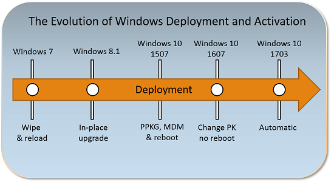
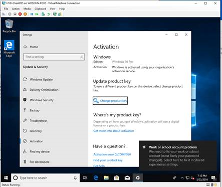
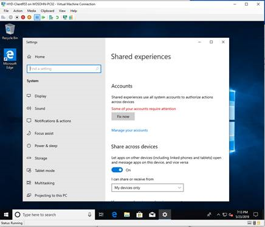
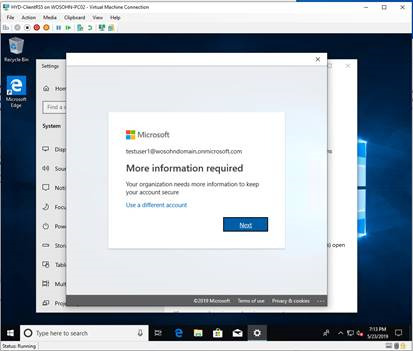
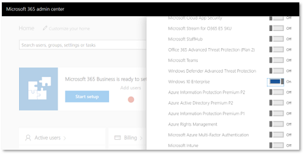
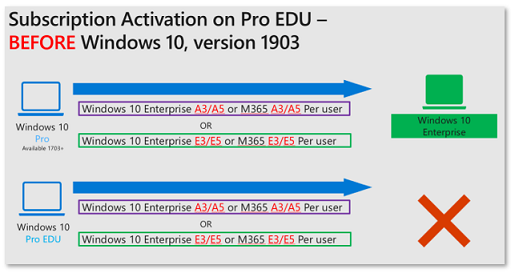
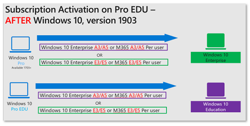

# Windows 10 Subscription Activation

Starting with Windows 10, version 1703 Windows 10 Pro supports the Subscription Activation feature, enabling users to “step-up” from Windows 10 Pro to **Windows 10 Enterprise** automatically if they are subscribed to Windows 10 Enterprise E3 or E5.

With Windows 10, version 1903 the Subscription Activation feature also supports the ability to step-up from Windows 10 Pro Education to the Enterprise grade edition for educational institutions – **Windows 10 Education**. 

The Subscription Activation feature eliminates the need to manually deploy Windows 10 Enterprise or Education images on each target device, then later standing up on-prem key management services such as KMS or MAK based activation, entering GVLKs, and subsequently rebooting client devices.

## Subscription Activation for Windows 10 Enterprise

With Windows 10, version 1703 both Windows 10 Enterprise E3 and Windows 10 Enterprise E5 are available as online services via subscription. Deploying [Windows 10 Enterprise](planning/windows-10-enterprise-faq-itpro.md) in your organization can now be accomplished with no keys and no reboots.

 If you are running Windows 10, version 1703 or later:

- Devices with a current Windows 10 Pro license can be seamlessly upgraded to Windows 10 Enterprise.
- Product key-based Windows 10 Enterprise software licenses can be transitioned to Windows 10 Enterprise subscriptions.

Organizations that have an Enterprise agreement can also benefit from the new service, using traditional Active Directory-joined devices. In this scenario, the Active Directory user that signs in on their device must be synchronized with Azure AD using [Azure AD Connect Sync](https://docs.microsoft.com/azure/active-directory/connect/active-directory-aadconnectsync-whatis).

## Subscription Activation for Windows 10 Education

Subscription Activation for Education works the same as the Enterprise version, but in order to use Subscription Activation for Education, you must have a device running Windows 10 Pro Education, version 1903 or later and an active subscription plan with a Windows 10 Enterprise license. For more information, see the [requirements](#windows-10-education-requirements) section.

## In this article

- [Inherited Activation](#inherited-activation): Description of a new feature available in Windows 10, version 1803 and later.
- [The evolution of Windows 10 deployment](#the-evolution-of-deployment): A short history of Windows deployment.
- [Requirements](#requirements): Prerequisites to use the Windows 10 Subscription Activation model.
- [Benefits](#benefits): Advantages of Windows 10 subscription-based licensing.
- [How it works](#how-it-works): A summary of the subscription-based licensing option.
- [Virtual Desktop Access (VDA)](#virtual-desktop-access-vda): Enable Windows 10 Subscription Activation for VMs in the cloud.

For information on how to deploy Windows 10 Enterprise licenses, see [Deploy Windows 10 Enterprise licenses](deploy-enterprise-licenses.md).

## Inherited Activation

Inherited Activation is a new feature available in Windows 10, version 1803 that allows Windows 10 virtual machines to inherit activation state from their Windows 10 host. 

When a user with Windows 10 E3/E5 or A3/A5 license assigned creates a new Windows 10 virtual machine (VM) using a Windows 10 local host, the VM inherits the activation state from a host machine independent of whether user signs on with a local account or using an Azure Active Directory (AAD) account on a VM. 

To support Inherited Activation, both the host computer and the VM must be running Windows 10, version 1803 or later.

## The evolution of deployment

>The original version of this section can be found at [Changing between Windows SKUs](https://blogs.technet.microsoft.com/mniehaus/2017/10/09/changing-between-windows-skus/).

The following figure illustrates how deploying Windows 10 has evolved with each release. With this release, deployment is automatic.

- **Windows 7** required you to redeploy the operating system using a full wipe-and-load process if you wanted to change from Windows 7 Professional to Windows 10 Enterprise. 
- **Windows 8.1** added support for a Windows 8.1 Pro to Windows 8.1 Enterprise in-place upgrade (considered a “repair upgrade” because the OS version was the same before and after).  This was a lot easier than wipe-and-load, but it was still time-consuming. 
- **Windows 10, version 1507** added the ability to install a new product key using a provisioning package or using MDM to change the SKU.  This required a reboot, which would install the new OS components, and took several minutes to complete. However, it was a lot quicker than in-place upgrade. 
- **Windows 10, version 1607** made a big leap forward. Now you can just change the product key and the SKU instantly changes from Windows 10 Pro to Windows 10 Enterprise.  In addition to provisioning packages and MDM, you can just inject a key using SLMGR.VBS (which injects the key into WMI), so it became trivial to do this using a command line. 
- **Windows 10, version 1703** made this “step-up” from Windows 10 Pro to Windows 10 Enterprise automatic for those that subscribed to Windows 10 Enterprise E3 or E5 via the CSP program. 
- **Windows 10, version 1709** adds support for Windows 10 Subscription Activation, very similar to the CSP support but for large enterprises, enabling the use of Azure AD for assigning licenses to users. When those users sign in on an AD or Azure AD-joined machine, it automatically steps up from Windows 10 Pro to Windows 10 Enterprise. 
- **Windows 10, version 1803** updates Windows 10 Subscription Activation to enable pulling activation keys directly from firmware for devices that support firmware-embedded keys. It is no longer necessary to run a script to perform the activation step on Windows 10 Pro prior to activating Enterprise. For virtual machines and hosts running Windows 10, version 1803 [Inherited Activation](#inherited-activation) is also enabled. 
- **Windows 10, version 1903** updates Windows 10 Subscription Activation to enable step up from Windows 10 Pro Education to Windows 10 Education for those with a qualifying Windows 10 or Microsoft 365 subscription.

## Requirements

### Windows 10 Enterprise requirements

For Microsoft customers with Enterprise Agreements (EA) or Microsoft Products & Services Agreements (MPSA), you must have the following: 

- Windows 10 (Pro or Enterprise) version 1703 or later installed on the devices to be upgraded.
- Azure Active Directory (Azure AD) available for identity management.
- Devices must be Azure AD-joined or Hybrid Azure AD joined. Workgroup-joined or Azure AD registered devices are not supported.

For Microsoft customers that do not have EA or MPSA, you can obtain Windows 10 Enterprise E3/E5 or A3/A5 through a cloud solution provider (CSP). Identity management and device requirements are the same when you use CSP to manage licenses, with the exception that Windows 10 Enterprise E3 is also available through CSP to devices running Windows 10, version 1607. For more information about obtaining Windows 10 Enterprise E3 through your CSP, see [Windows 10 Enterprise E3 in CSP](windows-10-enterprise-e3-overview.md).

If devices are running Windows 7 or Windows 8.1, see [New Windows 10 upgrade benefits for Windows Cloud Subscriptions in CSP](https://blogs.windows.com/business/2017/01/19/new-windows-10-upgrade-benefits-windows-cloud-subscriptions-csp/)

#### Muti-factor authentication

An issue has been identified with Hybrid Azure AD joined devices that have enabled [multi-factor authentication](https://docs.microsoft.com/azure/active-directory/authentication/howto-mfa-getstarted) (MFA). If a user signs into a device using their Active Directory account and MFA is enabled, the device will not successfully upgrade to their Windows Enterprise subscription.  

To resolve this issue:

If the device is running Windows 10, version 1703, 1709, or 1803, the user must either sign in with an Azure AD account, or you must disable MFA for this user during the 30-day polling period and renewal.

If the device is running Windows 10, version 1809 or later:
1. Windows 10, version 1809 must be updated with [KB4497934](https://support.microsoft.com/help/4497934/windows-10-update-kb4497934). Later versions of Windows 10 automatically include this patch.
2. When the user signs in on a Hybrid Azure AD joined device with MFA enabled, a notification will indicate that there is a problem. Click the notification and then click **Fix now** to step through the subscription activation process. See the example below:

 
 

### Windows 10 Education requirements

1. Windows 10 Pro Education, version 1903 or later installed on the devices to be upgraded.
2. A device with a Windows 10 Pro Education digital license. You can confirm this information in Settings > Update & Security> Activation. 
3. The Education tenant must have an active subscription to Microsoft 365 with a Windows 10 Enterprise license or a Windows 10 Enterprise or Education subscription. 
4. Devices must be Azure AD-joined or Hybrid Azure AD joined. Workgroup-joined or Azure AD registered devices are not supported.

>If Windows 10 Pro is converted to Windows 10 Pro Education [using benefits available in Store for Education](https://docs.microsoft.com/education/windows/change-to-pro-education#change-using-microsoft-store-for-education), then the feature will not work. You will need to re-image the device using a Windows 10 Pro Education edition.  

## Benefits

With Windows 10 Enterprise or Windows 10 Education, businesses and institutions can benefit from enterprise-level security and control. Previously, only organizations with a Microsoft Volume Licensing Agreement could deploy Windows 10 Education or Windows 10 Enterprise to their users. Now, with Windows 10 Enterprise E3 or A3 and E5 or A5 being available as a true online service, it is available in select channels thus allowing all organizations to take advantage of enterprise-grade Windows 10 features. To compare Windows 10 editions and review pricing, see the following:

- [Compare Windows 10 editions](https://www.microsoft.com/windowsforbusiness/compare)
- [Enterprise Mobility + Security Pricing Options](https://www.microsoft.com/cloud-platform/enterprise-mobility-security-pricing)

You can benefit by moving to Windows as an online service in the following ways:

1. Licenses for Windows 10 Enterprise and Education are checked based on Azure Active Directory (Azure AD) credentials, so now businesses have a systematic way to assign licenses to end users and groups in their organization.
2. User logon triggers a silent edition upgrade, with no reboot required 
3. Support for mobile worker/BYOD activation; transition away from on-prem KMS and MAK keys. 
4. Compliance support via seat assignment. 
5. Licenses can be updated to different users dynamically, enabling you to optimize your licensing investment against changing needs.  

## How it works

The device is AAD joined from Settings > Accounts > Access work or school. 

The IT administrator assigns Windows 10 Enterprise to a user. See the following figure.

When a licensed user signs in to a device that meets requirements using their Azure AD credentials, the operating system steps up from Windows 10 Pro to Windows 10 Enterprise (or Windows 10 Pro Education to Windows 10 Education) and all the appropriate Windows 10 Enterprise/Education features are unlocked. When a user’s subscription expires or is transferred to another user, the device reverts seamlessly to Windows 10 Pro / Windows 10 Pro Education edition, once current subscription validity expires.

Devices running Windows 10 Pro, version 1703 or Windows 10 Pro Education, version 1903 or later can get Windows 10 Enterprise or Education Semi-Annual Channel on up to five devices for each user covered by the license. This benefit does not include Long Term Servicing Channel.

The following figures summarize how the Subscription Activation model works:

Before Windows 10, version 1903: 

After Windows 10, version 1903: 

Note: 
1. A Windows 10 Pro Education device will only step up to Windows 10 Education edition when “Windows 10 Enterprise” license is assigned from M365 Admin center (as of May 2019).
2. A Windows 10 Pro device will only step up to Windows 10 Enterprise edition when “Windows 10 Enterprise” license is assigned from M365 Admin center (as of May 2019).

### Scenarios

**Scenario #1**:  You are using Windows 10, version 1803 or above, and just purchased Windows 10 Enterprise E3 or E5 subscriptions (or have had an E3 or E5 subscription for a while but haven’t yet deployed Windows 10 Enterprise).

All of your Windows 10 Pro devices will step-up to Windows 10 Enterprise, and devices that are already running Windows 10 Enterprise will migrate from KMS or MAK activated Enterprise edition to Subscription activated Enterprise edition when a Subscription Activation-enabled user signs in to the device.  

**Scenario #2**:  You are using Windows 10, version 1607, 1703, or 1709 with KMS for activation, and just purchased Windows 10 Enterprise E3 or E5 subscriptions (or have had an E3 or E5 subscription for a while but haven’t yet deployed Windows 10 Enterprise).

To change all of your Windows 10 Pro devices to Windows 10 Enterprise, run the following command on each computer:

<pre style="overflow-y: visible">
cscript.exe c:\windows\system32\slmgr.vbs /ipk NPPR9-FWDCX-D2C8J-H872K-2YT43</pre>
    
The command causes the OS to change to Windows 10 Enterprise and then seek out the KMS server to reactivate.  This key comes from [Appendix A: KMS Client Setup Keys](https://technet.microsoft.com/library/jj612867.aspx) in the Volume Activation guide.  It is also possible to inject the Windows 10 Pro key from this article if you wish to step back down from Enterprise to Pro.

**Scenario #3**:  Using Azure AD-joined devices or Active Directory-joined devices running Windows 10 1709 or later, and with Azure AD synchronization configured, just follow the steps in [Deploy Windows 10 Enterprise licenses](deploy-enterprise-licenses.md) to acquire a $0 SKU and get a new Windows 10 Enterprise E3 or E5 license in Azure AD. Then, assign that license to all of your Azure AD users. These can be AD-synced accounts.  The device will automatically change from Windows 10 Pro to Windows 10 Enterprise when that user signs in.

In summary, if you have a Windows 10 Enterprise E3 or E5 subscription, but are still running Windows 10 Pro, it’s really simple (and quick) to move to Windows 10 Enterprise using one of the scenarios above.

If you’re running Windows 7, it can be more work.  A wipe-and-load approach works, but it is likely to be easier to upgrade from Windows 7 Pro directly to Windows 10 Enterprise. This is a supported path, and completes the move in one step.  This method also works if you are running Windows 8.1 Pro.

### Licenses

The following policies apply to acquisition and renewal of licenses on devices:
- Devices that have been upgraded will attempt to renew licenses about every 30 days, and must be connected to the Internet to successfully acquire or renew a license.
- If a device is disconnected from the Internet until its current subscription expires, the operating system will revert to Windows 10 Pro or Windows 10 Pro Education. As soon as the device is connected to the Internet again, the license will automatically renew.
- Up to five devices can be upgraded for each user license. 
- If a device meets the requirements and a licensed user signs in on that device, it will be upgraded.

Licenses can be reallocated from one user to another user, allowing you to optimize your licensing investment against changing needs.

When you have the required Azure AD subscription, group-based licensing is the preferred method to assign Enterprise E3 and E5 licenses to users. For more information, see [Group-based licensing basics in Azure AD](https://docs.microsoft.com/azure/active-directory/active-directory-licensing-whatis-azure-portal).

### Existing Enterprise deployments

If you are running Windows 10, version 1803 or later, Subscription Activation will automatically pull the firmware-embedded Windows 10 activation key and activate the underlying Pro License. The license will then step-up to Windows 10 Enterprise using Subscription Activation. This automatically migrates your devices from KMS or MAK activated Enterprise to Subscription activated Enterprise. 

If you are using Windows 10, version 1607, 1703, or 1709 and have already deployed Windows 10 Enterprise, but you want to move away from depending on KMS servers and MAK keys for Windows client machines, you can seamlessly transition as long as the computer has been activated with a firmware-embedded Windows 10 Pro product key.

If the computer has never been activated with a Pro key, run the following script. Copy the text below into a .cmd file and run the file from an elevated command prompt:

<pre style="overflow-y: visible">
@echo off
FOR /F "skip=1" %%A IN ('wmic path SoftwareLicensingService get OA3xOriginalProductKey') DO  ( 
SET "ProductKey=%%A"
goto InstallKey
)

:InstallKey
IF [%ProductKey%]==[] (
echo No key present
) ELSE (
echo Installing %ProductKey%
changepk.exe /ProductKey %ProductKey%
)
</pre>

### Obtaining an Azure AD license

Enterprise Agreement/Software Assurance (EA/SA):
- Organizations with a traditional EA must order a $0 SKU, process e-mails sent to the license administrator for the company, and assign licenses using Azure AD (ideally to groups using the new Azure AD Premium feature for group assignment). For more information, see [Enabling Subscription Activation with an existing EA](https://docs.microsoft.com/windows/deployment/deploy-enterprise-licenses#enabling-subscription-activation-with-an-existing-ea).
- The license administrator can assign seats to Azure AD users with the same process that is used for O365.
- New EA/SA Windows Enterprise customers can acquire both an SA subscription and an associated $0 cloud subscription.

Microsoft Products & Services Agreements (MPSA):
- Organizations with MPSA are automatically emailed the details of the new service. They must take steps to process the instructions.
- Existing MPSA customers will receive service activation emails that allow their customer administrator to assign users to the service.  
- New MPSA customers who purchase the Software Subscription Windows Enterprise E3 and E5 will be enabled for both the traditional key-based and new subscriptions activation method.

### Deploying licenses

See [Deploy Windows 10 Enterprise licenses](deploy-enterprise-licenses.md).

## Virtual Desktop Access (VDA)

Subscriptions to Windows 10 Enterprise are also available for virtualized clients. Windows 10 Enterprise E3 and E5 are available for Virtual Desktop Access (VDA) in Windows Azure or in another [qualified multitenant hoster](https://www.microsoft.com/CloudandHosting/licensing_sca.aspx).

Virtual machines (VMs) must be configured to enable Windows 10 Enterprise subscriptions for VDA. Active Directory-joined and Azure Active Directory-joined clients are supported. See [Enable VDA for Subscription Activation](vda-subscription-activation.md).

## Related topics

[Connect domain-joined devices to Azure AD for Windows 10 experiences](https://azure.microsoft.com/documentation/articles/active-directory-azureadjoin-devices-group-policy/) 
[Compare Windows 10 editions](https://www.microsoft.com/WindowsForBusiness/Compare) 
[Windows for business](https://www.microsoft.com/windowsforbusiness/default.aspx) 
