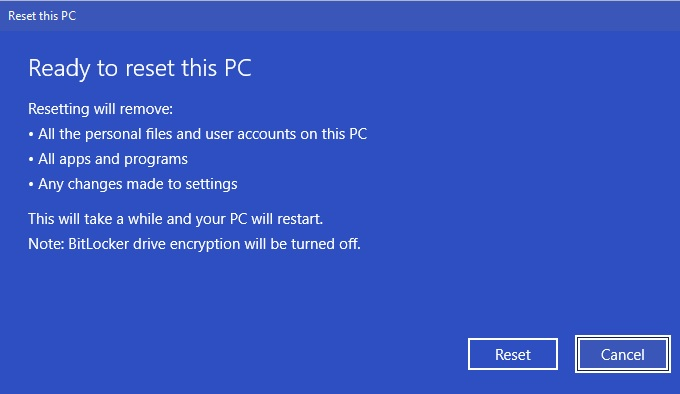
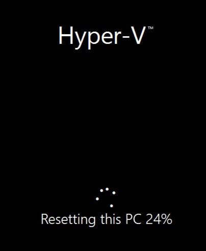
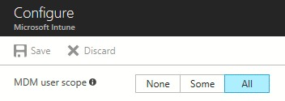
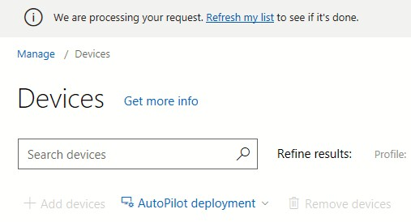
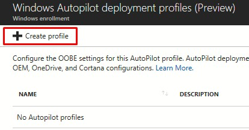
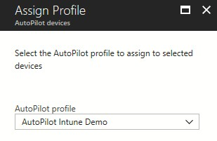
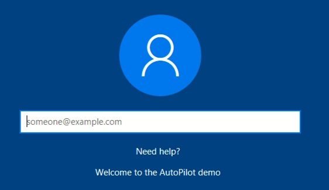

# Demonstrate Autopilot deployment on a VM

**Applies to**

-   Windows 10

In this topic you'll learn how to set-up a Windows Autopilot deployment for a virtual machine (VM) using Hyper-V. Note: Although there are [multiple platforms](administer.md) available to enable Autopilot, this lab primarily uses Intune.

See the following video for an overview of the process:

</br>
<iframe width="560" height="315" src="https://www.youtube-nocookie.com/embed/KYVptkpsOqs" frameborder="0" allow="autoplay; encrypted-media" allowfullscreen></iframe> 

>For a list of terms used in this guide, see the [Glossary](#glossary) section.

## Prerequisites

These are the things you'll need to complete this lab:
* Installation media for the latest version of Windows 10 Professional or Enterprise (ISO file)
    - A link is provided to download an [evaluation version of Windows 10 Enterprise](https://www.microsoft.com/evalcenter/evaluate-windows-10-enterprise).
* Internet access
    - If you are behind a firewall, see the detailed [networking requirements](windows-autopilot-requirements-network.md).
* Hyper-V or a physical device running Windows 10.
    - The guide assumes that you will use a Hyper-V VM. To use a physical device, skip the steps to install and configure Hyper-V.
* A Premium Intune account
    - This guide will describe how to obtain a free 30-day trial account.

## Create a virtual machine

First, we must enable Hyper-V on a Windows 10 or Windows Server (2012 R2 or later) device. If you already have Hyper-V enabled, skip to the [next step](#create-a-demo-vm). If you are not sure that your device supports Hyper-V, see [appendix A](#appendix-a-verify-support-for-hyper-v) below for details on verifying that Hyper-V can be successfully installed.

### Enable Hyper-V

Open a PowerShell prompt **as an administrator** and run the following:

```powershell
Enable-WindowsOptionalFeature -Online -FeatureName Microsoft-Hyper-V -All
```

You will be prompted to restart your device, so save all your work and restart it before you continue.

### Create a demo VM

Now that Hyper-V is enabled, proceed to create your Virtual Machine.

Open a PowerShell prompt **as an administrator** and run the following:
```powershell
New-VMSwitch -Name AutopilotExternal -NetAdapterName <Name of Network Adapter with internet access> -AllowManagementOS $true
New-VM -Name WindowsAutopilot -MemoryStartupBytes 2GB -BootDevice VHD -NewVHDPath .\VMs\WindowsAutopilot.vhdx -Path .\VMData -NewVHDSizeBytes 80GB -Generation 2 -Switch AutopilotExternal
Add-VMDvdDrive -Path <Path to Windows 10 ISO> -VMName WindowsAutopilot
Start-VM -VMName WindowsAutopilot
```

>[!IMPORTANT]
>Make sure to replace <*Name of Network Adapter with internet access*> and <*Path to Windows 10 ISO*> with the appropriate values.
>Additionally, note that all Virtual Machine related data will be created under the current path in your PowerShell prompt. Consider navigating into a new folder before running the above.

### Install Windows 10

Now that the Virtual Machine was created and started, open **Hyper-V Manager** and connect to the **WindowsAutopilot** Virtual Machine.
Make sure the Virtual Machine booted from the installation media you've provided and complete the Windows installation process.

Once the installation is complete, create a checkpoint. You will create multiple checkpoints throughout this process, which you can later use to go through the process again.

To create the checkpoint, open a PowerShell prompt **as an administrator** and run the following:
```powershell
Checkpoint-VM -Name WindowsAutopilot -SnapshotName "Finished Windows install"
```

## Capture your Virtual Machine's hardware ID

On the newly created Virtual Machine, open a PowerShell prompt **as an administrator** and run the following:
```powershell
md c:\HWID
Set-Location c:\HWID
Set-ExecutionPolicy Unrestricted
Install-Script -Name Get-WindowsAutopilotInfo
Get-WindowsAutopilotInfo.ps1 -OutputFile AutopilotHWID.csv
```

>[!NOTE]
>Accept all prompts while running the above cmdlets.

### Mount the Virtual Hard Drive (VHD)

To gain access to the AutopilotHWID.csv that contains the hardware ID, stop the Virtual Machine to unlock the Virtual Hard Drive. 

To do that, on your device (**not** on the Virtual Machine), open a PowerShell prompt **as an administrator** and run the following:
```powershell
Stop-VM -VMName WindowsAutopilot
```

Once the Virtual Machine has stopped, create a checkpoint:
```powershell
Checkpoint-VM -Name WindowsAutopilot -SnapshotName "HWID captured"
```

With the checkpoint created, continue to mount the VHD:
```powershell
Mount-VHD -path (Get-VMHardDiskDrive -VMName WindowsAutopilot).Path
```

Once mounted, navigate to the new drive and copy **AutopilotHWID.csv** to a location on your device.

Before you proceed, unmount the VHD to unlock it and start the Virtual Machine:
```powershell
Dismount-VHD -path (Get-VMHardDiskDrive -VMName WindowsAutopilot).Path
Start-VM -VMName WindowsAutopilot
```

## Reset Virtual Machine back to Out-Of-Box-Experience (OOBE)

With the hardware ID captured, prepare your Virtual Machine for Windows Autopilot deployment by resetting it back to OOBE.

On the Virtual Machine, go to **Settings > Update & Security > Recovery** and click on **Get started** under **Reset this PC**.
Select **Remove everything** and **Just remove my files**. Finally, click on **Reset**.



Resetting your Virtual Machine can take a while. Proceed to the next steps while your Virtual Machine is resetting.



## Configure company branding

>[!IMPORTANT]
>If you already have company branding configured in Azure Active Directory, you can skip this step.

Navigate to [Company branding in Azure Active Directory](https://portal.azure.com/#blade/Microsoft_AAD_IAM/ActiveDirectoryMenuBlade/LoginTenantBranding).

>[!IMPORTANT]
>Make sure to sign-in with a Global Administrator account.

Click on **Configure** and configure any type of company branding you'd like to see during the OOBE.


Once finished, click **Save**.

>[!NOTE]
>Changes to company branding can take up to 30 minutes to apply.


## Configure Microsoft Intune auto-enrollment

>[!IMPORTANT]
>If you already have MDM auto-enrollment configured in Azure Active Directory, you can skip this step.

Navigate to [Mobility (MDM and MAM) in Azure Active Directory](https://portal.azure.com/#blade/Microsoft_AAD_IAM/ActiveDirectoryMenuBlade/Mobility) and select **Microsoft Intune**.

For the purposes of this demo, select **All** under the **MDM user scope** and click **Save**.



## Register your Virtual Machine to your organization

Navigate to [Microsoft Store for Business device management](https://businessstore.microsoft.com/en-us/manage/devices). Click on **Add devices** and select the **AutopilotHWID.csv** you've saved earlier. A message will appear indicating your request is being processed. Wait a few moments before refreshing to see your Virtual Machine added.



## Create and assign a Windows Autopilot deployment profile

Navigate to [Windows enrollment in Microsoft Intune](https://portal.azure.com/#blade/Microsoft_Intune_Enrollment/OverviewBlade/windowsEnrollment).

Make sure to sync the device you've just registered, by clicking on **Devices** under **Windows Autopilot Deployment Program (Preview)** and selecting **Sync**. Wait a few moments before refreshing to see your Virtual Machine added.


### Create a Windows Autopilot deployment profile

Click on **Deployment profiles** under **Windows Autopilot Deployment Program (Preview)** and select **Create profile**.



In the **Create profile** blade, set the name to **Autopilot Intune Demo**, click on **Out-of-box experience (OOBE)** and configure the following:
| Setting name | Value |
|---|---|
|Privacy Settings|Hide|
|End user license agreement (EULA)|Hide|
|User account type|Standard|

Click on **Save** and **Create**.


### Assign a Windows Autopilot deployment profile

With the deployment profile created, go back to **Devices** under **Windows Autopilot Deployment Program (Preview)** and select your Virtual Machine. Click on **Assign profile** and in the **Assign Profile** blade select **Autopilot Intune Demo** under the **Autopilot profile**. Click on **Assign**.



Wait a few minutes for all changes to apply.

## See Windows Autopilot in action

By now, your Virtual Machine should be back to OOBE. Make sure to wait at least 30 minutes from the time you've [configured company branding](#configure-company-branding)
, otherwise those changes might not show up.

Once you select a language and a keyboard layout, your company branded sign-in screen should appear. Provide your Azure Active Directory credentials and you're all done.



Windows Autopilot will now take over to automatically join your Virtual Machine into Azure Active Directory and enroll it to Microsoft Intune. Use the checkpoints you've created to go through this process again with different settings.

## Appendix A: Verify support for Hyper-V

Starting with Windows 8, the host computer’s microprocessor must support second level address translation (SLAT) to install Hyper-V. See [Hyper-V: List of SLAT-Capable CPUs for Hosts](https://social.technet.microsoft.com/wiki/contents/articles/1401.hyper-v-list-of-slat-capable-cpus-for-hosts.aspx) for more information.

To verify your computer supports SLAT, open an administrator command prompt,  type **systeminfo**, press ENTER, scroll down, and review the section displayed at the bottom of the output, next to Hyper-V Requirements. See the following example:

<pre style="overflow-y: visible">
C:\>systeminfo

...
Hyper-V Requirements:      VM Monitor Mode Extensions: Yes
                           Virtualization Enabled In Firmware: Yes
                           Second Level Address Translation: Yes
                           Data Execution Prevention Available: Yes
</pre>

In this example, the computer supports SLAT and Hyper-V.

>If one or more requirements are evaluated as **No** then the computer does not support installing Hyper-V.  However, if only the virtualization setting is incompatible, you might be able to enable virtualization in the BIOS and change the **Virtualization Enabled In Firmware** setting from **No** to **Yes**. The location of this setting will depend on the manufacturer and BIOS version, but is typically found associated with the BIOS security settings.

You can also identify Hyper-V support using [tools](https://blogs.msdn.microsoft.com/taylorb/2008/06/19/hyper-v-will-my-computer-run-hyper-v-detecting-intel-vt-and-amd-v/) provided by the processor manufacturer, the [msinfo32](https://technet.microsoft.com/library/cc731397.aspx) tool, or you can download the [coreinfo](https://technet.microsoft.com/sysinternals/cc835722) utility and run it, as shown in the following example:

<pre style="overflow-y: visible">
C:\>coreinfo -v

Coreinfo v3.31 - Dump information on system CPU and memory topology
Copyright (C) 2008-2014 Mark Russinovich
Sysinternals - www.sysinternals.com

Intel(R) Core(TM) i7-2600 CPU @ 3.40GHz
Intel64 Family 6 Model 42 Stepping 7, GenuineIntel
Microcode signature: 0000001B
HYPERVISOR      -       Hypervisor is present
VMX             *       Supports Intel hardware-assisted virtualization
EPT             *       Supports Intel extended page tables (SLAT)
</pre>

Note: A 64-bit operating system is required to run Hyper-V.

## Glossary

<table border="1">
<tr><td>CSV</td><td>Comma Separated Values</td></tr>
<tr><td>MPC</td><td>Microsoft Partner Center</td></tr>
<tr><td>CSP</td><td>Cloud Solution Provider</td></tr>
<tr><td>MSfB</td><td>Microsoft Store for Business</td></tr>
<tr><td>AAD</td><td>Azure Active Directory</td></tr>
<tr><td>4K HH</td><td>4K Hardware Hash</td></tr>
<tr><td>CBR</td><td>Computer Build Report</td></tr>
<tr><td>EC</td><td>Enterprise Commerce (server)</td></tr>
<tr><td>DDS</td><td>Device Directory Service</td></tr>
<tr><td>OOBE</td><td>Out of the Box Experience</td></tr>
<tr><td>VM</td><td>Virtual Machine</td></tr>
</table>

	
	 
	 
	 
	 
	
	
	
	  
	 
	
