# Demonstrate Autopilot deployment on a VM

**Applies to**

-   Windows 10

In this topic you'll learn how to set-up a Windows Autopilot deployment for a virtual machine (VM) using Hyper-V. Note: Although there are [multiple platforms](administer.md) available to enable Autopilot, this lab primarily uses Intune.

See the following video for an overview of the process:

</br>
<iframe width="560" height="315" src="https://www.youtube-nocookie.com/embed/KYVptkpsOqs" frameborder="0" allow="autoplay; encrypted-media" allowfullscreen></iframe> 

>For a list of terms used in this guide, see the [Glossary](#glossary) section.

## Prerequisites

These are the things you'll need to complete this lab:
* Installation media for Windows 10 Professional or Enterprise (ISO file), version 1703 or later.
    - If you do not already have an ISO to use, a link is provided to download an [evaluation version of Windows 10 Enterprise](https://www.microsoft.com/evalcenter/evaluate-windows-10-enterprise).
* Internet access
    - If you are behind a firewall, see the detailed [networking requirements](windows-autopilot-requirements-network.md).
* Hyper-V or a physical device running Windows 10.
    - The guide assumes that you will use a Hyper-V VM. To use a physical device, skip the steps to install and configure Hyper-V.
* A Premium Intune account
    - This guide will describe how to obtain a free 30-day trial account that can be used to complete the lab.

## Create a virtual machine

First, we must enable Hyper-V on a computer running Windows 10 or Windows Server (2012 R2 or later) device. If you already have Hyper-V enabled, skip to the [create a demo VM](#create-a-demo-vm) step. If you are not sure that your device supports Hyper-V, or you have problems installing Hyper-V, see [appendix A](#appendix-a-verify-support-for-hyper-v) below for details on verifying that Hyper-V can be successfully installed.

### Enable Hyper-V

To enable Hyper-V, open an elevated Windows PowerShell prompt and run the following command:

```powershell
Enable-WindowsOptionalFeature -Online -FeatureName Microsoft-Hyper-V -All
```

This command works on all operating systems that support Hyper-V, but on Windows Server operating systems you must type an additional command to add the Hyper-V Windows PowerShell module and the Hyper-V Manager console. This command will also install Hyper-V if it isn't already installed, so if desired you can just type the following command on Windows Server instead of using the Enable-WindowsOptionalFeature command:

```powershell
Install-WindowsFeature -Name Hyper-V -IncludeManagementTools
```

When you are prompted to restart the computer, choose **Yes**. The computer might restart more than once. 

>Alternatively, you can install Hyper-V using the Control Panel in Windows under **Turn Windows features on or off** for a client operating system, or using Server Manager's **Add Roles and Features Wizard** on a server operating system, as shown below:

   

   

<P>If you choose to install Hyper-V using Server Manager, accept all default selections. Also be sure to install both items under **Role Administration Tools\Hyper-V Management Tools**.

After installation is complete, open Hyper-V Manager by typing **virtmgmt.msc** at an elevated command prompt, or by typing **Hyper-V** in the Start menu search box.

### Creating a demo VM

Now that Hyper-V is enabled, we need to create a VM running Windows 10. We can create the VM using the Hyper-V Manager console, but it is simpler to use Windows PowerShell. To use Windows Powershell we just need to know two things:

1. The location of the Windows 10 ISO file.
   - In the example, we assume the location is **c:\iso\win10-eval.iso**. 
2. The name of the network interface that connects to the Internet.
   - In the example, we use a Windows PowerShell command to determine this automatically. 

#### ISO file location

You can download an ISO file for an evaluation version of the latest release of Windows 10 Enterprise [here](https://www.microsoft.com/evalcenter/evaluate-windows-10-enterprise). 
- When asked to select a platform, choose **64 bit**. 

After you download this file, the name will be extremely long (ex: 17763.107.101029-1455.rs5_release_svc_refresh_CLIENTENTERPRISEEVAL_OEMRET_x64FRE_en-us.iso). 
- So that it is easier to type and remember, rename the file to **win10-eval.iso**. 
- Create a directory on your computer named **c:\iso** and move the **win10-eval.iso** file there, so the path to the file is **c:\iso\win10-eval.iso**.
- If you wish to use a different name and location for the file, you must modify the Windows PowerShell commands below to use your custom name and directory.

#### Network adapter name

The Get-NetAdaper cmdlet is used below to automatically find the network adapter that is most likely to be the one you use to connect to the Internet. You should test this command first by running the following at an elevated Windows PowerShell prompt:

```powershell
(Get-NetAdapter |?{$_.Status -eq "Up" -and !$_.Virtual}).Name
```

The output of this command should be the name of the network interface you use to connect to the Internet. Verify that this is the correct interface name. If it is not the correct interface name, you'll need to edit the first command below to use your network interface name. 

For example, if the command above displays Ethernet but you wish to use Ethernet2, then the first command below would be New-VMSwitch -Name AutopilotExternal -AllowManagementOS $true -NetAdapterName **Ethernet2**.

####  Create the demo VM

All VM data will be created under the current path in your PowerShell prompt. Consider navigating into a new folder before running the following commands.

>[!IMPORTANT]
>**VM switch**: a VM switch is how Hyper-V connects VMs to a network. <br>If you have previously enabled Hyper-V and your Internet-connected network interface is already bound to a VM switch, then the PowerShell commands below will fail. In this case, you can either delete the existing VM switch (so that the commands below can create one), or you can reuse this VM switch by skipping the first command below and either modifying the second command to replace the switch name **AutopilotExternal** with the name of your switch, or by renaming your existing switch to "AutopilotExternal."

```powershell
New-VMSwitch -Name AutopilotExternal -AllowManagementOS $true -NetAdapterName (Get-NetAdapter |?{$_.Status -eq "Up" -and !$_.Virtual}).Name 
New-VM -Name WindowsAutopilot -MemoryStartupBytes 2GB -BootDevice VHD -NewVHDPath .\VMs\WindowsAutopilot.vhdx -Path .\VMData -NewVHDSizeBytes 80GB -Generation 2 -Switch AutopilotExternal
Add-VMDvdDrive -Path c:\iso\win10-eval.iso -VMName WindowsAutopilot
Start-VM -VMName WindowsAutopilot
```

After entering these commands, connect to the VM that you just created and wait for a prompt to press a key and boot from the DVD.  

See the sample output below. In this sample, the VM is created under the **c:\autopilot** directory and the vmconnect.exe command is used (which is only available on Windows Server). If you installed Hyper-V on Windows 10, use Hyper-V Manager to connect to your VM.

<pre style="overflow-y: visible">
PS C:\autopilot> dir c:\iso


    Directory: C:\iso


Mode                LastWriteTime         Length Name
----                -------------         ------ ----
-a----        3/12/2019   2:46 PM     4627343360 win10-eval.iso

PS C:\autopilot> (Get-NetAdapter |?{$_.Status -eq "Up" -and !$_.Virtual}).Name
Ethernet
PS C:\autopilot> New-VMSwitch -Name AutopilotExternal -AllowManagementOS $true -NetAdapterName (Get-NetAdapter |?{$_.Status -eq "Up" -and !$_.Virtual}).Name

Name              SwitchType NetAdapterInterfaceDescription
----              ---------- ------------------------------
AutopilotExternal External   Intel(R) Ethernet Connection (2) I218-LM

PS C:\autopilot> New-VM -Name WindowsAutopilot -MemoryStartupBytes 2GB -BootDevice VHD -NewVHDPath .\VMs\WindowsAutopilot.vhdx -Path .\VMData -NewVHDSizeBytes 80GB -Generation 2 -Switch AutopilotExternal

Name             State CPUUsage(%) MemoryAssigned(M) Uptime   Status             Version
----             ----- ----------- ----------------- ------   ------             -------
WindowsAutopilot Off   0           0                 00:00:00 Operating normally 8.0

PS C:\autopilot> Add-VMDvdDrive -Path c:\iso\win10-eval.iso -VMName WindowsAutopilot
PS C:\autopilot> Start-VM -VMName WindowsAutopilot
PS C:\autopilot> vmconnect.exe localhost WindowsAutopilot
PS C:\autopilot> dir

    Directory: C:\autopilot

Mode                LastWriteTime         Length Name
----                -------------         ------ ----
d-----        3/12/2019   3:15 PM                VMData
d-----        3/12/2019   3:42 PM                VMs

PS C:\autopilot>
</pre>

### Install Windows 10

Ensure the VM booted from the installation ISO, click **Next** then click **Install now** and complete the Windows installation process. See the following examples:

   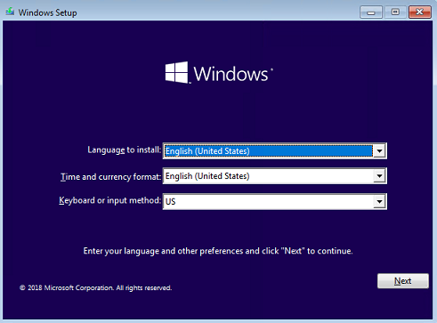
   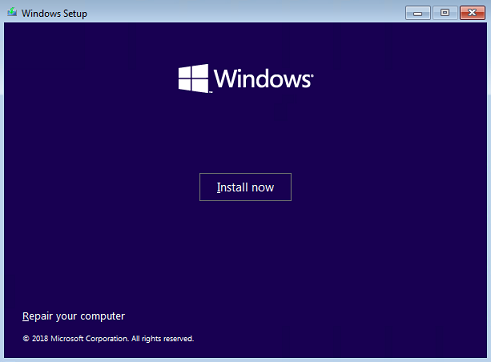
   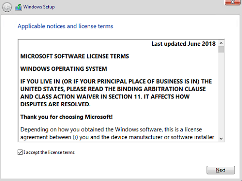
   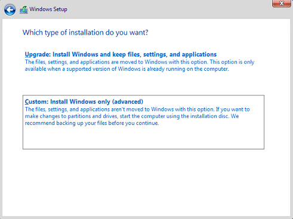
   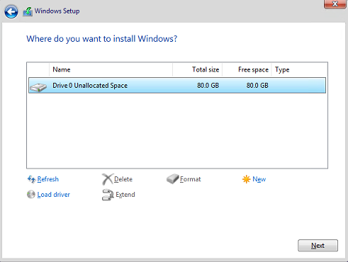
   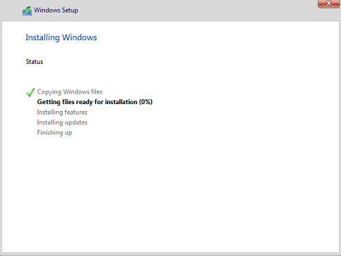

>After the VM restarts, during OOBE, it’s fine to select **Set up for personal use** or **Domain join instead** and then choose an offline account on the **Sign in** screen.  This will offer the fastest way to the desktop. For example:

   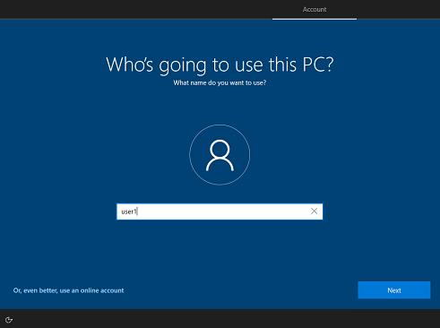 

Once the installation is complete, sign in and verify that you are at the Windows 10 desktop, then create your first Hyper-V checkpoint. Checkpoints are used to restore the VM to a previous state. You will create multiple checkpoints throughout this process, which can be used later to go through the process again.

   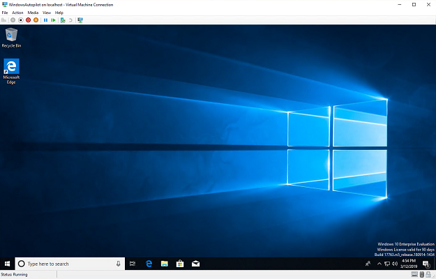 

To create your first checkpoint, open an elevated Windows PowerShell prompt on the computer running Hyper-V (not on the VM) and run the following:

```powershell
Checkpoint-VM -Name WindowsAutopilot -SnapshotName "Finished Windows install"
```

Click on the **WindowsAutopilot** VM in Hyper-V Manager and verify that you see **Finished Windows Install** listed in the Checkpoints pane.

## Capture your Virtual Machine's hardware ID

>NOTE: Normally, the Device ID is captured by the OEM as they run the OA3 Tool on each device in the factory.  The OEM then submits the 4K HH created by the OA3 Tool to Microsoft by submitting it with a Computer Build Report (CBR).  For purposes of this lab, you are acting as the OEM (capturing the 4K HH), but you’re not going to use the OA3 Tool to capture the full 4K HH for various reasons (you’d have to install the OA3 tool, your device couldn’t have a volume license version of Windows, it’s a more complicated process than using a PS script, etc.).  Instead, you’ll simulate running the OA3 tool by running a PowerShell script, which captures the device 4K HH just like the OA3 tool.

Follow these steps to run the PS script:

1.	Open an elevated Windows PowerShell prompt and run the following commands. These commands are the same regardless of whether you are using a VM or a physical device:

    ```powershell
    md c:\HWID
    Set-Location c:\HWID
    Set-ExecutionPolicy -Scope Process -ExecutionPolicy Unrestricted -Force
    Install-Script -Name Get-WindowsAutopilotInfo -Force
    $env:Path += ";C:\Program Files\WindowsPowerShell\Scripts"
    Get-WindowsAutopilotInfo.ps1 -OutputFile AutopilotHWID.csv
    ```

When you are prompted to install the NuGet package, choose **Yes**.

See the sample output below.

<pre>
PS C:\> md c:\HWID

    Directory: C:\

Mode                LastWriteTime         Length Name
----                -------------         ------ ----
d-----        3/14/2019  11:33 AM                HWID

PS C:\> Set-Location c:\HWID
PS C:\HWID> Set-ExecutionPolicy -Scope Process -ExecutionPolicy Unrestricted -Force
PS C:\HWID> Install-Script -Name Get-WindowsAutopilotInfo -Force

NuGet provider is required to continue
PowerShellGet requires NuGet provider version '2.8.5.201' or newer to interact with NuGet-based repositories. The NuGet
 provider must be available in 'C:\Program Files\PackageManagement\ProviderAssemblies' or
'C:\Users\user1\AppData\Local\PackageManagement\ProviderAssemblies'. You can also install the NuGet provider by running
 'Install-PackageProvider -Name NuGet -MinimumVersion 2.8.5.201 -Force'. Do you want PowerShellGet to install and
import the NuGet provider now?
[Y] Yes  [N] No  [S] Suspend  [?] Help (default is "Y"): Y
PS C:\HWID> $env:Path += ";C:\Program Files\WindowsPowerShell\Scripts"
PS C:\HWID> Get-WindowsAutopilotInfo.ps1 -OutputFile AutopilotHWID.csv
PS C:\HWID> dir

    Directory: C:\HWID

Mode                LastWriteTime         Length Name
----                -------------         ------ ----
-a----        3/14/2019  11:33 AM           8184 AutopilotHWID.csv

PS C:\HWID>
</pre>

Verify that there is an **AutopilotHWID.csv** file in the **c:\HWID** directory that is about 8 KB in size.  This file contains the device or VM’s complete 4K HH.  

>Note: Although the .csv extension might be associated with Microsoft Excel, you cannot view the file properly by double-clicking it. To correctly parse the comma delimiters and view the file in Excel, you must use the **Data** > **From Text/CSV** function in Excel to import the appropriate data columns. You don't need to view the file in Excel unless you are curious. The file format will be validated when it is imported into Autopilot.

You will need to upload this data into Intune to register your device for Autopilot, so it needs to be transferred to the computer you will use to access the Azure portal.  If you are using a physical device instead of a VM, you can copy the file to a USB stick.  If you’re using a VM, you can right-click the AutopilotHWID.csv file and copy it, then right-click and paste the file to your desktop (outside the VM). 

If you have trouble copying and pasting the file, just view the contents in Notepad on the VM and copy the text into Notepad outside the VM. Do not use another text editor to do this.

>[!NOTE]
>When copying and pasting to/from VMs, avoid doing other things with your mouse between copying and pasting as this can empty the clipboard and require that you start over. It is especially important that  you don't try to copy anything else before completing the paste operation.

## Reset Virtual Machine back to Out-Of-Box-Experience (OOBE)

With the hardware ID captured, prepare your Virtual Machine for Windows Autopilot deployment by resetting it back to OOBE.

On the Virtual Machine, go to **Settings > Update & Security > Recovery** and click on **Get started** under **Reset this PC**.
Select **Remove everything** and **Just remove my files**. Finally, click on **Reset**.


Resetting the VM or device can take a while. Proceed to the next step (verify subscription level) during the reset process.


## Verify subscription level

For this lab, you need an AAD Premium subscription.  You can tell if you have a Premium subscription by navigating to the [MDM enrollment configuration](https://portal.azure.com/#blade/Microsoft_AAD_IAM/ActiveDirectoryMenuBlade/Mobility) blade. See the following example:

**Azure Active Directory** > **Mobility (MDM and MAM)** > **Microsoft Intune**

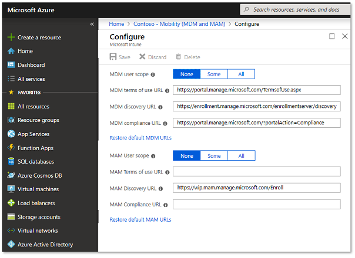

If the configuration blade shown above does not appear, it’s likely that you don’t have a **Premium** subscription.  Auto-enrollment is a feature only available in AAD Premium.  

To convert your Intune trial account to a free Premium trial account, navigate to **Azure Active Directory** > **Licenses** > **All products** > **Try / Buy** and select **Free trial** for Azure AD Premium, or EMS E5.

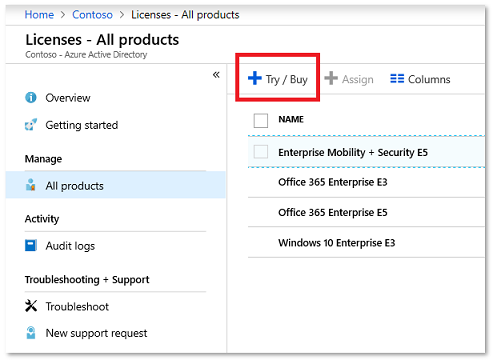

## Configure company branding

If you already have company branding configured in Azure Active Directory, you can skip this step.

>[!IMPORTANT]
>Make sure to sign-in with a Global Administrator account.

Navigate to [Company branding in Azure Active Directory](https://portal.azure.com/#blade/Microsoft_AAD_IAM/ActiveDirectoryMenuBlade/LoginTenantBranding), click on **Configure** and configure any type of company branding you'd like to see during the OOBE.

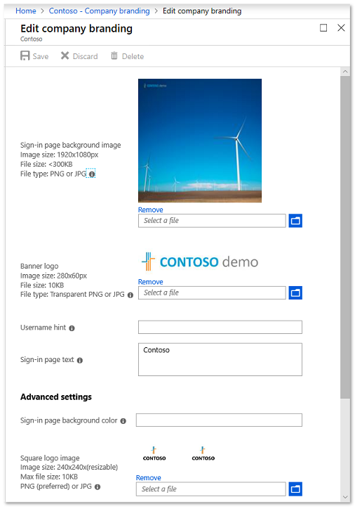

When you are finished, click **Save**.

>[!NOTE]
>Changes to company branding can take up to 30 minutes to apply.

## Configure Microsoft Intune auto-enrollment

If you already have MDM auto-enrollment configured in Azure Active Directory, you can skip this step.

Open [Mobility (MDM and MAM) in Azure Active Directory](https://portal.azure.com/#blade/Microsoft_AAD_IAM/ActiveDirectoryMenuBlade/Mobility) and select **Microsoft Intune**. If you do not see Microsoft Intune, click **Add application** and choose **Intune**.

For the purposes of this demo, select **All** under the **MDM user scope** and click **Save**.

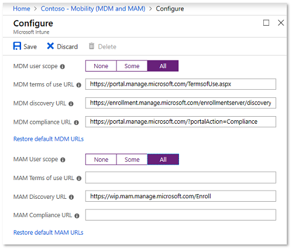

## Register your VM

Your VM (or device) can be registered either via Intune or Microsoft Store for Business (MSfB).  Both processes are shown here, but <u>only pick one</u> for purposes of this lab. We highly recommend using Intune rather than MSfB.

### Autopilot registration using Intune

1. In Intune in the Azure portal, choose **Device enrollment** > **Windows enrollment** > **Devices** > **Import**.

    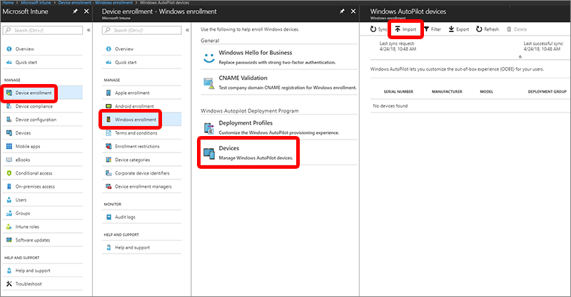

    >[!NOTE]
    >If menu items like **Windows enrollment** are not active for you, then look to the far-right blade in the UI.  You might need to provide Intune configuration privileges in a challenge window that appeared.

2. Under **Add Windows Autopilot devices** in the far right pane, browse to the **AutopilotHWID.csv** file you previously created and copied to your computer.  The file should contain the serial number and 4K HH of your VM (or device).  It’s okay if other fields (Windows Product ID) are left blank.

    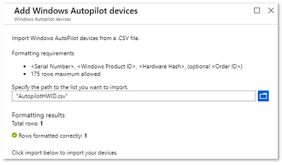

    You should receive confirmation that the file is formatted correctly before uploading it, as shown above.

3. Click **Import** and wait until the import process completes. This can take up to 15 minutes. 

4. Click **Sync** to sync the device you just registered. Wait a few moments before refreshing to verify your VM or device has been added. See the following example.

   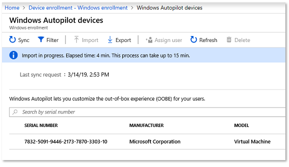

### Autopilot registration using MSfB

>[!IMPORTANT]
>If you've already registered your VM (or device) using Intune, then skip this step.

See the following video for an overview of the process:

> [!video https://www.youtube.com/embed/IpLIZU_j7Z0]

First, you need a MSfB account.  You may use the same one you created above for Intune, or follow [these instructions](https://docs.microsoft.com/en-us/microsoft-store/windows-store-for-business-overview) to create a new one.

Next, sign in to [Microsoft Store for Business](https://businessstore.microsoft.com/en-us/store) using your test account by clicking **Sign in** in the upper-right-corner of the main page.

Select **Manage** from the top menu, then click the **Windows Autopilot Deployment Program** link under the **Devices** card.

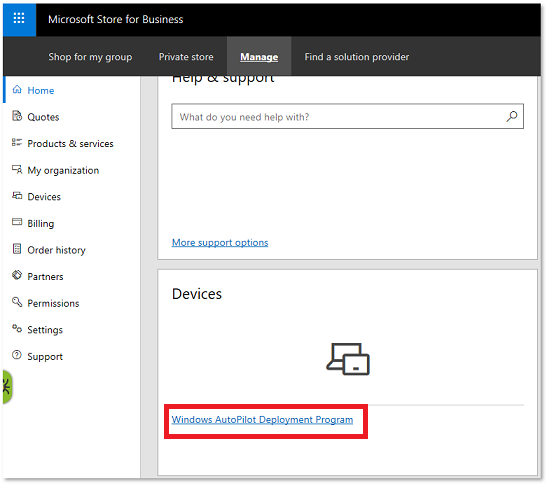

Click the **Add devices** link to upload your CSV file. A message will appear indicating your request is being processed. Wait a few moments before refreshing to see your new device has been added.


## Create and assign a Windows Autopilot deployment profile

>[!IMPORTANT]
>Autopilot profiles can be created and assigned to your registered VM or device either through Intune or MSfB.  Both processes are shown here, but only <U>pick one for purposes of this lab</U>:

   [Create profiles using Intune](#create-a-windows-autopilot-deployment-profile-using-intune) or [Create profiles using MSfB](#create-a-windows-autopilot-deployment-profile-using-msfb)

### Create a Windows Autopilot deployment profile using Intune

>[!NOTE]
>Even if you registered your device in MSfB, it will still appear in Intune, though you might have to **sync** and then **refresh** your device list first:

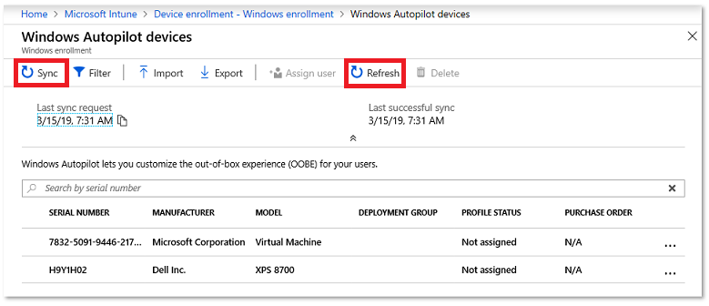

>The example above lists both a physical device and a VM. Your list should only include only one of these.

To create a Windows Autopilot profile, select **Device enrollment** > **Windows enrollment** > **Deployment profiles**

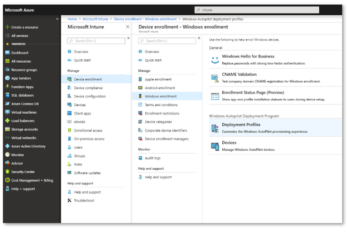

Click on **Create profile**.


On the **Create profile** blade, use the following values:

| Setting | Value |
|---|---|
| Name | Autopilot Lab profile |
| Description | blank |
| Convert all targeted devices to Autopilot | No |
| Deployment mode | User-driven |
| Join to Azure AD as | Azure AD joined |

Click on **Out-of-box experience (OOBE)** and configure the following settings:

| Setting | Value |
|---|---|
| EULA | Hide |
| Privacy Settings | Hide |
| Hide change account options | Hide |
| User account type | Standard |
| Apply device name template | No |

See the following example:

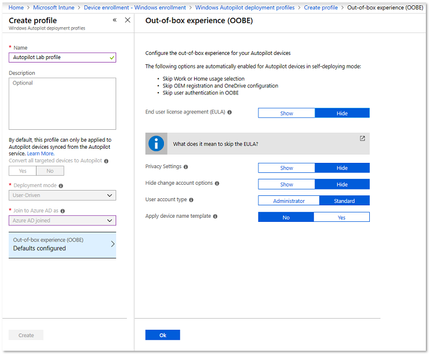

Click on **OK** and then click on **Create**.

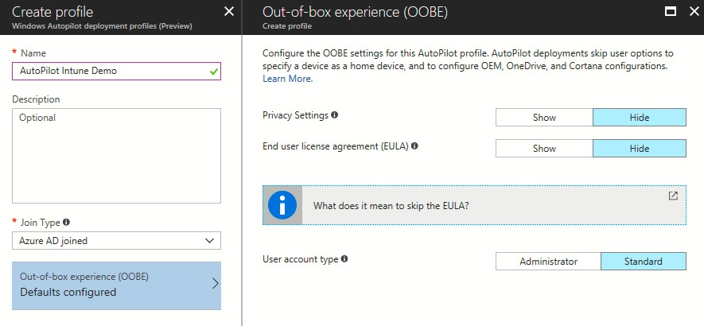

### Create a Windows Autopilot deployment profile using MSfB

Something here

### Assign a Windows Autopilot deployment profile

With the deployment profile created, go back to **Devices** under **Windows Autopilot Deployment Program (Preview)** and select your Virtual Machine. Click on **Assign profile** and in the **Assign Profile** blade select **Autopilot Intune Demo** under the **Autopilot profile**. Click on **Assign**.


Wait a few minutes for all changes to apply.

## See Windows Autopilot in action

By now, your Virtual Machine should be back to OOBE. Make sure to wait at least 30 minutes from the time you've [configured company branding](#configure-company-branding)
, otherwise those changes might not show up.

Once you select a language and a keyboard layout, your company branded sign-in screen should appear. Provide your Azure Active Directory credentials and you're all done.


Windows Autopilot will now take over to automatically join your Virtual Machine into Azure Active Directory and enroll it to Microsoft Intune. Use the checkpoints you've created to go through this process again with different settings.

## Appendix A: Verify support for Hyper-V

Starting with Windows 8, the host computer’s microprocessor must support second level address translation (SLAT) to install Hyper-V. See [Hyper-V: List of SLAT-Capable CPUs for Hosts](https://social.technet.microsoft.com/wiki/contents/articles/1401.hyper-v-list-of-slat-capable-cpus-for-hosts.aspx) for more information.

To verify your computer supports SLAT, open an administrator command prompt,  type **systeminfo**, press ENTER, scroll down, and review the section displayed at the bottom of the output, next to Hyper-V Requirements. See the following example:

<pre style="overflow-y: visible">
C:\>systeminfo

...
Hyper-V Requirements:      VM Monitor Mode Extensions: Yes
                           Virtualization Enabled In Firmware: Yes
                           Second Level Address Translation: Yes
                           Data Execution Prevention Available: Yes
</pre>

In this example, the computer supports SLAT and Hyper-V.

>If one or more requirements are evaluated as **No** then the computer does not support installing Hyper-V.  However, if only the virtualization setting is incompatible, you might be able to enable virtualization in the BIOS and change the **Virtualization Enabled In Firmware** setting from **No** to **Yes**. The location of this setting will depend on the manufacturer and BIOS version, but is typically found associated with the BIOS security settings.

You can also identify Hyper-V support using [tools](https://blogs.msdn.microsoft.com/taylorb/2008/06/19/hyper-v-will-my-computer-run-hyper-v-detecting-intel-vt-and-amd-v/) provided by the processor manufacturer, the [msinfo32](https://technet.microsoft.com/library/cc731397.aspx) tool, or you can download the [coreinfo](https://technet.microsoft.com/sysinternals/cc835722) utility and run it, as shown in the following example:

<pre style="overflow-y: visible">
C:\>coreinfo -v

Coreinfo v3.31 - Dump information on system CPU and memory topology
Copyright (C) 2008-2014 Mark Russinovich
Sysinternals - www.sysinternals.com

Intel(R) Core(TM) i7-2600 CPU @ 3.40GHz
Intel64 Family 6 Model 42 Stepping 7, GenuineIntel
Microcode signature: 0000001B
HYPERVISOR      -       Hypervisor is present
VMX             *       Supports Intel hardware-assisted virtualization
EPT             *       Supports Intel extended page tables (SLAT)
</pre>

Note: A 64-bit operating system is required to run Hyper-V.

## Glossary

<table border="1">
<tr><td>OEM</td><td>Original Equipment Manufacturer</td></tr>
<tr><td>CSV</td><td>Comma Separated Values</td></tr>
<tr><td>MPC</td><td>Microsoft Partner Center</td></tr>
<tr><td>CSP</td><td>Cloud Solution Provider</td></tr>
<tr><td>MSfB</td><td>Microsoft Store for Business</td></tr>
<tr><td>AAD</td><td>Azure Active Directory</td></tr>
<tr><td>4K HH</td><td>4K Hardware Hash</td></tr>
<tr><td>CBR</td><td>Computer Build Report</td></tr>
<tr><td>EC</td><td>Enterprise Commerce (server)</td></tr>
<tr><td>DDS</td><td>Device Directory Service</td></tr>
<tr><td>OOBE</td><td>Out of the Box Experience</td></tr>
<tr><td>VM</td><td>Virtual Machine</td></tr>
</table>

	
	 
	 
	 
	 
	
	
	
	  
	 
	
