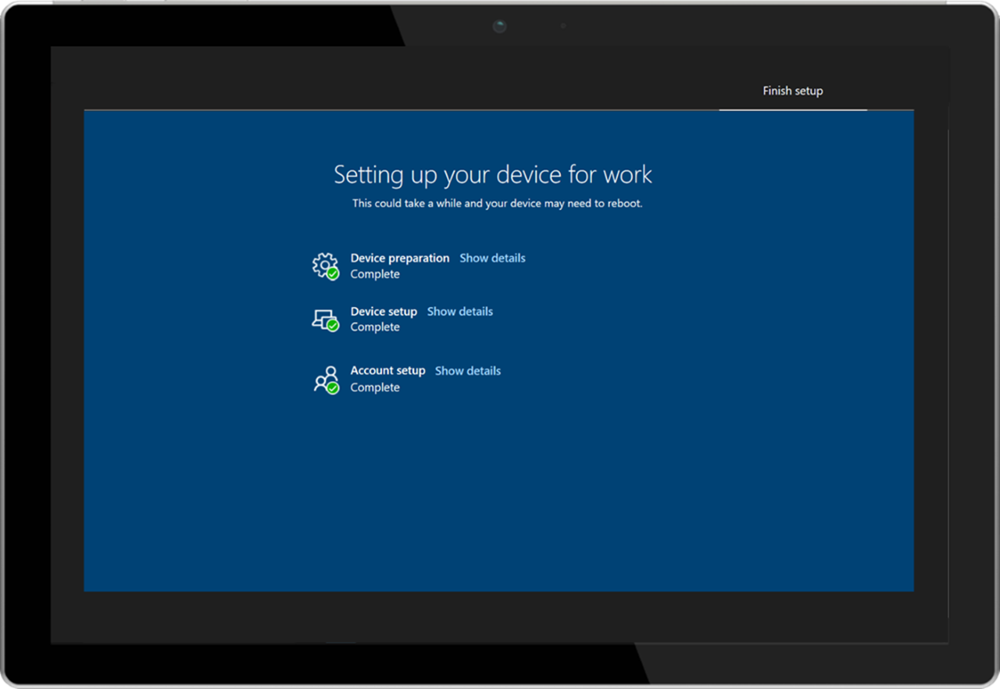
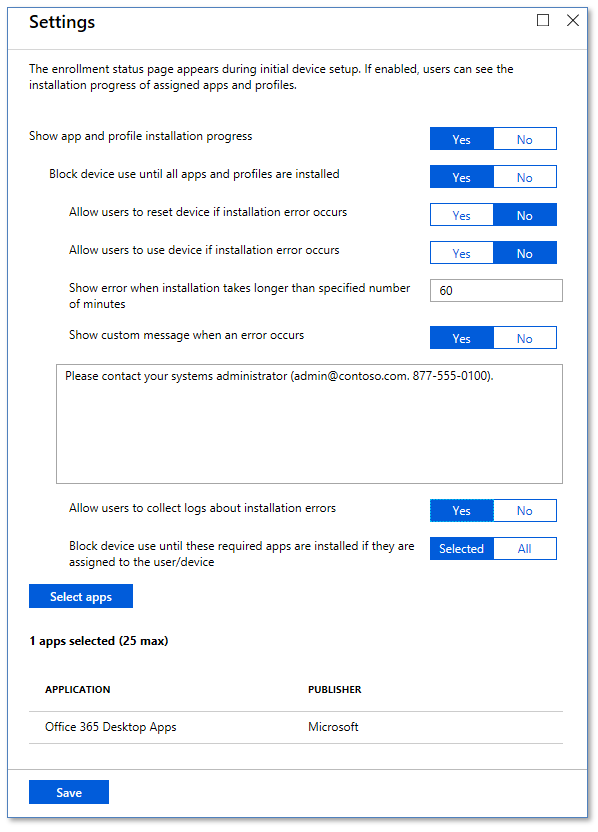

# Windows Autopilot Enrollment Status page

The Windows Autopilot Enrollment Status page displaying the status of the complete device configuration process.  Incorporating feedback from customers, this provides information to the user to show that the device is being set up and can be configured to prevent access to the desktop until the configuration is complete. 
 
 

## Available settings

 The following settings can be configured to customize behavior of the enrollment status page:

<table>
<th align=left>Setting<th align=left>Yes<th align=left>No
<tr><td>Show app and profile installation progress<td>The enrollment status page is displayed.<td>The enrollment status page is not displayed.
<tr><td>Block device use until all apps and profiles are installed<td>The settings in this table are made available to customize behavior of the enrollment status page, so that the user can address potential installation issues.
<td>The enrollment status page is displayed with no additional options to address installation failures.
<tr><td>Allow users to reset device if installation error occurs<td>A <b>Reset device</b> button is displayed if there is an installation failure.<td>The <b>Reset device</b> button is not displayed if there is an installation failure.
<tr><td>Allow users to use device if installation error occurs<td>A <b>Continue anyway</b> button is displayed if there is an installation failure.<td>The <b>Continue anyway</b> button is not displayed if there is an installation failure.
<tr><td>Show error when installation takes longer than specified number of minutes<td colspan=2>Specify the number of minutes to wait for installation to complete. A default value of 60 minutes is entered.
<tr><td>Show custom message when an error occurs<td>A text box is provided where you can specify a custom message to display in case of an installation error.<td>The default message is displayed:  <b>Oh no! Something didn't do what it was supposed to.  Please contact your IT department.<b>
<tr><td>Allow users to collect logs about installation errors<td>If there is an installation error, a <b>Collect logs</b> button is displayed.  If the user clicks this button they are asked to choose a location to save the log file <b>MDMDiagReport.cab</b><td>The <b>Collect logs</b> button is not displayed if there is an installation error.
</table>

See the following example:

 

## Installation progress tracking

The Enrollment Status page tracks a subset of the available MDM CSP policies that are delivered to the device as part of the complete device configuration process.  The specific types of policies that are tracked include:

- Certain types of app installations.
    - Enterprise modern apps (Appx/MSIX) installed by the [Enterprise Modern App Managment CSP](https://docs.microsoft.com/windows/client-management/mdm/enterprisemodernappmanagement-csp).
    - Enterprise desktop apps (single-file MSIs) installed by the [Enterprise Desktop App Management CSP](https://docs.microsoft.com/windows/client-management/mdm/enterprisedesktopappmanagement-csp).
- Certain device configuration policies.

Presently the following types of policies are not tracked:

- Intune Management Extensions PowerShell scripts.
- Office 365 ProPlus installations.
- System Center Configuration Manager apps, packages, and task sequences.

## For more information

For more information on configuring the Enrollment Status page, [see the Microsoft Intune documentation](https://docs.microsoft.com/intune/windows-enrollment-status).  For details about the underlying implementation, see the [FirstSyncStatus details in the DMClient CSP docuementation](https://docs.microsoft.com/windows/client-management/mdm/dmclient-csp).

