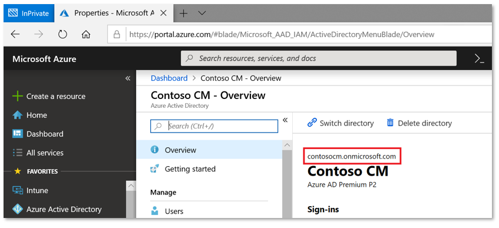
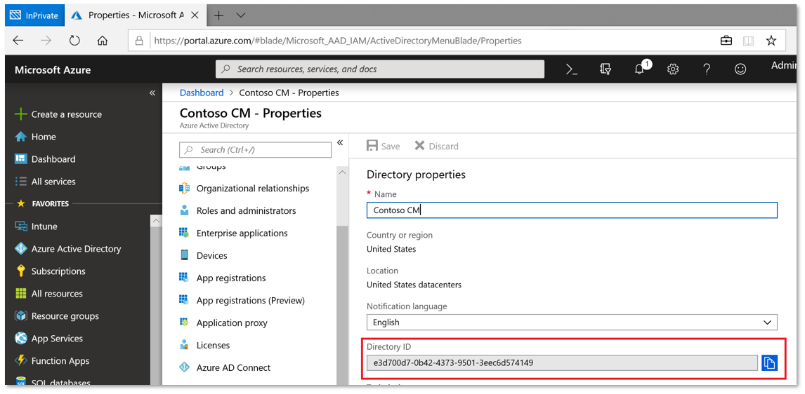
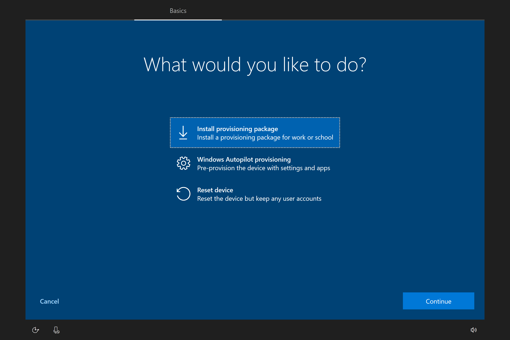

# Windows Autopilot for white glove deployment

**Applies to: Windows 10, version 1903**

Windows Autopilot enables organizations to easily provision new devices, leveraging the preinstalled OEM image and drivers resulting in a simple process that can be performed by the end user.

 

Windows Autopilot can also provide a "white glove" service enabling partners or IT staff to pre-provision a Windows 10 PC to be fully configured and business-ready​. With Windows Autopilot for white glove deployment, the provisioning process is split, with the time-consuming portions performed by IT, partners, or OEMs.  From the end user’s perspective, the process is exactly the same, just faster – the Windows Autopilot user-driven experience is unchanged.

 

Enabled with Microsoft Intune in Windows 10, version 1903 and later, white glove deployment capabilities build on top of existing Windows Autopilot [user-driven scenarios](user-driven.md), supporting the user-driven [Azure AD join](user-driven-aad.md) and [Hybrid Azure AD](user-driven-hybrid.md) join scenarios.

## Prerequisites

In addition to [Windows Autopilot requirements](windows-autopilot-requirements.md), Windows Autopilot for white glove deployment adds the following:

- Windows 10, version 1903 or later is required. Note: If you are a Windows Insider, Windows 10 build 18342 and above is required. The Insider Skip Ahead builds for the Windows 10 20H1 release with build numbers greater than 18800 may work, but 19H1 build numbers in the 18300 range are recommended.
- Microsoft Intune subscriptions with additional flighted features that are not yet available publicly.  Attempts to perform white glove deployment without these flighted features will fail with an Intune enrollment error.
- Physical devices that support TPM 2.0 and device attestation; virtual machines are not supported.  The white glove provisioning process leverages Windows Autopilot self-deploying capabilities, hence the TPM 2.0 requirements.
- Physical devices with Ethernet connectivity; Wi-fi connectivity is not supported due to the requirement to choose a language, locale, and keyboard to make that Wi-fi connection; doing that in a pre-provisioning process could prevent the user from choosing their own language, locale, and keyboard when they receive the device.

## Preparation

To be ready to try out Windows Autopilot for white glove deployment, ensure that you can first successfully use existing Windows Autopilot user-driven scenarios:

- User-driven Azure AD join.  Devices can be deployed using Windows Autopilot and joined to an Azure Active Directory tenant.
- User-driven with Hybrid Azure AD join.  Devices can be deployed using Windows Autopilot and joined to an on-premises Active Directory domain, then registered with Azure Active Directory to enable the Hybrid Azure AD join features.

If these scenarios cannot be completed, Windows Autopilot for white glove deployment will also not succeed since it builds on top of these scenarios.

To ensure that your Intune tenant has been flighted with the needed white glove deployment functionality, please provide your Azure AD tenant name and tenant ID to your Microsoft contact for the preview process.  The tenant name can be found from http://portal.microsoft.com, under **Azure Active Directory** and then **Overview**:

 

The tenant ID can be found under **Azure Active Directory** and then **Properties**. Click the icon next to the ID to copy to the clipboard.

 

>[!NOTE]
>Please use a non-critical tenant for this evaluation process.  If you do not currently have a non-critical tenant, you can create a new Azure Active Directory tenant and then add an EMS trial license to it. 

Two features will be enabled as part of the flighting process:

- Support for Windows Autopilot for white glove deployment.  
    - This will enable devices performing white glove deployment processes to enroll in Intune, and will expose a new Autopilot profile setting that enables white glove deployment for any devices that have been assigned that profile.
- Support for tracking Intune Management Extensions activities (Win32 apps, PowerShell scripts) in the Enrollment Status Page (ESP).  
    - This is needed to ensure that all Win32 apps are installed before the white glove deployment process completes.

Once the flighting is complete, you will be able to enable Windows Autopilot for white glove deployment in any Autopilot profile; all devices with that profile assigned will be able to leverage the white glove deployment process.

>[!TIP]
>To see the white glove deployment Autopilot profile setting, use this URL to access the Intune portal: https://portal.azure.com/?microsoft_intune_enrollment_enableWhiteGlove=true. This is a temporary requirement.

 

The Windows Autopilot for white glove deployment pre-provisioning process will apply all device-targeted policies from Intune.  That includes certificates, security templates, settings, apps, and more – anything targeting the device.  Additionally, any apps that are targeted to the user that has been pre-assigned to the Autopilot device will also be installed.  **Note**: other user-targeted policies will not apply until the user signs into the device.  To verify these behaviors, be sure to create appropriate apps and policies targeted to devices and users.

## Scenarios

Windows Autopilot for white glove deployment supports two distinct scenarios:
- User-driven deployments with Azure AD Join.  The device will be joined to an Azure AD tenant.
- User-driven deployments with Hybrid Azure AD Join.  The device will be joined to an on-premises Active Directory domain, and separately registered with Azure AD.
Each of these scenarios consists of two parts, a technician flow and a user flow.  At a high level, these parts are the same for Azure AD Join and Hybrid Azure AD join; differences are primarily seen by the end user in the authentication steps.

### Technican flow

The first part of the Windows Autopilot for white glove deployment process is designed to be carried out by a technician; this could be a member of the IT staff, a services partner, or an OEM – each organization can decide who should perform these activities.
Regardless of the scenario, the process to be performed by the technician is the same:
- Boot the device (running Windows 10 Pro, Enterprise, or Education SKUs, Insider Preview build 18342 or higher).
- From the first OOBE screen (which could be a language selection or locale selection screen), do not click **Next**.  Instead, press the Windows key five times to view an additional options dialog.  From that screen, choose the **Windows Autopilot provisioning** option and then click **Continue**.

 

- On the **Windows Autopilot Configuration** screen, information will be displayed about the device:
    - The Autopilot profile assigned to the device.
    - The organization name for the device.
    - The user assigned to the device (if there is one).
    - A QR code containing a unique identifier for the device, useful to look up the device in Intune to make any configuration changes needed (e.g. assigning a user, adding the device to any additional groups needed for app or policy targeting).
- Validate the information displayed.  If any changes are needed, make these and then click **Refresh** to re-download the updated Autopilot profile details.

 

- Click **Provision** to begin the provisioning process.
If the pre-provisioning process completes successfully:
- A green status screen will be displayed with information about the device, including the same details presented previously (e.g. Autopilot profile, organization name, assigned user, QR code), as well as the elapsed time for the pre-provisioning steps.
- Click **Reseal** to shut the device down.  At that point, the device can be shipped to the end user.
If the pre-provisioning process fails:
- A red status screen will be displayed with information about the device, including the same details presented previously (e.g. Autopilot profile, organization name, assigned user, QR code), as well as the elapsed time for the pre-provisioning steps.
- Diagnostic logs can be gathered from the device, and then it can be reset to start the process over again.

### User flow

If the pre-provisioning process completed successfully and the device was resealed, it can be delivered to the end user to complete the normal Windows Autopilot user-driven process.  They will perform a standard set of steps:

- Power on the device.
- Select the appropriate language, locale, and keyboard layout.
- Connect to a network (if using Wi-Fi).  If using Hybrid Azure AD Join, there must be connectivity to a domain controller; if using Azure AD Join, internet connectivity is required.
- On the branded sign-on screen, enter the user’s Azure Active Directory credentials.
- If using Hybrid Azure AD Join, the device will reboot; after the reboot, enter the user’s Active Directory credentials.
- Additional policies and apps will be delivered to the device, as tracked by the Enrollment Status Page (ESP).  Once complete, the user will be able to access the desktop.

## Fixed issues

Each Windows 10 19H1 Insider Preview build can contain additional fixes for Windows Autopilot and related functionality.  The following issues should already be addressed:
- Some failures may be displayed on the Enrollment Status Page, instead of advancing to the red "white glove" summary page.  This is fixed in build 10.0.18345.  (20355940)
- Connectivity to the corporate network is presently required during the Hybrid AAD Join technician flow, even though it is only used to check that an Active Directory domain controller is accessible.  This is fixed in build 10.0.18345.  (20301592)
- When enrolling a device in Intune during the technician flow, an enrollment error 80180003 is reported, indicating that white glove is not enabled.  This is fixed in Intune on March 8th, 2019.
- When editing the Autopilot profile to enable white glove deployment, the setting change is not saved properly.  This is fixed in Intune on March 12th, 2019.

## Known issues

### All scenarios

When installing Win32 apps via the Intune Management Extensions, the Enrollment Status Page may time out even though the apps are installed successfully.  In some cases, this may indicate that the detection rules for the app are not correct, but this may happen even with properly configured apps.  This  issue is currently under investigation.

### Hybrid Azure AD Join

The process of TPM attestation, joining the device to Active Directory, and enrolling in Intune happens when the **Provision** button is clicked from the initial **Windows Autopilot Configuration** screen.  Additional status is being added.  (20212277)

### Azure AD Join

There are currently no known issues specific to Azure AD Join.

## Questions and comments

Depending on your method of participation in the Windows Autopilot for white glove deployment process, your feedback mechanism may be different.

- If you are participating in the Windows TAP program, please provide feedback via the **Windows 10 TAP** Yammer group.
- If you are participating via MVP programs, please provide feedback via the MVP distribution list for your specialty.
- For others, please use the feedback links provided below or your specific Windows Autopilot team contact.
