# Windows 10 deployment scenarios and tools


To successfully deploy the Windows 10 operating system and applications for your organization, it is essential that you know about the available tools to help with the process. In this topic, you will learn about the most commonly used tools for Windows 10 deployment.

Microsoft provides many tools, services, and solutions. These tools include Windows Deployment Services (WDS), the Volume Activation Management Tool (VAMT), the User State Migration Tool (USMT), Windows System Image Manager (Windows SIM), Windows Preinstallation Environment (Windows PE), and Windows Recovery Environment (Windows RE). Keep in mind that these are just tools and not a complete solution on their own. It’s when you combine these tools with solutions like [Microsoft Deployment Toolkit (MDT)](deploy-windows-mdt/deploy-windows-10-with-the-microsoft-deployment-toolkit.md) or [Microsoft System Center 2012 R2 Configuration Manager](deploy-windows-sccm/deploy-windows-10-with-system-center-2012-r2-configuration-manager.md) that you get the complete deployment solution.

In this topic, you also learn about different types of reference images that you can build, and why reference images are beneficial for most organizations

## <a href="" id="sec06"></a>Windows Assessment and Deployment Kit


Windows ADK contains core assessment and deployment tools and technologies, including Deployment Image Servicing and Management (DISM), Windows Imaging and Configuration Designer (Windows ICD), Windows System Image Manager (Windows SIM), User State Migration Tool (USMT), Volume Activation Management Tool (VAMT), Windows Preinstallation Environment (Windows PE), Windows Assessment Services, Windows Performance Toolkit (WPT), Application Compatibility Toolkit (ACT), and Microsoft SQL Server 2012 Express. For more details, see [Windows ADK for Windows 10](https://go.microsoft.com/fwlink/p/?LinkId=526803  ) or [Windows ADK for Windows 10 scenarios for IT Pros](windows-adk-scenarios-for-it-pros.md).

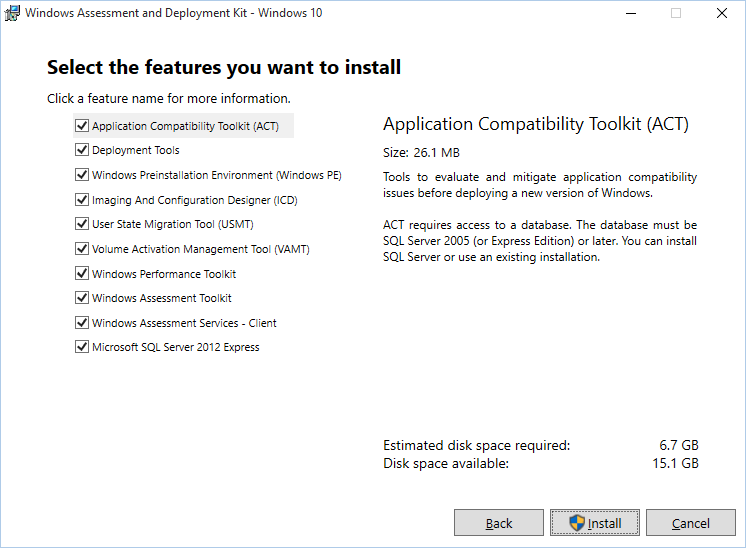

Figure 1. The Windows 10 ADK feature selection page.

### Deployment Image Servicing and Management (DISM)

DISM is one of the deployment tools included in the Windows ADK and is used for capturing, servicing, and deploying boot images and operating system images.

DISM services online and offline images. For example, with DISM you can install the Microsoft .NET Framework 3.5.1 in Windows 10 online, which means that you can start the installation in the running operating system, not that you get the software online. The /LimitAccess switch configures DISM to get the files only from a local source:

``` syntax
Dism.exe /Online /Enable-Feature /FeatureName:NetFX3 /All /Source:D:\Sources\SxS /LimitAccess
```

In Windows 10, you can use Windows PowerShell for many of the functions performed by DISM.exe. The equivalent command in Windows 10 using PowerShell is:

``` syntax
Enable-WindowsOptionalFeature -Online -FeatureName NetFx3 -All 
-Source D:\Sources\SxS -LimitAccess
```


Figure 2. Using DISM functions in PowerShell.

For more information on DISM, see [DISM technical reference](https://go.microsoft.com/fwlink/p/?LinkId=619161).

### User State Migration Tool (USMT)

USMT is a backup and restore tool that allows you to migrate user state, data, and settings from one installation to another. Microsoft Deployment Toolkit (MDT) and System Center 2012 R2 Configuration Manager use USMT as part of the operating system deployment process.

**Note**  
Occasionally, we find that customers are wary of USMT because they believe it requires significant configuration, but, as you will learn below, using USMT is not difficult. If you use MDT and Lite Touch to deploy your machines, the USMT feature is automatically configured and extended so that it is easy to use. With MDT, you do nothing at all and USMT just works.

 

USMT includes several command-line tools, the most important of which are ScanState and LoadState:

-   **ScanState.exe.** This performs the user-state backup.

-   **LoadState.exe.** This performs the user-state restore.

-   **UsmtUtils.exe.** This supplements the functionality in ScanState.exe and LoadState.exe.

In addition to these tools, there are also XML templates that manage which data is migrated. You can customize the templates, or create new ones, to manage the backup process at a high level of detail. USMT uses the following terms for its templates:

-   **Migration templates.** The default templates in USMT.

-   **Custom templates.** Custom templates that you create.

-   **Config template.** An optional template, called Config.xml, which you can use to exclude or include components in a migration without modifying the other standard XML templates.

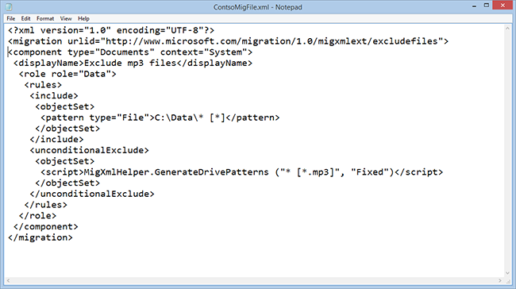

Figure 3. A sample USMT migration file that will exclude .MP3 files on all local drives and include the folder C:\\Data and all its files, including its subdirectories and their files.

USMT supports capturing data and settings from Windows Vista and later, and restoring the data and settings to Windows 7 and later (including Windows 10 in both cases). It also supports migrating from a 32-bit operating system to a 64-bit operating system, but not the other way around. For example, you can use USMT to migrate from Windows 7 x86 to Windows 10 x64.

By default USMT migrates many settings, most of which are related to the user profile but also to Control Panel configurations, file types, and more. The default templates that are used in Windows 10 deployments are MigUser.xml and MigApp.xml. These two default templates migrate the following data and settings:

-   Folders from each profile, including those from user profiles as well as shared and public profiles. For example, the My Documents, My Video, My Music, My Pictures, desktop files, Start menu, Quick Launch settings, and Favorites folders are migrated.

-   Specific file types. USMT templates migrate the following file types: .accdb, .ch3, .csv, .dif, .doc\*, .dot\*, .dqy, .iqy, .mcw, .mdb\*, .mpp, .one\*, .oqy, .or6, .pot\*, .ppa, .pps\*, .ppt\*, .pre, .pst, .pub, .qdf, .qel, .qph, .qsd, .rqy, .rtf, .scd, .sh3, .slk, .txt, .vl\*, .vsd, .wk\*, .wpd, .wps, .wq1, .wri, .xl\*, .xla, .xlb, .xls\*.

    **Note**  
    The OpenDocument extensions (\*.odt, \*.odp, \*.ods, etc.) that Microsoft Office applications can use are not migrated by default.

     

-   Operating system component settings

-   Application settings

These are the settings migrated by the default MigUser.xml and MigApp.xml templates. For more details on what USMT migrates, see [What does USMT migrate?](https://go.microsoft.com/fwlink/p/?LinkId=619227) For more information on the USMT overall, see the [USMT technical reference](https://go.microsoft.com/fwlink/p/?LinkId=619228).

### Windows Imaging and Configuration Designer

Windows Imaging and Configuration Designer (Windows ICD) is a tool designed to assist with the creation of provisioning packages that can be used to dynamically configure a Windows device (PCs, tablets, and phones). This is particularly useful for setting up new devices, without the need for re-imaging the device with a custom image.

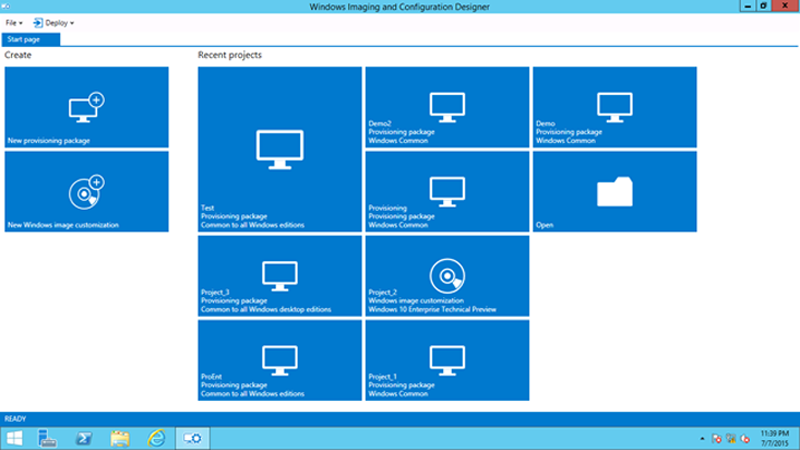

Figure 4. Windows Imaging and Configuration Designer.

For more information, see [Windows Imaging and Configuration Designer](https://go.microsoft.com/fwlink/p/?LinkID=525483).

### Windows System Image Manager (Windows SIM)

Windows SIM is an authoring tool for Unattend.xml files. When using MDT and/or Configuration Manager, you don’t need Windows SIM very often because those systems automatically update the Unattend.xml file during the deployment, greatly simplifying the process overall.


Figure 5. Windows answer file opened in Windows SIM.

For more information, see [Windows System Image Manager Technical Reference]( https://go.microsoft.com/fwlink/p/?LinkId=619906).

### Volume Activation Management Tool (VAMT)

If you don’t use KMS, you can still manage your MAKs centrally with the Volume Activation Management Tool (VAMT). With this tool, you can install and manage product keys throughout the organization. VAMT also can activate on behalf of clients without Internet access, acting as a MAK proxy.


Figure 6. The updated Volume Activation Management Tool.

VAMT also can be used to create reports, switch from MAK to KMS, manage Active Directory-based activation, and manage Office 2010 and Office 2013 volume activation. VAMT also supports PowerShell (instead of the old command-line tool). For example, if you want to get information from the VAMT database, you can type:

``` syntax
Get-VamtProduct
```

For more information on the VAMT, see [VAMT technical reference](https://go.microsoft.com/fwlink/p/?LinkId=619230).

### Windows Preinstallation Environment (Windows PE)

Windows PE is a “Lite” version of Windows 10 and was created to act as a deployment platform. Windows PE replaces the DOS or Linux boot disks that ruled the deployment solutions of the last decade.

The key thing to know about Windows PE is that, like the operating system, it needs drivers for at least network and storage devices in each PC. Luckily Windows PE includes the same drivers as the full Windows 10 operating system, which means much of your hardware will work out of the box.

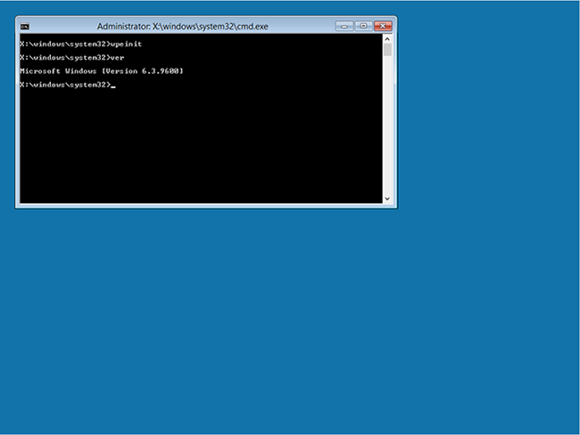

Figure 7. A machine booted with the Windows ADK default Windows PE boot image.

For more details on Windows PE, see [Windows PE (WinPE)](https://go.microsoft.com/fwlink/p/?LinkId=619233).

## <a href="" id="sec07"></a>Windows Recovery Environment


Windows Recovery Environment (Windows RE) is a diagnostics and recovery toolset included in Windows Vista and later operating systems. The latest version of Windows RE is based on Windows PE. You can also extend Windows RE and add your own tools if needed. If a Windows installation fails to start and Windows RE is installed, you will see an automatic failover into Windows RE.

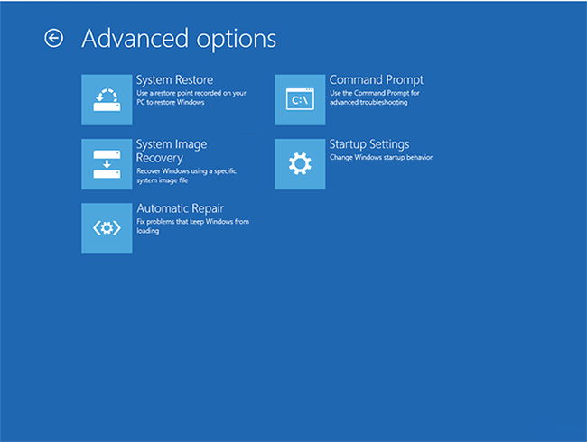

Figure 8. A Windows 10 client booted into Windows RE, showing Advanced options.

For more information on Windows RE, see [Windows Recovery Environment](https://go.microsoft.com/fwlink/p/?LinkId=619236).

## <a href="" id="sec08"></a>Windows Deployment Services


Windows Deployment Services (WDS) has been updated and improved in several ways starting with Windows 8. Remember that the two main functions you will use are the PXE boot support and multicast. Most of the changes are related to management and increased performance. In Windows Server 2012 R2, WDS also can be used for the Network Unlock feature in BitLocker.

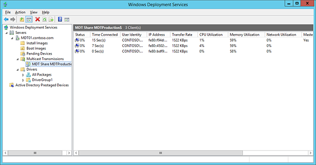

Figure 9. Windows Deployment Services using multicast to deploy three machines.

In Windows Server 2012 R2, [Windows Deployment Services](https://go.microsoft.com/fwlink/p/?LinkId=619245) can be configured for stand-alone mode or for Active Directory integration. In most scenarios, the Active Directory integration mode is the best option. WDS also has the capability to manage drivers; however, driver management through MDT and Configuration Manager is more suitable for deployment due to the flexibility offered by both solutions, so you will use them instead. In WDS, it is possible to pre-stage devices in Active Directory, but here, too, Configuration Manager has that capability built in, and MDT has the ability to use a SQL Server database for pre-staging. In most scenarios, those solutions are better than the built-in pre-staging function as they allow greater control and management.

### Trivial File Transfer Protocol (TFTP) configuration

In some cases, you need to modify TFTP Maximum Block Size settings for performance tuning reasons, especially when PXE traffic travels through routers and such. In the previous version of WDS, it was possible to change that, but the method of do so—editing the registry—was not user friendly. In Windows Server 2012, this has become much easier to do as it can be configured as a setting.

Also, there are a few new features related to TFTP performance:

-   **Scalable buffer management.** Allows buffering an entire file instead of a fixed-size buffer for each client, enabling different sessions to read from the same shared buffer.

-   **Scalable port management.** Provides the capability to service clients with shared UDP port allocation, increasing scalability.

-   **Variable-size transmission window (Variable Windows Extension).** Improves TFTP performance by allowing the client and server to determine the largest workable window size.

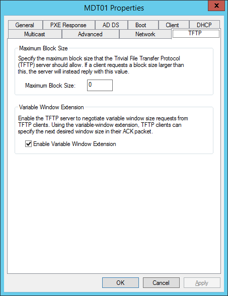

Figure 10. TFTP changes are now easy to perform.

## <a href="" id="sec09"></a>Microsoft Deployment Toolkit


MDT is a free deployment solution from Microsoft. It provides end-to-end guidance, best practices, and tools for planning, building, and deploying Windows operating systems. MDT builds on top of the core deployment tools in the Windows ADK by contributing guidance, reducing complexity, and adding critical features for an enterprise-ready deployment solution.

MDT has two main parts: the first is Lite Touch, which is a stand-alone deployment solution; the second is Zero Touch, which is an extension to System Center 2012 R2 Configuration Manager.

**Note**  
Lite Touch and Zero Touch are marketing names for the two solutions that MDT supports, and the naming has nothing to do with automation. You can fully automate the stand-alone MDT solution (Lite Touch), and you can configure the solution integration with Configuration Manager to prompt for information.

 

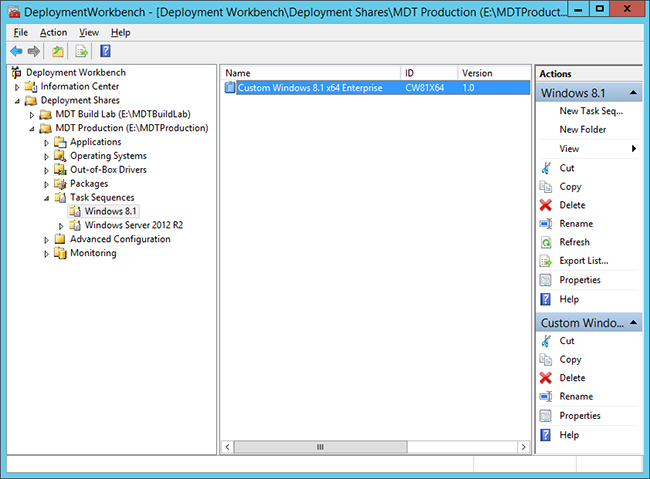

Figure 11. The Deployment Workbench in, showing a task sequence.

For more information on MDT, see the [Microsoft Deployment Toolkit](https://go.microsoft.com/fwlink/p/?LinkId=618117) resource center.

## <a href="" id="sec10"></a>Microsoft Security Compliance Manager 2013


[Microsoft SCM](https://go.microsoft.com/fwlink/p/?LinkId=619246) is a free utility used to create baseline security settings for the Windows client and server environment. The baselines can be exported and then deployed via Group Policy, local policies, MDT, or Configuration Manager. The current version of Security Compliance Manager includes baselines for Windows 8.1 and several earlier versions of Windows, Windows Server, and Internet Explorer.

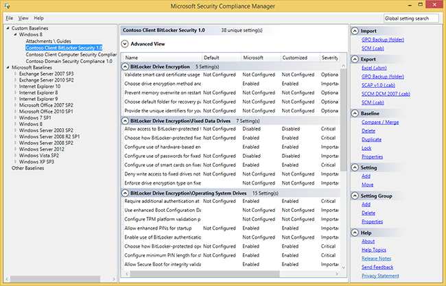

Figure 12. The SCM console showing a baseline configuration for a fictional client's computer security compliance.

## <a href="" id="sec11"></a>Microsoft Desktop Optimization Pack


MDOP is a suite of technologies available to Software Assurance customers through an additional subscription.

The following components are included in the MDOP suite:

-   **Microsoft Application Virtualization (App-V).** App-V 5.0 provides an integrated platform, more flexible virtualization, and powerful management for virtualized applications. With the release of App-V 5.0 SP3, you have support to run virtual applications on Windows 10.

-   **Microsoft User Experience Virtualization (UE-V).** UE-V monitors the changes that are made by users to application settings and Windows operating system settings. The user settings are captured and centralized to a settings storage location. These settings can then be applied to the different computers that are accessed by the user, including desktop computers, laptop computers, and virtual desktop infrastructure (VDI) sessions.

-   **Microsoft Advanced Group Policy Management (AGPM).** AGPM enables advanced management of Group Policy objects by providing change control, offline editing, and role-based delegation.

-   **Microsoft Diagnostics and Recovery Toolset (DaRT).** DaRT provides additional tools that extend Windows RE to help you troubleshoot and repair your machines.

-   **Microsoft BitLocker Administration and Monitoring (MBAM).** MBAM is an administrator interface used to manage BitLocker drive encryption. It allows you to configure your enterprise with the correct BitLocker encryption policy options, as well as monitor compliance with these policies.

For more information on the benefits of an MDOP subscription, see [Microsoft Desktop Optimization Pack](https://go.microsoft.com/fwlink/p/?LinkId=619247).

## <a href="" id="sec12"></a>Internet Explorer Administration Kit 11


There has been a version of IEAK for every version of Internet Explorer since 3.0. It gives you the capability to customize Internet Explorer as you would like. The end result of using IEAK is an Internet Explorer package that can be deployed unattended. The wizard creates one .exe file and one .msi file.

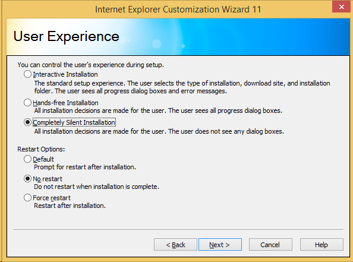

Figure 13. The User Experience selection screen in IEAK 11.

To download IEAK 11, see the [Internet Explorer Administration Kit (IEAK) Information and Downloads](https://go.microsoft.com/fwlink/p/?LinkId=619248) page.

## <a href="" id="sec13"></a>Windows Server Update Services


WSUS is a server role in Windows Server 2012 R2 that enables you to maintain a local repository of Microsoft updates and then distribute them to machines on your network. WSUS offers approval control and reporting of update status in your environment.

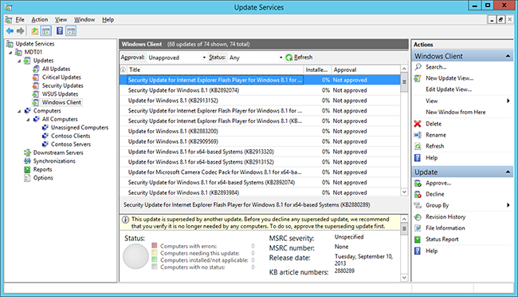

Figure 14. The Windows Server Update Services console.

For more information on WSUS, see the [Windows Server Update Services Overview](https://go.microsoft.com/fwlink/p/?LinkId=619249).

## <a href="" id="sec14"></a>Unified Extensible Firmware Interface


For many years BIOS has been the industry standard for booting a PC. BIOS has served us well, but it is time to replace it with something better. **UEFI** is the replacement for BIOS, so it is important to understand the differences between BIOS and UEFI. In this section, you learn the major differences between the two and how they affect operating system deployment.

### Introduction to UEFI

BIOS has been in use for approximately 30 years. Even though it clearly has proven to work, it has some limitations, including:

-   16-bit code

-   1 MB address space

-   Poor performance on ROM initialization

-   MBR maximum bootable disk size of 2.2 TB

As the replacement to BIOS, UEFI has many features that Windows can and will use.

With UEFI, you can benefit from:

-   **Support for large disks.** UEFI requires a GUID Partition Table (GPT) based disk, which means a limitation of roughly 16.8 million TB in disk size and more than 100 primary disks.

-   **Faster boot time.** UEFI does not use INT 13, and that improves boot time, especially when it comes to resuming from hibernate.

-   **Multicast deployment.** UEFI firmware can use multicast directly when it boots up. In WDS, MDT, and Configuration Manager scenarios, you need to first boot up a normal Windows PE in unicast and then switch into multicast. With UEFI, you can run multicast from the start.

-   **Compatibility with earlier BIOS.** Most of the UEFI implementations include a compatibility support module (CSM) that emulates BIOS.

-   **CPU-independent architecture.** Even if BIOS can run both 32- and 64-bit versions of firmware, all firmware device drivers on BIOS systems must also be 16-bit, and this affects performance. One of the reasons is the limitation in addressable memory, which is only 64 KB with BIOS.

-   **CPU-independent drivers.** On BIOS systems, PCI add-on cards must include a ROM that contains a separate driver for all supported CPU architectures. That is not needed for UEFI because UEFI has the ability to use EFI Byte Code (EBC) images, which allow for a processor-independent device driver environment.

-   **Flexible pre-operating system environment.** UEFI can perform many functions for you. You just need an UEFI application, and you can perform diagnostics and automatic repairs, and call home to report errors.

-   **Secure boot.** Windows 8 and later can use the UEFI firmware validation process, called secure boot, which is defined in UEFI 2.3.1. Using this process, you can ensure that UEFI launches only a verified operating system loader and that malware cannot switch the boot loader.

### Versions

UEFI Version 2.3.1B is the version required for Windows 8 and later logo compliance. Later versions have been released to address issues; a small number of machines may need to upgrade their firmware to fully support the UEFI implementation in Windows 8 and later.

### Hardware support for UEFI

In regard to UEFI, hardware is divided into four device classes:

-   **Class 0 devices.** This is the UEFI definition for a BIOS, or non-UEFI, device.

-   **Class 1 devices.** These devices behave like a standard BIOS machine, but they run EFI internally. They should be treated as normal BIOS-based machines. Class 1 devices use a CSM to emulate BIOS. These older devices are no longer manufactured.

-   **Class 2 devices.** These devices have the capability to behave as a BIOS- or a UEFI-based machine, and the boot process or the configuration in the firmware/BIOS determines the mode. Class 2 devices use a CSM to emulate BIOS. These are the most common type of devices currently available.

-   **Class 3 devices.** These are UEFI-only devices, which means you must run an operating system that supports only UEFI. Those operating systems include Windows 8, Windows 8.1, Windows Server 2012, and Windows Server 2012 R2. Windows 7 is not supported on these class 3 devices. Class 3 devices do not have a CSM to emulate BIOS.

### Windows support for UEFI

Microsoft started with support for EFI 1.10 on servers and then added support for UEFI on both clients and servers.

With UEFI 2.3.1, there are both x86 and x64 versions of UEFI. Windows 10 supports both. However, UEFI does not support cross-platform boot. This means that a computer that has UEFI x64 can run only a 64-bit operating system, and a computer that has UEFI x86 can run only a 32-bit operating system.

### How UEFI is changing operating system deployment

There are many things that affect operating system deployment as soon as you run on UEFI/EFI-based hardware. Here are considerations to keep in mind when working with UEFI devices:

-   Switching from BIOS to UEFI in the hardware is easy, but you also need to reinstall the operating system because you need to switch from MBR/NTFS to GPT/FAT32 and NTFS.

-   When you deploy to a Class 2 device, make sure the boot option you select matches the setting you want to have. It is common for old machines to have several boot options for BIOS but only a few for UEFI, or vice versa.

-   When deploying from media, remember the media has to be FAT32 for UEFI, and FAT32 has a file-size limitation of 4GB.

-   UEFI does not support cross-platform booting; therefore, you need to have the correct boot media (32- or 64-bit).

For more information on UEFI, see the [UEFI firmware](https://go.microsoft.com/fwlink/p/?LinkId=619251) overview and related resources.

## Related topics


[Deploy Windows To Go](deploy-windows-to-go.md)

[Sideload apps in Windows 10](/windows/application-management/sideload-apps-in-windows-10)

[Windows ADK for Windows 10 scenarios for IT pros](windows-adk-scenarios-for-it-pros.md)

 

 


