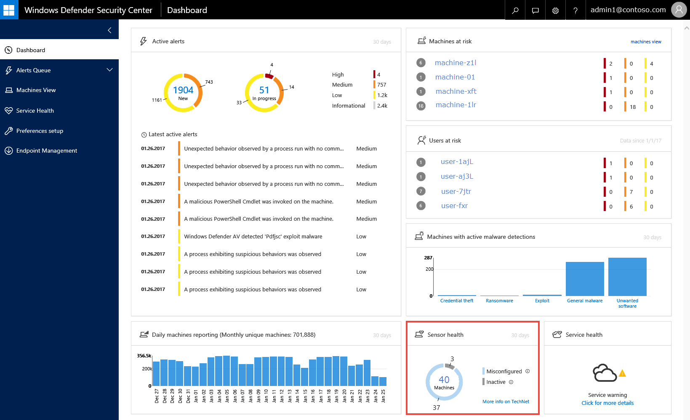
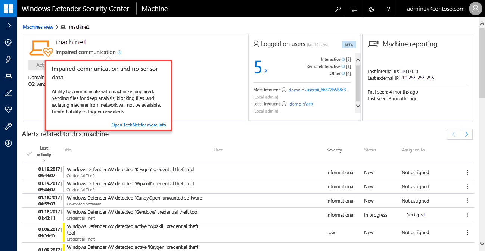

# Check sensor health state in Windows Defender ATP

**Applies to:**

- Windows 10 Enterprise
- Windows 10 Education
- Windows 10 Pro
- Windows 10 Pro Education
- Windows Defender Advanced Threat Protection (Windows Defender ATP)

The sensor health tile provides information on the individual endpoint’s ability to provide sensor data and communicate with the Windows Defender ATP service. It reports how many machines require attention and helps you identify problematic machines and take action to correct known issues.

There are two status indicators on the tile that provide information on the number of machines that are not reporting properly to the service:
-	**Inactive** - Machines that have stopped reporting to the Windows Defender ATP service for more than seven days in the past month.
- **Misconfigured** - These machines might partially be reporting sensor data to the Windows Defender ATP service and might have configuration errors that need to be corrected.

Clicking any of the groups directs you to Machines view, filtered according to your choice.

You can filter the health state list by the following status:
- **Active** - Machines that are actively reporting to the Windows Defender ATP service.
- **Inactive** - Machines that have stopped reporting to the Windows Defender ATP service.
- **Misconfigured** - These machines might partially be reporting sensor data to the Windows Defender ATP service but have configuration errors that need to be corrected. Misconfigured machines can have either one or a combination of the following issues:
  - **No sensor data** - Machines has stopped sending sensor data. Limited alerts can be triggered from the machine.
  - **Impaired communication** - Ability to communicate with machine is impaired. Sending files for deep analysis, blocking files, isolating machine from network and other actions that require communication with the machine may not work.

You can view the machine details when you click on a misconfigured or inactive machine. You’ll see more specific machine information when you click the information icon.

In the **Machines view**, you can download a full list of all the machines in your organization in a CSV format. To download, click the **Manage Alert** menu icon on the top corner of the page.

>[!NOTE]
>Export the list in CSV format to display the unfiltered data. The CSV file will include all machines in the organization, regardless of any filtering applied in the view itself and can take a significant amount of time to download, depending on how large your organization is.

## Related topic
- [Fix unhealthy sensors in Windows Defender ATP](fix-unhealhty-sensors-windows-defender-advanced-threat-protection.md)
