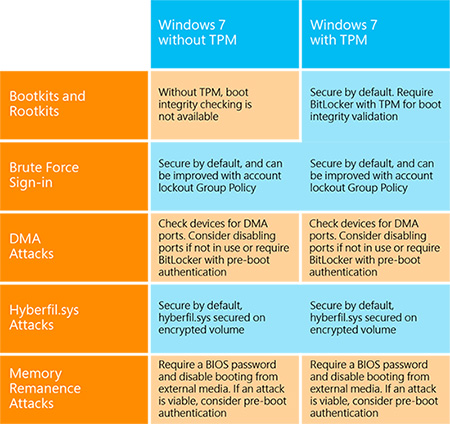
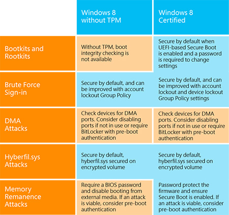
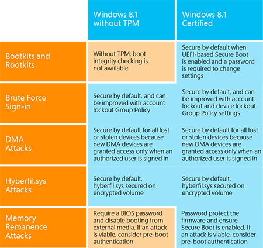

# Choose the right BitLocker countermeasure
**Applies to**
-   Windows 10
This section outlines the best countermeasures you can use to protect your organization from bootkits and rootkits, brute force sign-in, Direct Memory Access (DMA) attacks, Hyberfil.sys attacks, and memory remanence attacks.
You can use BitLocker to protect your Windows 10 PCs. Whichever operating system you’re using, Microsoft and Windows-certified devices provide countermeasures to address attacks and improve your data security. In most cases, this protection can be implemented without the need for pre-boot authentication.
Figures 2, 3, and 4 summarize the recommended mitigations for different types of attacks against PCs running recent versions of Windows. The orange blocks indicate that the system requires additional configuration from the default settings.

**Figure 2.** How to choose the best countermeasures for Windows 7

**Figure 3.** How to choose the best countermeasures for Windows 8

**Figure 4.** How to choose the best countermeasures for Windows 8.1
The latest InstantGo devices, primarily tablets, are designed to be secure by default against all attacks that might compromise the BitLocker encryption key. Other Windows devices can be, too. DMA port–based attacks, which represent the attack vector of choice, are not possible on InstantGo devices, because these port types are prohibited. The inclusion of DMA ports on even non-InstantGo devices is extremely rare on recent devices, particularly on mobile ones. This could change if Thunderbolt is broadly adopted, so IT should consider this when purchasing new devices. In any case DMA ports can be disabled entirely, which is an increasingly popular option because the use of DMA ports is infrequent in the non-developer space.
Memory remanence attacks can be mitigated with proper configuration; in cases where the system memory is fixed and non-removable, they are not possible using published techniques. Even in cases where system memory can be removed and loaded into another device, attackers will find the attack vector extremely unreliable, as has been shown in the DRDC Valcartier group’s analysis (see [An In-depth Analysis of the Cold Boot Attack](http://www.dtic.mil/cgi-bin/GetTRDoc?AD=ADA545078)).
Windows 7 PCs share the same security risks as newer devices but are far more vulnerable to DMA and memory remanence attacks, because Windows 7 devices are more likely to include DMA ports, lack support for UEFI-based Secure Boot, and rarely have fixed memory. To eliminate the need for pre-boot authentication on Windows 7 devices, disable the ability to boot to external media, password-protect the BIOS configuration, and disable the DMA ports. If you believe that your devices may be a target of a memory remanence attack, where the system memory may be removed and put into another computer to gain access to its contents, consider testing your devices to determine whether they are susceptible to this type of attack.
In the end, many customers will find that pre-boot authentication improves security only for a shrinking subset of devices within their organization. Microsoft recommends a careful examination of the attack vectors and mitigations outlined in this document along with an evaluation of your devices before choosing to implement pre-boot authentication, which may not enhance the security of your devices and instead will only compromise the user experience and add to support costs.
## See also
-   [Types of attacks for volume encryption keys](types-of-attacks-for-volume-encryption-keys.md)
-   [BitLocker Countermeasures](bitlocker-countermeasures.md)
-   [Protect BitLocker from pre-boot attacks](protect-bitlocker-from-pre-boot-attacks.md)
-   [BitLocker overview](bitlocker-overview.md)
 
 
