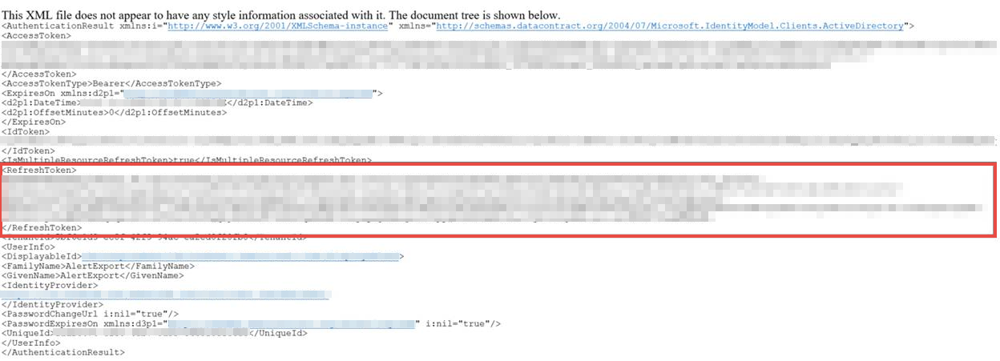

# Configure an Azure Active Directory application for SIEM integration

**Applies to:**

- Azure Active Directory
- Windows 10 Enterprise
- Windows 10 Education
- Windows 10 Pro
- Windows 10 Pro Education
- Windows Defender Advanced Threat Protection (Windows Defender ATP)

You need to add an application in your Azure Active Directory (AAD) tenant then authorize the Windows Defender ATP Alerts Export application  to communicate with it so that your security information and events management (SIEM) tool can consume alerts from Windows Defender ATP portal.

1. Login to the [Azure management portal](https://ms.portal.azure.com).
  >!NOTE:
  >Use your Azure credentials not the Windows Defender Advanced Threat protection portal credentials.

2. Select **Active Directory**.

3. Select your tenant.

4. Click **Applications**, then select **Add** to create a new application.

5. Click **Add an application my organization is developing**.

6. Choose a client name for the application, for example, *Alert Export Client*.

7. Select **WEB APPLICATION AND/OR WEB API** in the Type section.

8. Assign a sign-on URL and app ID URI to the application, for example, `https://alertexportclient`.

9. Confirm the request details and verify that you have successfully added the app.

10. Select the application you've just created from the directory application list and click the **Configure** tab.

11. Scroll down to the **keys** section and select a duration for the application key.

12. Type the following URLs in the **Reply URL** field:

  - `https://DataAccess-PRD.trafficmanager.net:444/api/FetchAccessTokenFromAuthCode`
  - `https://localhost:44300/WDATPconnector`

13. Click **Save** and copy the key in a safe place. You'll need this key to authenticate the client application on Azure Active Directory.

14. Open a web browser and connect to the following URL: `https://DataAccess-PRD.trafficmanager.net:444/api/FetchToken?clientId=f7c1acd8-0458-48a0-a662-dba6de049d1c&tenantId=<tenant ID>&clientSecret=1234` 

  An Azure login page appears.
  > [!NOTE]
  > - Replace *tenant ID* with your actual tenant ID.  
  > - Keep the *clientSecret* as is. This is a dummy value, but the parameter must appear.

15. Sign in with the credentials of a user from your tenant.

16. Click **Accept** to provide consent. Ignore the error.

17. Click **Application configuration** under your tenant.

18. Click **Permissions to other applications**, then select **Add application**.

19. Click **All apps** from the **SHOW** field and submit.

20. Click **WDATPAlertExport**, then select **+** to add the application. You should see it on the **SELECTED** panel.

21. Submit your changes.

22. On the **WDATPAlertExport** record, in the **Delegated Permissions** field, select **Access WDATPAlertExport**.

23. Save the application changes.

After configuring the application in AAD, you'll need to obtain a refresh token to be used when you configure the connector for your SIEM tool in the next steps. The token lets the connector access Windows Defender ATP events to be consumed by your SIEM.

## Obtain a refresh token
This section provides information on how you can use an events URL to obtain a refresh token. Obtain a refresh token used to retrieve the Windows Defender Advanced Threat Protection events to your SIEM.
>[!NOTE]
>For HP ArcSight, you can obtain a refresh token using the restutil tool.

### Before you begin
Get the following information from your Azure Active Directory (AAD) application by selecting the **View Endpoint** on the application configuration page:

    - OAuth 2 Client ID
    - OAuth 2 Client secret

You'll use these values to obtain a refresh token.

>[!IMPORTANT]
>Before using the OAuth 2 Client secret described in the next steps, you **must** encode it. Use a URL encoder to transform the OAuth 2 client secret.

### Obtain a refresh token    
1. Open a web browser and connect to the following URL: `https://DataAccess-PRD.trafficmanager.net:444/api/FetchToken?clientId=<client ID>&tenantId=<tenant ID>&clientSecret=<client secret>`

  >[!NOTE]
  >- Replace the *client ID* value with the one you got from your AAD application.
  >- Replace *tenant ID* with your actual tenant ID.
  >- Replace *client secret* with your encoded client secret. The client secret **must** be pasted encoded.

2. Click **Accept**. When you authenticate, a web page opens with your refresh token.

  

3.  Save the refresh token value in a safe place. You'll need this value when configuring your SIEM tool.

After configuring your AAD application and generating a refresh token, you can proceed to configure your SIEM tool.

## Related topics
- [Configure security information and events management (SIEM) tools to consume alerts](configure-siem-windows-defender-advanced-threat-protection.md)
- [Configure Splunk to consume alerts](configure-splunk-windows-defender-advanced-threat-protection.md)
- [Configure HP ArcSight to consume alerts](configure-arcsight-windows-defender-advanced-threat-protection.md)
