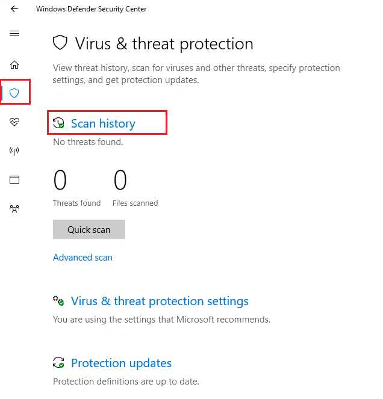
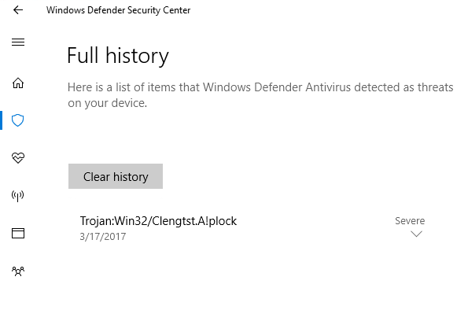

# Configure and validate network connections for Windows Defender Antivirus


**Applies to:**

- Windows 10, version 1703

**Audience**

- Enterprise security administrators


To ensure Windows Defender Antivirus cloud-delivered protection works properly, you need to configure your network to allow connections between your endpoints and certain Microsoft servers.

This topic lists the connections that must be allowed, including firewall rules, and provides instructions for validating your connection. This will help ensure you receive the best protection from our cloud-delivered protection services.

See the Enterprise Mobility and Security blog post [Important changes to Microsoft Active Protection Services endpoint](https://blogs.technet.microsoft.com/enterprisemobility/2016/05/31/important-changes-to-microsoft-active-protection-service-maps-endpoint/) for some details about network connectivity.

## Allow connections to the Windows Defender Antivirus cloud

The Windows Defender Antivirus cloud provides fast, strong protection for your endpoints. Enabling the cloud-delivered protection service is optional, however it is highly recommend as it provides very important protection against malware on your endpoints and across your network.

>[!NOTE] 
>The Windows Defender Antivirus cloud service is a mechanism for delivering updated protection to your network and endpoints. Although it is called a cloud service, it is not simply protection for files stored in the cloud, rather it uses distributed resources and machine learning to deliver protection to your endpoints at a rate that is far faster than traditional signature updates.

See the [Enable cloud-delivered protection](enable-cloud-protection-windows-defender-antivirus.md) topic for details on enabling the service with Group Policy, System Center Configuration Manager, PowerShell cmdlets, Microsoft Intune, or on individual clients in the Windows Defender Security Center app.

After you've enabled the service, you may need to configure your network or firewall to allow connections between it and your endpoints.

The following table lists the services and their associated URLs that your network must be able to connect to. You should ensure there are no firewall or network filtering rules that would deny access to these URLs, or you may need to create an **allow** rule specifically for them:

<table  style="vertical-align:top">
<tr style="vertical-align:top">
<th >Service</th>
<th>Description</th>
<th>URL</th>
</tr>
<tr style="vertical-align:top">
<td>
 Windows Defender Antivirus cloud-based protection service, also referred to as Microsoft Active Protection Service (MAPS)
</td>
<td>
 Used by Windows Defender Antivirus to provide cloud-based protection
</td>
<td>
*.wdcp.microsoft.com*<br />
*.wdcpalt.microsoft.com*
</td>
</tr>
<tr style="vertical-align:top">
<td>
Microsoft Update Service (MU)
</td>
<td>
Signature and product updates
</td>
<td>
*.updates.microsoft.com
</td>
</tr>
<tr style="vertical-align:top">
<td>
 Definition updates alternate download location (ADL)
</td>
<td>
 Alternate location for Windows Defender Antivirus definition updates if the installed definitions fall out of date (7 or more days behind)
</td>
<td>
*.download.microsoft.com
</td>
</tr>
<tr style="vertical-align:top">
<td>
 Malware submission storage 
</td>
<td>
 Upload location for files submitted to Microsoft via the <a href="https://www.microsoft.com/en-us/security/portal/submission/submit.aspx">Submission form</a> or automatic sample submission
</td>
<td>
*.blob.core.windows.net
</td>
</tr>
<tr style="vertical-align:top">
<td>
Certificate Revocation List (CRL)
</td>
<td>
Used by Windows when creating the SSL connection to MAPS for updating the CRL
</td>
<td>
http://www.microsoft.com/pkiops/crl/<br />
http://www.microsoft.com/pkiops/certs<br />
http://crl.microsoft.com/pki/crl/products<br />
http://www.microsoft.com/pki/certs
</ul>
</td>
</tr>
<tr style="vertical-align:top">
<td>
Symbol Store 
</td>
<td>
Used by Windows Defender Antivirus to restore certain critical files during remediation flows
</td>
<td>
https://msdl.microsoft.com/download/symbols
</td>
</tr>
<tr style="vertical-align:top">
<td>
Universal Telemetry Client
</td>
<td>
Used by Windows to send client telemetry, Windows Defender Antivirus uses this for product quality monitoring purposes
</td>
<td>
This update uses SSL (TCP Port 443) to download manifests and upload telemetry to Microsoft that uses the following DNS endpoints:  <ul><li>vortex-win.data.microsoft.com</li><li>settings-win.data.microsoft.com</li></ul></td>
</tr>
</table>

<a id="validate"></a>


## Validate connections between your network and the cloud

After whitelisting the URLs listed above, you can test if you are connected to the Windows Defender AV cloud and are correctly reporting and receiving information to ensure you are fully protected.

**Use the cmdline tool to validate cloud-delivered protection:**

Use the following argument with the Windows Defender AV command line utility (*mpcmdrun.exe*) to verify that your network can communicate with the Windows Defender AV cloud:

```DOS
MpCmdRun - ValidateMapsConnection 
```

See [Use the mpcmdrun.exe commandline tool to configure and manage Windows Defender Antivirus](command-line-arguments-windows-defender-antivirus.md) for more information on how to use the *mpcmdrun.exe* utility.

**Attempt to download a fake malware file from Microsoft:**

You can download a sample file that Windows Defender AV will detect and block if you are properly connected to the cloud.

Download the file by visiting the following link:
- http://aka.ms/ioavtest

>[!NOTE] 
>This file is not an actual piece of malware. It is a fake file that is designed to test if you are properly connected to the cloud.

If you are properly connected, you will see a warning notification from Windows Defender Antivirus:


If you are using Microsoft Edge, you'll also see a notification message:


A similar message occurs if you are uding Internet Explorer:


You will also see a detection under **Quarantined threats** in the **Scan history** section in the Windows Defender Security Center app:

1. Open the Windows Defender Security Center app by clicking the shield icon in the task bar or searching the start menu for **Defender**.

2. Click the **Virus & threat protection** tile (or the shield icon on the left menu bar) and then the **Scan history** label:

    
    
3. Under the **Quarantined threats** section, click the **See full history** label to see the detected fake malware:

    

The Windows event log will also show [Windows Defender client event ID 2050](event-ids-windows-defender-antivirus.md).

>[!IMPORTANT]
>You will not be able to use a proxy auto-config (.pac) file to test network connections to these URLs. You will  need to verify your proxy servers and any network filtering tools manually to ensure connectivity.


## Related topics

- [Windows Defender Antivirus in Windows 10](windows-defender-in-windows-10.md)
- [Enable cloud-delivered protection](enable-cloud-protection-windows-defender-antivirus.md)
- [Run a Windows Defender scan from the command line](run-scan-command-line-windows-defender-antivirus) and [Command line arguments](command-line-arguments-windows-defender-antivirus.md)
- [Important changes to Microsoft Active Protection Services endpoint](https://blogs.technet.microsoft.com/enterprisemobility/2016/05/31/important-changes-to-microsoft-active-protection-service-maps-endpoint/) 


