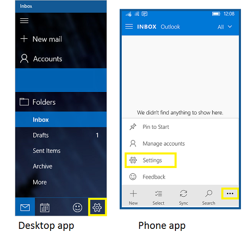
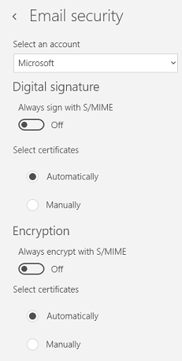
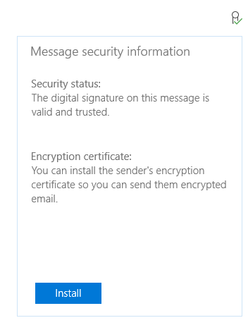

# Configure S/MIME for Windows 10 and Windows 10 Mobile

**Applies to**
-   Windows 10
-   Windows 10 Mobile

S/MIME stands for Secure/Multipurpose Internet Mail Extensions, and provides an added layer of security for email sent to and from an Exchange ActiveSync (EAS) account. In Windows 10, S/MIME lets users encrypt outgoing messages and attachments so that only intended recipients who have a digital identification (ID), also known as a certificate, can read them. Users can digitally sign a message, which provides the recipients with a way to verify the identity of the sender and that the message hasn't been tampered with.

## About message encryption

Users can send encrypted message to people in their organization and people outside their organization if they have their encryption certificates. However, users using Windows 10 Mail app can only read encrypted messages if the message is received on their Exchange account and they have corresponding decryption keys.

Encrypted messages can be read only by recipients who have a certificate. If you try to send an encrypted message to recipient(s) whose encryption certificate are not available, the app will prompt you to remove these recipients before sending the email.

## About digital signatures

A digitally signed message reassures the recipient that the message hasn't been tampered with and verifies the identity of the sender. Recipients can only verify the digital signature if they’re using an email client that supports S/MIME.

## Prerequisites

-   [S/MIME is enabled for Exchange accounts](http://go.microsoft.com/fwlink/p/?LinkId=718217) (on-premises and Office 365). Users can’t use S/MIME signing and encryption with a personal account such as Outlook.com.
-   Valid Personal Information Exchange (PFX) certificates are installed on the device.

    -   [How to Create PFX Certificate Profiles in Configuration Manager](http://go.microsoft.com/fwlink/p/?LinkID=718215)
    -   [Enable access to company resources using certificate profiles with Microsoft Intune](http://go.microsoft.com/fwlink/p/?LinkId=718216)
    -   [Install digital certificates on Windows 10 Mobile](installing-digital-certificates-on-windows-10-mobile.md)

## Choose S/MIME settings

On the device, perform the following steps: (add select certificate)
1.  Open the Mail app. (In Windows 10 Mobile, the app is Outlook Mail.)
2.  Open **Settings** by tapping the gear icon on a PC, or the ellipsis (...) and then the gear icon on a phone.

    

3.  Tap **Email security**.

    

4.  In **Select an account**, select the account for which you want to configure S/MIME options.
5.  Make a certificate selection for digital signature and encryption.

    -   Select **Automatically** to let the app choose the certificate.
    -   Select **Manually** to specify the certificate yourself from the list of valid certificates on the device.
6.  (Optional) Select **Always sign with S/MIME**, **Always encrypt with S/MIME**, or both, to automatically digitally sign or encrypt all outgoing messages.

    >**Note:**  The option to sign or encrypt can be changed for individual messages, unless EAS policies prevent it.
     
7.  Tap the back arrow.

## Encrypt or sign individual messages
1.  While composing a message, choose **Options** from the ribbon. On phone, **Options** can be accessed by tapping the the ellipsis (...).

2.  Use **Sign** and **Encrypt** icons to turn on digital signature and encryption for this message.

    

## Read signed or encrypted messages

When you receive an encrypted message, the mail app will check whether there is a certificate available on your computer. If there is a certificate available, the message will be decrypted when you open it. If your certificate is stored on a smartcard, you will be prompted to insert the smartcard to read the message. Your smartcard may also require a PIN to access the certificate.

## Install certificates from a received message

When you receive a signed email, the app provide feature to install corresponding encryption certificate on your device if the certificate is available. This certificate can then be used to send encrypted email to this person.

1.  Open a signed email.
2.  Tap or click the digital signature icon in the reading pane.
3.  Tap **Install.**

    
 
 
