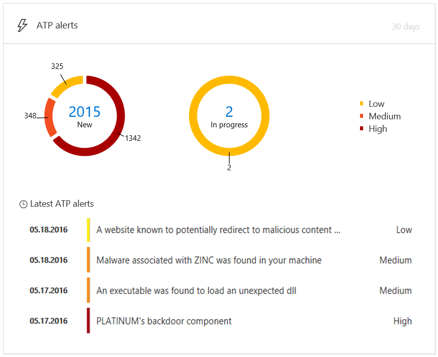
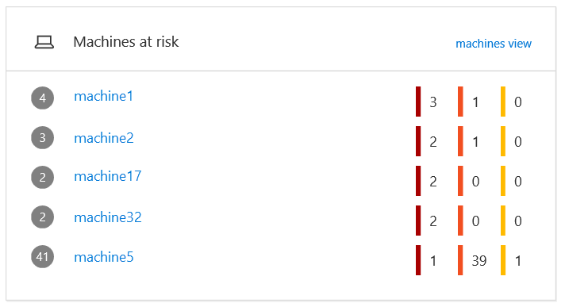

# View the Windows Defender Advanced Threat Protection Dashboard

**Applies to:**

- Windows 10 Insider Preview Build 14332 or later
- Windows Defender Advanced Threat Protection (Windows Defender ATP)

[Some information relates to pre-released product which may be substantially modified before it's commercially released. Microsoft makes no warranties, express or implied, with respect to the information provided here.]

The **Dashboard** displays a snapshot of:

- The latest active alerts on your network
- Machines reporting
- Top machines with active alerts
- The overall status of Windows Defender ATP for the past 30 days
- Machines with active malware detections

You can explore and investigate alerts and machines to quickly determine if, where, and when suspicious activities occurred in your network to help you understand the context they appeared in.

From the **Dashboard** you will see aggregated events to facilitate the identification of significant events or behaviors on a machine. You can also drill down into granular events and low-level indicators.

It also has clickable tiles that give visual cues on the overall health status of your organization. Each tile opens a detailed view of the corresponding overview.

## ATP alerts
You can view the overall number of active ATP alerts from the last 30 days in your network from the **ATP alerts** tile. Alerts are grouped into **New** and **In progress**.

Each group is further sub-categorized into their corresponding alert severity levels. Click the number of alerts inside each alert ring to see a sorted view of that category's queue (**New** or **In progress**).

See the [View and organize the Windows Defender Advanced Threat Protection Alerts queue](alerts-queue-windows-defender-advanced-threat-protection.md) topic for more information.

The **Latest ATP alerts** section includes the latest active alerts in your network. Each row includes an alert severity category and a short description of the alert. Click an alert to see its detailed view, or **Alerts queue** at the top of the list to go directly to the Alerts queue. See the [Investigate Windows Defender Advanced Threat Protection alerts](investigate-alerts-windows-defender-advanced-threat-protection.md) and [View and organize the Windows Defender Advanced Threat Protection Alerts queue](alerts-queue-windows-defender-advanced-threat-protection.md) topics for more information.

## Machines at risk
This tile shows you a list of machines with the highest number of active alerts. The total number of alerts for each machine is shown in a circle next to the machine name, and then further categorized by severity levels at the far end of the tile (hover over each severity bar to its label).

Click the name of the machine to see details about that machine. See the [Investigate Windows Defender ATP alerts](investigate-alerts-windows-defender-advanced-threat-protection.md#investigate-a-machine) topic for more information.

You can also click **Machines view** at the top of the tile to go directly to the **Machines view**, sorted by the number of active alerts. See the [Investigate machines in the Windows Defender Advanced Threat Protection Machines view](investigate-machines-windows-defender-advanced-threat-protection.md) topic for more information.

## Status
The **Status** tile informs you if the service is active and running and the specific number of machines (endpoints) reporting to Windows Defender ATP.

## Machines reporting
The **Machines reporting** tile shows a bar graph that represents the number of machines reporting alerts daily. Hover over individual bars on the graph to see the exact number of machines reporting in each day.

## Machines with active malware detections
The **Machines with active malware detections** tile will only appear if your endpoints are using Windows Defender.

Active malware is defined as threats that are actively executing at the time of detection.

Hover over each bar to see the number of active malware detections (as **Malware detections**) and the number of endpoints with at least one active detection (as **Machines**) over the past 30 days.

The chart is sorted into five categories:

- **Password stealer** - threats that attempt to steal credentials.
- **Ransomware** - threats that prevent user access to a machine or its files and demand payment to restore access.
- **Exploit** - threats that use software vulnerabilities to infect machines.
- **Threat** - all other threats that don't fit into the **Password stealer**, **Ransomware**, or **Exploit** categories. This includes trojans, worms, backdoors, and viruses.
- **Low severity** - threats with low severity, including adware and potentially unwanted software such as browser modifiers.

Threats are considered "active" if there is a very high probability that the malware was executing on your network, as opposed to statically located on-disk.

Clicking on any of these categories will navigate to the [Machines view](investigate-machines-windows-defender-advanced-threat-protection.md), filtered by the appropriate category. This lets you see a detailed breakdown of which machines have active malware detections, and how many threats were detected per machine.

> **Note**&nbsp;&nbsp;The **Machines with active malware detections** tile will only appear if your endpoints are using [Windows Defender](https://technet.microsoft.com/en-us/library/mt622091(v=vs.85).aspx) as the default real-time protection antimalware product.

### Related topics
- [View and organize the Windows Defender Advanced Threat Protection Alerts queue](alerts-queue-windows-defender-advanced-threat-protection.md)
- [Investigate Windows Defender Advanced Threat Protection alerts](investigate-alerts-windows-defender-advanced-threat-protection.md)
- [Investigate machines in the Windows Defender ATP Machines view](investigate-machines-windows-defender-advanced-threat-protection.md)
- [Investigate a file associated with a Windows Defender ATP alert](investigate-files-windows-defender-advanced-threat-protection.md)
- [Investigate an IP address associated with a Windows Defender ATP alert](investigate-ip-windows-defender-advanced-threat-protection.md)
- [Investigate a domain associated with a Windows Defender ATP alert](investigate-domain-windows-defender-advanced-threat-protection.md)
- [Manage Windows Defender Advanced Threat Protection alerts](manage-alerts-windows-defender-advanced-threat-protection.md)
