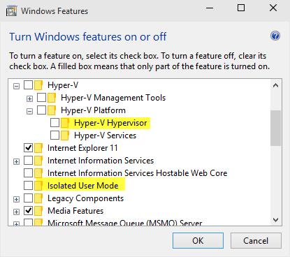
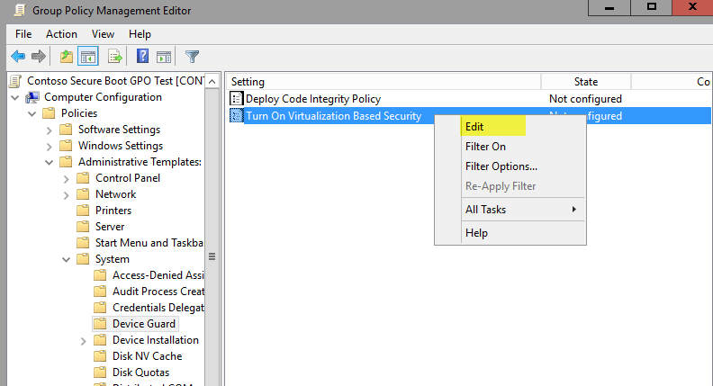
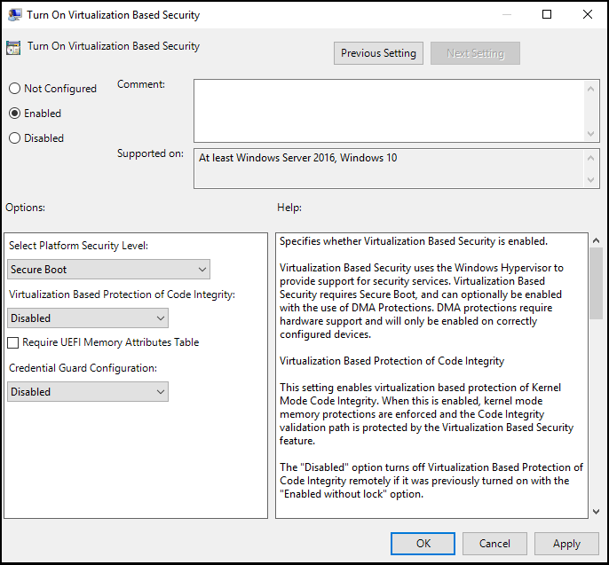
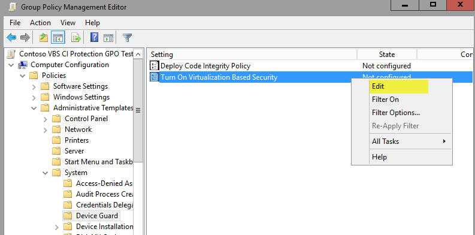
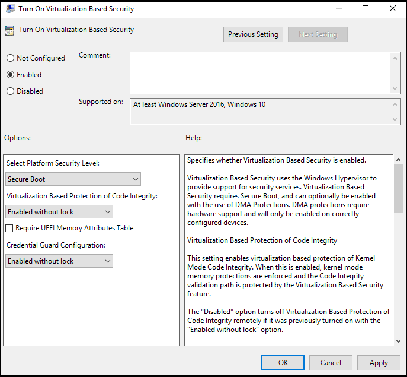
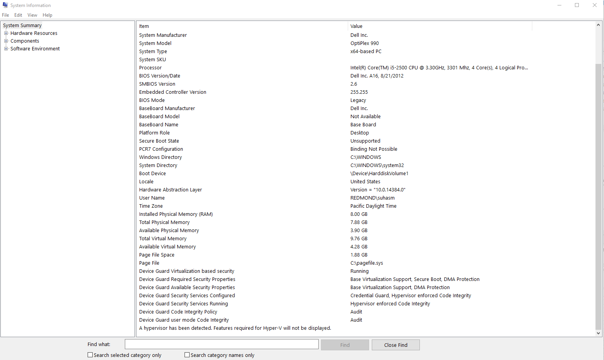

# Deploy Device Guard: enable virtualization-based security (Windows 10)

**Applies to**
-   Windows 10
-   Windows Server 2016

Hardware-based security features, also called virtualization-based security or VBS, make up a large part of Device Guard security offerings. VBS reinforces the most important feature of Device Guard: configurable code integrity. There are three steps to configure hardware-based security features in Device Guard:

1.  **Verify that hardware and firmware requirements are met**. Verify that your client computers possess the necessary hardware and firmware to run these features. A list of requirements for hardware-based security features is available in [Hardware, firmware, and software requirements for Device Guard](requirements-and-deployment-planning-guidelines-for-device-guard.md#hardware-firmware-and-software-requirements-for-device-guard).

2.  **Enable the necessary Windows features**. There are several ways to enable the Windows features required for hardware-based security. For details, see the following section, [Windows feature requirements for virtualization-based security](#windows-feature-requirements-for-virtualization-based-security).

3.  **Enable additional features as desired**. When the necessary Windows features have been enabled, you can enable additional hardware-based security features as desired. For more information, see the following sections in this topic:

    - [Enable Unified Extensible Firmware Interface Secure Boot](#enable-unified-extensible-firmware-interface-secure-boot)
    - [Enable virtualization-based security for kernel-mode code integrity](#enable-virtualization-based-security-for-kernel-mode-code-integrity)

For information about enabling Credential Guard, see [Protect derived domain credentials with Credential Guard](credential-guard.md).

## Windows feature requirements for virtualization-based security

In addition to the hardware requirements found in [Hardware, firmware, and software requirements for Device Guard](requirements-and-deployment-planning-guidelines-for-device-guard.md#hardware-firmware-and-software-requirements-for-device-guard), you must enable certain operating system features before you can enable VBS: Microsoft Hyper-V and isolated user mode (shown in Figure 1).

> **Note**&nbsp;&nbsp;You can configure these features manually by using Windows PowerShell or Deployment Image Servicing and Management. For specific information about these methods, see [Protect derived domain credentials with Credential Guard](credential-guard.md).
 

Figure 1. Enable operating system features for VBS

After you enable these features, you can configure any additional hardware-based security features you want. The following sections provide more information:
- [Enable Unified Extensible Firmware Interface Secure Boot](#enable-unified-extensible-firmware-interface-secure-boot)
- [Enable virtualization-based security for kernel-mode code integrity](#enable-virtualization-based-security-for-kernel-mode-code-integrity)

## Enable Unified Extensible Firmware Interface Secure Boot

Before you begin this process, verify that the target device meets the hardware requirements for UEFI Secure Boot that are laid out in [Hardware, firmware, and software requirements for Device Guard](requirements-and-deployment-planning-guidelines-for-device-guard.md#hardware-firmware-and-software-requirements-for-device-guard). There are two options to configure UEFI Secure Boot: manual configuration of the appropriate registry keys and Group Policy deployment. Complete the following steps to manually configure UEFI Secure Boot on a computer running Windows 10.

> **Note**&nbsp;&nbsp;There are two platform security levels for Secure Boot: stand-alone Secure Boot and Secure Boot with DMA protection. DMA protection provides additional memory protection but will be enabled only on systems whose processors include input/output memory management units (IOMMUs). Protection against driver-based attacks is provided only on systems that have IOMMUs and that have DMA protection enabled.

1.  Navigate to the **HKEY\_LOCAL\_MACHINE\\SYSTEM\\CurrentControlSet\\Control\\DeviceGuard** registry subkey.

2.  Set the **EnableVirtualizationBasedSecurity DWORD** value to **1**.

3.  Set the **RequirePlatformSecurityFeatures DWORD** value as appropriate:

    -   Set this value to **1** to enable the **Secure Boot** option.

    -   Set this value to **2** to enable the **Secure Boot with DMA Protection** option.

4.  Restart the client computer.

Unfortunately, it would be time consuming to perform these steps manually on every protected computer in your enterprise. Group Policy offers a much simpler way to deploy UEFI Secure Boot to your organization. This example creates a test organizational unit (OU) called *DG Enabled PCs*. If you want, you can instead link the policy to an existing OU, and then scope the GPO by using appropriately named computer security groups.

> **Note**&nbsp;&nbsp;We recommend that you test-enable this feature on a group of test computers before you deploy it to users' computers.

### Use Group Policy to deploy Secure Boot

1.  To create a new GPO, right-click the OU to which you want to link the GPO, and then click **Create a GPO in this domain, and Link it here**.

    

    Figure 5. Create a new OU-linked GPO

2.  Give the new GPO a name, for example, **Contoso Secure Boot GPO Test**, or any name you prefer. Ideally, the name will align with your existing GPO naming convention.

3.  Open the Group Policy Management Editor: right-click the new GPO, and then click **Edit**.

4.  Within the selected GPO, navigate to Computer Configuration\\Administrative Templates\\System\\Device Guard. Right-click **Turn On Virtualization Based Security**, and then click **Edit**.

    

    Figure 6. Enable VBS

5.  Select the **Enabled** option, and then select **Secure Boot and DMA Protection** from the **Select Platform Security Level** list.

    

    Figure 7. Enable Secure Boot

    > **Note**&nbsp;&nbsp;Device Guard Secure Boot is maximized when combined with DMA protection. If your hardware contains the IOMMUs required for DMA protection, be sure to select the **Secure Boot and DMA Protection** platform security level. If your hardware does not contain IOMMUs, there are several mitigations provided by leveraging Secure Boot without DMA Protection.

6.  Close the Group Policy Management Editor, and then restart the Windows 10 test computer. After you configure this setting, UEFI Secure Boot will be enabled upon restart.

7.  Check the test computer’s event log for Device Guard GPOs.

    Processed Device Guard policies are logged in event viewer at **Applications and Services Logs\\Microsoft\\Windows\\DeviceGuard-GPEXT\\Operational**. When the **Turn On Virtualization Based Security** policy is successfully processed, event ID 7000 is logged, which contains the selected settings within the policy.

## Enable virtualization-based security for kernel-mode code integrity

Before you begin this process, verify that the desired computer meets the hardware requirements for VBS found in [Hardware, firmware, and software requirements for Device Guard](requirements-and-deployment-planning-guidelines-for-device-guard.md#hardware-firmware-and-software-requirements-for-device-guard), and enable the Windows features discussed in the [Windows feature requirements for virtualization-based security](#windows-feature-requirements-for-virtualization-based-security) section. When validated, you can enable virtualization-based protection of KMCI in one of two ways: manual configuration of the appropriate registry subkeys and Group Policy deployment.

> **Note**&nbsp;&nbsp;All drivers on the system must be compatible with virtualization-based protection of code integrity; otherwise, your system may fail. We recommend that you enable this feature on a group of test computers before you enable it on users' computers.

**To configure virtualization-based protection of KMCI manually:**

1.  Navigate to the **HKEY\_LOCAL\_MACHINE\\SYSTEM\\CurrentControlSet\\Control\\DeviceGuard** registry subkey.

2.  Set the **HypervisorEnforcedCodeIntegrity DWORD** value to **1**.

3.  Restart the client computer.

It would be time consuming to perform these steps manually on every protected computer in your enterprise. Instead, use Group Policy to deploy virtualization-based protection of KMCI. This example creates a test OU called *DG Enabled PCs*, which you will use to link the GPO. If you prefer to link the policy to an existing OU rather than create a test OU and scope the policy by using appropriately named computer security groups, that is another option.

> **Note**&nbsp;&nbsp;We recommend that you test-enable this feature on a group of test computers before you deploy it to users' computers. If untested, there is a possibility that this feature can cause system instability and ultimately cause the client operating system to fail.

**To use Group Policy to configure VBS of KMCI:**

1.  Create a new GPO: Right-click the OU to which you want to link the GPO, and then click **Create a GPO in this domain, and Link it here**.

    

    Figure 2. Create a new OU-linked GPO

2.  Give the new GPO a name, for example, **Contoso VBS CI Protection GPO Test**, or any name you prefer. Ideally, the name will align with your existing GPO naming convention.

3.  Open the Group Policy Management Editor: Right-click the new GPO, and then click **Edit**.

4.  Within the selected GPO, navigate to Computer Configuration\\Administrative Templates\\System\\Device Guard. Right-click **Turn On Virtualization Based Security**, and then click **Edit**.

    

    Figure 3. Enable VBS

5.  Select the **Enabled** option, and then select the **Enable Virtualization Based Protection of Code Integrity** check box.

    

    Figure 4. Enable VBS of KMCI

6.  Close the Group Policy Management Editor, and then restart the Windows 10 test computer. With this setting configured, the VBS of the KMCI will take effect upon restart.

7.  Check the test client event log for Device Guard GPOs.

    Processed Device Guard policies are logged in event viewer under **Applications and Services Logs\\Microsoft\\Windows\\DeviceGuard-GPEXT\\Operational**. When the **Turn On Virtualization Based Security** policy has been successfully processed, event ID 7000 is logged, which contains the selected settings within the policy.

**Validate enabled Device Guard hardware-based security features**

Windows 10 and Windows Server 2016 and later have a WMI class for Device Guard–related properties and features: *Win32\_DeviceGuard*. This class can be queried from an elevated Windows PowerShell session by using the following command:

` Get-CimInstance –ClassName Win32_DeviceGuard –Namespace root\Microsoft\Windows\DeviceGuard`

> **Note**&nbsp;&nbsp;The *Win32\_DeviceGuard* WMI class is only available on the Enterprise edition of Windows 10.

The output of this command provides details of the available hardware-based security features as well as those features that are currently enabled. For detailed information about what each property means, refer to Table 1.

Table 1. Win32\_DeviceGuard properties

<table>
<colgroup>
<col width="33%" />
<col width="33%" />
<col width="33%" />
</colgroup>
<thead>
<tr class="header">
<th align="left"><strong>Properties</strong></th>
<th align="left"><strong>Description</strong></th>
<th align="left"><strong>Valid values</strong></th>
</tr>
</thead>
<tbody>
<tr class="odd">
<td align="left"><strong>AvailableSecurityProperties</strong></td>
<td align="left">This field helps to enumerate and report state on the relevant security properties for Device Guard.</td>
<td align="left"><ul>
<li>
<strong>0.</strong> If present, no relevant properties exist on the device.
</li>
<li>
<strong>1.</strong> If present, hypervisor support is available.
</li>
<li>
<strong>2.</strong> If present, Secure Boot is available.
</li>
<li>
<strong>3.</strong> If present, DMA protection is available.
</li>
</ul></td>
</tr>
<tr class="even">
<td align="left"><strong>InstanceIdentifier</strong></td>
<td align="left">A string that is unique to a particular device.</td>
<td align="left">Determined by WMI.</td>
</tr>
<tr class="odd">
<td align="left"><strong>RequiredSecurityProperties</strong></td>
<td align="left">This field describes the required security properties to enable virtualization-based security.</td>
<td align="left"><ul>
<li>
<strong>0.</strong> Nothing is required.
</li>
<li>
<strong>1.</strong> If present, Secure Boot is needed.
</li>
<li>
<strong>2.</strong> If present, DMA protection is needed.
</li>
<li>
<strong>3.</strong> If present, both Secure Boot and DMA protection are needed.
</li>
</ul></td>
</tr>
<tr class="even">
<td align="left"><strong>SecurityServicesConfigured</strong></td>
<td align="left">This field indicates whether the Credential Guard or HVCI service has been configured.</td>
<td align="left"><ul>
<li>
<strong>0.</strong> No services configured.
</li>
<li>
<strong>1.</strong> If present, Credential Guard is configured.
</li>
<li>
<strong>2.</strong> If present, HVCI is configured.
</li>
</ul></td>
</tr>
<tr class="odd">
<td align="left"><strong>SecurityServicesRunning</strong></td>
<td align="left">This field indicates whether the Credential Guard or HVCI service is running.</td>
<td align="left"><ul>
<li>
<strong>0.</strong> No services running.
</li>
<li>
<strong>1.</strong> If present, Credential Guard is running.
</li>
<li>
<strong>2.</strong> If present, HVCI is running.
</li>
</ul></td>
</tr>
<tr class="even">
<td align="left"><strong>Version</strong></td>
<td align="left">This field lists the version of this WMI class.</td>
<td align="left">The only valid value now is <strong>1.0</strong>.</td>
</tr>
<tr class="odd">
<td align="left"><strong>VirtualizationBasedSecurityStatus</strong></td>
<td align="left">This field indicates whether VBS is enabled and running.</td>
<td align="left"><ul>
<li>
<strong>0.</strong> VBS is not enabled.
</li>
<li>
<strong>1.</strong> VBS is enabled but not running.
</li>
<li>
<strong>2.</strong> VBS is enabled and running.
</li>
</ul></td>
</tr>
<tr class="even">
<td align="left"><strong>PSComputerName</strong></td>
<td align="left">This field lists the computer name.</td>
<td align="left">All valid values for computer name.</td>
</tr>
</tbody>
</table>

Another method to determine the available and enabled Device Guard features is to run msinfo32.exe from an elevated PowerShell session. When you run this program, the Device Guard properties are displayed at the bottom of the **System Summary** section, as shown in Figure 11.

Figure 11. Device Guard properties in the System Summary

## Related topics

- [Introduction to Device Guard: virtualization-based security and code integrity policies](introduction-to-device-guard-virtualization-based-security-and-code-integrity-policies.md)

- [Deploy Device Guard: deploy code integrity policies](deploy-device-guard-deploy-code-integrity-policies.md)
