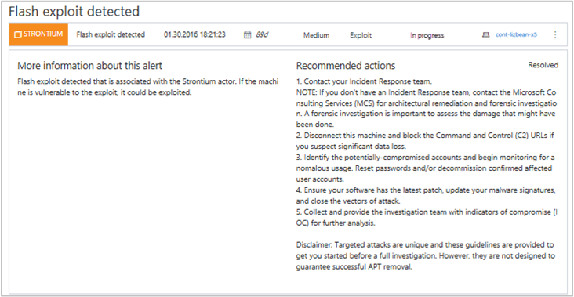
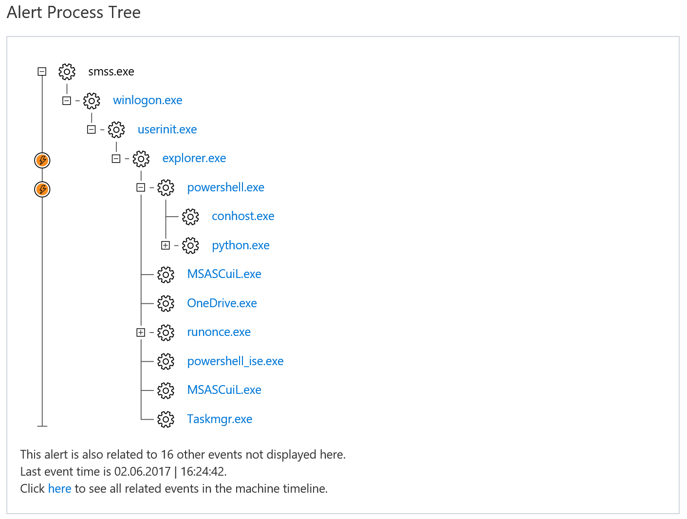
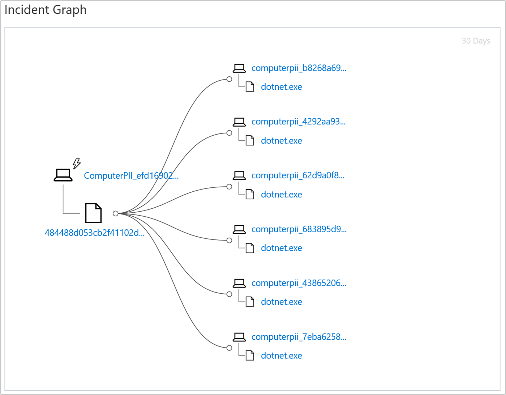
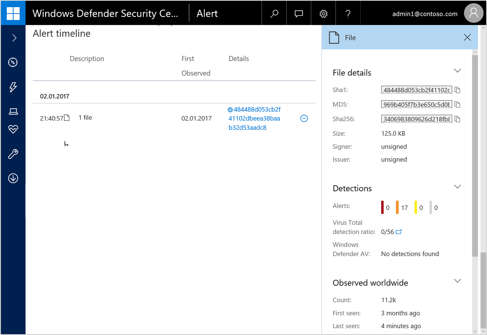

# Investigate Windows Defender Advanced Threat Protection alerts

**Applies to:**

- Windows 10 Enterprise
- Windows 10 Education
- Windows 10 Pro
- Windows 10 Pro Education
- Windows Defender Advanced Threat Protection (Windows Defender ATP)

[Some information relates to pre-released product, which may be substantially modified before it's commercially released. Microsoft makes no warranties, express or implied, with respect to the information provided here.]

You can click an alert in any of the [alert queues](alerts-queue-windows-defender-advanced-threat-protection.md) to begin an investigation. Selecting an alert brings up the **Alert management pane**, while clicking an alert brings you the alert details view where general information about the alert, some recommended actions, an alert process tree, an incident graph, and an alert timeline is shown.  

Alerts attributed to an adversary or actor display a colored tile with the actor name.

Click on the actor's name to see a threat intelligence profile of the actor, including a brief overview of the actor, their interests or targets, tools, tactics, and processes (TTPs) as well as areas where it's active worldwide. You will also see a set of recommended actions to take.

Some actor profiles include a link to download a more comprehensive threat intelligence report.

## Alert process tree
The **Alert process tree** takes alert triage and investigation to the next level by displaying the alert and its evidence with other events that occurred in the same execution context and time. This broad triage context of the alert and surrounding events is available on the alert page.

The **Alert process tree** expands to display the execution path of the alert, its evidence, and related events that occurred in proximity - before and after - the alert.

You’ll see markers  that indicate related events. These icons also indicate the events that triggered the alert.

>[!NOTE]
>The alert process tree might not be available in some alerts.

Selecting an indicator within the alert process tree brings up the **Alert details** pane where you can take a deeper look at the details about the alert. It displays rich information about the selected process, file, IP address, and other details – while remaining on the alert page, so you never leave the current context of your investigation.

## Incident graph
The **Incident graph** provides a visual representation of where an alert was seen, events that triggered the alert, and which other machines are affected by the event. It provides an illustrated alert footprint on the original machine and expands to show the footprint of each alert event on other machines.

You can click the circles on the incident graph to expand the nodes and view the associated events or files related to the alert. It expands alert evidence to connect to other machines it was observed on by file and process.

The Windows Defender ATP service keeps track of "known processes" such as system files like PowerShell and others, that often trigger alerts. These alerts can be considered benign and very prevalent (on almost all machines) – so there is little to no value in expanding the **Incident graph** to other machines these files were observed on.

Alerts related to these processes include specific command lines that are generally the basis for the alert. You can use command lines as a criterion for expanding to other machines.

The **Incident graph** also shows that ‘the same command’ (for the same known process) was observed on other machines, ensuring the accuracy and value of the Incident Graph’s expansion.

The **Incident graph** also supports IP Addresses as a criterion of expansion, showing the potential scope of alert evidence without having to change context by navigating to the IP Address page.

## Alert timeline
The **Alert timeline** feature helps ease investigations by highlighting alerts related to a specific machine and events.

Selecting an alert detail brings up the **Details pane** where you'll be able to see more information about the alert such as file details, detections, instances of it observed worldwide, and in the organization.

### Related topics
- [View the Windows Defender Advanced Threat Protection Dashboard](dashboard-windows-defender-advanced-threat-protection.md)
- [View and organize the Windows Defender Advanced Threat Protection Alerts queue](alerts-queue-windows-defender-advanced-threat-protection.md)
- [Investigate machines in the Windows Defender ATP Machines view](investigate-machines-windows-defender-advanced-threat-protection.md)
- [Investigate a file associated with a Windows Defender ATP alert](investigate-files-windows-defender-advanced-threat-protection.md)
- [Investigate an IP address associated with a Windows Defender ATP alert](investigate-ip-windows-defender-advanced-threat-protection.md)
- [Investigate a domain associated with a Windows Defender ATP alert](investigate-domain-windows-defender-advanced-threat-protection.md)
- [Manage Windows Defender Advanced Threat Protection alerts](manage-alerts-windows-defender-advanced-threat-protection.md)
