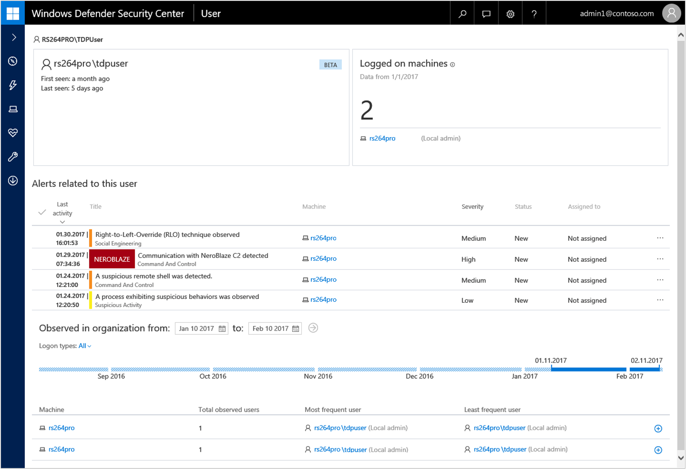

# Investigate a user account associated with a Windows Defender ATP alert

**Applies to:**

- Windows 10 Enterprise
- Windows 10 Education
- Windows 10 Pro
- Windows 10 Pro Education
- Windows Defender Advanced Threat Protection (Windows Defender ATP)

[Some information relates to pre-released product, which may be substantially modified before it's commercially released. Microsoft makes no warranties, express or implied, with respect to the information provided here.]

## Investigate user entities
Identify user accounts with the most active alerts and investigate the associated alerts to identify possible lateral movement between machines and potential compromised credentials cases.

You can find user account information from the following views:
- Dashboard
- Alerts queue
- Machine details page

A clickable user account link is available from these views. You'll be taken to the user account details page where more details about the account is shown.

When you investigate a user entity, you'll see:
- User account details and Logged on machines
- Alerts related to this user
- Observed in organization

The user entity details and logged on machines section display various attributes about the user entity. You'll see details such as when the user was first and last seen and the total number of machines the user logged in to. You'll also see the machines that the user was most and least frequently logged in to.

The **Alerts related to this user** section provides a list of alerts that are associated with the user. This list is a simplified version of the [Alerts queue](alerts-queue-windows-defender-advanced-threat-protection.md), and shows the date when the last activity was detected, a short description of the alert, the machine associated with the alert, the alert's severity, the alert's status in the queue, and who is addressing the alert.

The **Observed in organization** section allows you to specify a date range to see the total number of observed users logged in to specific machine and which machines the user most frequently and least frequently logged in to.

You'll also be able to determine the machine health state from the machine icon and color as well as the description of the machine health state. Clicking on the icon displays more details regarding machine health.

## Search for specific user accounts

1. Select **User** from the **Search bar** drop-down menu.
2. Enter the user account in the **Search** field.
3. Click the search icon or press **Enter**.

A list of users with matches are displayed in a list. You'll see the username, when the user was last seen, and the total number of machines it was observed on in the last 30 days.

You can filter the results by the following days:
- 1 day
- 3 days
- 7 days
- 30 days
- 6 months
