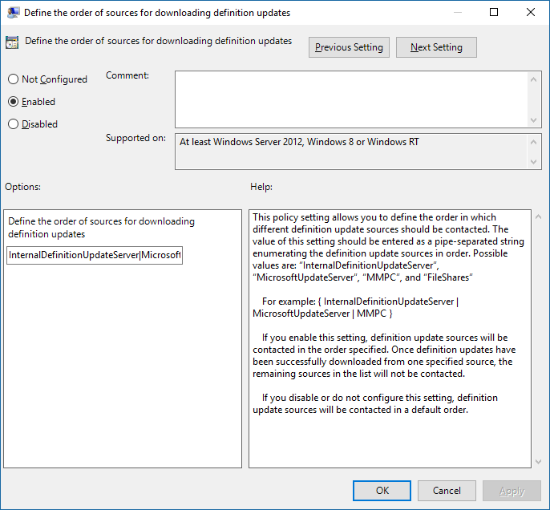

# Manage Windows Defender Antivirus protection and definition updates

**Applies to**
-   Windows 10

**Audience**

- Network administrators

**Manageability available with**

- Group Policy
- System Center Configuration Manager
- PowerShell cmdlets
- Windows Management Instruction (WMI)

<a id="protection-updates"></a>  
<!-- this has been used as anchor in VDI content -->

Windows Defender AV uses both [cloud-delivered protection](utilize-microsoft-cloud-protection-windows-defender-antivirus.md) (also called the Microsoft Advanced Protection Service or MAPS) and periodically downloaded protection updates to provide protection. These protection updates are also known as "definitions" or "signature updates".

The cloud-based protection is “always-on” and requires an active connection to the Internet to function, while the protection updates generally occur once a day (although this can be configured).  

There are two components to managing protection updates - where the updates are downloaded from, and when updates are downloaded and applied.

This topic describes the locations 

<a id="fallback-order"></a>
## Manage the fallback order for downloading protection updates
There are five locations where you can specify where an endpoint should obtain updates. Typically, you would configure each endpoint to individually download the updates from a primary source and specify fallback sources in case the primary source is unavailable.

-   [Windows Server Update Service (WSUS)](https://technet.microsoft.com/windowsserver/bb332157.aspx)
-   Microsoft Update.
-   The [Microsoft Malware Protection Center definitions page (MMPC)](http://www.microsoft.com/security/portal/definitions/adl.aspx)
-   A network file share
-   Configuration manager

Each location has typical scenarios (in addition to acting as fallback locations) for when you would use that source, as described in the following table:

Location | Sample scenario
---|---
WSUS | You are using WSUS to manage updates for your network
Microsoft Update | You want your endpoints to connect directly to Microsoft Update. This can be useful for endpoints that irregularly connect to your enterprise network.
MMPC | You need to download the latest protection updates because of a recent infection or to help provision a strong, base image for [VDI deployment](deployment-vdi-windows-defender-antivirus.md).
File share | You have non-Internet-connected devices (such as VMs). You can use your Internet-connected VM host download the updates to a network share, from which the VMs can obtain the updates. See the [VDI deployment guide](deployment-vdi-windows-defender-antivirus.md) for how file shares can be used in virtual desktop infrastructure (VDI) environments.
Configuration Manager | You are using System Center Configuration Manager to update your endpoints.

You can manage the order in which update sources are used with Group Policy, System Center Configuration Manager, PowerShell cmdlets, and WMI.

> [!IMPORTANT]
> If you set WSUS as a download location, you must approve the updates - regardless of what management tool you use to specify the location. You can set up an automatic approval rule with WSUS, which may be useful as updates arrive at least once a day. See [To synchronize endpoint protection updates in standalone WSUS](https://docs.microsoft.com/en-us/sccm/protect/deploy-use/endpoint-definitions-wsus#to-synchronize-endpoint-protection-definition-updates-in-standalone-wsus) for more details.


**Use Group Policy to manage the update location:**

1.  On your Group Policy management machine, open the [Group Policy Management Console](https://technet.microsoft.com/library/cc731212.aspx), right-click the Group Policy Object you want to configure and click **Edit**.

3.  In the **Group Policy Management Editor** go to **Computer configuration**.

4.  Click **Policies** then **Administrative templates**.

5.  Expand the tree to **Windows components > Windows Defender > Signature updates** and configure the following settings:
    
    1.  Double-click the **Define the order of sources for downloading definition updates** setting and set the option to **Enabled**.  

    2.  Enter the order of sources, separated by a single pipe, for example: `InternalDefinitionUpdateServer|MicrosoftUpdateServer|MMPC`, shown in the following screenshot.  

    

    3.  Click **OK**. This will set the order of protection update sources.  

    1.  Double-click the **Define file shares for downloading definition updates** setting and set the option to **Enabled**.  

    2.  Enter the file share source. If you have multiple sources, enter each source in the order they should be used, separated by a single pipe. Use [standard UNC notation](https://msdn.microsoft.com/en-us/library/gg465305.aspx) for denoting the path, for example: `\\host-name1\share-name\object-name|\\host-name2\share-name\object-name`.  If you do not enter any paths then this source will be skipped when the VM downloads updates.

    3.  Click **OK**. This will set the order of file shares when that source is referenced in the **Define the order of sources...** group policy setting.


**Use Configuration Manager to manage the update location:**

See [Configure Definition Updates for Endpoint Protection](https://docs.microsoft.com/en-us/sccm/protect/deploy-use/endpoint-definition-updates) for details on configuring System Center Configuration Manager (current branch).


**Use PowerShell cmdlets to manage the update location:**

Use the following PowerShell cmdlets to set the update order.

```PowerShell
Set-MpPreference -SignatureFallbackOrder {LOCATION|LOCATION|LOCATION|LOCATION}
Set-MpPreference -SignatureDefinitionUpdateFileSharesSouce {\\UNC SHARE PATH|\\UNC SHARE PATH}
```
See the following for more information:
- [Set-MpPreference -SignatureFallbackOrder](https://technet.microsoft.com/en-us/itpro/powershell/windows/defender/set-mppreference#-signaturefallbackorder)
- [Set-MpPreference -SignatureDefinitionUpdateFileSharesSouce](https://technet.microsoft.com/en-us/itpro/powershell/windows/defender/set-mppreference#-signaturedefinitionupdatefilesharessources)
- [Use PowerShell cmdlets to configure and run Windows Defender Antivirus](use-powershell-cmdlets-windows-defender-antivirus.md)
- [Defender cmdlets](https://technet.microsoft.com/en-us/library/dn433280.aspx) 

**Use Windows Management Instruction (WMI) to manage the update location:**

Use the [**Set** method of the **MSFT_MpPreference**](https://msdn.microsoft.com/en-us/library/dn455323(v=vs.85).aspx) class for the following properties:

```WMI
SignatureFallbackOrder
SignatureDefinitionUpdateFileSharesSouce
```

See the following for more information:
- [Windows Defender WMIv2 APIs](https://msdn.microsoft.com/en-us/library/dn439477(v=vs.85).aspx)


## Related topics

- [Update and manage Windows Defender in Windows 10](get-started-with-windows-defender-for-windows-10.md)
- [Troubleshoot Windows Defender in Windows 10](troubleshoot-windows-defender-in-windows-10.md)
