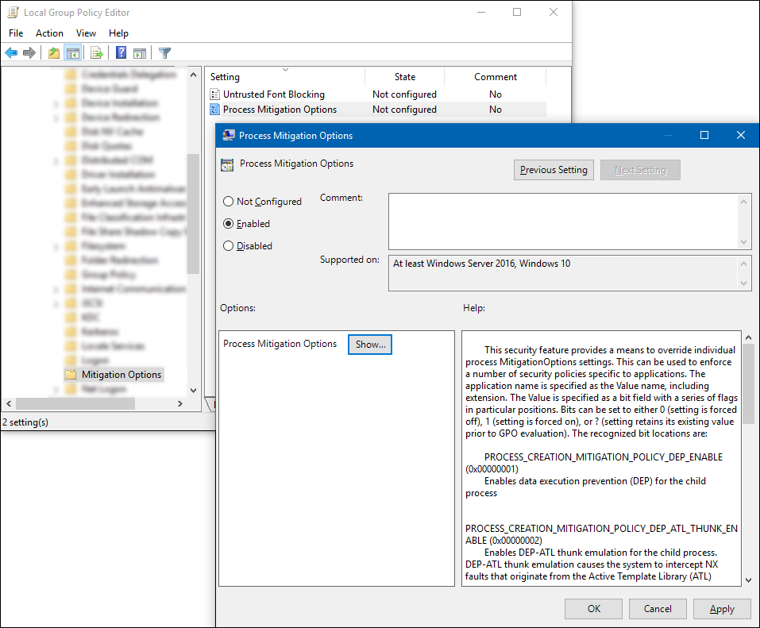
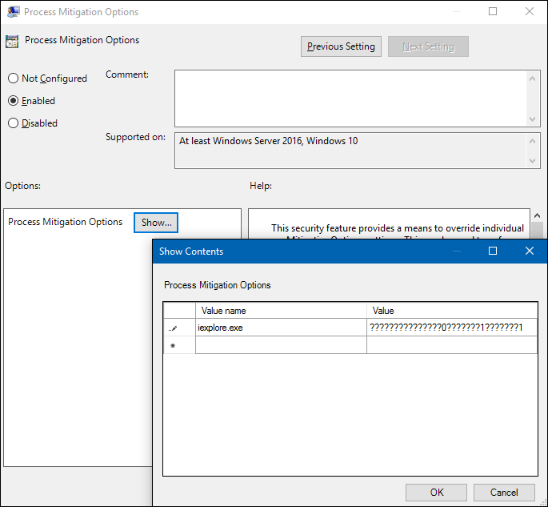

---
title: Override Process Mitigation Options to help enforce app-related security policies (Windows 10)
description: How to use Group Policy to override individual Process Mitigation Options settings and to help enforce specific app-related security policies.
keywords: Process Mitigation Options, Mitigation Options, Group Policy Mitigation Options
ms.prod: w10
ms.mktglfcycl: deploy
ms.pagetype: security
ms.sitesec: library
---

# Override Process Mitigation Options to help enforce app-related security policies

**Applies to:**

-   Windows 10, version 1607
-   Windows Server 2016

Windows 10 includes Group Policy-configurable “Process Mitigation Options” that add advanced protections against memory-based attacks, that is, attacks where malware manipulates memory to gain control of a system. For example, malware might attempt to use buffer overruns to inject malicious executable code into memory, but Process Mitigation Options can prevent the running of the malicious code.

> [!IMPORTANT]
> We recommend trying these mitigations in a test lab before deploying to your organization, to determine if they interfere with your organization’s required apps.

The Group Policy settings in this topic are related to three types of process mitigations. In Windows 10, all three types are on by default for 64-bit applications, but by using the Group Policy settings described in this topic, you can configure additional protections. The types of process mitigations are:

- **Data Execution Prevention (DEP)** is a system-level memory protection feature that enables the operating system to mark one or more pages of memory as non-executable, preventing code from being run from that region of memory, to help prevent exploitation of buffer overruns. DEP helps prevent code from being run from data pages such as the default heap, stacks, and memory pools. 

- **Structured Exception Handling Overwrite Protection (SEHOP)** is designed to block exploits that use the Structured Exception Handler (SEH) overwrite technique. Because this protection mechanism is provided at run-time, it helps to protect apps regardless of whether they have been compiled with the latest improvements. 

- **Address Space Layout Randomization (ASLR)** loads DLLs into random memory addresses at boot time to mitigate against malware that’s designed to attack specific memory locations, where specific DLLs are expected to be loaded. 
    To find additional ASLR protections in the table below, look for `IMAGES` or `ASLR`.

The following procedure describes how to use Group Policy to override individual **Process Mitigation Options** settings.

**To modify Process Mitigation Options**

1. Open your Group Policy editor and go to the **Administrative Templates\System\Mitigation Options\Process Mitigation Options** setting.

    

2. Click **Enabled**, and then in the **Options** area, click **Show** to open the **Show Contents** box, where you’ll be able to add your apps and the appropriate bit flag values, as shown in the [Setting the bit field](#setting-the-bit-field) and [Example](#example) sections of this topic.

    **Important** For each app you want to include, you must include:
    
    - **Value name.** The app file name, including the extension. For example, iexplore.exe.
    - **Value.** A bit field with a series of bit flags in particular positions. Bits can be set to 0 (where the setting is forced off), 1 (where the setting is forced on), or ? (where the setting retains the previous, existing value).
    
        **Note** Setting bit flags in positions not specified here to anything other than ? might cause undefined behavior.

    

## Setting the bit field
Here’s a visual representation of the bit flag locations for the various Process Mitigation Options settings:

Where the bit flags are read from right to left and are defined as:

|Flag |Bit location |Setting |Details |
|-----|--------------|--------|--------|
|A |0 |`PROCESS_CREATION_MITIGATION_POLICY_DEP_ENABLE (0x00000001)` |Turns on Data Execution Prevention (DEP) for child processes. |
|B |1 |`PROCESS_CREATION_MITIGATION_POLICY_DEP_ATL_THUNK_ENABLE (0x00000002)` |Turns on DEP-ATL thunk emulation for child processes. DEP-ATL thunk emulation lets the system intercept non-executable (NX) faults that originate from the Active Template Library (ATL) thunk layer, and then emulate and handle the instructions so the process can continue to run. |
|C |2 |`PROCESS_CREATION_MITIGATION_POLICY_SEHOP_ENABLE (0x00000004)` |Turns on Structured Exception Handler Overwrite Protection (SEHOP) for child processes. SEHOP helps to block exploits that use the Structured Exception Handler (SEH) overwrite technique. |
|D |8 |`PROCESS_CREATION_MITIGATION_POLICY_FORCE_RELOCATE_IMAGES_ALWAYS_ON (0x00000100)` |Uses the force Address Space Layout Randomization (ASLR) setting to act as though an image base collision happened at load time, forcibly rebasing images that aren’t dynamic base compatible. Images without the base relocation section won’t be loaded if relocations are required. |
|E |15 |`PROCESS_CREATION_MITIGATION_POLICY_BOTTOM_UP_ASLR_ALWAYS_ON (0x00010000)` |Turns on the bottom-up randomization policy, which includes stack randomization options and causes a random location to be used as the lowest user address. |
|F |16 |`PROCESS_CREATION_MITIGATION_POLICY_BOTTOM_UP_ASLR_ALWAYS_OFF (0x00020000)` |Turns off the bottom-up randomization policy, which includes stack randomization options and causes a random location to be used as the lowest user address. |
    
## Example
If you want to turn on the **PROCESS_CREATION_MITIGATION_POLICY_DEP_ENABLE** and **PROCESS_CREATION_MITIGATION_POLICY_FORCE_RELOCATE_IMAGES_ALWAYS_ON** settings, turn off the **PROCESS_CREATION_MITIGATION_POLICY_BOTTOM_UP_ASLR_ALWAYS_OFF** setting, and leave everything else as the default values, you’d want to type a value of `???????????????0???????1???????1`.

