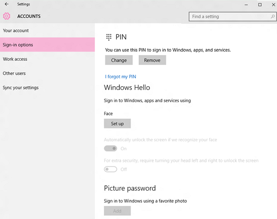

# Prepare people to use Windows Hello

**Applies to**
-   Windows 10
-   Windows 10 Mobile

When you set a policy to require Windows Hello for Business in the workplace, you will want to prepare people in your organization by explaining how to use Hello.

After enrollment in Hello, users should use their gesture (such as a PIN or fingerprint) for access to corporate resources. Their gesture is only valid on the enrolled device.

Although the organization may require users to change their Active Directory or Azure Active Directory (AD) account password at regular intervals, changes to their passwords have no effect on Hello.

People who are currently using virtual smart cards for authentication can use their virtual smart card to verify their identity when they set up Hello.

## On devices owned by the organization

When someone sets up a new device, they are prompted to choose who owns the device. For corporate devices, they select **This device belongs to my organization**.

Next, they select a way to connect. Tell the people in your enterprise which option they should pick here.

They sign in, and are then asked to verify their identity. People have options to choose from, such as a text message, phone call, or authentication app. After verification, they create their PIN. The **Create a work PIN** screen displays any complexity requirements that you have set, such as minimum length.

After Hello is set up, people use their PIN to unlock the device, and that will automatically log them on.

## On personal devices

People who want to access work resources on their personal devices can add a work or school account in **Settings** &gt; **Accounts** &gt; **Work or school**, and then sign in with work credentials. The person selects the method for receiving the verification code, such as text message or email. The verification code is sent and the person then enters the verification code. After verification, the person enters and confirms new PIN. The person can access any token-based resource using this device without being asked for credentials. (This work account gesture doesn't affect the device unlock PIN.)

People can go to **Settings** &gt; **Accounts** &gt; **Work or school**, select the work account, and then select **Unjoin** to remove the account from their device.

## Using Windows Hello and biometrics

If your policy allows it, people can use biometrics (fingerprint, iris, and facial recognition) with Windows Hello for Business, if the hardware supports it.

## Use a phone to sign in to a PC or VPN

If your enterprise enables phone sign-in, users can pair a phone running Windows 10 Mobile to a PC running Windows 10 and then use an app on the phone to sign in to the PC using their Windows Hello credentials.

> [!NOTE]
> Phone sign-in is currently limited to select Technology Adoption Program (TAP) participants.

 
**Prerequisites:**
   
- Both phone and PC must be running Windows 10, version 1607.
- The PC must be running Windows 10 Pro, Enterprise, or Education
- Both phone and PC must have Bluetooth.
- The **Microsoft Authenticator** app must be installed on the phone.
- The PC must be joined to an Active Directory domain that is connected to an Azure Active Directory (Azure AD) domain, or the PC must be joined to Azure AD.
- The phone must be joined to Azure AD or have a work account added.
- The VPN configuration profile must use certificate-based authentication.

**Pair the PC and phone**

1.  On the PC, go to **Settings** &gt; **Devices** &gt; **Bluetooth**. Tap the name of the phone and then tap **Pair** to begin pairing.

    
    
2.  On the phone, go to **Settings** &gt; **Devices** &gt; **Bluetooth**, and verify that the passcode for **Pairing accessory** on the phone matches the passcode displayed on the PC, and then tap **ok**.

    
    
3.  On the PC, tap **Yes**.

**Sign in to PC using the phone**

1.  Open the **Microsoft Authenticator** app, choose your account, and tap the name of the PC to sign in to.
    > **Note: **  The first time that you run the **Microsoft Authenticator** app, you must add an account.
    
    
     
2.  Enter the work PIN that you set up when you joined the phone to the cloud domain or added a work account.

**Connect to VPN**

You simply connect to VPN as you normally would. If the phone's certificates are being used, a notification will be pushed to the phone asking if you approve. If you click **allow** in the notification, you will be prompted for your PIN. After you enter your PIN, the VPN session will connect. 

## Related topics

[Manage identity verification using Windows Hello for Business](manage-identity-verification-using-microsoft-passport.md)

[Implement Windows Hello for Business in your organization](implement-microsoft-passport-in-your-organization.md)

[Enable phone sign-in to PC or VPN](enable-phone-signin-to-pc-and-vpn.md) 

[Why a PIN is better than a password](why-a-pin-is-better-than-a-password.md)

[Windows Hello and password changes](microsoft-passport-and-password-changes.md)

[Windows Hello errors during PIN creation](microsoft-passport-errors-during-pin-creation.md)

[Event ID 300 - Windows Hello successfully created](passport-event-300.md)

[Windows Hello biometrics in the enterprise](windows-hello-in-enterprise.md) 

