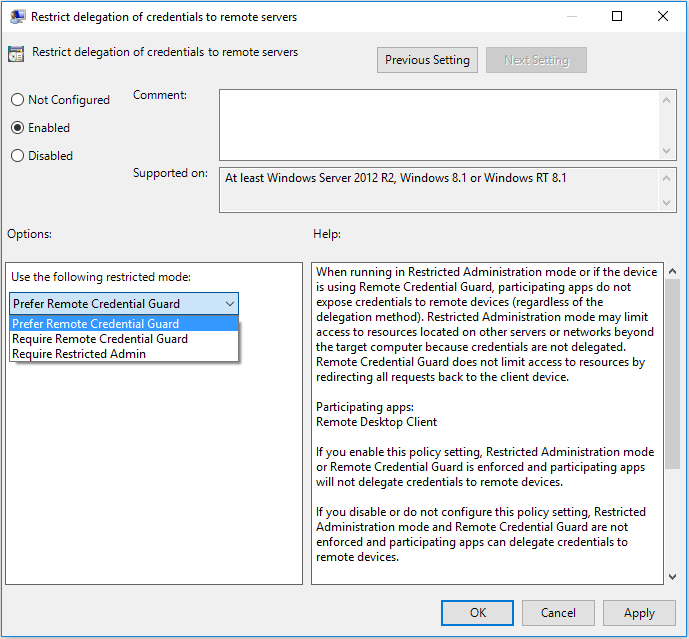

#  Protect Remote Desktop credentials with Remote Credential Guard

**Applies to**
-   Windows 10
-   Windows Server 2016

Introduced in Windows 10, version 1607, Remote Credential Guard helps you protect your credentials over a Remote Desktop connection by redirecting the Kerberos requests back to the device that's requesting the connection. It also provides single sign on experiences for Remote Desktop sessions. If the target device is compromised, your credentials are not exposed because both credential and credential derivatives are never sent to the target device.

You can use Remote Credential Guard in the following ways:

- Administrator credentials are highly privileged and must be protected. By using Remote Credential Guard to connect, you can be assured that your credentials are not passed over the network to the target device.

- Helpdesk employees in your organization must connect to domain-joined devices that could be compromised. With Remote Credential Guard, the helpdesk employee can use RDP to connect to the target device without compromising their credentials to malware.

Use the following diagrams to help understand how Remote Credential Guard works and what it helps protect against.


## Hardware and software requirements

The Remote Desktop client and server must meet the following requirements in order to use Remote Credential Guard:

- They must be joined to an Active Directory domain
    - Both devices must either joined to the same domain or the Remote Desktop server must be joined to a domain with a trust relationship to the client device's domain.
- They must use Kerberos authentication.
- They must be running at least Windows 10, version 1607 or Windows Server 2016.
- The Remote Desktop classic Windows app is required. The Remote Desktop Universal Windows Platform app doesn't support Remote Credential Guard.


## Enable Remote Credential Guard

You must enable Remote Credential Guard on the target device by using the registry.

1. Open Registry Editor.
2. Enable Remote Credential Guard:
    - Go to HKEY_LOCAL_MACHINE\System\CurrentControlSet\Control\Lsa.
    - Add a new DWORD value named **DisableRestrictedAdmin**. Set the value of this registry setting to 0 to turn on Remote Credential Guard.
3. Close Registry Editor.

You can add this by running the following from an elevated command prompt:

```
reg add HKLM\SYSTEM\CurrentControlSet\Control\Lsa /v DisableRestrictedAdmin /d 0 /t REG_DWORD
```

## Using Remote Credential Guard

You can use Remote Credential Guard on the client device by setting a Group Policy or by using a parameter with Remote Desktop Connection. 

### Turn on Remote Credential Guard by using Group Policy

1. From the Group Policy Management Console, go to **Computer Configuration** -> **Administrative Templates** -> **System** -> **Credentials Delegation**.
2. Double-click **Restrict delegation of credentials to remote servers**.
3. In the Use the following restricted mode box:
    - If you want to require either [Restricted Admin mode](http://social.technet.microsoft.com/wiki/contents/articles/32905.how-to-enable-restricted-admin-mode-for-remote-desktop.aspx) or Remote Credential Guard, choose **Require Credential Guard**. In this configuration, Remote Credential Guard is preferred, but it will use Restricted Admin mode (if supported) when Remote Credential Guard cannot be used.
        >![NOTE]
        >Neither Remote Credential Guard nor Restricted Admin mode will send credentials in clear text to the Remote Desktop server.
    - If you want to allow Remote Credential Guard, choose **Prefer Remote Credential Guard**.
4. Click **OK**.

    

5. Close the Group Policy Management Console.

6. From a command prompt, run **gpupdate.exe /force** to ensure that the Group Policy object is applied.


### Use Remote Credential Guard with a parameter to Remote Desktop Connection 

If you don't use Group Policy in your organization, you can add the remoteGuard parameter when you start Remote Desktop Connection to turn on Remote Credential Guard for that connection.

```
mstsc.exe /remoteGuard
```


## Considerations when using Remote Credential Guard

- Remote Credential Guard does not include device claims. For example, if you’re trying to access a file server from the remote and the file server requires device claim, access will be denied.

- Remote Credential Guard cannot be used to connect to a device that is joined to Azure Active Directory.

- Remote Desktop Credential Guard only works with the RDP protocol.

- No credentials are sent to the target device, but the target device still acquires the Kerberos Service Tickets on its own.

- Remote Desktop Gateway is not compatible with Remote Credential Guard.

- You cannot used saved credentials or credentials that are different than yours. You must use the credentials of the user who is logged into the device.

- Both the client and the server must be joined to the same domain or the domains must have a trust relationship.

- The server and client must authenticate using Kerberos.