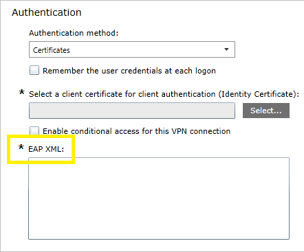

# VPN authentication options

**Applies to**
-   Windows 10
-   Windows 10 Mobile

In addition to older and less-secure password-based authentication methods (which should be avoided), the built-in VPN solution uses Extensible Authentication Protocol (EAP) to provide secure authentication using both user name and password, and certificate-based methods. You can only configure EAP-based authentication if you select a built-in VPN type (IKEv2, L2TP, PPTP or Automatic).

Windows supports a number of EAP authentication methods. 

<table>
<thead><tr><th>Method</th><th>Details</th></thead>
<tbody>
<tr><td>EAP-Microsoft Challenge Handshake Authentication Protocol version 2 (EAP-MSCHAPv2)</td><td><ul><li>User name and password authentication</li><li>Winlogon credentials - can specify authentication with computer sign-in credentials</li></ul></td></tr>
<tr><td>EAP-Transport Layer Security (EAP-TLS) </td><td><ul><li>Supports the following types of certificate authentication<ul><li>Certificate with keys in the software Key Storage Provider (KSP)</li><li>Certificate with keys in Trusted Platform Module (TPM) KSP</li><li>Smart card certficates</li><li>Windows Hello for Business certificate</li></ul></li><li>Certificate filtering<ul><li>Certificate filtering can be enabled to search for a particular certificate to use to authenticate with</li><li>Filtering can be Issuer-based or Enhanced Key Usage (EKU)-based</li></ul></li><li>Server validation - with TLS, server validation can be toggled on or off<ul><li>Server name - specify the server to validate</li><li>Server certificate - trusted root certificate to validate the server</li><li>Notification - specify if the user should get a notification asking whether to trust the server or not</li></ul></li></ul></td></tr>
<tr><td><a href="https://msdn.microsoft.com/library/cc754179.aspx">Protected Extensible Authentication Protocol (PEAP)</a></td><td><ul><li>Server validation - with PEAP, server validation can be toggled on or off<ul><li>Server name - specify the server to validate</li><li>Server certificate - trusted root certificate to validate the server</li><li>Notification - specify if the user should get a notification asking whether to trust the server or not</li></ul></li><li>Inner method - the outer method creates a secure tunnel inside while the inner method is used to complete the authentication<ul><li>EAP-MSCHAPv2</li><li>EAP-TLS</li></ul><li>Fast Reconnect: reduces the delay between an authentication request by a client and the response by the Network Policy Server (NPS) or other Remote Authentication Dial-in User Service (RADIUS) server. This reduces resource requirements for both client and server, and minimizes the number of times that users are prompted for credentials.<li><a href="https://msdn.microsoft.com/library/cc238384.aspx">Cryptobinding</a>: By deriving and exchanging values from the PEAP phase 1 key material (<b>Tunnel Key</b>) and from the PEAP phase 2 inner EAP method key material (<b>Inner Session Key</b>), it is possible to prove that the two authentications terminate at the same two entities (PEAP peer and PEAP server). This process, termed "cryptobinding", is used to protect the PEAP negotiation against "Man in the Middle" attacks.</li></li></ul></td></tr>
<tr><td>Tunneled Transport Layer Security (TTLS)</td><td><ul><li>Inner method<ul><li>Non-EAP<ul><li>Password Authentication Protocol (PAP)</li><li>CHAP</li><li>MSCHAP</li><li>MSCHAPv2</li></ul></li><li>EAP<ul><li>MSCHAPv2</li><li>TLS</li></ul></li></ul></li><li>Server validation: in TTLS, the server must be validated. The following can be configured:<ul><li>Server name</li><li></li>Trusted root certificate for server certificate<li>Whether there should be a server validation notification</li></ul></li></ul></td></tr></tbody>
</table>
 

## Configure authentication

See [EAP configuration](https://msdn.microsoft.com/library/windows/hardware/mt168513.aspx) for EAP XML configuration. 

>[!NOTE]
>To configure Windows Hello for Business authentication, follow the steps in [EAP configuration](https://msdn.microsoft.com/library/windows/hardware/mt168513.aspx) to create a smart card certificate.

The following image shows the field for EAP XML in a Microsoft Intune VPN profile. The EAP XML field only appears when you select a built-in connection type (automatic, IKEv2, L2TP, PPTP).

## Related topics

- [VPN technical guide](vpn-guide.md)
- [VPN connection types](vpn-connection-type.md)
- [VPN routing decisions](vpn-routing.md)
- [VPN and conditional access](vpn-conditional-access.md)
- [VPN proxy settings](vpn-proxy-settings.md)
- [VPN name resolution](vpn-name-resolution.md)
- [VPN auto-triggered profile options](vpn-auto-trigger-profile.md)
- [VPN security features](vpn-security-features.md)
- [VPN profile options](vpn-profile-options.md)