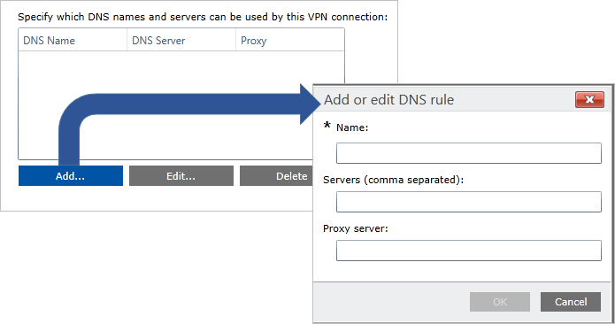

# VPN auto-triggered profile options

**Applies to**
-   Windows 10
-   Windows 10 Mobile

In Windows 10, a number of “auto-triggering” features were added to VPN so users won’t have to manually connect when VPN is needed to access necessary resources. There are three different types of auto-trigger rules: 

- App trigger
- Name-based trigger
- Always On

## App trigger

You can configure apps (desktop or Universal Windows Platform) to trigger a VPN connection. You can also configure per-app VPN and specify traffic rules for each app. See [Traffic filters](vpn-security-features.md#traffic-filters) for more details.

The app identifier for a desktop app is a file path. The app identifier for a UWP app is a package family name.

[Find a package family name (PFN) for per-app VPN configuration](https://docs.microsoft.com/intune/deploy-use/find-a-pfn-for-per-app-vpn)

## Name-based trigger

## Always On

Always On is a new feature in Windows 10 which enables the active VPN profile to connect automatically on the following triggers: 

- User sign-in 
- Network change 
- Device screen on 

When the trigger occurs, VPN tries to connect. If an error occurs or anyuUser input is needed, the user is shown a toast notification for additional interaction. 

When a device has multiple profiles with Always On triggers, the user can specify the active profile in **Settings** > **Network & Internet** > **VPN** > *VPN profile* by selecting the **Let apps automatically use this VPN connection** checkbox. By default, the first MDM-configured profile is marked as **Active**. 

## Trusted network detection

## Configure ,,,

See [VPN profile options](vpn-profile-options.md) and [VPNv2 CSP](https://msdn.microsoft.com/library/windows/hardware/dn914776.aspx) for XML configuration. 

The following image shows name resolution options in a VPN Profile configuration policy using Microsoft Intune.

The fields in **Add or edit DNS rule*- in the Intune profile correspond to the XML settings shown in the following table.

| Field | XML |
| --- | --- |
| **Name*- | **VPNv2//*ProfileName*/DomainNameInformationList//*dniRowId*/DomainName*-  |

## Related topics

- [VPN technical guide](vpn-guide.md)
- [VPN connection types](vpn-connection-type.md)
- [VPN routing decisions](vpn-routing.md)
- [VPN authentication options](vpn-authentication.md)
- [VPN and conditional access](vpn-conditional-access.md)
- [VPN name resolution](vpn-name-resolution.md)
- [VPN security features](vpn-security-features.md)
- [VPN profile options](vpn-profile-options.md)