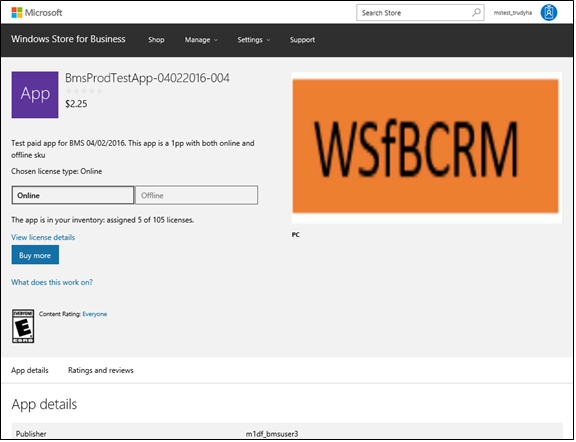

# Acquire apps in Windows Store for Business
As an admin, you can acquire apps from the Windows Store for Business for your employees. Some apps are free, and some have a price. For info on app types that are supported, see [Apps in the Windows Store for Business](apps-in-windows-store-for-business.md).

## App licensing model
The Business store supports two options to license apps: online and offline. **Online** licensing is the default licensing model and is similar to the Windows Store. Online licensed apps require users and devices to connect to the Store for Business service to acquire an app and its license. **Offline** licensing is a new licensing option for Windows 10. With offline licenses, organizations can cache apps and their licenses to deploy within their network. ISVs or devs can opt-in their apps for offline licensing when they submit them to the developer center.

For more information, see [Apps in the Windows Store for Business](apps-in-windows-store-for-business.md). 

## Payment options
Some apps are free, and some have a price. Apps can be purchased in the Windows Store for Business using your credit card. You can enter your credit card information on **Account Information**, or when you purchase an app. Currently, we accept these credit cards:
- VISA 
- MasterCard 
- Discover 
- American Express 
- Japan Commercial Bureau (JCB)

## Organization info
There are a couple of things we need to know when you pay for apps. You can add this info to the **Account information**  page before you buy apps. If you haven’t provided it, we’ll ask when you make a purchase. Either way works. Here’s the info you’ll need to provide:
- Legal business address
- Payment option (credit card)

You can add payment info on **Account information**. If you don’t have one saved with your account, you’ll be prompted to provide one when you buy an app.

## Acquire apps
To acquire an app  
1.	Log in to http://businessstore.microsoft.com
2.	Click Shop, or use Search to find an app. 
3.	Click the app you want to purchase. 
4.	On the product description page, choose your license type - either online or offline. 
    
    
    
5. Free apps will be added to Inventory. For apps with a price, you can set the quantity you want to buy. Type the quantity and click **Next**.
6.	If you don’t have a payment method saved in Account settings, Store for Business will prompt you for one.
7.	Add your credit card or debit card info, and click **Next**. Your card info is saved as a payment option on **Account information**.

You’ll also need to have your business address saved on **Account information**. The address is used to generate tax rates. For more information on taxes for apps, see organization tax information. 

Store for Business adds the app to your inventory. From **Inventory**, you can:
- Distribute the app: add to private store, or assign licenses
- View app licenses: review current licenses, reclaim and reassign licenses
- View app details: review the app details page and purchase more licenses

For info on distributing apps, see [Distribute apps to your employees from the Windows Store for Business](distribute-apps-to-your-employees-windows-store-for-business.md).

For info on offline-licensed apps, see [Distribute offline apps](distribute-offline-apps.md).
